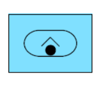
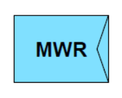
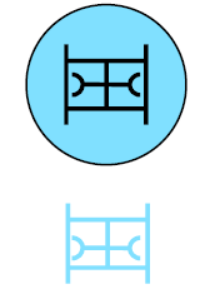
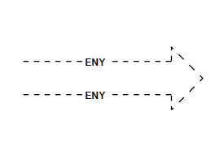
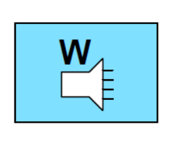

|ID|Significant Issue?|Image from Style Export|Image from Standard|Full SIDC|Hierarchy Code|Name|Geometry|Appendix|Notes / Issue Description / Details|
|---|---|---|---|---|---|---|---|---|---|
|187|YES|||SFGPUCFRS------|1.X.3.1.1.7.2.1 |SINGLE ROCKET LAUNCHER|POINT|D||
|205|YES|||SFGPUCFMSW-----|1.X.3.1.1.7.4.2 |SP WHEELED MORTAR|POINT|D||
|235|YES|||SFGPUCRLL------|1.X.3.1.1.8.7 |RECONNAISSANCE LIGHT|POINT|D||
|356|YES|||SFGPUSAW-------|1.X.3.1.3.1.12 |MORAL WELFARE RECREATION (MWR) |POINT|D||
|357|YES|||SFGPUSAWT------|1.X.3.1.3.1.12.1 |MWR THEATRE|POINT|D||
|358|YES|||SFGPUSAWC------|1.X.3.1.3.1.12.2 |MWR CORPS|POINT|D||
|532|YES|||SFGPEVATW------|1.X.3.2.2.1.1.1.1 |TANK LIGHT RECOVERY|POINT|D||
|534|YES|||SFGPEVATX------|1.X.3.2.2.1.1.2.1 |TANK MEDIUM RECOVERY|POINT|D||
|536|YES|||SFGPEVATY------|1.X.3.2.2.1.1.3.1 |TANK HEAVY RECOVERY|POINT|D||
|687|YES|||SFUPNBR--------|1.X.5.4.2.2 |SEABED ROCK/STONE OBSTACLE OTHER |POINT|D||
|688|YES|||SFUPNBW--------|1.X.5.4.2.3 |WRECK|POINT|D||
|689|YES|||SFUPNM---------|1.X.5.4.3 |MARINE LIFE|POINT|D||
|690|YES|||SFUPNA---------|1.X.5.4.4 |SEA ANOMALY|POINT|D||
|835|YES|||GHCPMOLAE------|2.X.2.1.5.2.1.7|ENEMY CONFIRMED|LINE|E||
|836|YES|||GHCPMOLAT------|2.X.2.1.5.2.1.8|ENEMY TEMPLATED|LINE|E||
|854|YES|||GFCPMOOTF------|2.X.2.1.5.3.2.1|FRIENDLY ATTACK POSITION|AREA|E||
|933|YES|||GFCPBSW--------|2.X.2.2.3.4|FOXHOLE EMPLACEMENT OR WEAPON SITE |POINT|E||
|1125|YES|||GHOPPCU--------|2.X.3.3.3.1|RECRUITMENT (COERCED/IMPRESSED)|POINT|E||
|1131|YES|||GFOPPHG--------|2.X.3.3.6.3|WRITTEN PROPAGANDA|POINT|E||
