|ID|Significant Issue?|Image from Style Export|Image from Standard|Full SIDC|Hierarchy Code|Name|Geometry|Appendix|Notes / Issue Description / Details|
|---|---|---|---|---|---|---|---|---|---|
|1|||TODO|SFP------------|1.X.1 |SPACE TRACK|POINT|D||
|2|||TODO|SFP-S----------|1.X.1.1 |SATELLITE|POINT|D||
|3|||TODO|SFP-V----------|1.X.1.2 |CREWED SPACE VEHICLE|POINT|D||
|4|||TODO|SFP-T----------|1.X.1.3 |SPACE STATION|POINT|D||
|5|||TODO|SFA------------|1.X.2 |AIR TRACK|POINT|D||
|6|||TODO|SFA-M----------|1.X.2.1 |MILITARY|POINT|D||
|7|||TODO|SFAPMF---------|1.X.2.1.1 |FIXED WING|POINT|D||
|8|||TODO|SFAPMFB--------|1.X.2.1.1.1 |BOMBER|POINT|D||
|9|||TODO|SFAPMFF--------|1.X.2.1.1.2 |FIGHTER|POINT|D||
|10|||TODO|SFAPMFFI-------|1.X.2.1.1.2.1 |INTERCEPTOR|POINT|D||
|11|||TODO|SFAPMFT--------|1.X.2.1.1.3 |TRAINER|POINT|D||
|12|||TODO|SFAPMFA--------|1.X.2.1.1.4 |ATTACK/STRIKE|POINT|D||
|13|||TODO|SFAPMFL--------|1.X.2.1.1.5 |VSTOL|POINT|D||
|14|||TODO|SFAPMFK--------|1.X.2.1.1.6 |TANKER|POINT|D||
|15|||TODO|SFAPMFC--------|1.X.2.1.1.7 |CARGO AIRLIFT (TRANSPORT)|POINT|D||
|16|||TODO|SFAPMFCL-------|1.X.2.1.1.7.1 |CARGO AIRLIFT (LIGHT)|POINT|D||
|17|||TODO|SFAPMFCM-------|1.X.2.1.1.7.2 |CARGO AIRLIFT (MEDIUM)|POINT|D||
|18|||TODO|SFAPMFCH-------|1.X.2.1.1.7.3 |CARGO AIRLIFT (HEAVY)|POINT|D||
|19|||TODO|SFAPMFJ--------|1.X.2.1.1.8 |ELECTRONIC COUNTERMEASURES(ECM/JAMMER)|POINT|D||
|20|||TODO|SFAPMFO--------|1.X.2.1.1.9 |MEDEVAC|POINT|D||
|21|||TODO|SFAPMFR--------|1.X.2.1.1.10 |RECONNAISSANCE|POINT|D||
|22|||TODO|SFAPMFRW-------|1.X.2.1.1.10.1 |AIRBORNE EARLY WARNING (AEW)|POINT|D||
|23|||TODO|SFAPMFRZ-------|1.X.2.1.1.10.2 |ELECTRONIC SURVEILLANCE MEASURES|POINT|D||
|24|||TODO|SFAPMFRX-------|1.X.2.1.1.10.3 |PHOTOGRAPHIC|POINT|D||
|25|||TODO|SFAPMFP--------|1.X.2.1.1.11 |PATROL|POINT|D||
|26|||TODO|SFAPMFPN-------|1.X.2.1.1.11.1 |ANTI SURFACE WARFARE/ASUW|POINT|D||
|27|||TODO|SFAPMFPM-------|1.X.2.1.1.11.2 |MINE COUNTER MEASURES|POINT|D||
|28|||TODO|SFAPMFU--------|1.X.2.1.1.12 |UTILITY|POINT|D||
|29|||TODO|SFAPMFUL-------|1.X.2.1.1.12.1 |UTILITY (LIGHT)|POINT|D||
|30|||TODO|SFAPMFUM-------|1.X.2.1.1.12.2 |UTILITY (MEDIUM)|POINT|D||
|31|||TODO|SFAPMFUH-------|1.X.2.1.1.12.3 |UTILITY (HEAVY)|POINT|D||
|32|||TODO|SFAPMFY--------|1.X.2.1.1.13 |COMMUNICATIONS (C3I)|POINT|D||
|33|||TODO|SFAPMFH--------|1.X.2.1.1.14 |SEARCH AND RESCUE (CSAR)|POINT|D||
|34|||TODO|SFAPMFD--------|1.X.2.1.1.15 |AIRBORNE COMMAND POST (C2)|POINT|D||
|35|||TODO|SFAPMFQ--------|1.X.2.1.1.16 |DRONE (RPV/UAV)|POINT|D||
|36|||TODO|SFAPMFS--------|1.X.2.1.1.17 |ANTI SUBMARINE WARFARE (ASW) CARRIER BASED|POINT|D||
|37|||TODO|SFAPMFM--------|1.X.2.1.1.18 |SPECIAL OPERATIONS FORCE (SOF)|POINT|D||
|38|||TODO|SFAPMH---------|1.X.2.1.2 |ROTARY WING|POINT|D||
|39|||TODO|SFAPMHA--------|1.X.2.1.2.1 |ATTACK|POINT|D||
|40|||TODO|SFAPMHS--------|1.X.2.1.2.2 |ANTISUBMARINE WARFARE|POINT|D||
|41|||TODO|SFAPMHU--------|1.X.2.1.2.3 |UTILITY|POINT|D||
|42|||TODO|SFAPMHUL-------|1.X.2.1.2.3.1 |UTILITY (LIGHT)|POINT|D||
|43|||TODO|SFAPMHUM-------|1.X.2.1.2.3.2 |UTILITY (MEDIUM)|POINT|D||
|44|||TODO|SFAPMHUH-------|1.X.2.1.2.3.3 |UTILITY (HEAVY)|POINT|D||
|45|||TODO|SFAPMHI--------|1.X.2.1.2.4 |MINE COUNTER MEASURES|POINT|D||
|46|||TODO|SFAPMHH--------|1.X.2.1.2.5 |COMBAT SEARCH AND RESCUE (CSAR)|POINT|D||
|47|||TODO|SFAPMHR--------|1.X.2.1.2.6 |RECONNAISSANCE|POINT|D||
|48|||TODO|SFAPMHQ--------|1.X.2.1.2.7 |DRONE (RPV/UAV)|POINT|D||
|49|||TODO|SFAPMHC--------|1.X.2.1.2.8 |CARGO AIRLIFT (TRANSPORT)|POINT|D||
|50|||TODO|SFAPMHCL-------|1.X.2.1.2.8.1 |CARGO AIRLIFT (LIGHT)|POINT|D||
|51|||TODO|SFAPMHCM-------|1.X.2.1.2.8.2 |CARGO AIRLIFT (MEDIUM)|POINT|D||
|52|||TODO|SFAPMHCH-------|1.X.2.1.2.8.3 |CARGO AIRLIFT (HEAVY)|POINT|D||
|53|||TODO|SFAPMHT--------|1.X.2.1.2.9 |TRAINER|POINT|D||
|54|||TODO|SFAPMHO--------|1.X.2.1.2.10 |MEDEVAC|POINT|D||
|55|||TODO|SFAPMHM--------|1.X.2.1.2.11 |SPECIAL OPERATIONS FORCE (SOF)|POINT|D||
|56|||TODO|SFAPMHD--------|1.X.2.1.2.12 |AIRBORNE COMMAND POST (C2)|POINT|D||
|57|||TODO|SFAPMHK--------|1.X.2.1.2.13 |TANKER|POINT|D||
|58|||TODO|SFAPMHJ--------|1.X.2.1.2.14 |ELECTRONIC COUNTER MEASURES (ECM/JAMMER)|POINT|D||
|59|||TODO|SFAPML---------|1.X.2.1.3 |LIGHTER THAN AIR|POINT|D||
|60|||TODO|SFAPW----------|1.X.2.2 |WEAPON|POINT|D||
|61|||TODO|SFAPWM---------|1.X.2.2.1 |MISSILE IN FLIGHT|POINT|D||
|62|||TODO|SFAPWMS--------|1.X.2.2.1.1 |SURFACE/LAND LAUNCHED MISSILE|POINT|D||
|63|||TODO|SFAPWMSS-------|1.X.2.2.1.1.1 |SURFACE TO SURFACE MISSILE (SSM)|POINT|D||
|64|||TODO|SFAPWMSA-------|1.X.2.2.1.1.2 |SURFACE TO AIR MISSILE (SAM)|POINT|D||
|65|||TODO|SFAPWMA--------|1.X.2.2.1.2 |AIR LAUNCHED MISSILE|POINT|D||
|66|||TODO|SFAPWMAS-------|1.X.2.2.1.2.1 |AIR TO SURFACE MISSILE (ASM)|POINT|D||
|67|||TODO|SFAPWMAA-------|1.X.2.2.1.2.2 |AIR TO AIR MISSILE (AAM)|POINT|D||
|68|||TODO|SFAPWMU--------|1.X.2.2.1.3 |SUBSURFACE TO SURFACE MISSILE (S/SSM)|POINT|D||
|69|||TODO|SFAPWML--------|1.X.2.2.1.4 |LAND ATTACK MISSILE|POINT|D||
|70|||TODO|SFAPWD---------|1.X.2.2.2 |DECOY|POINT|D||
|71|||TODO|SFAPC----------|1.X.2.3 |CIVIL AIRCRAFT|POINT|D||
|72|||TODO|SFAPCF---------|1.X.2.3.1 |FIXED WING|POINT|D||
|73|||TODO|SFAPCH---------|1.X.2.3.2 |ROTARY WING|POINT|D||
|74|||TODO|SFAPCL---------|1.X.2.3.3 |LIGHTER THAN AIR|POINT|D||
|75|||TODO|SFGPU----------|1.X.3.1 |UNIT|POINT|D||
|76|||TODO|SFGPUC---------|1.X.3.1.1 |COMBAT|POINT|D||
|77|||TODO|SFGPUCD--------|1.X.3.1.1.1 |AIR DEFENCE|POINT|D||
|78|||TODO|SFGPUCDS-------|1.X.3.1.1.1.1 |SHORT RANGE|POINT|D||
|79|||TODO|SFGPUCDS-------|1.X.3.1.1.1.1.1 |MISSILE|POINT|D||
|80|||TODO|SFGPUCDS-------|1.X.3.1.1.1.1.2 |GUN|POINT|D||
|81|||TODO|SFGPUCDM-------|1.X.3.1.1.1.2 |AIR DEFENCE MISSILE|POINT|D||
|82|||TODO|SFGPUCDML------|1.X.3.1.1.1.2.1 |AIR DEFENCE MISSILE LIGHT|POINT|D||
|83|||TODO|SFGPUCDMLA-----|1.X.3.1.1.1.2.1.1 |AIR DEFENCE MISSILE MOTORIZED|POINT|D||
|84|||TODO|SFGPUCDMM------|1.X.3.1.1.1.2.2 |AIR DEFENCE MISSILE MEDIUM|POINT|D||
|85|||TODO|SFGPUCDMH------|1.X.3.1.1.1.2.3 |AIR DEFENCE MISSILE HEAVY|POINT|D||
|86|||TODO|SFGPUCDH-------|1.X.3.1.1.1.2.4 |H/MAD|POINT|D||
|87|||TODO|SFGPUCDG-------|1.X.3.1.1.1.3 |GUN UNIT|POINT|D||
|88|||TODO|SFGPUCDC-------|1.X.3.1.1.1.4 |COMPOSITE|POINT|D||
|89|||TODO|SFGPUCDT-------|1.X.3.1.1.1.5 |TARGETING UNIT|POINT|D||
|90|||TODO|SFGPUCDO-------|1.X.3.1.1.1.6 |THEATRE MISSILE DEFENCE UNIT|POINT|D||
|91|||TODO|SFGPUCA--------|1.X.3.1.1.2 |ARMOUR|POINT|D||
|92|||TODO|SFGPUCAT-------|1.X.3.1.1.2.1 |ARMOUR TRACK|POINT|D||
|93|||TODO|SFGPUCATA------|1.X.3.1.1.2.1.1 |ARMOUR TRACK AIRBORNE|POINT|D||
|94|||TODO|SFGPUCATW------|1.X.3.1.1.2.1.2 |ARMOUR TRACK AMPHIBIOUS|POINT|D||
|95|||TODO|SFGPUCATWR-----|1.X.3.1.1.2.1.2.1 |ARMOUR TRACK AMPHIBIOUS RECOVERY|POINT|D||
|96|||TODO|SFGPUCATL------|1.X.3.1.1.2.1.3 |ARMOUR TRACK LIGHT |POINT|D||
|97|||TODO|SFGPUCATM------|1.X.3.1.1.2.1.4 |ARMOUR TRACK MEDIUM |POINT|D||
|98|||TODO|SFGPUCATH------|1.X.3.1.1.2.1.5 |ARMOUR TRACK HEAVY |POINT|D||
|99|||TODO|SFGPUCATR------|1.X.3.1.1.2.1.6 |ARMOUR TRACK RECOVERY |POINT|D||
|100|||TODO|SFGPUCAW-------|1.X.3.1.1.2.2 |ARMOUR WHEELED |POINT|D||
|101|||TODO|SFGPUCAWS------|1.X.3.1.1.2.2.1 |ARMOUR WHEELED AIR ASSAULT |POINT|D||
|102|||TODO|SFGPUCAWA------|1.X.3.1.1.2.2.2 |ARMOUR WHEELED AIRBORNE |POINT|D||
|103|||TODO|SFGPUCAWA------|1.X.3.1.1.2.2.3 |ARMOUR WHEELED AMPHIBIOUS |POINT|D||
|104|||TODO|SFGPUCAWL------|1.X.3.1.1.2.2.4 |ARMOUR WHEELED LIGHT |POINT|D||
|105|||TODO|SFGPUCAWM------|1.X.3.1.1.2.2.5 |ARMOUR WHEELED MEDIUM |POINT|D||
|106|||TODO|SFGPUCAWH------|1.X.3.1.1.2.2.6 |ARMOUR WHEELED HEAVY |POINT|D||
|107|||TODO|SFGPUCAWR------|1.X.3.1.1.2.2.7 |ARMOUR WHEELED RECOVERY |POINT|D||
|108|||TODO|SFGPUCAA-------|1.X.3.1.1.3 |ANTI ARMOUR|POINT|D||
|109|||TODO|SFGPUCAAD------|1.X.3.1.1.3.1 |ANTI ARMOUR DISMOUNTED|POINT|D||
|110|||TODO|SFGPUCAAL------|1.X.3.1.1.3.2 |ANTI ARMOUR LIGHT|POINT|D||
|111|||TODO|SFGPUCAAM------|1.X.3.1.1.3.3 |ANTI ARMOUR AIRBORNE|POINT|D||
|112|||TODO|SFGPUCAAS------|1.X.3.1.1.3.4 |ANTI ARMOUR AIR ASSAULT|POINT|D||
|113|||TODO|SFGPUCAAU------|1.X.3.1.1.3.5 |ANTI ARMOUR MOUNTAIN|POINT|D||
|114|||TODO|SFGPUCAAC------|1.X.3.1.1.3.6 |ANTI ARMOUR ARCTIC|POINT|D||
|115|||TODO|SFGPUCAAA------|1.X.3.1.1.3.7 |ANTI ARMOUR ARMOURED|POINT|D||
|116|||TODO|SFGPUCAAAT-----|1.X.3.1.1.3.7.1 |ANTI ARMOUR ARMOURED TRACKED|POINT|D||
|117|||TODO|SFGPUCAAAW-----|1.X.3.1.1.3.7.2 |ANTI ARMOUR ARMOURED WHEELED|POINT|D||
|118|||TODO|SFGPUCAAAS-----|1.X.3.1.1.3.7.3 |ANTI ARMOUR ARMOURED AIR ASSAULT|POINT|D||
|119|||TODO|SFGPUCAAO------|1.X.3.1.1.3.8 |ANTI ARMOUR MOTORIZED|POINT|D||
|120|||TODO|SFGPUCAAOS-----|1.X.3.1.1.3.8.1 |ANTI ARMOUR MOTORIZED AIR ASSAULT|POINT|D||
|121|||TODO|SFGPUCV--------|1.X.3.1.1.4 |AVIATION|POINT|D||
|122|||TODO|SFGPUCVF-------|1.X.3.1.1.4.1 |FIXED WING|POINT|D||
|123|||TODO|SFGPUCVFU------|1.X.3.1.1.4.1.1 |UTILITY FIXED WING|POINT|D||
|124|||TODO|SFGPUCVFA------|1.X.3.1.1.4.1.2 |ATTACK FIXED WING|POINT|D||
|125|||TODO|SFGPUCVUTP-----|1.X.3.1.1.4.1.2.1 |TACTICAL AIR CONTROL PARTY (TACP)|POINT|D||
|126|||TODO|SFGPUCVUFC-----|1.X.3.1.1.4.1.2.2 |FORWARD AIR CONTROLLER (FAC)|POINT|D||
|127|||TODO|SFGPUCVFR------|1.X.3.1.1.4.1.3 |RECON FIXED WING|POINT|D||
|128|||TODO|SFGPUCVR-------|1.X.3.1.1.4.2 |ROTARY WING|POINT|D||
|129|||TODO|SFGPUCVRA------|1.X.3.1.1.4.2.1 |ATTACK ROTARY WING|POINT|D||
|130|||TODO|SFGPUCVRS------|1.X.3.1.1.4.2.2 |SCOUT ROTARY WING|POINT|D||
|131|||TODO|SFGPUCVRW------|1.X.3.1.1.4.2.3 |ANTISUBMARINE WARFARE ROTARY WING|POINT|D||
|132|||TODO|SFGPUCVRU------|1.X.3.1.1.4.2.4 |UTILITY ROTARY WING|POINT|D||
|133|||TODO|SFGPUCVRUL-----|1.X.3.1.1.4.2.4.1 |LIGHT UTILITY ROTARY WING|POINT|D||
|134|||TODO|SFGPUCVRUM-----|1.X.3.1.1.4.2.4.2 |MEDIUM UTILITY ROTARY WING|POINT|D||
|135|||TODO|SFGPUCVRUH-----|1.X.3.1.1.4.2.4.3 |HEAVY UTILITY ROTARY WING|POINT|D||
|136|||TODO|SFGPUCVRUC-----|1.X.3.1.1.4.2.5 |C2 ROTARY WING|POINT|D||
|137|||TODO|SFGPUCVRUE-----|1.X.3.1.1.4.2.6 |MEDEVAC ROTARY WING|POINT|D||
|138|||TODO|SFGPUCVRM------|1.X.3.1.1.4.2.7 |MINE COUNTERMEASURE ROTARY WING|POINT|D||
|139|||TODO|SFGPUCVS-------|1.X.3.1.1.4.3 |PERSONNEL RECOVERY|POINT|D||
|140|||TODO|SFGPUCVC-------|1.X.3.1.1.4.4 |COMPOSITE|POINT|D||
|141|||TODO|SFGPUCVV-------|1.X.3.1.1.4.5 |VERTICAL/SHORT TAKEOFF AND LANDING (V/STOL)|POINT|D||
|142|||TODO|SFGPUCVU-------|1.X.3.1.1.4.6 |UNMANNED AERIAL VEHICLE|POINT|D||
|143|||TODO|SFGPUCVUF------|1.X.3.1.1.4.6.1 |UNMANNED AERIAL VEHICLE FIXED WING|POINT|D||
|144|||TODO|SFGPUCVUR------|1.X.3.1.1.4.6.2 |UNMANNED AERIAL VEHICLE ROTARY WING|POINT|D||
|145|||TODO|SFGPUCVUTP-----|1.X.3.1.1.4.6.3 |TACTICAL AIR CONTROL PARTY (TACP)|POINT|D||
|146|||TODO|SFGPUCVUFC-----|1.X.3.1.1.4.6.4 |FORWARD AIR CONTROLLER (FAC)|POINT|D||
|147|||TODO|SFGPUCI--------|1.X.3.1.1.5 |INFANTRY|POINT|D||
|148|||TODO|SFGPUCIL-------|1.X.3.1.1.5.1 |INFANTRY LIGHT|POINT|D||
|149|||TODO|SFGPUCIM-------|1.X.3.1.1.5.2 |INFANTRY MOTORIZED|POINT|D||
|150|||TODO|SFGPUCIO-------|1.X.3.1.1.5.3 |INFANTRY MOUNTAIN|POINT|D||
|151|||TODO|SFGPUCIA-------|1.X.3.1.1.5.4 |INFANTRY AIRBORNE|POINT|D||
|152|||TODO|SFGPUCIS-------|1.X.3.1.1.5.5 |INFANTRY AIR ASSAULT|POINT|D||
|153|||TODO|SFGPUCIZ-------|1.X.3.1.1.5.6 |INFANTRY MECHANIZED|POINT|D||
|154|||TODO|SFGPUCIN-------|1.X.3.1.1.5.7 |INFANTRY NAVAL|POINT|D||
|155|||TODO|SFGPUCII-------|1.X.3.1.1.5.8 |INFANTRY FIGHTING VEHICLE|POINT|D||
|156|||TODO|SFGPUCIC-------|1.X.3.1.1.5.9 |INFANTRY ARCTIC|POINT|D||
|157|||TODO|SFGPUCE--------|1.X.3.1.1.6 |ENGINEER|POINT|D||
|158|||TODO|SFGPUCEC-------|1.X.3.1.1.6.1 |ENGINEER COMBAT|POINT|D||
|159|||TODO|SFGPUCECS------|1.X.3.1.1.6.1.1 |ENGINEER COMBAT AIR ASSAULT|POINT|D||
|160|||TODO|SFGPUCECA------|1.X.3.1.1.6.1.2 |ENGINEER COMBAT AIRBORNE|POINT|D||
|161|||TODO|SFGPUCECC------|1.X.3.1.1.6.1.3 |ENGINEER COMBAT ARCTIC|POINT|D||
|162|||TODO|SFGPUCECL------|1.X.3.1.1.6.1.4 |ENGINEER COMBAT LIGHT|POINT|D||
|163|||TODO|SFGPUCECM------|1.X.3.1.1.6.1.5 |ENGINEER COMBAT MEDIUM|POINT|D||
|164|||TODO|SFGPUCECH------|1.X.3.1.1.6.1.6 |ENGINEER COMBAT HEAVY|POINT|D||
|165|||TODO|SFGPUCECT------|1.X.3.1.1.6.1.7 |ENGINEER COMBAT MECHANIZED (TRACK)|POINT|D||
|166|||TODO|SFGPUCECW------|1.X.3.1.1.6.1.8 |ENGINEER COMBAT MOTORIZED|POINT|D||
|167|||TODO|SFGPUCECO------|1.X.3.1.1.6.1.9 |ENGINEER COMBAT MOUNTAIN|POINT|D||
|168|||TODO|SFGPUCECR------|1.X.3.1.1.6.1.10 |ENGINEER COMBAT RECON|POINT|D||
|169|||TODO|SFGPUCEC-------|1.X.3.1.1.6.1.11 |ENGINEER COMBAT BRIDGING|POINT|D||
|170|||TODO|SFGPUCEC-------|1.X.3.1.1.6.1.12 |ENGINEER COMBAT MINE CLEARING|POINT|D||
|171|||TODO|SFGPUCEC-------|1.X.3.1.1.6.1.13 |ENGINEER COMBAT MINE LAYING|POINT|D||
|172|||TODO|SFGPUCEC-------|1.X.3.1.1.6.1.14 |ENGINEER COMBAT DIVING|POINT|D||
|173|||TODO|SFGPUCEN-------|1.X.3.1.1.6.2 |ENGINEER CONSTRUCTION|POINT|D||
|174|||TODO|SFGPUCENN------|1.X.3.1.1.6.2.1 |ENGINEER NAVAL CONSTRUCTION|POINT|D||
|175|||TODO|SFGPUCF--------|1.X.3.1.1.7 |FIELD ARTILLERY|POINT|D||
|176|||TODO|SFGPUCFH-------|1.X.3.1.1.7.1 |HOWITZER/GUN|POINT|D||
|177|||TODO|SFGPUCFHE------|1.X.3.1.1.7.1.1 |SELF PROPELLED|POINT|D||
|178|||TODO|SFGPUCFHS------|1.X.3.1.1.7.1.2 |AIR ASSAULT|POINT|D||
|179|||TODO|SFGPUCFHA------|1.X.3.1.1.7.1.3 |AIRBORNE|POINT|D||
|180|||TODO|SFGPUCFHC------|1.X.3.1.1.7.1.4 |ARCTIC|POINT|D||
|181|||TODO|SFGPUCFHO------|1.X.3.1.1.7.1.5 |MOUNTAIN|POINT|D||
|182|||TODO|SFGPUCFHL------|1.X.3.1.1.7.1.6 |LIGHT|POINT|D||
|183|||TODO|SFGPUCFHM------|1.X.3.1.1.7.1.7 |MEDIUM|POINT|D||
|184|||TODO|SFGPUCFHH------|1.X.3.1.1.7.1.8 |HEAVY|POINT|D||
|185|||TODO|SFGPUCFHX------|1.X.3.1.1.7.1.9 |AMPHIBIOUS|POINT|D||
|186|||TODO|SFGPUCFR-------|1.X.3.1.1.7.2 |ROCKET|POINT|D||
|187|YES|||SFGPUCFRS------|1.X.3.1.1.7.2.1 |SINGLE ROCKET LAUNCHER|POINT|D||
|188|||TODO|SFGPUCFRSS-----|1.X.3.1.1.7.2.1.1 |SINGLE ROCKET SELF PROPELLED|POINT|D||
|189|||TODO|SFGPUCFRSR-----|1.X.3.1.1.7.2.1.2 |SINGLE ROCKET TRUCK|POINT|D||
|190|||TODO|SFGPUCFRST-----|1.X.3.1.1.7.2.1.3 |SINGLE ROCKET TOWED|POINT|D||
|191|||TODO|SFGPUCFRM------|1.X.3.1.1.7.2.2 |MULTI ROCKET LAUNCHER|POINT|D||
|192|||TODO|SFGPUCFRMS-----|1.X.3.1.1.7.2.2.1 |MULTI ROCKET SELF PROPELLED|POINT|D||
|193|||TODO|SFGPUCFRMR-----|1.X.3.1.1.7.2.2.2 |MULTI ROCKET TRUCK|POINT|D||
|194|||TODO|SFGPUCFRMT-----|1.X.3.1.1.7.2.2.3 |MULTI ROCKET TOWED|POINT|D||
|195|||TODO|SFGPUCFT-------|1.X.3.1.1.7.3 |TARGET ACQUISITION|POINT|D||
|196|||TODO|SFGPUCFTR------|1.X.3.1.1.7.3.1 |RADAR|POINT|D||
|197|||TODO|SFGPUCFTS------|1.X.3.1.1.7.3.2 |SOUND|POINT|D||
|198|||TODO|SFGPUCFTF------|1.X.3.1.1.7.3.3 |FLASH (OPTICAL)|POINT|D||
|199|||TODO|SFGPUCFTC------|1.X.3.1.1.7.3.4 |TARGET ACQUISITION MOUNTED|POINT|D||
|200|||TODO|SFGPUCFTCD-----|1.X.3.1.1.7.3.4.1 |TARGET ACQUISITION DISMOUNTED|POINT|D||
|201|||TODO|SFGPUCFTCM-----|1.X.3.1.1.7.3.4.2 |TARGET ACQUISITION TRACKED|POINT|D||
|202|||TODO|SFGPUCFTA------|1.X.3.1.1.7.3.5 |TARGET ACQUISITION NAVAL GUNFIRE|POINT|D||
|203|||TODO|SFGPUCFM-------|1.X.3.1.1.7.4 |MORTAR|POINT|D||
|204|||TODO|SFGPUCFMS------|1.X.3.1.1.7.4.1 |SELF PROPELLED (SP) TRACKED MORTAR|POINT|D||
|205|YES|||SFGPUCFMSW-----|1.X.3.1.1.7.4.2 |SP WHEELED MORTAR|POINT|D||
|206|||TODO|SFGPUCFMT------|1.X.3.1.1.7.4.3 |TOWED MORTAR|POINT|D||
|207|||TODO|SFGPUCFMTA-----|1.X.3.1.1.7.4.3.1 |TOWED AIRBORNE MORTAR|POINT|D||
|208|||TODO|SFGPUCFMTS-----|1.X.3.1.1.7.4.3.2 |TOWED AIR ASSAULT MORTAR|POINT|D||
|209|||TODO|SFGPUCFMTC-----|1.X.3.1.1.7.4.3.3 |TOWED ARCTIC MORTAR|POINT|D||
|210|||TODO|SFGPUCFMTO-----|1.X.3.1.1.7.4.3.4 |TOWED MOUNTAIN MORTAR|POINT|D||
|211|||TODO|SFGPUCFML------|1.X.3.1.1.7.4.4 |AMPHIBIOUS MORTAR|POINT|D||
|212|||TODO|SFGPUCFS-------|1.X.3.1.1.7.5 |ARTILLERY SURVEY|POINT|D||
|213|||TODO|SFGPUCFSS------|1.X.3.1.1.7.5.1 |AIR ASSAULT|POINT|D||
|214|||TODO|SFGPUCFSA------|1.X.3.1.1.7.5.2 |AIRBORNE|POINT|D||
|215|||TODO|SFGPUCFSL------|1.X.3.1.1.7.5.3 |LIGHT|POINT|D||
|216|||TODO|SFGPUCFSO------|1.X.3.1.1.7.5.4 |MOUNTAIN|POINT|D||
|217|||TODO|SFGPUCFO-------|1.X.3.1.1.7.6 |METEOROLOGICAL|POINT|D||
|218|||TODO|SFGPUCFOS------|1.X.3.1.1.7.6.1 |AIR ASSAULT METEOROLOGICAL|POINT|D||
|219|||TODO|SFGPUCFOA------|1.X.3.1.1.7.6.2 |AIRBORNE METEOROLOGICAL|POINT|D||
|220|||TODO|SFGPUCFOL------|1.X.3.1.1.7.6.3 |LIGHT METEOROLOGICAL|POINT|D||
|221|||TODO|SFGPUCFOO------|1.X.3.1.1.7.6.4 |MOUNTAIN METEOROLOGICAL|POINT|D||
|222|||TODO|SFGPUCF--------|1.X.3.1.1.7.7 |FIRE DIRECTION CENTRE|POINT|D||
|223|||TODO|SFGPUCF--------|1.X.3.1.1.7.8 |OBERSERVER|POINT|D||
|224|||TODO|SFGPUCR--------|1.X.3.1.1.8 |RECONNAISSANCE|POINT|D||
|225|||TODO|SFGPUCRH-------|1.X.3.1.1.8.1 |RECONNAISSANCE HORSE|POINT|D||
|226|||TODO|SFGPUCRV-------|1.X.3.1.1.8.2 |RECONNAISSANCE CAVALRY|POINT|D||
|227|||TODO|SFGPUCRVA------|1.X.3.1.1.8.2.1 |RECONNAISSANCE CAVALRY ARMOURED|POINT|D||
|228||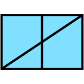|TODO|SFGPUCRVM------|1.X.3.1.1.8.2.2 |RECONNAISSANCE CAVALRY MOTORIZED|POINT|D||
|229|||TODO|SFGPUCRVG------|1.X.3.1.1.8.2.3 |RECONNAISSANCE CAVALRY GROUND|POINT|D||
|230|||TODO|SFGPUCRVO------|1.X.3.1.1.8.2.4 |RECONNAISSANCE CAVALRY AIR|POINT|D||
|231|||TODO|SFGPUCRC-------|1.X.3.1.1.8.3 |RECONNAISSANCE ARCTIC|POINT|D||
|232|||TODO|SFGPUCRS-------|1.X.3.1.1.8.4 |RECONNAISSANCE AIR ASSAULT|POINT|D||
|233|||TODO|SFGPUCRA-------|1.X.3.1.1.8.5 |RECONNAISSANCE AIRBORNE|POINT|D||
|234||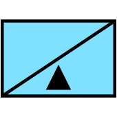|TODO|SFGPUCRO-------|1.X.3.1.1.8.6 |RECONNAISSANCE MOUNTAIN|POINT|D||
|235|YES|||SFGPUCRLL------|1.X.3.1.1.8.7 |RECONNAISSANCE LIGHT|POINT|D||
|236|||TODO|SFGPUCRR-------|1.X.3.1.1.8.8 |RECONNAISSANCE MARINE|POINT|D||
|237|||TODO|SFGPUCRRD------|1.X.3.1.1.8.8.1 |RECONNAISSANCE MARINE DIVISION|POINT|D||
|238|||TODO|SFGPUCRRF------|1.X.3.1.1.8.8.2 |RECONNAISSANCE MARINE FORCE|POINT|D||
|239|||TODO|SFGPUCRRL------|1.X.3.1.1.8.8.3 |RECONNAISSANCE MARINE LIGHT ARMOURED RECONNAISSANCE (LAR)|POINT|D||
|240|||TODO|SFGPUCRX-------|1.X.3.1.1.8.9 |RECONNAISSANCE LONG RANGE SURVEILLANCE (LRS)|POINT|D||
|241|||TODO|SFGPUCM--------|1.X.3.1.1.9 |MISSILE (SURFACE-SURFACE)|POINT|D||
|242|||TODO|SFGPUCMT-------|1.X.3.1.1.9.1 |MISSILE (SURFACE-SURFACE) TACTICAL|POINT|D||
|243|||TODO|SFGPUCMS-------|1.X.3.1.1.9.2 |MISSILE (SURFACE-SURFACE) STRATEGIC|POINT|D||
|244|||TODO|SFGPUCS--------|1.X.3.1.1.10 |INTERNAL SECURITY FORCES|POINT|D||
|245|||TODO|SFGPUCSW-------|1.X.3.1.1.10.1 |RIVERINE|POINT|D||
|246|||TODO|SFGPUCSG-------|1.X.3.1.1.10.2 |GROUND|POINT|D||
|247|||TODO|SFGPUCSGD------|1.X.3.1.1.10.2.1 |DISMOUNTED GROUND|POINT|D||
|248|||TODO|SFGPUCSGM------|1.X.3.1.1.10.2.2 |MOTORIZED GROUND|POINT|D||
|249|||TODO|SFGPUCSGA------|1.X.3.1.1.10.2.3 |MECHANIZED GROUND|POINT|D||
|250|||TODO|SFGPUCSM-------|1.X.3.1.1.10.3 |WHEELED MECHANIZED|POINT|D||
|251|||TODO|SFGPUCSR-------|1.X.3.1.1.10.4 |RAILROAD|POINT|D||
|252|||TODO|SFGPUCSA-------|1.X.3.1.1.10.5 |AVIATION|POINT|D||
|253|||TODO|SFGPUU---------|1.X.3.1.2 |COMBAT SUPPORT|POINT|D||
|254|||TODO|SFGPUUA--------|1.X.3.1.2.1 |COMBAT SUPPORT CBRN|POINT|D||
|255|||TODO|SFGPUUAC-------|1.X.3.1.2.1.1 |CHEMICAL|POINT|D||
|256|||TODO|SFGPUUACC------|1.X.3.1.2.1.1.1 |SMOKE/DECON|POINT|D||
|257|||TODO|SFGPUUACCK-----|1.X.3.1.2.1.1.1.1 |MECHANIZED SMOKE/DECON|POINT|D||
|258|||TODO|SFGPUUACCM-----|1.X.3.1.2.1.1.1.2 |MOTORIZED SMOKE/DECON|POINT|D||
|259|||TODO|SFGPUUACS------|1.X.3.1.2.1.1.2 |SMOKE|POINT|D||
|260|||TODO|SFGPUUACSM-----|1.X.3.1.2.1.1.2.1 |MOTORIZED SMOKE|POINT|D||
|261|||TODO|SFGPUUACSA-----|1.X.3.1.2.1.1.2.2 |ARMOUR SMOKE|POINT|D||
|262|||TODO|SFGPUUACR------|1.X.3.1.2.1.1.3 |CHEMICAL RECON|POINT|D||
|263|||TODO|SFGPUUACRW-----|1.X.3.1.2.1.1.3.1 |CHEMICAL WHEELED ARMOURED VEHICLE|POINT|D||
|264|||TODO|SFGPUUACRS-----|1.X.3.1.2.1.1.3.2 |CHEMICAL WHEELED ARMOURED VEHICLE RECONNAISSANCE SURVEILLANCE|POINT|D||
|265|||TODO|SFGPUUAN-------|1.X.3.1.2.1.2 |NUCLEAR|POINT|D||
|266|||TODO|SFGPUUAB-------|1.X.3.1.2.1.3 |BIOLOGICAL|POINT|D||
|267|||TODO|SFGPUUABR------|1.X.3.1.2.1.3.1 |RECON EQUIPPED|POINT|D||
|268|||TODO|SFGPUUAD-------|1.X.3.1.2.1.4 |DECONTAMINATION|POINT|D||
|269|||TODO|SFGPUUM--------|1.X.3.1.2.2 |MILITARY INTELLIGENCE|POINT|D||
|270|||TODO|SFGPUUMA-------|1.X.3.1.2.2.1 |AERIAL EXPLOITATION|POINT|D||
|271|||TODO|SFGPUUMS-------|1.X.3.1.2.2.2 |SIGNAL INTELLIGENCE (SIGINT)|POINT|D||
|272|||TODO|SFGPUUMSE------|1.X.3.1.2.2.2.1 |ELECTRONIC WARFARE|POINT|D||
|273|||TODO|SFGPUUMSEA-----|1.X.3.1.2.2.2.1.1 |ARMOURED WHEELED VEHICLE|POINT|D||
|274|||TODO|SFGPUUMSED-----|1.X.3.1.2.2.2.1.2 |DIRECTION FINDING|POINT|D||
|275|||TODO|SFGPUUMSEI-----|1.X.3.1.2.2.2.1.3 |INTERCEPT|POINT|D||
|276|||TODO|SFGPUUMSEJ-----|1.X.3.1.2.2.2.1.4 |JAMMING|POINT|D||
|277|||TODO|SFGPUUMSET-----|1.X.3.1.2.2.2.1.5 |THEATRE|POINT|D||
|278|||TODO|SFGPUUMSEC-----|1.X.3.1.2.2.2.1.6 |CORPS|POINT|D||
|279|||TODO|SFGPUUMC-------|1.X.3.1.2.2.3 |COUNTER INTELLIGENCE|POINT|D||
|280|||TODO|SFGPUUMR-------|1.X.3.1.2.2.4 |SURVEILLANCE|POINT|D||
|281|||TODO|SFGPUUMRG------|1.X.3.1.2.2.4.1 |GROUND SURVEILLANCE RADAR|POINT|D||
|282|||TODO|SFGPUUMRS------|1.X.3.1.2.2.4.2 |SENSOR|POINT|D||
|283|||TODO|SFGPUUMRSS-----|1.X.3.1.2.2.4.2.1 |SENSOR SCM|POINT|D||
|284|||TODO|SFGPUUMRX------|1.X.3.1.2.2.4.3 |GROUND STATION MODULE|POINT|D||
|285|||TODO|SFGPUUMMO------|1.X.3.1.2.2.4.4 |METEOROLOGICAL|POINT|D||
|286|||TODO|SFGPUUMO-------|1.X.3.1.2.2.5 |OPERATIONS|POINT|D||
|287|||TODO|SFGPUUMT-------|1.X.3.1.2.2.6 |TACTICAL EXPLOIT|POINT|D||
|288|||TODO|SFGPUUMQ-------|1.X.3.1.2.2.7 |INTERROGATION|POINT|D||
|289||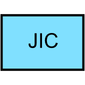|TODO|SFGPUUMJ-------|1.X.3.1.2.2.8 |JOINT INTELLIGENCE CENTRE|POINT|D||
|290|||TODO|SFGPUUL--------|1.X.3.1.2.3 |LAW ENFORCEMENT UNIT|POINT|D||
|291|||TODO|SFGPUULS-------|1.X.3.1.2.3.1 |SHORE PATROL|POINT|D||
|292|||TODO|SFGPUULM-------|1.X.3.1.2.3.2 |MILITARY POLICE|POINT|D||
|293|||TODO|SFGPUULC-------|1.X.3.1.2.3.3 |CIVILIAN LAW ENFORCEMENT|POINT|D||
|294|||TODO|SFGPUULF-------|1.X.3.1.2.3.4 |SECURITY POLICE (AIR)|POINT|D||
|295|||TODO|SFGPUULD-------|1.X.3.1.2.3.5 |CENTRAL INTELLIGENCE DIVISION (CID)|POINT|D||
|296|||TODO|SFGPUUS--------|1.X.3.1.2.4 |SIGNAL UNIT|POINT|D||
|297|||TODO|SFGPUUSA-------|1.X.3.1.2.4.1 |AREA|POINT|D||
|298|||TODO|SFGPUUSC-------|1.X.3.1.2.4.2 |COMMUNICATION CONFIGURED PACKAGE|POINT|D||
|299|||TODO|SFGPUUSCL------|1.X.3.1.2.4.2.1 |LARGE COMMUNICATION CONFIGURED PACKAGE (LCCP)|POINT|D||
|300|||TODO|SFGPUUSO-------|1.X.3.1.2.4.3 |COMMAND OPERATIONS|POINT|D||
|301|||TODO|SFGPUUSF-------|1.X.3.1.2.4.4 |FORWARD COMMUNICATIONS|POINT|D||
|302|||TODO|SFGPUUSM-------|1.X.3.1.2.4.5 |MULTIPLE SUBSCRIBER ELEMENT|POINT|D||
|303|||TODO|SFGPUUSMS------|1.X.3.1.2.4.5.1 |SMALL EXTENSION NODE|POINT|D||
|304|||TODO|SFGPUUSML------|1.X.3.1.2.4.5.2 |LARGE EXTENSION NODE|POINT|D||
|305|||TODO|SFGPUUSMN------|1.X.3.1.2.4.5.3 |NODE CENTRE|POINT|D||
|306|||TODO|SFGPUUSR-------|1.X.3.1.2.4.6 |RADIO UNIT|POINT|D||
|307|||TODO|SFGPUUSRS------|1.X.3.1.2.4.6.1 |TACTICAL SATELLITE|POINT|D||
|308|||TODO|SFGPUUSRT------|1.X.3.1.2.4.6.2 |TELETYPE CENTRE|POINT|D||
|309|||TODO|SFGPUUSRW------|1.X.3.1.2.4.6.3 |RELAY|POINT|D||
|310|||TODO|SFGPUUSS-------|1.X.3.1.2.4.7 |SIGNAL SUPPORT|POINT|D||
|311|||TODO|SFGPUUSW-------|1.X.3.1.2.4.8 |TELEPHONE SWITCH|POINT|D||
|312||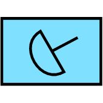|TODO|SFGPUUSX-------|1.X.3.1.2.4.9 |ELECTRONIC RANGING|POINT|D||
|313|||TODO|SFGPUUI--------|1.X.3.1.2.5 |INFORMATION WARFARE UNIT|POINT|D||
|314|||TODO|SFGPUUL--------|1.X.3.1.2.6 |LANDING SUPPORT|POINT|D||
|315|||TODO|SFGPUUE--------|1.X.3.1.2.7 |EXPLOSIVE ORDINANCE DISPOSAL|POINT|D||
|316|||TODO|SFGPUUT--------|1.X.3.1.2.8 |TOPOGRAPHIC|POINT|D||
|317|||TODO|SFGPUU---------|1.X.3.1.2.9 |DOG|POINT|D||
|318|||TODO|SFGPUUD--------|1.X.3.1.2.10 |DRILLING|POINT|D||
|319|||TODO|SFGPUS---------|1.X.3.1.3 |COMBAT SERVICE SUPPORT|POINT|D||
|320|||TODO|SFGPUSA--------|1.X.3.1.3.1 |ADMINISTRATIVE (ADMIN)|POINT|D||
|321|||TODO|SFGPUSAT-------|1.X.3.1.3.1.1 |ADMIN THEATRE|POINT|D||
|322|||TODO|SFGPUSAC-------|1.X.3.1.3.1.2 |ADMIN CORPS|POINT|D||
|323|||TODO|SFGPUSAJ-------|1.X.3.1.3.1.3 |JUDGE ADVOCATE GENERAL (JAG)|POINT|D||
|324|||TODO|SFGPUSAJT------|1.X.3.1.3.1.3.1 |JAG THEATRE|POINT|D||
|325|||TODO|SFGPUSAJC------|1.X.3.1.3.1.3.2 |JAG CORPS|POINT|D||
|326|||TODO|SFGPUSAO-------|1.X.3.1.3.1.4 |POSTAL|POINT|D||
|327|||TODO|SFGPUSAOT------|1.X.3.1.3.1.4.1 |POSTAL THEATRE|POINT|D||
|328|||TODO|SFGPUSAOC------|1.X.3.1.3.1.4.2 |POSTAL CORPS|POINT|D||
|329|||TODO|SFGPUSAF-------|1.X.3.1.3.1.5 |FINANCE|POINT|D||
|330|||TODO|SFGPUSAFT------|1.X.3.1.3.1.5.1 |FINANCE THEATRE|POINT|D||
|331|||TODO|SFGPUSAFC------|1.X.3.1.3.1.5.2 |FINANCE CORPS|POINT|D||
|332|||TODO|SFGPUSAS-------|1.X.3.1.3.1.6 |PERSONNEL SERVICES|POINT|D||
|333|||TODO|SFGPUSAST------|1.X.3.1.3.1.6.1 |PERSONNEL THEATRE|POINT|D||
|334|||TODO|SFGPUSASC------|1.X.3.1.3.1.6.2 |PERSONNEL CORPS|POINT|D||
|335|||TODO|SFGPUSAM-------|1.X.3.1.3.1.7 |MORTUARY/GRAVES REGISTRY|POINT|D||
|336|||TODO|SFGPUSAMT------|1.X.3.1.3.1.7.1 |MORTUARY/GRAVES REGISTRY THEATRE|POINT|D||
|337|||TODO|SFGPUSAMC------|1.X.3.1.3.1.7.2 |MORTUARY/GRAVES REGISTRY CORPS|POINT|D||
|338|||TODO|SFGPUSAR-------|1.X.3.1.3.1.8 |RELIGIOUS/CHAPLAIN|POINT|D||
|339|||TODO|SFGPUSART------|1.X.3.1.3.1.8.1 |RELIGIOUS/CHAPLAIN THEATRE|POINT|D||
|340|||TODO|SFGPUSARC------|1.X.3.1.3.1.8.2 |RELIGIOUS/CHAPLAIN CORPS|POINT|D||
|341|||TODO|SFGPUSAP-------|1.X.3.1.3.1.9 |PUBLIC AFFAIRS|POINT|D||
|342|||TODO|SFGPUSAPT------|1.X.3.1.3.1.9.1 |PUBLIC AFFAIRS THEATRE|POINT|D||
|343|||TODO|SFGPUSAPC------|1.X.3.1.3.1.9.2 |PUBLIC AFFAIRS CORPS|POINT|D||
|344|||TODO|SFGPUSAPB------|1.X.3.1.3.1.9.3 |PUBLIC AFFAIRS BROADCAST|POINT|D||
|345|||TODO|SFGPUSAPBT-----|1.X.3.1.3.1.9.3.1 |PUBLIC AFFAIRS BROADCAST THEATRE|POINT|D||
|346|||TODO|SFGPUSAPBC-----|1.X.3.1.3.1.9.3.2 |PUBLIC AFFAIRS BROADCAST CORPS|POINT|D||
|347|||TODO|SFGPUSAPM------|1.X.3.1.3.1.9.4 |PUBLIC AFFAIRS JOINT INFORMATION BUREAU (JIB)|POINT|D||
|348|||TODO|SFGPUSAPMT-----|1.X.3.1.3.1.9.4.1 |PUBLIC AFFAIRS JIB THEATRE|POINT|D||
|349|||TODO|SFGPUSAPMC-----|1.X.3.1.3.1.9.4.2 |PUBLIC AFFAIRS JIB CORPS|POINT|D||
|350|||TODO|SFGPUSAX-------|1.X.3.1.3.1.10 |REPLACEMENT HOLDING UNIT (RHU)|POINT|D||
|351|||TODO|SFGPUSAXT------|1.X.3.1.3.1.10.1 |RHU THEATRE|POINT|D||
|352|||TODO|SFGPUSAXC------|1.X.3.1.3.1.10.2 |RHU CORPS|POINT|D||
|353|||TODO|SFGPUSAL-------|1.X.3.1.3.1.11 |LABOUR|POINT|D||
|354|||TODO|SFGPUSALT------|1.X.3.1.3.1.11.1 |LABOUR THEATRE|POINT|D||
|355|||TODO|SFGPUSALC------|1.X.3.1.3.1.11.2 |LABOUR CORPS|POINT|D||
|356|YES|||SFGPUSAW-------|1.X.3.1.3.1.12 |MORAL WELFARE RECREATION (MWR) |POINT|D||
|357|YES|||SFGPUSAWT------|1.X.3.1.3.1.12.1 |MWR THEATRE|POINT|D||
|358|YES|||SFGPUSAWC------|1.X.3.1.3.1.12.2 |MWR CORPS|POINT|D||
|359|||TODO|SFGPUSAQ-------|1.X.3.1.3.1.13 |QUARTERMASTER (SUPPLY)|POINT|D||
|360|||TODO|SFGPUSAQT------|1.X.3.1.3.1.13.1 |QUARTERMASTER (SUPPLY) THEATRE|POINT|D||
|361|||TODO|SFGPUSAQC------|1.X.3.1.3.1.13.2 |QUARTERMASTER (SUPPLY) CORPS|POINT|D||
|362|||TODO|SFGPUSM--------|1.X.3.1.3.2 |MEDICAL|POINT|D||
|363|||TODO|SFGPUSMT-------|1.X.3.1.3.2.1 |MEDICAL THEATRE|POINT|D||
|364|||TODO|SFGPUSMC-------|1.X.3.1.3.2.2 |MEDICAL CORPS|POINT|D||
|365|||TODO|SFGPUSMM-------|1.X.3.1.3.2.3 |MEDICAL TREATMENT FACILITY|POINT|D||
|366|||TODO|SFGPUSMMT------|1.X.3.1.3.2.3.1 |MEDICAL TREATMENT FACILITY THEATRE|POINT|D||
|367|||TODO|SFGPUSMMC------|1.X.3.1.3.2.3.2 |MEDICAL TREATMENT FACILITY CORPS|POINT|D||
|368|||TODO|SFGPUSMV-------|1.X.3.1.3.2.4 |MEDICAL VETERINARY|POINT|D||
|369|||TODO|SFGPUSMVT------|1.X.3.1.3.2.4.1 |MEDICAL VETERINARY THEATRE|POINT|D||
|370|||TODO|SFGPUSMVC------|1.X.3.1.3.2.4.2 |MEDICAL VETERINARY CORPS|POINT|D||
|371|||TODO|SFGPUSMD-------|1.X.3.1.3.2.5 |MEDICAL DENTAL|POINT|D||
|372|||TODO|SFGPUSMDT------|1.X.3.1.3.2.5.1 |MEDICAL DENTAL THEATRE|POINT|D||
|373|||TODO|SFGPUSMDC------|1.X.3.1.3.2.5.2 |MEDICAL DENTAL CORPS|POINT|D||
|374|||TODO|SFGPUSMP-------|1.X.3.1.3.2.6 |MEDICAL PSYCHOLOGICAL|POINT|D||
|375|||TODO|SFGPUSMPT------|1.X.3.1.3.2.6.1 |MEDICAL PSYCHOLOGICAL THEATRE|POINT|D||
|376|||TODO|SFGPUSMPC------|1.X.3.1.3.2.6.2 |MEDICAL PSYCHOLOGICAL CORPS|POINT|D||
|377|||TODO|SFGPUSS--------|1.X.3.1.3.3 |SUPPLY|POINT|D||
|378|||TODO|SFGPUSST-------|1.X.3.1.3.3.1 |SUPPLY THEATRE|POINT|D||
|379|||TODO|SFGPUSSC-------|1.X.3.1.3.3.2 |SUPPLY CORPS|POINT|D||
|380|||TODO|SFGPUSS1-------|1.X.3.1.3.3.3 |SUPPLY CLASS I|POINT|D||
|381|||TODO|SFGPUSS1T------|1.X.3.1.3.3.3.1 |SUPPLY CLASS I THEATRE|POINT|D||
|382|||TODO|SFGPUSS1C------|1.X.3.1.3.3.3.2 |SUPPLY CLASS I CORPS|POINT|D||
|383|||TODO|SFGPUSS2-------|1.X.3.1.3.3.4 |SUPPLY CLASS II|POINT|D||
|384|||TODO|SFGPUSS2T------|1.X.3.1.3.3.4.1 |SUPPLY CLASS II THEATRE|POINT|D||
|385|||TODO|SFGPUSS2C------|1.X.3.1.3.3.4.2 |SUPPLY CLASS II CORPS|POINT|D||
|386|||TODO|SFGPUSS3-------|1.X.3.1.3.3.5 |SUPPLY CLASS III|POINT|D||
|387|||TODO|SFGPUSS3T------|1.X.3.1.3.3.5.1 |SUPPLY CLASS III THEATRE|POINT|D||
|388|||TODO|SFGPUSS3C------|1.X.3.1.3.3.5.2 |SUPPLY CLASS III CORPS|POINT|D||
|389|||TODO|SFGPUSS3A------|1.X.3.1.3.3.5.3 |SUPPLY CLASS III AVIATION|POINT|D||
|390|||TODO|SFGPUSS3AT-----|1.X.3.1.3.3.5.3.1 |SUPPLY CLASS III AVIATION|POINT|D||
|391|||TODO|SFGPUSS3AC-----|1.X.3.1.3.3.5.3.2 |SUPPLY CLASS III AVIATION CORPS|POINT|D||
|392|||TODO|SFGPUSS4-------|1.X.3.1.3.3.6 |SUPPLY CLASS IV|POINT|D||
|393|||TODO|SFGPUSS4T------|1.X.3.1.3.3.6.1 |SUPPLY CLASS IV THEATRE|POINT|D||
|394|||TODO|SFGPUSS4C------|1.X.3.1.3.3.6.2 |SUPPLY CLASS IV CORPS|POINT|D||
|395|||TODO|SFGPUSS5-------|1.X.3.1.3.3.7 |SUPPLY CLASS V|POINT|D||
|396|||TODO|SFGPUSS5T------|1.X.3.1.3.3.7.1 |SUPPLY CLASS V THEATRE|POINT|D||
|397|||TODO|SFGPUSS5C------|1.X.3.1.3.3.7.2 |SUPPLY CLASS V CORPS|POINT|D||
|398||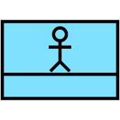|TODO|SFGPUSS6-------|1.X.3.1.3.3.8 |SUPPLY CLASS VI|POINT|D||
|399|||TODO|SFGPUSS6T------|1.X.3.1.3.3.8.1 |SUPPLY CLASS VI THEATRE|POINT|D||
|400|||TODO|SFGPUSS6C------|1.X.3.1.3.3.8.2 |SUPPLY CLASS VI CORPS|POINT|D||
|401|||TODO|SFGPUSS7-------|1.X.3.1.3.3.9 |SUPPLY CLASS VII|POINT|D||
|402|||TODO|SFGPUSS7T------|1.X.3.1.3.3.9.1 |SUPPLY CLASS VII THEATRE|POINT|D||
|403|||TODO|SFGPUSS7C------|1.X.3.1.3.3.9.2 |SUPPLY CLASS VII CORPS|POINT|D||
|404|||TODO|SFGPUSS8-------|1.X.3.1.3.3.10 |SUPPLY CLASS VIII|POINT|D||
|405|||TODO|SFGPUSS8T------|1.X.3.1.3.3.10.1 |SUPPLY CLASS VIII THEATRE|POINT|D||
|406|||TODO|SFGPUSS8C------|1.X.3.1.3.3.10.2 |SUPPLY CLASS VIII CORPS|POINT|D||
|407|||TODO|SFGPUSS9-------|1.X.3.1.3.3.11 |SUPPLY CLASS IX|POINT|D||
|408|||TODO|SFGPUSS9T------|1.X.3.1.3.3.11.1 |SUPPLY CLASS IX THEATRE|POINT|D||
|409|||TODO|SFGPUSS9C------|1.X.3.1.3.3.11.2 |SUPPLY CLASS IX CORPS|POINT|D||
|410|||TODO|SFGPUSSX-------|1.X.3.1.3.3.12 |SUPPLY CLASS X|POINT|D||
|411|||TODO|SFGPUSSXT------|1.X.3.1.3.3.12.1 |SUPPLY CLASS X THEATRE|POINT|D||
|412|||TODO|SFGPUSSXC------|1.X.3.1.3.3.12.2 |SUPPLY CLASS X CORPS|POINT|D||
|413|||TODO|SFGPUSSL-------|1.X.3.1.3.3.13 |SUPPLY LAUNDRY/BATH|POINT|D||
|414|||TODO|SFGPUSSLT------|1.X.3.1.3.3.13.1 |SUPPLY LAUNDRY/BATH THEATRE|POINT|D||
|415|||TODO|SFGPUSSLC------|1.X.3.1.3.3.13.2 |SUPPLY LAUNDRY/BATH CORPS|POINT|D||
|416|||TODO|SFGPUSSW-------|1.X.3.1.3.3.14 |SUPPLY WATER|POINT|D||
|417|||TODO|SFGPUSSWT------|1.X.3.1.3.3.14.1 |SUPPLY WATER THEATRE|POINT|D||
|418|||TODO|SFGPUSSWC------|1.X.3.1.3.3.14.2 |SUPPLY WATER CORPS|POINT|D||
|419|||TODO|SFGPUSSWP------|1.X.3.1.3.3.14.3 |SUPPLY WATER PURIFICATION|POINT|D||
|420|||TODO|SFGPUSSWPT-----|1.X.3.1.3.3.14.3.1 |SUPPLY WATER PURIFICATION THEATRE|POINT|D||
|421|||TODO|SFGPUSSWPC-----|1.X.3.1.3.3.14.3.2 |SUPPLY WATER PURIFICATION CORPS|POINT|D||
|422|||TODO|SFGPUST--------|1.X.3.1.3.4 |TRANSPORTATION|POINT|D||
|423|||TODO|SFGPUSTT-------|1.X.3.1.3.4.1 |TRANSPORTATION THEATRE|POINT|D||
|424|||TODO|SFGPUSTC-------|1.X.3.1.3.4.2 |TRANSPORTATION CORPS|POINT|D||
|425|||TODO|SFGPUSTM-------|1.X.3.1.3.4.3 |MOVEMENT CONTROL CENTRE(MCC)|POINT|D||
|426|||TODO|SFGPUSTMT------|1.X.3.1.3.4.3.1 |MCC THEATRE|POINT|D||
|427|||TODO|SFGPUSTMC------|1.X.3.1.3.4.3.2 |MCC CORPS|POINT|D||
|428|||TODO|SFGPUSTR-------|1.X.3.1.3.4.4 |RAILHEAD|POINT|D||
|429|||TODO|SFGPUSTRT------|1.X.3.1.3.4.4.1 |RAILHEAD THEATRE|POINT|D||
|430|||TODO|SFGPUSTRC------|1.X.3.1.3.4.4.2 |RAILHEAD CORPS|POINT|D||
|431|||TODO|SFGPUSTS-------|1.X.3.1.3.4.5 |SPOD/SPOE|POINT|D||
|432|||TODO|SFGPUSTST------|1.X.3.1.3.4.5.1 |SPOD/SPOE THEATRE|POINT|D||
|433|||TODO|SFGPUSTSC------|1.X.3.1.3.4.5.2 |SPOD/SPOE CORPS|POINT|D||
|434|||TODO|SFGPUSTA-------|1.X.3.1.3.4.6 |APOD/APOE|POINT|D||
|435|||TODO|SFGPUSTAT------|1.X.3.1.3.4.6.1 |APOD/APOE THEATRE|POINT|D||
|436|||TODO|SFGPUSTAC------|1.X.3.1.3.4.6.2 |APOD/APOE CORPS|POINT|D||
|437|||TODO|SFGPUSTI-------|1.X.3.1.3.4.7 |MISSILE|POINT|D||
|438|||TODO|SFGPUSTIT------|1.X.3.1.3.4.7.1 |MISSILE THEATRE|POINT|D||
|439|||TODO|SFGPUSTIC------|1.X.3.1.3.4.7.2 |MISSILE CORPS|POINT|D||
|440|||TODO|SFGPUSX--------|1.X.3.1.3.5 |MAINTENANCE|POINT|D||
|441|||TODO|SFGPUSXT-------|1.X.3.1.3.5.1 |MAINTENANCE THEATRE|POINT|D||
|442|||TODO|SFGPUSXC-------|1.X.3.1.3.5.2 |MAINTENANCE CORPS|POINT|D||
|443|||TODO|SFGPUSXH-------|1.X.3.1.3.5.3 |MAINTENANCE HEAVY|POINT|D||
|444|||TODO|SFGPUSXHT------|1.X.3.1.3.5.3.1 |MAINTENANCE HEAVY THEATRE|POINT|D||
|445|||TODO|SFGPUSXHC------|1.X.3.1.3.5.3.2 |MAINTENANCE HEAVY CORPS|POINT|D||
|446|||TODO|SFGPUSXR-------|1.X.3.1.3.5.4 |MAINTENANCE RECOVERY|POINT|D||
|447|||TODO|SFGPUSXRT------|1.X.3.1.3.5.4.1 |MAINTENANCE RECOVERY THEATRE|POINT|D||
|448|||TODO|SFGPUSXRC------|1.X.3.1.3.5.4.2 |MAINTENANCE RECOVERY CORPS|POINT|D||
|449|||TODO|SFGPUSXO-------|1.X.3.1.3.5.5 |ORDINANCE|POINT|D||
|450|||TODO|SFGPUSXOT------|1.X.3.1.3.5.5.1 |ORDINANCE THEATRE|POINT|D||
|451|||TODO|SFGPUSXOC------|1.X.3.1.3.5.5.2 |ORDINANCE CORPS|POINT|D||
|452|||TODO|SFGPUSXOM------|1.X.3.1.3.5.5.3 |ORDINANCE MISSILE|POINT|D||
|453|||TODO|SFGPUSXOMT-----|1.X.3.1.3.5.5.3.1 |ORDINANCE MISSILE THEATRE|POINT|D||
|454|||TODO|SFGPUSXOMC-----|1.X.3.1.3.5.5.3.2 |ORDINANCE MISSILE CORPS|POINT|D||
|455|||TODO|SFGPUSXE-------|1.X.3.1.3.5.6 |ELECTRO-OPTICAL|POINT|D||
|456|||TODO|SFGPUSXET------|1.X.3.1.3.5.6.1 |ELECTRO-OPTICAL THEATRE|POINT|D||
|457|||TODO|SFGPUSXEC------|1.X.3.1.3.5.6.2 |ELECTRO-OPTICAL CORPS|POINT|D||
|458|||TODO|SFGPUSXBDR-----|1.X.3.1.3.5.7 |BATTLE DAMAGE REPAIR|POINT|D||
|459|||TODO|SFGPUSXPM------|1.X.3.1.3.5.8 |PREVENTIVE MAINTANANCE|POINT|D||
|460||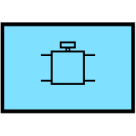|TODO|SFGPUSXP-------|1.X.3.1.3.6 |PIPELINE|POINT|D||
|461|||TODO|SFGPUSXEP------|1.X.3.1.3.7 |ENVIRONMENTAL PROTECTION|POINT|D||
|462|||TODO|SFGPUH---------|1.X.3.1.4 |SPECIAL C2 HEADQUARTERS COMPONENT|POINT|D||
|463|||TODO|SFGPUH---------|1.X.3.1.5 |UNIT GENERAL HEADQUARTERS|POINT|D||
|464|||TODO|SFGPUH---------|1.X.3.1.6 |GENERAL HEADQUARTERS AND SERVICE|POINT|D||
|465|||TODO|SFGPGL---------|1.X.3.1.7 |UNIT GENERAL LIAISON|POINT|D||
|466|||TODO|SFGPE----------|1.X.3.2 |GROUND TRACK EQUIPMENT|POINT|D||
|467|||TODO|SFGPEWM--------|1.X.3.2.1.1 |MISSILE LAUNCHERS|POINT|D||
|468|||TODO|SFGPEWMA-------|1.X.3.2.1.1.1 |AIR DEFENCE (AD) MISSILE LAUNCH|POINT|D||
|469|||TODO|SFGPEWMAS------|1.X.3.2.1.1.1.1 |SHORT RANGE AD MISSILE LAUNCHERS|POINT|D||
|470|||TODO|SFGPEWMAI------|1.X.3.2.1.1.1.2 |INTERMEDIATE RANGE AD MISSILE LAUNCH|POINT|D||
|471|||TODO|SFGPEWMAL------|1.X.3.2.1.1.1.3 |LONG RANGE AD MISSILE LAUNCH|POINT|D||
|472|||TODO|SFGPEWMAT------|1.X.3.2.1.1.1.4 |AD MISSILE LAUNCH THEATRE|POINT|D||
|473|||TODO|SFGPEWMS-------|1.X.3.2.1.1.2 |SURFACE-SURFACE (SS) MISSILE LAUNCHER|POINT|D||
|474|||TODO|SFGPEWMSS------|1.X.3.2.1.1.2.1 |SHORT RANGE SS MISSILE LAUNCH|POINT|D||
|475|||TODO|SFGPEWMSI------|1.X.3.2.1.1.2.2 |INTERMEDIATE RANGE SS MISSILE LAUNCH|POINT|D||
|476|||TODO|SFGPEWMSL------|1.X.3.2.1.1.2.3 |LONG RANGE SS MISSILE LAUNCH|POINT|D||
|477|||TODO|SFGPEWMT-------|1.X.3.2.1.1.3 |MISSILE LAUNCHERS ANTI TANK (AT)|POINT|D||
|478|||TODO|SFGPEWMTL------|1.X.3.2.1.1.3.1 |MISSILE LAUNCHERS AT LIGHT|POINT|D||
|479|||TODO|SFGPEWMTM------|1.X.3.2.1.1.3.2 |MISSILE LAUNCHER AT MEDIUM|POINT|D||
|480|||TODO|SFGPEWMTH------|1.X.3.2.1.1.3.3 |MISSILE LAUNCHER AT HEAVY|POINT|D||
|481|||TODO|SFGPEWS--------|1.X.3.2.1.2 |SINGLE ROCKET LAUNCHER|POINT|D||
|482|||TODO|SFGPEWSL-------|1.X.3.2.1.2.1 |SINGLE ROCKET LAUNCHER LIGHT|POINT|D||
|483|||TODO|SFGPEWSM-------|1.X.3.2.1.2.2 |SINGLE ROCKET LAUNCHER MEDIUM|POINT|D||
|484|||TODO|SFGPEWSH-------|1.X.3.2.1.2.3 |SINGLE ROCKET LAUNCHER HEAVY|POINT|D||
|485|||TODO|SFGPEWX--------|1.X.3.2.1.3 |MULTIPLE ROCKET LAUNCHER|POINT|D||
|486|||TODO|SFGPEWXL-------|1.X.3.2.1.3.1 |MULTIPLE ROCKET LAUNCHER LIGHT|POINT|D||
|487|||TODO|SFGPEWXM-------|1.X.3.2.1.3.2 |MULTIPLE ROCKET LAUNCHER MEDIUM|POINT|D||
|488|||TODO|SFGPEWXH-------|1.X.3.2.1.3.3 |MULTIPLE ROCKET LAUNCHER HEAVY|POINT|D||
|489|||TODO|SFGPEWT--------|1.X.3.2.1.4 |ANTITANK ROCKET LAUNCHER|POINT|D||
|490|||TODO|SFGPEWTL-------|1.X.3.2.1.4.1 |ANTITANK ROCKET LAUNCHER LIGHT|POINT|D||
|491|||TODO|SFGPEWTM-------|1.X.3.2.1.4.2 |ANTITANK ROCKET LAUNCHER MEDIUM|POINT|D||
|492|||TODO|SFGPEWTH-------|1.X.3.2.1.4.3 |ANTITANK ROCKET LAUNCHER HEAVY|POINT|D||
|493|||TODO|SFGPEWR--------|1.X.3.2.1.5 |RIFLE/AUTOMATIC WEAPON|POINT|D||
|494|||TODO|SFGPEWRR-------|1.X.3.2.1.5.1 |RIFLE|POINT|D||
|495|||TODO|SFGPEWRL-------|1.X.3.2.1.5.2 |LIGHT MACHINE GUN|POINT|D||
|496|||TODO|SFGPEWRH-------|1.X.3.2.1.5.3 |HEAVY MACHINE GUN|POINT|D||
|497|||TODO|SFGPEWZ--------|1.X.3.2.1.6 |GRENADE LAUNCHER|POINT|D||
|498|||TODO|SFGPEWZL-------|1.X.3.2.1.6.1 |GRENADE LAUNCHER LIGHT|POINT|D||
|499|||TODO|SFGPEWZM-------|1.X.3.2.1.6.2 |GRENADE LAUNCHER MEDIUM|POINT|D||
|500|||TODO|SFGPEWZH-------|1.X.3.2.1.6.3 |GRENADE LAUNCHER HEAVY|POINT|D||
|501|||TODO|SFGPEWO--------|1.X.3.2.1.7 |MORTAR|POINT|D||
|502|||TODO|SFGPEWOL-------|1.X.3.2.1.7.1 |MORTAR LIGHT|POINT|D||
|503|||TODO|SFGPEWOM-------|1.X.3.2.1.7.2 |MORTAR MEDIUM|POINT|D||
|504|||TODO|SFGPEWOH-------|1.X.3.2.1.7.3 |MORTAR HEAVY|POINT|D||
|505|||TODO|SFGPEWH--------|1.X.3.2.1.8 |HOWITZER|POINT|D||
|506||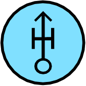|TODO|SFGPEWHL-------|1.X.3.2.1.8.1 |HOWITZER LIGHT|POINT|D||
|507|||TODO|SFGPEWHLS------|1.X.3.2.1.8.1.1 |HOWITZER LIGHT SELF-PROPELLED|POINT|D||
|508|||TODO|SFGPEWHM-------|1.X.3.2.1.8.2 |HOWITZER MEDIUM|POINT|D||
|509|||TODO|SFGPEWHMS------|1.X.3.2.1.8.2.1 |HOWITZER MEDIUM SELF-PROPELLED|POINT|D||
|510||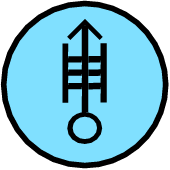|TODO|SFGPEWHH-------|1.X.3.2.1.8.3 |HOWITZER HEAVY|POINT|D||
|511|||TODO|SFGPEWHHS------|1.X.3.2.1.8.3.1 |HOWITZER HEAVY SELF-PROPELLED|POINT|D||
|512|||TODO|SFGPEWG--------|1.X.3.2.1.9 |ANTITANK GUN|POINT|D||
|513|||TODO|SFGPEWGR-------|1.X.3.2.1.9.1 |ANTITANK GUN RECOILLESS|POINT|D||
|514|||TODO|SFGPEWGL-------|1.X.3.2.1.9.2 |ANTITANK GUN LIGHT|POINT|D||
|515|||TODO|SFGPEWGM-------|1.X.3.2.1.9.3 |ANTITANK GUN MEDIUM|POINT|D||
|516|||TODO|SFGPEWGH-------|1.X.3.2.1.9.4 |ANTITANK GUN HEAVY|POINT|D||
|517|||TODO|SFGPEWD--------|1.X.3.2.1.10 |DIRECT FIRE GUN|POINT|D||
|518|||TODO|SFGPEWDL-------|1.X.3.2.1.10.1 |DIRECT FIRE GUN LIGHT|POINT|D||
|519|||TODO|SFGPEWDLS------|1.X.3.2.1.10.1.1 |DIRECT FIRE GUN LIGHT SELF-PROPELLED|POINT|D||
|520|||TODO|SFGPEWDM-------|1.X.3.2.1.10.2 |DIRECT FIRE GUN MEDIUM|POINT|D||
|521|||TODO|SFGPEWDMS------|1.X.3.2.1.10.2.1 |DIRECT FIRE GUN MEDIUM SELF-PROPELLED|POINT|D||
|522|||TODO|SFGPEWDH-------|1.X.3.2.1.10.3 |DIRECT FIRE GUN HEAVY|POINT|D||
|523|||TODO|SFGPEWDHS------|1.X.3.2.1.10.3.1 |DIRECT FIRE GUN HEAVY SELF-PROPELLED|POINT|D||
|524|||TODO|SFGPEWA--------|1.X.3.2.1.11 |AIR DEFENCE GUN|POINT|D||
|525|||TODO|SFGPEWAL-------|1.X.3.2.1.11.1 |AIR DEFENCE GUN LIGHT|POINT|D||
|526|||TODO|SFGPEWAM-------|1.X.3.2.1.11.2 |AIR DEFENCE GUN MEDIUM|POINT|D||
|527|||TODO|SFGPEWAH-------|1.X.3.2.1.11.3 |AIR DEFENCE GUN HEAVY|POINT|D||
|528|||TODO|SFGPEV---------|1.X.3.2.2 |GROUND VEHICLE|POINT|D||
|529|||TODO|SFGPEVA--------|1.X.3.2.2.1 |ARMOURED VEHICLE|POINT|D||
|530|||TODO|SFGPEVAT-------|1.X.3.2.2.1.1 |TANK|POINT|D||
|531|||TODO|SFGPEVATL------|1.X.3.2.2.1.1.1 |TANK LIGHT|POINT|D||
|532|YES|||SFGPEVATW------|1.X.3.2.2.1.1.1.1 |TANK LIGHT RECOVERY|POINT|D||
|533|||TODO|SFGPEVATM------|1.X.3.2.2.1.1.2 |TANK MEDIUM|POINT|D||
|534|YES|||SFGPEVATX------|1.X.3.2.2.1.1.2.1 |TANK MEDIUM RECOVERY|POINT|D||
|535|||TODO|SFGPEVATH------|1.X.3.2.2.1.1.3 |TANK HEAVY|POINT|D||
|536|YES|||SFGPEVATY------|1.X.3.2.2.1.1.3.1 |TANK HEAVY RECOVERY|POINT|D||
|537|||TODO|SFGPEVAA-------|1.X.3.2.2.1.2 |ARMOURED PERSONNEL CARRIER|POINT|D||
|538|||TODO|SFGPEVAAR------|1.X.3.2.2.1.2.1 |ARMOURED PERSONNEL CARRIER RECOVERY|POINT|D||
|539|||TODO|SFGPEVAI-------|1.X.3.2.2.1.3 |ARMOURED INFANTRY|POINT|D||
|540|||TODO|SFGPEVAC-------|1.X.3.2.2.1.4 |C2V/ACV|POINT|D||
|541|||TODO|SFGPEVAS-------|1.X.3.2.2.1.5 |COMBAT SERVICE SUPPORT VEHICLE|POINT|D||
|542|||TODO|SFGPEVAL-------|1.X.3.2.2.1.6 |LIGHT ARMOURED VEHICLE|POINT|D||
|543|||TODO|SFGPEVU--------|1.X.3.2.2.2 |UTILITY VEHICLE|POINT|D||
|544|||TODO|SFGPEVUB-------|1.X.3.2.2.2.1 |BUS|POINT|D||
|545|||TODO|SFGPEVUS-------|1.X.3.2.2.2.2 |SEMI|POINT|D||
|546|||TODO|SFGPEVUL-------|1.X.3.2.2.2.3 |LIMITED CROSS-COUNTRY TRUCK|POINT|D||
|547|||TODO|SFGPEVUX-------|1.X.3.2.2.2.4 |CROSS-COUNTRY TRUCK|POINT|D||
|548|||TODO|SFGPEVUR-------|1.X.3.2.2.2.5 |WATER CRAFT|POINT|D||
|549|||TODO|SFGPEVE--------|1.X.3.2.2.3 |ENGINEER VEHICLE|POINT|D||
|550|||TODO|SFGPEVEB-------|1.X.3.2.2.3.1 |BRIDGE|POINT|D||
|551|||TODO|SFGPEVEE-------|1.X.3.2.2.3.2 |EARTHMOVER|POINT|D||
|552|||TODO|SFGPEVEE-------|1.X.3.2.2.3.2.1 |MULTIFUNCTIONAL EARTHMOVER/DIGGER|POINT|D||
|553|||TODO|SFGPEVEC-------|1.X.3.2.2.3.3 |CONSTRUCTION VEHICLE|POINT|D||
|554|||TODO|SFGPEVEM-------|1.X.3.2.2.3.4 |MINE LAYING VEHICLE|POINT|D||
|555|||TODO|SFGPEVEMA------|1.X.3.2.2.3.4.1 |ARMOURED VEHICLE MOUNTED|POINT|D||
|556|||TODO|SFGPEVEMT------|1.X.3.2.2.3.4.2 |TRAILER MOUNTED|POINT|D||
|557|||TODO|SFGPEVEMSM-----|1.X.3.2.2.3.4.5 |ARMOURED CARRIER WITH SCATTERABLE MINES|POINT|D||
|558|||TODO|SFGPEVED-------|1.X.3.2.2.3.5 |DOZER|POINT|D||
|559|||TODO|SFGPEVD--------|1.X.3.2.2.3.6 |DRILLING VEHICLE|POINT|D||
|560|||TODO|SFGPEVST-------|1.X.3.2.2.4 |TRAIN LOCOMOTIVE|POINT|D||
|561|||TODO|SFGPEVC--------|1.X.3.2.2.5 |CIVILIAN VEHICLE|POINT|D||
|562|||TODO|SFGPES---------|1.X.3.2.3 |SENSOR|POINT|D||
|563|||TODO|SFGPESR--------|1.X.3.2.3.1 |RADAR|POINT|D||
|564|||TODO|SFGPESE--------|1.X.3.2.3.2 |EMPLACED SENSOR|POINT|D||
|565|||TODO|SFGPEXL--------|1.X.3.2.4.1 |LASER|POINT|D||
|566|||TODO|SFGPEXN--------|1.X.3.2.4.2 |CBRN EQUIPMENT|POINT|D||
|567|||TODO|SFGPEXF--------|1.X.3.2.4.3 |FLAME THROWER|POINT|D||
|568|||TODO|SFGPEXM--------|1.X.3.2.4.4 |LAND MINES|POINT|D||
|569|||TODO|SFGPEXMC-------|1.X.3.2.4.4.1 |LAND MINES LETHAL |POINT|D||
|570|||TODO|SFGPEXML-------|1.X.3.2.4.4.2 |LESS THAN LETHAL|POINT|D||
|571|||TODO|SFGPI-----H----|1.X.3.3 |INSTALLATION|POINT|D||
|572|||TODO|SFGPIR----H----|1.X.3.3.1 |RAW MATERIAL PRODUCTION/STORAGE|POINT|D||
|573|||TODO|SFGPIRM---H----|1.X.3.3.1.1 |MINE|POINT|D||
|574|||TODO|SFGPIRP---H----|1.X.3.3.1.2 |PETROLEUM/GAS/OIL|POINT|D||
|575|||TODO|SFGPIRN---H----|1.X.3.3.1.3 |CBRN|POINT|D||
|576|||TODO|SFGPIRNB--H----|1.X.3.3.1.3.1 |BIOLOGICAL|POINT|D||
|577|||TODO|SFGPIRNC--H----|1.X.3.3.1.3.2 |CHEMICAL|POINT|D||
|578|||TODO|SFGPIRNN--H----|1.X.3.3.1.3.3 |NUCLEAR|POINT|D||
|579|||TODO|SFGPIP----H----|1.X.3.3.2 |PROCESSING FACILITY|POINT|D||
|580|||TODO|SFGPIPD---H----|1.X.3.3.2.1 |DECON|POINT|D||
|581|||TODO|SFGPIE----H----|1.X.3.3.3 |EQUIPMENT MANUFACTURE|POINT|D||
|582|||TODO|SFGPIU----H----|1.X.3.3.4 |SERVICE RESEARCH UTILITY FACILITY |POINT|D||
|583|||TODO|SFGPIUR---H----|1.X.3.3.4.1 |TECHNOLOGICAL RESEARCH FACILITY|POINT|D||
|584|||TODO|SFGPIUT---H----|1.X.3.3.4.2 |TELECOMMUNICATIONS FACILITY|POINT|D||
|585|||TODO|SFGPIUE---H----|1.X.3.3.4.3 |ELECTRIC POWER FACILITY|POINT|D||
|586|||TODO|SFGPIUP---H----|1.X.3.3.4.4 |PUBLIC WATER SERVICES|POINT|D||
|587|||TODO|SFGPIMF---H----|1.X.3.3.5.1 |ATOMIC ENERGY PRODUCTION|POINT|D||
|588|||TODO|SFGPIMA---H----|1.X.3.3.5.2 |AIRCRAFT PRODUCTION & ASSEMBLY|POINT|D||
|589|||TODO|SFGPIME---H----|1.X.3.3.5.3 |AMMUNITION AND EXPLOSIVES PRODUCTION|POINT|D||
|590|||TODO|SFGPIMG---H----|1.X.3.3.5.4 |ARMAMENT PRODUCTION|POINT|D||
|591||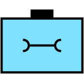|TODO|SFGPIMV---H----|1.X.3.3.5.5 |MILITARY VEHICLE PRODUCTION|POINT|D||
|592|||TODO|SFGPIMN---H----|1.X.3.3.5.6 |ENGINEERING EQUIPMENT PRODUCTION|POINT|D||
|593|||TODO|SFGPIMNB--H----|1.X.3.3.5.6.1 |BRIDGE|POINT|D||
|594|||TODO|SFGPIMC---H----|1.X.3.3.5.7 |CHEMICAL & BIOLOGICAL WARFARE PRODUCTION|POINT|D||
|595|||TODO|SFGPIMS---H----|1.X.3.3.5.8 |SHIP CONSTRUCTION|POINT|D||
|596|||TODO|SFGPIMM---H----|1.X.3.3.5.9 |MISSILE & SPACE SYSTEM PRODUCTION|POINT|D||
|597|||TODO|SFGPIG----H----|1.X.3.3.6 |GOVERNMENT LEADERSHIP|POINT|D||
|598|||TODO|SFGPIB----H----|1.X.3.3.7 |MILITARY BASE/FACILITY|POINT|D||
|599||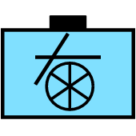|TODO|SFGPIBA---H----|1.X.3.3.7.1 |AIRPORT/AIRBASE|POINT|D||
|600|||TODO|SFGPIBN---H----|1.X.3.3.7.2 |SEAPORT/NAVAL BASE|POINT|D||
|601|||TODO|SFGPIT----H----|1.X.3.3.8 |TRANSPORT FACILITY|POINT|D||
|602|||TODO|SFGPIX----H----|1.X.3.3.9 |MEDICAL FACILITY|POINT|D||
|603|||TODO|SFGPIXH---H----|1.X.3.3.9.1 |HOSPITAL|POINT|D||
|604|||TODO|SFGPIR----H----|1.X.3.4 |SEA SURFACE INSTALLATION|POINT|D||
|605|||TODO|SFSP-----------|1.X.4 |SEA SURFACE TRACK|POINT|D||
|606|||TODO|SFSPC----------|1.X.4.1 |COMBATANT|POINT|D||
|607|||TODO|SFSPCL---------|1.X.4.1.1 |LINE|POINT|D||
|608|||TODO|SFSPCLCV-------|1.X.4.1.1.1 |CARRIER|POINT|D||
|609|||TODO|SFSPCLBB-------|1.X.4.1.1.2 |BATTLESHIP|POINT|D||
|610|||TODO|SFSPCLCC-------|1.X.4.1.1.3 |CRUISER|POINT|D||
|611|||TODO|SFSPCLDD-------|1.X.4.1.1.4 |DESTROYER|POINT|D||
|612|||TODO|SFSPCLFF-------|1.X.4.1.1.5 |FRIGATE/CORVETTE|POINT|D||
|613|||TODO|SFSPCA---------|1.X.4.1.2 |AMPHIBIOUS WARFARE SHIP|POINT|D||
|614|||TODO|SFSPCALA-------|1.X.4.1.2.1 |ASSAULT VESSEL|POINT|D||
|615|||TODO|SFSPCALS-------|1.X.4.1.2.2 |LANDING SHIP|POINT|D||
|616|||TODO|SFSPCALC-------|1.X.4.1.2.3 |LANDING CRAFT|POINT|D||
|617|||TODO|SFSPCM---------|1.X.4.1.3 |MINE WARFARE VESSEL|POINT|D||
|618|||TODO|SFSPCMML-------|1.X.4.1.3.1 |MINELAYER|POINT|D||
|619|||TODO|SFSPCMMS-------|1.X.4.1.3.2 |MINESWEEPER|POINT|D||
|620|||TODO|SFSPCMMH-------|1.X.4.1.3.3 |MINEHUNTER|POINT|D||
|621|||TODO|SFSPCMMD-------|1.X.4.1.3.5 |MCM DRONE|POINT|D||
|622|||TODO|SFSPCP---------|1.X.4.1.4 |PATROL|POINT|D||
|623|||TODO|SFSPCPSB-------|1.X.4.1.4.1 |ANTI SUBMARINE WARFARE|POINT|D||
|624|||TODO|SFSPCPSU-------|1.X.4.1.4.2 |ANTI SURFACE WARFARE|POINT|D||
|625|||TODO|SFSPCH---------|1.X.4.1.5 |HOVERCRAFT|POINT|D||
|626|||TODO|SFSPGF---------|1.X.4.1.6.1 |NAVY TASK FORCE|POINT|D||
|627|||TODO|SFSPGG---------|1.X.4.1.6.2 |NAVY TASK GROUP|POINT|D||
|628|||TODO|SFSPGU---------|1.X.4.1.6.3 |NAVY TASK UNIT|POINT|D||
|629|||TODO|SFSPGE---------|1.X.4.1.6.4 |NAVY TASK ELEMENT|POINT|D||
|630|||TODO|SFSPGC---------|1.X.4.1.6.5 |CONVOY|POINT|D||
|631|||TODO|SFSPN----------|1.X.4.2 |NONCOMBATANT|POINT|D||
|632|||TODO|SFSPNR---------|1.X.4.2.1 |UNDERWAY REPLENISHMENT|POINT|D||
|633|||TODO|SFSPNRA--------|1.X.4.2.1.1 |UNDERWAY REPLENISHMENT AMMO |POINT|D||
|634|||TODO|SFSPNOT--------|1.X.4.2.1.2 |UNDERWAY REPLENISHMENT OIL |POINT|D||
|635|||TODO|SFSPNFT--------|1.X.4.2.2 |FLEET SUPPORT TUG OCEAN GOING |POINT|D||
|636|||TODO|SFSPNI---------|1.X.4.2.3 |INTELLIGENCE|POINT|D||
|637|||TODO|SFSPNM---------|1.X.4.2.4 |HOSPITAL SHIP|POINT|D||
|638|||TODO|SFSPNR---------|1.X.4.2.5 |REPAIR SHIP|POINT|D||
|639|||TODO|SFSPNTS--------|1.X.4.2.6 |SUBMARINE TENDER|POINT|D||
|640|||TODO|SFSPNH---------|1.X.4.2.7 |HOVERCRAFT|POINT|D||
|641|||TODO|SFSPNS---------|1.X.4.2.8 |SERVICE & SUPPORT HARBOUR|POINT|D||
|642|||TODO|SFSPXM---------|1.X.4.3.1 |MERCHANT|POINT|D||
|643|||TODO|SFSPXMC--------|1.X.4.3.1.1 |CARGO|POINT|D||
|644|||TODO|SFSPXME--------|1.X.4.3.1.2 |ROLL ON-ROLL OFF|POINT|D||
|645|||TODO|SFSPXMO--------|1.X.4.3.1.3 |OILER/TANKER|POINT|D||
|646|||TODO|SFSPXMT--------|1.X.4.3.1.4 |TUG|POINT|D||
|647|||TODO|SFSPXMF--------|1.X.4.3.1.5 |FERRY|POINT|D||
|648|||TODO|SFSPXMP--------|1.X.4.3.1.6 |PASSENGER|POINT|D||
|649|||TODO|SFSPXMHZ-------|1.X.4.3.1.7 |HAZARDOUS MATERIALS|POINT|D||
|650|||TODO|SFSPXMD--------|1.X.4.3.1.8 |DREDGE|POINT|D||
|651|||TODO|SFSPXF---------|1.X.4.3.2 |FISHING|POINT|D||
|652|||TODO|SFSPXMDF-------|1.X.4.3.2.1 |DRIFTER|POINT|D||
|653|||TODO|SFSPXMTR-------|1.X.4.3.2.2 |TRAWLER|POINT|D||
|654|||TODO|SFSPXR---------|1.X.4.3.3 |LEISURE CRAFT|POINT|D||
|655|||TODO|SFSPXL---------|1.X.4.3.4 |LAW ENFORCEMENT VESSEL|POINT|D||
|656|||TODO|SFSPXH---------|1.X.4.3.5 |HOVERCRAFT|POINT|D||
|657|||TODO|SFSPO----------|1.X.4.4 |OWN TRACK|POINT|D||
|658|||TODO|SFSPED---------|1.X.4.5.1 |DITCHED AIRCRAFT|POINT|D||
|659|||TODO|SFSPEP---------|1.X.4.5.2 |PERSON IN WATER|POINT|D||
|660|||TODO|SFSPEV---------|1.X.4.5.3 |DISTRESSED VESSEL|POINT|D||
|661|||TODO|SFSPZM---------|1.X.4.6.1 |SEA MINELIKE|POINT|D||
|662|||TODO|SFSPZN---------|1.X.4.6.2 |NAVIGATIONAL|POINT|D||
|663|||TODO|SFSPZI---------|1.X.4.6.3 |ICEBERG|POINT|D||
|664|||TODO|SFUP-----------|1.X.5 |SUBSURFACE TRACK|POINT|D||
|665|||TODO|SFUPS----------|1.X.5.1 |SUBMARINE|POINT|D||
|666|||TODO|SFUPSN---------|1.X.5.1.1 |NUCLEAR PROPULSION|POINT|D||
|667|||TODO|SFUPSC---------|1.X.5.1.2 |CONVENTIONAL PROPULSION|POINT|D||
|668|||TODO|SFUPSO---------|1.X.5.1.3 |OTHER SUBMERSIBLE|POINT|D||
|669|||TODO|SFUPW----------|1.X.5.2 |UNDERWATER WEAPON|POINT|D||
|670|||TODO|SFUPWT---------|1.X.5.2.1 |TORPEDO|POINT|D||
|671|||TODO|SFUPWM---------|1.X.5.2.2 |SEA MINE|POINT|D||
|672|||TODO|SFUPWMD--------|1.X.5.2.2.1 |SEA MINE DEALT|POINT|D||
|673|||TODO|SFUPWMG--------|1.X.5.2.2.2 |SEA MINE (GROUND)|POINT|D||
|674|||TODO|SFUPWMGD-------|1.X.5.2.2.2.1 |SEA MINE (GROUND) DEALT|POINT|D||
|675|||TODO|SFUPWMM--------|1.X.5.2.2.3 |SEA MINE (MOORED)|POINT|D||
|676||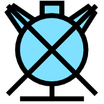|TODO|SFUPWMMD-------|1.X.5.2.2.3.1 |SEA MINE (MOORED DEALT|POINT|D||
|677|||TODO|SFUPWMF--------|1.X.5.2.2.4 |SEA MINE (FLOATING)|POINT|D||
|678|||TODO|SFUPWMFD-------|1.X.5.2.2.4.1 |SEA MINE (FLOATING) DEALT|POINT|D||
|679|||TODO|SFUPWMO--------|1.X.5.2.2.5 |SEA MINE (IN OTHER POSITION)|POINT|D||
|680|||TODO|SFUPWMOD-------|1.X.5.2.2.5.1 |SEA MINE (IN OTHER POSITION) DEALT|POINT|D||
|681|||TODO|SFUPWV---------|1.X.5.2.3 |DRONE (UUV)|POINT|D||
|682|||TODO|SFUPWD---------|1.X.5.3 |UNDERWATER DECOY|POINT|D||
|683|||TODO|SFUPWDM--------|1.X.5.3.1 |SEA MINE DECOY|POINT|D||
|684|||TODO|SFUPN----------|1.X.5.4 |NON-SUBMARINE|POINT|D||
|685|||TODO|SFUPND---------|1.X.5.4.1 |DIVER|POINT|D||
|686|||TODO|SFUPNBS--------|1.X.5.4.2.1 |SEABED INSTALLATION/MANMADE|POINT|D||
|687|YES|||SFUPNBR--------|1.X.5.4.2.2 |SEABED ROCK/STONE OBSTACLE OTHER |POINT|D||
|688|YES|||SFUPNBW--------|1.X.5.4.2.3 |WRECK|POINT|D||
|689|YES|||SFUPNM---------|1.X.5.4.3 |MARINE LIFE|POINT|D||
|690|YES|||SFUPNA---------|1.X.5.4.4 |SEA ANOMALY|POINT|D||
|691|||TODO|SFFP-----------|1.X.6 |SPECIAL OPERATIONS FORCE (SOF) UNIT|POINT|D||
|692||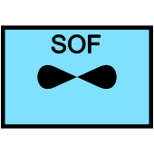|TODO|SFFPAF---------|1.X.6.1.1 |SOF UNIT FIXED WING|POINT|D||
|693|||TODO|SFFPAFA--------|1.X.6.1.1.1 |SOF UNIT ATTACK|POINT|D||
|694|||TODO|SFFPAFK--------|1.X.6.1.1.2 |SOF UNIT REFUEL|POINT|D||
|695|||TODO|SFFPAFU--------|1.X.6.1.1.3 |SOF UNIT UTILITY|POINT|D||
|696|||TODO|SFFPAFUL-------|1.X.6.1.1.3.1 |SOF UNIT UTILITY (LIGHT)|POINT|D||
|697|||TODO|SFFPAFUM-------|1.X.6.1.1.3.2 |SOF UNIT UTILITY (MEDIUM)|POINT|D||
|698||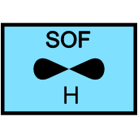|TODO|SFFPAFUH-------|1.X.6.1.1.3.3 |SOF UNIT UTILITY (HEAVY)|POINT|D||
|699|||TODO|SFFPAV---------|1.X.6.1.2 |SOF UNIT VSTOL|POINT|D||
|700|||TODO|SFFPAH---------|1.X.6.1.3 |SOF UNIT ROTARY WING|POINT|D||
|701|||TODO|SFFPAHH--------|1.X.6.1.3.1 |SOF UNIT COMBAT SEARCH AND RESCUE|POINT|D||
|702|||TODO|SFFPAHA--------|1.X.6.1.3.2 |SOF UNIT ATTACK|POINT|D||
|703|||TODO|SFFPAHU--------|1.X.6.1.3.3 |SOF UNIT UTILITY|POINT|D||
|704|||TODO|SFFPAHUL-------|1.X.6.1.3.3.1 |SOF UNIT UTILITY (LIGHT)|POINT|D||
|705|||TODO|SFFPAHUM-------|1.X.6.1.3.3.2 |SOF UNIT UTILITY (MEDIUM)|POINT|D||
|706|||TODO|SFFPAHUH-------|1.X.6.1.3.3.3 |SOF UNIT UTILITY (HEAVY)|POINT|D||
|707|||TODO|SFFPSN---------|1.X.6.2 |SOF UNIT SOF UNIT NAVAL|POINT|D||
|708|||TODO|SFFPSNS--------|1.X.6.2.1 |SOF UNIT SEAL|POINT|D||
|709|||TODO|SFFPSNU--------|1.X.6.2.2 |SOF UNIT UNDERWATER DEMOLITION TEAM|POINT|D||
|710|||TODO|SFFPSNB--------|1.X.6.2.3 |SOF UNIT SPECIAL BOAT|POINT|D||
|711|||TODO|SFFPSNN--------|1.X.6.2.4 |SOF UNIT SPECIAL SSNR|POINT|D||
|712|||TODO|SFFPG----------|1.X.6.3 |SOF UNIT GROUND|POINT|D||
|713|||TODO|SFFPGS---------|1.X.6.3.1 |SOF UNIT SPECIAL FORCES|POINT|D||
|714|||TODO|SFFPGSR--------|1.X.6.3.2 |SOF UNIT RANGER|POINT|D||
|715|||TODO|SFFPGSP--------|1.X.6.3.3 |SOF UNIT PSYCHOLOGICAL OPERATIONS (PSYOPS)|POINT|D||
|716|||TODO|SFFPGSPA-------|1.X.6.3.3.1 |SOF UNIT FIXED AVIATION|POINT|D||
|717|||TODO|SFFPGCA--------|1.X.6.3.4 |SOF UNIT CIVIL AFFAIRS|POINT|D||
|718|||TODO|SFFPGB---------|1.X.6.4 |SOF UNIT SUPPORT|POINT|D||
|719|||TODO|GFTPGB---------|2.X.1.1.1|BLOCK|LINE|E||
|720|||TODO|GFTPGH---------|2.X.1.1.2|BREACH|LINE|E||
|721|||TODO|GFTPGY---------|2.X.1.1.3|BYPASS|LINE|E||
|722|||TODO|GFTPGC---------|2.X.1.1.4|CANALIZE|LINE|E||
|723|||TODO|GFTPGX---------|2.X.1.1.5|CLEAR|LINE|E||
|724|||TODO|GFTPGJ---------|2.X.1.1.6|CONTAIN|LINE|E||
|725|||TODO|GFTPGK---------|2.X.1.1.7|COUNTERATTACK (CATK)|LINE|E||
|726|||TODO|GFTPGKF--------|2.X.1.1.7.1|COUNTERATTACK BY FIRE|LINE|E||
|727|||TODO|GFTPGL---------|2.X.1.1.8|DELAY|LINE|E||
|728|||TODO|GFTPGLT--------|2.X.1.1.8.1|DELAY (UNTIL A SPECIFIED TIME)|LINE|E||
|729|||TODO|GFTPGD---------|2.X.1.1.9|DESTROY|POINT|E||
|730|||TODO|GFTPGT---------|2.X.1.1.10|DISRUPT|LINE|E||
|731|||TODO|GFTPGF---------|2.X.1.1.11|FIX|LINE|E||
|732|||TODO|GFTPGA---------|2.X.1.1.12|FOLLOW AND ASSUME|LINE|E||
|733|||TODO|GFTPGAS--------|2.X.1.1.12.1|FOLLOW AND SUPPORT|LINE|E||
|734|||TODO|GFTPGI---------|2.X.1.1.13|INTERDICT|POINT|E||
|735||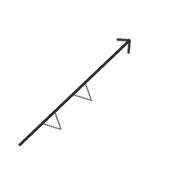|TODO|GFTPGE---------|2.X.1.1.14|ISOLATE|LINE|E||
|736|||TODO|GFTPGN---------|2.X.1.1.15|NEUTRALIZE|POINT|E||
|737|||TODO|GFTPGO---------|2.X.1.1.16|OCCUPY|LINE|E||
|738|||TODO|GFTPGP---------|2.X.1.1.17|PENETRATE|LINE|E||
|739|||TODO|GFTPGR---------|2.X.1.1.18|RELIEF IN PLACE (RIP)|LINE|E||
|740|||TODO|GFTPGQ---------|2.X.1.1.19|RETAIN|LINE|E||
|741|||TODO|GFTPGM---------|2.X.1.1.20|RETIREMENT|LINE|E||
|742|||TODO|GFTPGS---------|2.X.1.1.21|SECURE|LINE|E||
|743|||TODO|GFTPGSS--------|2.X.1.1.21.1|SECURITY (SCREEN)|LINE|E||
|744|||TODO|GFTPGSG--------|2.X.1.1.21.2|SECURITY (GUARD)|LINE|E||
|745|||TODO|GFTPGSC--------|2.X.1.1.21.3|SECURITY (COVER)|LINE|E||
|746|||TODO|GFTPGZ---------|2.X.1.1.22|SEIZE|LINE|E||
|747|||TODO|GFTPGW---------|2.X.1.1.23|WITHDRAW|LINE|E||
|748|||TODO|GFTPGWP--------|2.X.1.1.23.1|WITHDRAW UNDER PRESSURE|LINE|E||
|749|||TODO|GFCPMGPFE------|2.X.2.1.1.1.1.1|ELECTRO-MAGNETIC|POINT|E||
|750|||TODO|GFCPMGPFA------|2.X.2.1.1.1.1.2|ACOUSTIC|POINT|E||
|751|||TODO|GFCPMGPFO------|2.X.2.1.1.1.1.3|ELECTRO-OPTICAL|POINT|E||
|752|||TODO|GFCPMGPI-------|2.X.2.1.1.1.2|POINT OF INTEREST|POINT|E||
|753|||TODO|GFCPMGLBGF-----|2.X.2.1.1.2.1.1.1|FRIENDLY PRESENT|LINE|E||
|754|||TODO|GFCPMGLBGO-----|2.X.2.1.1.2.1.1.2|FRIENDLY PLANNED OR ON ORDER|LINE|E||
|755|||TODO|GHCPMGLBGK-----|2.X.2.1.1.2.1.1.3|ENEMY KNOWN|LINE|E||
|756|||TODO|GHCPMGLBGS-----|2.X.2.1.1.2.1.1.4|ENEMY SUSPECTED OR TEMPLA TED|LINE|E||
|757|||TODO|GFCPMGLBL------|2.X.2.1.1.2.1.2|LATERAL BOUNDARY|LINE|E||
|758|||TODO|GFCPMGLBF------|2.X.2.1.1.2.1.3|FORWARD BOUNDARY|LINE|E||
|759|||TODO|GFCPMGLBR------|2.X.2.1.1.2.1.4|REAR BOUNDARY|LINE|E||
|760|||TODO|GFCPMGLF-------|2.X.2.1.1.2.2|FORWARD LINE OF TROOPS (FLOT)|LINE|E||
|761|||TODO|GFCPMGLL-------|2.X.2.1.1.2.3|LINE OF CONTACT|LINE|E||
|762|||TODO|GFCPMGLP-------|2.X.2.1.1.2.4|PHASE/COORDINATION LINE|LINE|E||
|763|||TODO|GFCPMGLE-------|2.X.2.1.1.2.5|BEARING LINE|LINE|E||
|764|||TODO|GFCPMGLEE------|2.X.2.1.1.2.5.1|ELECTRONIC|LINE|E||
|765|||TODO|GFCPMGLEA------|2.X.2.1.1.2.5.2|ACOUSTIC|LINE|E||
|766|||TODO|GFCPMGLET------|2.X.2.1.1.2.5.3|TORPEDO|LINE|E||
|767|||TODO|GFCPMGLEO------|2.X.2.1.1.2.5.4|ELECTRO-OPTICAL INTERCEPT|LINE|E||
|768|||TODO|GFCPMGAUAF-----|2.X.2.1.1.3.1.1.1|FRIENDLY|AREA|E||
|769|||TODO|GFCPMGAUAP-----|2.X.2.1.1.3.1.1.2|FRIENDLY PLANNED/ON ORDER|AREA|E||
|770|||TODO|GHCPMGAUAE-----|2.X.2.1.1.3.1.1.3|ENEMY KNOWN/CONFIRMED|AREA|E||
|771|||TODO|GHCPMGAUAS-----|2.X.2.1.1.3.1.1.4|ENEMY SUSPECTED/TEMPLATED|AREA|E||
|772|||TODO|GFCPMGAUB------|2.X.2.1.1.3.1.2|ASSEMBLY AREA|AREA|E||
|773|||TODO|GFCPMGAUBO-----|2.X.2.1.1.3.1.2.1|OCCUPIED|AREA|E||
|774|||TODO|GFCPMGAUBM-----|2.X.2.1.1.3.1.2.2|OCCUPIED BY MULTIPLE UNITS|AREA|E||
|775|||TODO|GFCPMGAUBR-----|2.X.2.1.1.3.1.2.3|PROPOSED/ON ORDER|AREA|E||
|776|||TODO|GFCPMGASD------|2.X.2.1.1.3.2.1|DROP ZONE (DZ)|AREA|E||
|777|||TODO|GFCPMGASE------|2.X.2.1.1.3.2.2|EXTRACTION ZONE (EZ)|AREA|E||
|778|||TODO|GFCPMGASL------|2.X.2.1.1.3.2.3|LANDING ZONE (LZ)|AREA|E||
|779|||TODO|GFCPMGASP------|2.X.2.1.1.3.2.4|PICKUP ZONE (PZ)|AREA|E||
|780|||TODO|GFCPMGASS------|2.X.2.1.1.3.2.5|SEARCH AREA/RECONNAISSANCE AREA|AREA|E||
|781|||TODO|GFCPMGASM------|2.X.2.1.1.3.2.6|LIMITED ACCESS AREA|AREA|E||
|782|||TODO|GFCPMGASG------|2.X.2.1.1.3.2.7|ENGAGEMENT AREA|AREA|E||
|783|||TODO|GFCPMGASF------|2.X.2.1.1.3.2.8|FORTIFIED AREA|AREA|E||
|784|||TODO|GFCPMGAST------|2.X.2.1.1.3.2.9|STAGING AREA|AREA|E||
|785|||TODO|GFCPMAAP-------|2.X.2.1.2.1.1|AIR CONTROL POINT (ACP)|POINT|E||
|786||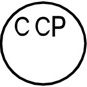|TODO|GFCPMAAC-------|2.X.2.1.2.1.2|COMMUNICATIONS CHECKPOINT (CCP)|POINT|E||
|787|||TODO|GFCPMAAU-------|2.X.2.1.2.1.3|POP UP POINT (PUP)|POINT|E||
|788|||TODO|GFCPMAAD-------|2.X.2.1.2.1.4|DOWNED AIRCREW PICK UP POINT|POINT|E||
|789|||TODO|GFCPMALC-------|2.X.2.1.2.2.1|AIR CORRIDOR|LINE|E||
|790|||TODO|GFCPMALM-------|2.X.2.1.2.2.2|MINIMUM RISK ROUTE (MRR)|LINE|E||
|791|||TODO|GFCPMALS-------|2.X.2.1.2.2.3|STANDARD-USE ARMY AIRCRAFT FLIGHT ROUTE (SAAFR)|LINE|E||
|792|||TODO|GFCPMALU-------|2.X.2.1.2.2.4|UNMANNED AERIAL VEHICLE (UAV) ROUTE|LINE|E||
|793|||TODO|GFCPMALL-------|2.X.2.1.2.2.5|LOW LEVEL TRANSIT ROUTE (LLTR)|LINE|E||
|794|||TODO|GFCPMALIN------|2.X.2.1.2.2.6|IFF ON LINE|LINE|E||
|795|||TODO|GFCPMALIF------|2.X.2.1.2.2.7|IFF OFF LINE|LINE|E||
|796|||TODO|GFCPMAVR-------|2.X.2.1.2.3.1|RESTRICTED OPERATIONS ZONE (ROZ)|AREA|E||
|797|||TODO|GFCPMAVF-------|2.X.2.1.2.3.2|FORWARD AREA AIR DEFENCE ZONE (FAADEZ)|AREA|E||
|798|||TODO|GFCPMAVH-------|2.X.2.1.2.3.3|HIGH DENSITY AIRSPACE CONTROL ZONE (HIDACZ)|AREA|E||
|799|||TODO|GFCPMAVM-------|2.X.2.1.2.3.4|MISSILE ENGAGEMENT ZONE (MEZ)|AREA|E||
|800|||TODO|GFCPMAVML------|2.X.2.1.2.3.4.1|LOW ALTITUDE MEZ|AREA|E||
|801|||TODO|GFCPMAVMH------|2.X.2.1.2.3.4.2|HIGH ALTITUDE MEZ|AREA|E||
|802|||TODO|GFCPMAVW-------|2.X.2.1.2.3.5|WEAPONS FREE ZONE|AREA|E||
|803|||TODO|GFCPMDD--------|2.X.2.1.3.1|DUMMY (DECEPTION)(DECOY)|LINE|E||
|804|||TODO|GFCPMDA--------|2.X.2.1.3.2|AXIS OF ADVANCE FOR FEINT|LINE|E||
|805|||TODO|GFCPMDF--------|2.X.2.1.3.3|DIRECTION OF ATTACK FOR FEINT|LINE|E||
|806|||TODO|GFCPMDM--------|2.X.2.1.3.4|DECOY MINED AREA|AREA|E||
|807|||TODO|GFCPMDY--------|2.X.2.1.3.5|DECOY MINED AREA FENCED |AREA|E||
|808|||TODO|GFCPMDN--------|2.X.2.1.3.6|DUMMY MINEFIELD|POINT|E||
|809|||TODO|GFCPMMPT-------|2.X.2.1.4.1.1|TARGET REFERENCE POINT (TRP)|POINT|E||
|810|||TODO|GFCPMMPBO------|2.X.2.1.4.1.2.1|OCCUPIED (BATTALION SIZED UNIT)|AREA|E||
|811|||TODO|GFCPMMPBP------|2.X.2.1.4.1.2.2|PREPARED (P) BUT NOT OCCUPIED|AREA|E||
|812|||TODO|GFCPMMPBL------|2.X.2.1.4.1.2.3|PLANNED|AREA|E||
|813|||TODO|GFCPMMPSF------|2.X.2.1.4.1.3.1|FRIENDLY|AREA|E||
|814|||TODO|GHCPMMPSE------|2.X.2.1.4.1.3.2|ENEMY KNOWN AND CONFIRMED|AREA|E||
|815|||TODO|GFCPMMPO-------|2.X.2.1.4.1.4|OBSERVATION POST/OUTPOST|POINT|E||
|816|||TODO|GFCPMMPOC------|2.X.2.1.4.1.4.1|COMBAT OUTPOST|POINT|E||
|817|||TODO|GFCPMMPOR------|2.X.2.1.4.1.4.2|OBSERVATION POST OCCUPIED BY DISMOUNTED SCOUTS OR RECONNAISSANCE|POINT|E||
|818|||TODO|GFCPMMPOF------|2.X.2.1.4.1.4.3|FORWARD OBSERVER POSITION|POINT|E||
|819|||TODO|GFCPMMPOS------|2.X.2.1.4.1.4.4|SENSOR OUTPOST/LISTENING POST (OP/LP)|POINT|E||
|820|||TODO|GFCPMMPON------|2.X.2.1.4.1.4.5|CBRN OBSERVATION POST (DISMOUNTED)|POINT|E||
|821|||TODO|GFCPMMPON------|2.X.2.1.4.1.4.6|FORWARD AIR CONTROLLER (FAC)|POINT|E||
|822|||TODO|GFCPMMPON------|2.X.2.1.4.1.4.7|TACTICAL AIR CONTROL PARTY (TACP)|POINT|E||
|823|||TODO|GFCPMMDF-------|2.X.2.1.4.2.1|FORWARD EDGE OF BATTLE AREA (FEBA)|LINE|E||
|824|||TODO|GFCPMMDFA------|2.X.2.1.4.2.1.1|ACTUAL TRACE OF THE FEBA|LINE|E||
|825|||TODO|GFCPMMDFP------|2.X.2.1.4.2.1.2|PROPOSED OR ON ORDER TRACE OF THE FEBA|LINE|E||
|826|||TODO|GFCPMMDP-------|2.X.2.1.4.2.2|PRINCIPLE DIRECTION OF FIRE (PDF)|LINE|E||
|827|||TODO|GFCPMMAE-------|2.X.2.1.4.3.1|ENGAGEMENT AREA (EA)|AREA|E||
|828|||TODO|GFCPMOPD-------|2.X.2.1.5.1.1|POINT OF DEPARTURE|POINT|E||
|829|||TODO|GFCPMOLAF------|2.X.2.1.5.2.1.1|FRIENDLY AVIATION|LINE|E||
|830|||TODO|GFCPMOLAA------|2.X.2.1.5.2.1.2|FRIENDLY AIRBORNE|LINE|E||
|831|||TODO|GFCPMOLAH------|2.X.2.1.5.2.1.3|FRIENDLY ATTACK HELICOPTER|LINE|E||
|832|||TODO|GFCPMOLAS------|2.X.2.1.5.2.1.4|FRIENDLY GROUND AXIS OF SUPPORTING ATTACK|LINE|E||
|833|||TODO|GFCPMOLAM------|2.X.2.1.5.2.1.5|FRIENDLY GROUND AXIS OF MAIN ATTACK|LINE|E||
|834|||TODO|GFCPMOLAO------|2.X.2.1.5.2.1.6|FRIENDLY GROUND AXIS ON ORDER WITH DATE AND TIME (IF KNOWN) EFFECTIVE|LINE|E||
|835|YES|||GHCPMOLAE------|2.X.2.1.5.2.1.7|ENEMY CONFIRMED|LINE|E||
|836|YES|||GHCPMOLAT------|2.X.2.1.5.2.1.8|ENEMY TEMPLATED|LINE|E||
|837|||TODO|GFCPMOLDF------|2.X.2.1.5.2.2.1|FRIENDLY AVIATION|LINE|E||
|838|||TODO|GFCPMOLDY------|2.X.2.1.5.2.2.2|FRIENDLY AVIATION PLANNED OR ON ORDER|LINE|E||
|839|||TODO|GHCPMOLDE------|2.X.2.1.5.2.2.3|ENEMY KNOWN/CONFIRMED A VIA TION|LINE|E||
|840|||TODO|GHCPMOLDT------|2.X.2.1.5.2.2.4|TEMPLATED ENEMY AVIATION|LINE|E||
|841|||TODO|GHCPMOLDG------|2.X.2.1.5.2.2.5|ENEMY CONFIRMED/KNOWN GROUND|LINE|E||
|842|||TODO|GHCPMOLDR------|2.X.2.1.5.2.2.6|TEMPLATED ENEMY GROUND|LINE|E||
|843|||TODO|GFCPMOLDS------|2.X.2.1.5.2.2.7|FRIENDLY DIRECTION OF SUPPORTING ATTACK|LINE|E||
|844|||TODO|GFCPMOLDM------|2.X.2.1.5.2.2.8|FRIENDLY DIRECTION OF MAIN ATTACK|LINE|E||
|845|||TODO|GFCPMOLDO------|2.X.2.1.5.2.2.9|FRIENDLY PLANNED OR ON ORDER|LINE|E||
|846|||TODO|GFCPMOLF-------|2.X.2.1.5.2.3|FINAL COORDINATION LINE|LINE|E||
|847|||TODO|GFCPMOLI-------|2.X.2.1.5.2.4|INFILTRATION LINE|LINE|E||
|848|||TODO|GFCPMOLL-------|2.X.2.1.5.2.5|LIMIT OF ADVANCE|LINE|E||
|849|||TODO|GFCPMOLT-------|2.X.2.1.5.2.6|LINE OF DEPARTURE|LINE|E||
|850|||TODO|GFCPMOLC-------|2.X.2.1.5.2.7|LINE OF DEPARTURE/LINE OF CONTACT (LD/LC)|LINE|E||
|851|||TODO|GFCPMOLP-------|2.X.2.1.5.2.8|PROBABLE LINE OF DEPLOYMENT (PLD)|LINE|E||
|852|||TODO|GFCPMOLR-------|2.X.2.1.5.2.9|RAID|LINE|E||
|853|||TODO|GFCPMOOA-------|2.X.2.1.5.3.1|ASSAULT POSITION|AREA|E||
|854|YES|||GFCPMOOTF------|2.X.2.1.5.3.2.1|FRIENDLY ATTACK POSITION|AREA|E||
|855|||TODO|GFCPMOOTC------|2.X.2.1.5.3.2.2|FRIENDLY OCCUPIED (ONLY IF A UNIT MUST STOP IN THE ATTACK POSITION)|AREA|E||
|856|||TODO|GFCPMOOTP------|2.X.2.1.5.3.2.3|FRIENDLY PLANNED PROPOSED OR ON ORDER |AREA|E||
|857|||TODO|GFCPMOOP-------|2.X.2.1.5.3.3|ATTACK BY FIRE POSITION|LINE|E||
|858|||TODO|GFCPMOOS-------|2.X.2.1.5.3.4|SUPPORT BY FIRE POSITION|LINE|E||
|859|||TODO|GFCPMOOJ-------|2.X.2.1.5.3.5|OBJECTIVE|AREA|E||
|860|||TODO|GFCPMOOX-------|2.X.2.1.5.3.6|PENETRATION BOX|AREA|E||
|861|||TODO|GFCPMOOR-------|2.X.2.1.5.3.7|RAID AREA|AREA|E||
|862|||TODO|GFCPMSGEF------|2.X.2.1.6.1.1.1|FRIENDLY|AREA|E||
|863|||TODO|GHCPMSGEY------|2.X.2.1.6.1.1.2|ENEMY|AREA|E||
|864|||TODO|GFCPMSGA-------|2.X.2.1.6.1.2|AMBUSH|LINE|E||
|865|||TODO|GFCPMSLA-------|2.X.2.1.6.2.1|AIR HEAD|LINE|E||
|866|||TODO|GFCPMSLB-------|2.X.2.1.6.2.2|BRIDGEHEAD|LINE|E||
|867|||TODO|GFCPMSLH-------|2.X.2.1.6.2.3|HOLDING LINE|LINE|E||
|868|||TODO|GFCPMSLR-------|2.X.2.1.6.2.4|RELEASE LINE|LINE|E||
|869|||TODO|GFCPMSAO-------|2.X.2.1.6.3.1|AREA OF OPERATIONS (AO)|AREA|E||
|870|||TODO|GFCPMSAN-------|2.X.2.1.6.3.2|NAMED AREA OF INTEREST|AREA|E||
|871|||TODO|GFCPMSAT-------|2.X.2.1.6.3.3|TARGETED AREA OF INTEREST|AREA|E||
|872|||TODO|GFCPBOGB-------|2.X.2.2.1.1.1|BELT|LINE|E||
|873|||TODO|GFCPBOGL-------|2.X.2.2.1.1.2|LINE|LINE|E||
|874|||TODO|GFCPBOGZ-------|2.X.2.2.1.1.3|ZONE|AREA|E||
|875|||TODO|GFCPBOA--------|2.X.2.2.1.2|ABA TIS|LINE|E||
|876|||TODO|GFCPBOATO------|2.X.2.2.1.3.1|ANTITANK DITCH|LINE|E||
|877|||TODO|GFCPBOATM------|2.X.2.2.1.3.2|ANTITANK DITCH REINFORCED WITH ANTITANK MINES|LINE|E||
|878|||TODO|GFCPBOATD------|2.X.2.2.1.3.3|ANTITANK OBSTACLES TETRAHEDRONS DRAGON'S TEETH AND OTHER SIMILAR OBSTACLES|POINT|E||
|879|||TODO|GFCPBOATW------|2.X.2.2.1.3.4|ANTITANK WALL|LINE|E||
|880||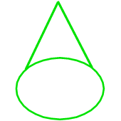|TODO|GFCPBOAB-------|2.X.2.2.1.4|BOOBY TRAP|POINT|E||
|881|||TODO|GFCPBOAMA------|2.X.2.2.1.5.1|ANTIPERSONNEL (AP) MINE|POINT|E||
|882|||TODO|GFCPBOAMT------|2.X.2.2.1.5.2|ANTITANK (AT) MINE|POINT|E||
|883|||TODO|GFCPBOAMD------|2.X.2.2.1.5.3|ANTITANK MINE WITH ANTIHANDLING DEVISE|POINT|E||
|884|||TODO|GFCPBOAMC------|2.X.2.2.1.5.4|ANTITANK MINE (ARROW SHOWS EFFECTS) CLAYMORE MINE|POINT|E||
|885|||TODO|GFCPBOAMU------|2.X.2.2.1.5.5|UNSPECIFIED MINE|POINT|E||
|886|||TODO|GFCPBOAMN------|2.X.2.2.1.5.6|MINE CLUSTER|POINT|E||
|887|||TODO|GFCPBOAMW------|2.X.2.2.1.5.7|WIDE AREA MINES|POINT|E||
|888|||TODO|GFCPBOAIP------|2.X.2.2.1.6.1|PLANNED MINEFIELD|POINT|E||
|889|||TODO|GFCPBOAIC------|2.X.2.2.1.6.2|COMPLETED MINEFIELD|POINT|E||
|890|||TODO|GFCPBOAIL------|2.X.2.2.1.6.3|ANTIPERSONNEL (AP) MINEFIELD|AREA|E||
|891|||TODO|GFCPBOAIG------|2.X.2.2.1.6.4|ANTITANK (AT) MINEFIELD WITH GAP|AREA|E||
|892|||TODO|GFCPBOAIN------|2.X.2.2.1.6.5|ANTITANK (AT) MINEFIELD|POINT|E||
|893|||TODO|GFCPBOAIS------|2.X.2.2.1.6.6|SCATTERABLE MINES|POINT|E||
|894|||TODO|GFCPBOAIH------|2.X.2.2.1.6.7|ANTIPERSONNEL (AP) MINEFIELD REINFORCED WITH SCATTERABLE WITH SELF-DESTRUCT DATE-TIME-GROUP|POINT|E||
|895|||TODO|GFCPBOAID------|2.X.2.2.1.6.8|SCATTERABLE MINEFIELD WITH SELF-DESTRUCT DATE-TIME-GROUP|POINT|E||
|896|||TODO|GFCPBOAIM------|2.X.2.2.1.6.9|MINED AREA|AREA|E||
|897|||TODO|GFCPBOAV-------|2.X.2.2.1.7|EXECUTED VOLCANO MINEFIELD|POINT|E||
|898|||TODO|GFCPBOAEB------|2.X.2.2.1.8.1|BLOCK|LINE|E||
|899|||TODO|GFCPBOAEF------|2.X.2.2.1.8.2|FIX|LINE|E||
|900|||TODO|GFCPBOAET------|2.X.2.2.1.8.3|TURN|LINE|E||
|901|||TODO|GFCPBOAED------|2.X.2.2.1.8.4|DISRUPT|LINE|E||
|902|||TODO|GFCPBOAF-------|2.X.2.2.1.9|OBSTACLE FREE AREA|AREA|E||
|903|||TODO|GFCPBOAFR------|2.X.2.2.1.9.1|OBSTACLE-RESTRICTED AREA|AREA|E||
|904|||TODO|GFCPBOAU-------|2.X.2.2.1.10|UN-EXPLODED ORDNANCE AREA|AREA|E||
|905|||TODO|GFCPBOARP------|2.X.2.2.1.11.1|ROADBLOCK PLANNED|LINE|E||
|906|||TODO|GFCPBOARE------|2.X.2.2.1.11.2|ROADBLOCK WITH EXPLOSIVES STATE OF READINESS 1(SAFE) |LINE|E||
|907|||TODO|GFCPBOARS------|2.X.2.2.1.11.3|ROADBLOCK WITH EXPLOSIVES STATE OF READINESS 2 (ARMED BUT PASSABLE) |LINE|E||
|908|||TODO|GFCPBOARC------|2.X.2.2.1.11.4|ROADBLOCK COMPLETED (EXECUTED)|LINE|E||
|909|||TODO|GFCPBOAP-------|2.X.2.2.1.12|TRIP WIRE|LINE|E||
|910|||TODO|GFCPBOAWU------|2.X.2.2.1.13.1|UNSPECIFIED|LINE|E||
|911|||TODO|GFCPBOAWS------|2.X.2.2.1.13.2|SINGLE FENCE|LINE|E||
|912|||TODO|GFCPBOAWD------|2.X.2.2.1.13.3|DOUBLE FENCE|LINE|E||
|913|||TODO|GFCPBOAWA------|2.X.2.2.1.13.4|DOUBLE APRON FENCE|LINE|E||
|914|||TODO|GFCPBOAWL------|2.X.2.2.1.13.5|LOW WIRE FENCE|LINE|E||
|915|||TODO|GFCPBOAWH------|2.X.2.2.1.13.6|HIGH WIRE FENCE|LINE|E||
|916|||TODO|GFCPBOAWC------|2.X.2.2.1.13.7|SINGLE CONCERTINA|LINE|E||
|917|||TODO|GFCPBOAWB------|2.X.2.2.1.13.8|DOUBLE STRAND CONCERTINA|LINE|E||
|918|||TODO|GFCPBOAWR------|2.X.2.2.1.13.9|TRIPLE STRAND CONCERTINA|LINE|E||
|919|||TODO|GFCPBYOE-------|2.X.2.2.2.1.1|BYPASS EASY|LINE|E||
|920|||TODO|GFCPBYOD-------|2.X.2.2.2.1.2|BYPASS DIFFICULT|LINE|E||
|921|||TODO|GFCPBYOI-------|2.X.2.2.2.1.3|BYPASS IMPOSSIBLE|LINE|E||
|922|||TODO|GFCPBYCA-------|2.X.2.2.2.2.1|ASSAULT CROSSING AREA|LINE|E||
|923|||TODO|GFCPBYCB-------|2.X.2.2.2.2.2|BRIDGE OR GAP|LINE|E||
|924||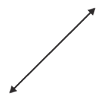|TODO|GFCPBYCF-------|2.X.2.2.2.2.3|FERRY|LINE|E||
|925|||TODO|GFCPBYCE-------|2.X.2.2.2.2.4|FORD/FORD EASY|LINE|E||
|926|||TODO|GFCPBYCD-------|2.X.2.2.2.2.5|FORD DIFFICULT|LINE|E||
|927|||TODO|GFCPBYCL-------|2.X.2.2.2.2.6|LANE|LINE|E||
|928|||TODO|GFCPBYCR-------|2.X.2.2.2.2.7|RAFT SITE|LINE|E||
|929|||TODO|GFCPBYCG-------|2.X.2.2.2.2.8|ENGINEER REGULATING POINT|POINT|E||
|930|||TODO|GFCPBSE--------|2.X.2.2.3.1|EARTHWORK SMALL TRENCH OR FORTIFICATION |POINT|E||
|931|||TODO|GFCPBSF--------|2.X.2.2.3.2|FORT|POINT|E||
|932|||TODO|GFCPBSL--------|2.X.2.2.3.3|FORTIFIED LINE|LINE|E||
|933|YES|||GFCPBSW--------|2.X.2.2.3.4|FOXHOLE EMPLACEMENT OR WEAPON SITE |POINT|E||
|934|||TODO|GFCPBSP--------|2.X.2.2.3.5|STRONG POINT|AREA|E||
|935|||TODO|GFCPBSH--------|2.X.2.2.3.6|SURFACE SHELTER|POINT|E||
|936|||TODO|GFCPBSU--------|2.X.2.2.3.7|UNDERGROUND SHELTER|POINT|E||
|937|||TODO|GFCPBWM--------|2.X.2.2.4.1|MINIMUM SAFE DISTANCE ZONES|POINT|E||
|938|||TODO|GFCPBWN--------|2.X.2.2.4.2|NUCLEAR DETONATIONS FRIENDLY GROUND ZERO|POINT|E||
|939|||TODO|GHCPBWE--------|2.X.2.2.4.3|ENEMY KNOWN GROUND ZERO|POINT|E||
|940|||TODO|GHCPBWI--------|2.X.2.2.4.4|ENEMY TEMPLATED|POINT|E||
|941|||TODO|GFCPBWF--------|2.X.2.2.4.5|FRIENDLY PLANNED OR ON-ORDER|POINT|E||
|942|||TODO|GFCPBWP--------|2.X.2.2.4.6|FALLOUT PRODUCING|POINT|E||
|943|||TODO|GFCPBWR--------|2.X.2.2.4.7|RADIOACTIVE AREA|AREA|E||
|944|||TODO|GFCPBWC--------|2.X.2.2.4.8|BIOLOGICALLY CONTAMINATED AREA|AREA|E||
|945||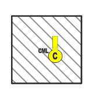|TODO|GFCPBWH--------|2.X.2.2.4.9|CHEMICALLY CONTAMINATED AREA|AREA|E||
|946|||TODO|GFCPBWK--------|2.X.2.2.4.10|BIOLOGICAL AND CHEMICAL ATTACK RELEASE EVENTS |POINT|E||
|947||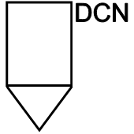|TODO|GFCPBWDP-------|2.X.2.2.4.11.1|DECON SITE/POINT (UNSPECIFIED)|POINT|E||
|948|||TODO|GFCPBWDA-------|2.X.2.2.4.11.2|ALTERNATE DECON SITE/POINT (UNSPECIFIED)|POINT|E||
|949|||TODO|GFCPBWDT-------|2.X.2.2.4.11.3|DECON SITE/POINT (TROOPS)|POINT|E||
|950|||TODO|GFCPBWDE-------|2.X.2.2.4.11.4|DECON SITE/POINT (EQUIPMENT)|POINT|E||
|951|||TODO|GFCPBWDS-------|2.X.2.2.4.11.5|DECON SITE/POINT (EQUIPMENT AND TROOPS)|POINT|E||
|952|||TODO|GFCPBWDO-------|2.X.2.2.4.11.6|DECON SITE/POINT (OPERATIONAL DECONTAMINATION)|POINT|E||
|953|||TODO|GFCPBWDG-------|2.X.2.2.4.11.7|DECON SITE/POINT (THOROUGH DECONTAMINATION)|POINT|E||
|954|||TODO|GFCPBWDEM------|2.X.2.2.4.11.8|DECON POINT (MAIN) EQUIPMENT|POINT|E||
|955|||TODO|GFCPBWDTF------|2.X.2.2.4.11.9|DECON POINT (FORWARD) TROOPS|POINT|E||
|956|||TODO|GFCPBWR--------|2.X.2.2.4.12|DOSE RATE CONTOUR LINES|AREA|E||
|957|||TODO|GFCPFSTP-------|2.X.2.3.1.1.1|POINT /SINGLE TARGET|POINT|E||
|958|||TODO|GFCPFSTC-------|2.X.2.3.1.1.2|CIRCULAR TARGET|POINT|E||
|959|||TODO|GFCPFSS--------|2.X.2.3.1.2|FIRE SUPPORT STATION|POINT|E||
|960|||TODO|GFCPFLC--------|2.X.2.3.2.1|FIRE SUPPORT COORDINATION LINE (FSCL)|LINE|E||
|961|||TODO|GFCPFLF--------|2.X.2.3.2.2|COORDINATION FIRE LINE (CFL)|LINE|E||
|962|||TODO|GFCPFLT--------|2.X.2.3.2.3|LINEAR TARGET|LINE|E||
|963|||TODO|GFCPFLTP-------|2.X.2.3.2.3.1|FINAL PROTECTIVE FIRE|LINE|E||
|964|||TODO|GFCPFLKP-------|2.X.2.3.2.4.1|PLANNED WITH DESIGNATED TIME SHOWN|AREA|E||
|965|||TODO|GFCPFLKS-------|2.X.2.3.2.4.2|SMOKE (ACTUALLY IN PLACE)|AREA|E||
|966|||TODO|GFCPFLKT-------|2.X.2.3.2.4.3|LINEAR SMOKE TARGET|LINE|E||
|967|||TODO|GFCPFLN--------|2.X.2.3.2.5|NO FIRE LINE|LINE|E||
|968|||TODO|GFCPFLR--------|2.X.2.3.2.6|RESTRICTED FIRE LINE (RFL)|LINE|E||
|969|||TODO|GFCPFAS--------|2.X.2.3.3.1|FIRE SUPPORT AREA|AREA|E||
|970|||TODO|GFCPFAC--------|2.X.2.3.3.2|AIRSPACE COORDINATION AREA|AREA|E||
|971|||TODO|GFCPFAT--------|2.X.2.3.3.3|AREA TARGET|AREA|E||
|972|||TODO|GFCPFARS-------|2.X.2.3.3.4.1|SERIES OF TARGETS USING REGULAR TARGETS|AREA|E||
|973|||TODO|GFCPFARU-------|2.X.2.3.3.4.2|SERIES OF TARGETS USING RECTANGULAR TARGETS|AREA|E||
|974|||TODO|GFCPFAB--------|2.X.2.3.3.5|BOMB AREA|AREA|E||
|975|||TODO|GFCPFAI--------|2.X.2.3.3.6|FREE FIRE AREA (FFA)|AREA|E||
|976|||TODO|GFCPFAZT-------|2.X.2.3.3.7.1|GROUP OF TARGETS USING REGULAR TARGETS|AREA|E||
|977|||TODO|GFCPFAZU-------|2.X.2.3.3.7.2|GROUP OF TARGETS USING RECTANGULAR TARGETS|AREA|E||
|978||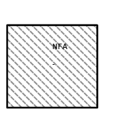|TODO|GFCPFAN--------|2.X.2.3.3.8|NO FIRE AREA|AREA|E||
|979|||TODO|GFCPFAU--------|2.X.2.3.3.9|NUCLEAR TARGET|POINT|E||
|980|||TODO|GFCPFAD--------|2.X.2.3.3.10|RESTRICTED FIRE AREA (RFA)|AREA|E||
|981|||TODO|GFCPFAP--------|2.X.2.3.3.11|POSITION AREA FOR ARTILLERY (PAA)|AREA|E||
|982|||TODO|GFCPFATA-------|2.X.2.3.3.12|TARGET ACQUISITION AREA (TAA)|AREA|E||
|983|||TODO|GFCPSPA--------|2.X.2.4.1.1|AMBULANCE EXCHANGE POINT|POINT|E||
|984|||TODO|GFCPSPC--------|2.X.2.4.1.2|CANNIBALIZATION POINT|POINT|E||
|985|||TODO|GFCPSPY--------|2.X.2.4.1.3|CASUALTY COLLECTION POINT|POINT|E||
|986|||TODO|GFCPSPT--------|2.X.2.4.1.4|CIVILIAN COLLECTION POINT|POINT|E||
|987|||TODO|GFCPSPD--------|2.X.2.4.1.5|DETAINEE COLLECTION POINT|POINT|E||
|988|||TODO|GFCPSPE--------|2.X.2.4.1.6|ENEMY PRISONER OF WAR (EPW) COLLECTION POINT|POINT|E||
|989|||TODO|GFCPSPL--------|2.X.2.4.1.7|LOGISTICS RELEASE POINT (LRP)|POINT|E||
|990|||TODO|GFCPSPM--------|2.X.2.4.1.8|MAINTENANCE COLLECTION POINT|POINT|E||
|991|||TODO|GFCPSPR--------|2.X.2.4.1.9|REARM REFUEL AND RE-SUPPLY POINT |POINT|E||
|992|||TODO|GFCPSPU--------|2.X.2.4.1.10|REFUEL ON THE MOVE (ROM) POINT|POINT|E||
|993|||TODO|GFCPSPO--------|2.X.2.4.1.11|TRAFFIC CONTROL POST (TCP)|POINT|E||
|994|||TODO|GFCPSPI--------|2.X.2.4.1.12|TRAILER TRANSFER POINT|POINT|E||
|995|||TODO|GFCPSPN--------|2.X.2.4.1.13|UNIT MAINTENANCE COLLECTION POINT|POINT|E||
|996|||TODO|GFCPSPQT-------|2.X.2.4.1.14.1|GENERAL|POINT|E||
|997|||TODO|GFCPSPQA-------|2.X.2.4.1.14.2|CLASS I|POINT|E||
|998|||TODO|GFCPSPQB-------|2.X.2.4.1.14.3|CLASS II|POINT|E||
|999|||TODO|GFCPSPQC-------|2.X.2.4.1.14.4|CLASS III|POINT|E||
|1000|||TODO|GFCPSPQD-------|2.X.2.4.1.14.5|CLASS IV|POINT|E||
|1001|||TODO|GFCPSPQE-------|2.X.2.4.1.14.6|CLASS V|POINT|E||
|1002|||TODO|GFCPSPQF-------|2.X.2.4.1.14.7|CLASS VI|POINT|E||
|1003|||TODO|GFCPSPQG-------|2.X.2.4.1.14.8|CLASS VII|POINT|E||
|1004|||TODO|GFCPSPQH-------|2.X.2.4.1.14.9|CLASS VIII|POINT|E||
|1005|||TODO|GFCPSPQI-------|2.X.2.4.1.14.10|CLASS IX|POINT|E||
|1006|||TODO|GFCPSPQJ-------|2.X.2.4.1.14.11|CLASS X|POINT|E||
|1007|||TODO|GFCPSPMA-------|2.X.2.4.1.15.1|AMMUNITION SUPPLY POINT (ASP)|POINT|E||
|1008|||TODO|GFCPSPMT-------|2.X.2.4.1.15.2|AMMUNITION TRANSFER POINT (ATP)|POINT|E||
|1009|||TODO|GFCPSLCM-------|2.X.2.4.2.1.1|MOVING CONVOY|LINE|E||
|1010|||TODO|GFCPSLCH-------|2.X.2.4.2.1.2|HALTED CONVOY|LINE|E||
|1011|||TODO|GFCPSLRM-------|2.X.2.4.2.2.1|MAIN SUPPLY ROUTE|LINE|E||
|1012|||TODO|GFCPSLRA-------|2.X.2.4.2.2.2|ALTERNATE SUPPLY ROUTE|LINE|E||
|1013|||TODO|GFCPSLRO-------|2.X.2.4.2.2.3|ONE-WAY TRAFFIC|LINE|E||
|1014|||TODO|GFCPSLRT-------|2.X.2.4.2.2.4|ALTERNATING TRAFFIC|LINE|E||
|1015|||TODO|GFCPSLRW-------|2.X.2.4.2.2.5|TWO-WAY TRAFFIC|LINE|E||
|1016|||TODO|GFCPSAD--------|2.X.2.4.3.1|DETAINEE HOLDING AREA|AREA|E||
|1017|||TODO|GFCPSAP--------|2.X.2.4.3.2|ENEMY PRISONER OF WAR (EPW) HOLDING AREA|AREA|E||
|1018|||TODO|GFCPSAR--------|2.X.2.4.3.3|FORWARD ARMING AND REFUELLING AREA (FARP)|AREA|E||
|1019|||TODO|GFCPSAH--------|2.X.2.4.3.4|REFUGEE HOLDING AREA|AREA|E||
|1020|||TODO|GFCPSATB-------|2.X.2.4.3.5.1|BRIGADE (BSA)|AREA|E||
|1021|||TODO|GFCPSATD-------|2.X.2.4.3.5.2|DIVISION (DSA)|AREA|E||
|1022|||TODO|GFCPSATR-------|2.X.2.4.3.5.3|REGIMENTAL (RSA)|AREA|E||
|1023|||TODO|GFCPSARR-------|2.X.2.4.3.6|REST (RA)|AREA|E||
|1024|||TODO|GFCPOX---------|2.X.2.5.1|SPECIAL POINT|POINT|E||
|1025|||TODO|GFCPOXRN-------|2.X.2.5.1.1.1|NAV REFERENCE|POINT|E||
|1026|||TODO|GFCPOXRD-------|2.X.2.5.1.1.2|DLRP|POINT|E||
|1027|||TODO|GFCPOXUD-------|2.X.2.5.1.2.1|DATUM|POINT|E||
|1028|||TODO|GFCPOXUB-------|2.X.2.5.1.2.2|BRIEF CONTACT|POINT|E||
|1029|||TODO|GFCPOXUL-------|2.X.2.5.1.2.3|LOST CONTACT|POINT|E||
|1030|||TODO|GFCPOXUS-------|2.X.2.5.1.2.4|SINKER|POINT|E||
|1031|||TODO|GFCPOXWA-------|2.X.2.5.1.3.1|AIM POINT|POINT|E||
|1032|||TODO|GFCPOXWD-------|2.X.2.5.1.3.2|DROP POINT|POINT|E||
|1033|||TODO|GFCPOXWE-------|2.X.2.5.1.3.3|ENTRY POINT|POINT|E||
|1034|||TODO|GFCPOXWG-------|2.X.2.5.1.3.4|GROUND ZERO|POINT|E||
|1035|||TODO|GFCPOXWM-------|2.X.2.5.1.3.5|MSL DETECT POINT|POINT|E||
|1036|||TODO|GFCPOXWI-------|2.X.2.5.1.3.6|IMPACT POINT|POINT|E||
|1037|||TODO|GFCPOXWP-------|2.X.2.5.1.3.7|PREDICTED IMPACT POINT|POINT|E||
|1038|||TODO|GFCPOXY--------|2.X.2.5.1.4|SONOBUOY|POINT|E||
|1039|||TODO|GFCPOXYP-------|2.X.2.5.1.4.1|PATTERN CENTRE|POINT|E||
|1040|||TODO|GFCPOXYD-------|2.X.2.5.1.4.2|DIFAR|POINT|E||
|1041|||TODO|GFCPOXYL-------|2.X.2.5.1.4.3|LOFAR|POINT|E||
|1042|||TODO|GFCPOXYC-------|2.X.2.5.1.4.4|CASS|POINT|E||
|1043|||TODO|GFCPOXYS-------|2.X.2.5.1.4.5|DICASS|POINT|E||
|1044|||TODO|GFCPOXYB-------|2.X.2.5.1.4.6|BT|POINT|E||
|1045|||TODO|GFCPOXYA-------|2.X.2.5.1.4.7|ANM|POINT|E||
|1046|||TODO|GFCPOXYV-------|2.X.2.5.1.4.8|VLAD|POINT|E||
|1047|||TODO|GFCPOXYT-------|2.X.2.5.1.4.9|ATAC|POINT|E||
|1048|||TODO|GFCPOXYR-------|2.X.2.5.1.4.10|RO|POINT|E||
|1049|||TODO|GFCPOXYK-------|2.X.2.5.1.4.11|KINGPIN|POINT|E||
|1050|||TODO|GFCPOXN--------|2.X.2.5.1.5|FORMA TION|POINT|E||
|1051|||TODO|GFCPOXH--------|2.X.2.5.1.6|HARBOUR|POINT|E||
|1052|||TODO|GFCPOXHQ-------|2.X.2.5.1.6.1|POINT Q|POINT|E||
|1053|||TODO|GFCPOXHA-------|2.X.2.5.1.6.2|POINT A|POINT|E||
|1054|||TODO|GFCPOXHY-------|2.X.2.5.1.6.3|POINT Y|POINT|E||
|1055|||TODO|GFCPOXHX-------|2.X.2.5.1.6.4|POINT X|POINT|E||
|1056|||TODO|GFCPOXR--------|2.X.2.5.1.7|ROUTE|POINT|E||
|1057|||TODO|GFCPOXRR-------|2.X.2.5.1.7.1|RENDEZVOUS|POINT|E||
|1058|||TODO|GFCPOXRD-------|2.X.2.5.1.7.2|DIVERSIONS|POINT|E||
|1059|||TODO|GFCPOXRW-------|2.X.2.5.1.7.3|WAYPOINT|POINT|E||
|1060|||TODO|GFCPOXRP-------|2.X.2.5.1.7.4|PIM|POINT|E||
|1061||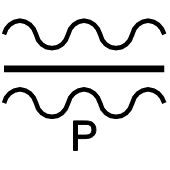|TODO|GFCPOXRT-------|2.X.2.5.1.7.5|POINT R|POINT|E||
|1062|||TODO|GFCPOXSTC------|2.X.2.5.1.8.1|COMBATANT STATION|POINT|E||
|1063|||TODO|GFCPOXSTCP-----|2.X.2.5.1.8.1.1|PICKET STATION|POINT|E||
|1064|||TODO|GFCPOXSTCA-----|2.X.2.5.1.8.1.2|ASW SHIP STATION|POINT|E||
|1065|||TODO|GFCPOXSTR------|2.X.2.5.1.8.2|REPLENISHMENT AT SEA (RAS) STATION|POINT|E||
|1066|||TODO|GFCPOXSTH-----|2.X.2.5.1.8.3|RESCUE STATION|POINT|E||
|1067|||TODO|GFCPOXSTS------|2.X.2.5.1.8.4|SUBMARINE STATION|POINT|E||
|1068|||TODO|GFCPOXSTSA-----|2.X.2.5.1.8.5|ASW SUBMARINE STATION|POINT|E||
|1069|||TODO|GFCPOXS--------|2.X.2.5.1.9|SEARCH|POINT|E||
|1070|||TODO|GFCPOXSA-------|2.X.2.5.1.9.1|SEARCH AREA|POINT|E||
|1071|||TODO|GFCPOXSD-------|2.X.2.5.1.9.2|DIP POSITION|POINT|E||
|1072|||TODO|GFCPOXSC-------|2.X.2.5.1.9.3|SEARCH CENTRE|POINT|E||
|1073|||TODO|GFCPOXAC-------|2.X.2.5.1.10.1|COMBAT AIR PATROL (CAP)|POINT|E||
|1074|||TODO|GFCPOXAA-------|2.X.2.5.1.10.2|AIRBORNE EARLY WARNING (AEW)|POINT|E||
|1075|||TODO|GFCPOXAT-------|2.X.2.5.1.10.3|TACAN|POINT|E||
|1076|||TODO|GFCPOXAK-------|2.X.2.5.1.10.4|TANKING|POINT|E||
|1077|||TODO|GFCPOXAF-------|2.X.2.5.1.10.5|ANTISUBMARINE WARFARE FIXED WING|POINT|E||
|1078||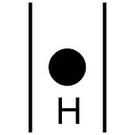|TODO|GFCPOXAH-------|2.X.2.5.1.10.6|ANTISUBMARINE WARFARE ROTARY WING|POINT|E||
|1079|||TODO|GFCPOXAO-------|2.X.2.5.1.10.7|TOMCAT|POINT|E||
|1080|||TODO|GFCPOXAR-------|2.X.2.5.1.10.8|RESCUE|POINT|E||
|1081|||TODO|GFCPOXAP-------|2.X.2.5.1.10.9|REPLENISH|POINT|E||
|1082|||TODO|GFCPOXAM-------|2.X.2.5.1.10.10|MARSHALL|POINT|E||
|1083|||TODO|GFCPOXAS-------|2.X.2.5.1.10.11|STRIKE IP|POINT|E||
|1084|||TODO|GFCPOXAD-------|2.X.2.5.1.10.12|CORRIDOR TAB|POINT|E||
|1085|||TODO|GFCPOG---------|2.X.2.5.2|GENERAL OR UNSPECIFIED COMMAND AND CONTROL POINT|POINT|E||
|1086|||TODO|GFCPOGC--------|2.X.2.5.2.1|CHECKPOINT|POINT|E||
|1087|||TODO|GFCPOGP--------|2.X.2.5.2.2|CONTACT POINT|POINT|E||
|1088|||TODO|GFCPOGT--------|2.X.2.5.2.3|COORDINATION POINT|POINT|E||
|1089|||TODO|GFCPOGD--------|2.X.2.5.2.4|DECISION POINT|POINT|E||
|1090|||TODO|GFCPOGL--------|2.X.2.5.2.5|LINKUP POINT|POINT|E||
|1091|||TODO|GFCPOGN--------|2.X.2.5.2.6|PASSAGE POINT|POINT|E||
|1092|||TODO|GFCPOGR--------|2.X.2.5.2.7|RALLY POINT|POINT|E||
|1093|||TODO|GFCPOGS--------|2.X.2.5.2.8|RELEASE POINT|POINT|E||
|1094|||TODO|GFCPOGI--------|2.X.2.5.2.9|START POINT|POINT|E||
|1095|||TODO|GFCPOGW--------|2.X.2.5.2.10|WAY POINT|POINT|E||
|1096|||TODO|GFCPOLN--------|2.X.2.5.3.1|LIGHT LINE|LINE|E||
|1097|||TODO|GFCPOLP--------|2.X.2.5.3.2|PHASE LINE|LINE|E||
|1098|||TODO|GFCPOAZ--------|2.X.2.5.4.1|AIRFIELD ZONE|AREA|E||
|1099|||TODO|GHOPVA---------|2.X.3.1.1|ARSON/FIRE|POINT|E||
|1100|||TODO|GHOPVR---------|2.X.3.1.2|ARTILLERY/ARTILLERY FIRE|POINT|E||
|1101|||TODO|GHOPVM---------|2.X.3.1.3|ASSASSINA TION/MURDER/ EXECUTION|POINT|E||
|1102|||TODO|GFOPVB---------|2.X.3.1.4|BOMB/BOMBING|POINT|E||
|1103|||TODO|GHOPVY---------|2.X.3.1.5|BOOBYTRAP|POINT|E||
|1104|||TODO|GHOPVD---------|2.X.3.1.6|DRIVE-BY SHOOTING|POINT|E||
|1105|||TODO|GHOPVI---------|2.X.3.1.7|INDIRECT FIRE (UNSPECIFIED TYPE)|POINT|E||
|1106|||TODO|GHOPVM---------|2.X.3.1.8|MORTAR/MORTAR FIRE|POINT|E||
|1107|||TODO|GHOPVK---------|2.X.3.1.9|ROCKET/ROCKET FIRE|POINT|E||
|1108|||TODO|GHOPVS---------|2.X.3.1.10|SNIPING|POINT|E||
|1109|||TODO|GHOPVP---------|2.X.3.1.11|POISONING|POINT|E||
|1110|||TODO|GHOPVU---------|2.X.3.1.12|AMBUSH|POINT|E||
|1111|||TODO|GHOPVC---------|2.X.3.1.13|AMMUNITION CACHE|POINT|E||
|1112||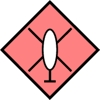|TODO|GHOPVH---------|2.X.3.1.14|HELICOPTER (CIVILIAN BEING USED BY HOSTILE OR INSURGENTS|POINT|E||
|1113|||TODO|GHOPVF---------|2.X.3.1.15|HOSTILE OR INSURGENT MOTORIZED INFANTRY|POINT|E||
|1114|||TODO|GHOPVO---------|2.X.3.1.16|HOSTILE OR INSURGENT INFANTRY|POINT|E||
|1115|||TODO|GHOPVL---------|2.X.3.1.17|RECONNAISSANCE/SURVEILLANC E|POINT|E||
|1116|||TODO|GHOPVX---------|2.X.3.1.18|SIGNAL/RADIO STATION|POINT|E||
|1117||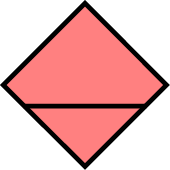|TODO|GHOPVZ---------|2.X.3.1.19|SUPPLY CACHE|POINT|E||
|1118|||TODO|GHOPLB---------|2.X.3.2.1|BLACK LIST LOCATION|POINT|E||
|1119|||TODO|GHOPLG---------|2.X.3.2.2|GRAY LIST LOCATION|POINT|E||
|1120|||TODO|GFOPLW---------|2.X.3.2.3|WHITE LIST LOCATION|POINT|E||
|1121|||TODO|GHOPPR---------|2.X.3.3.1|ROAD BLOCK|POINT|E||
|1122|||TODO|GHOPPRB--------|2.X.3.3.1.1|ROAD BLOCK (UNDER CONSTRUCTION)|POINT|E||
|1123|||TODO|GHOPPT---------|2.X.3.3.2|PATROLLING|POINT|E||
|1124|||TODO|GHOPPC---------|2.X.3.3.3|RECRUITMENT (WILLING)|POINT|E||
|1125|YES|||GHOPPCU--------|2.X.3.3.3.1|RECRUITMENT (COERCED/IMPRESSED)|POINT|E||
|1126|||TODO|GFOPPD---------|2.X.3.3.4|DEMONSTRATION|POINT|E||
|1127|||TODO|GHOPPM---------|2.X.3.3.5|MINELAYING|POINT|E||
|1128|||TODO|GHOPPH---------|2.X.3.3.6|PSYCHOLOGICAL OPERATIONS (PSYOP)|POINT|E||
|1129|||TODO|GHOPPHY--------|2.X.3.3.6.1|PSYOP (TV AND RADIO PROPAGANDA)|POINT|E||
|1130|||TODO|GFOPPHW--------|2.X.3.3.6.2|PSYOP (WRITTEN PROPAGANDA)|POINT|E||
|1131|YES|||GFOPPHG--------|2.X.3.3.6.3|WRITTEN PROPAGANDA|POINT|E||
|1132|||TODO|GFOPPHT--------|2.X.3.3.6.4|HOUSE-TO-HOUSE PROPAGANDA|POINT|E||
|1133|||TODO|GHOPPF---------|2.X.3.3.7|FORAGING/SEARCHING|POINT|E||
|1134|||TODO|GHOPPS---------|2.X.3.3.8|SPY|POINT|E||
|1135|||TODO|GNOPPF---------|2.X.3.3.9|FOOD DISTRIBUTION|POINT|E||
|1136|||TODO|GNOPPI---------|2.X.3.3.10|MEDICAL TREATMENT FACILITY|POINT|E||
|1137||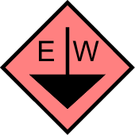|TODO|GHOPPE---------|2.X.3.3.11|ELECTRONIC WARFARE INTERCEPT|POINT|E||
|1138|||TODO|GHOPPX---------|2.X.3.3.12|EXTORTION|POINT|E||
|1139|||TODO|GHOPPJV--------|2.X.3.3.13.1|HIJACKING (VEHICLE)|POINT|E||
|1140|||TODO|GHOPPJA--------|2.X.3.3.13.2|HIJACKING (AIRPLANE)|POINT|E||
|1141|||TODO|GHOPPJB--------|2.X.3.3.13.3|HIJACKING (BOAT)|POINT|E||
|1142|||TODO|GHOPPK---------|2.X.3.3.14|KIDNAPPING|POINT|E||
|1143|||TODO|GFOPPA---------|2.X.3.3.15|ARREST|POINT|E||
|1144|||TODO|GHOPPO---------|2.X.3.3.16|DRUG OPERATION|POINT|E||
|1145|||TODO|GFOPIR---------|2.X.3.4.1|REFUGEES|POINT|E||
|1146|||TODO|GFOPIS---------|2.X.3.4.2|SAFE HOUSE|POINT|E||
|1147||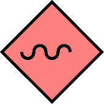|TODO|GHOPIG---------|2.X.3.4.3|GRAFFITI|POINT|E||
|1148|||TODO|GHOPIV---------|2.X.3.4.4|VANDALISM/RAPE/LOOT/ RANSACK/PLUNDER/SACK|POINT|E||
|1149|||TODO|GHOPIK---------|2.X.3.4.5|KNOWN INSURGENT VEHICLE|POINT|E||
|1150|||TODO|GHOPID---------|2.X.3.4.6|DRUG VEHICLE|POINT|E||
|1151|||TODO|GFOPIF---------|2.X.3.4.7|INTERNAL SECURITY FORCE|POINT|E||
|1152|||TODO|W-A-PL---------|3.X.1.1|LOW PRESSURE CENTRE|POINT|F||
|1153|||TODO|W-A-PH---------|3.X.1.2|HIGH PRESSURE CENTRE|POINT|F||
|1154|||TODO|W-A-PFC--------|3.X.1.3.1|COLD FRONT|LINE|F||
|1155|||TODO|W-A-PFCU-------|3.X.1.3.1.1|UPPER COLD FRONT|LINE|F||
|1156|||TODO|W-A-PFW--------|3.X.1.3.2|WARM FRONT|LINE|F||
|1157|||TODO|W-A-PFWU-------|3.X.1.3.2.1|UPPER WARM FRONT|LINE|F||
|1158|||TODO|W-A-PFO--------|3.X.1.3.3|OCCLUDED FRONT|LINE|F||
|1159|||TODO|W-A-PFS--------|3.X.1.3.4|STATIONARY FRONT|LINE|F||
|1160|||TODO|W-A-PXT--------|3.X.1.4.1|TROUGH LINE|LINE|F||
|1161|||TODO|W-A-PXR--------|3.X.1.4.2|RIDGE LINE|LINE|F||
|1162|||TODO|W-A-PXS--------|3.X.1.4.3|SQUALL LINE|LINE|F||
|1163|||TODO|W-A-TL---------|3.X.2.1|LIGHT TURBULENCE|POINT|F||
|1164|||TODO|W-A-TM---------|3.X.2.2|MODERATE TURBULENCE|POINT|F||
|1165|||TODO|W-A-TS---------|3.X.2.3|SEVERE TURBULENCE|POINT|F||
|1166|||TODO|W-A-TE---------|3.X.2.4|EXTREME TURBULENCE|POINT|F||
|1167|||TODO|W-A-ICL--------|3.X.3.1.1|LIGHT CLEAR ICING|POINT|F||
|1168|||TODO|W-A-ICM--------|3.X.3.1.2|MODERATE CLEAR ICING|POINT|F||
|1169|||TODO|W-A-ICS--------|3.X.3.1.3|SEVERE CLEAR ICING|POINT|F||
|1170|||TODO|W-A-IRL--------|3.X.3.2.1|LIGHT RIME ICING|POINT|F||
|1171|||TODO|W-A-IRM--------|3.X.3.2.2|MODERATE RIME ICING|POINT|F||
|1172|||TODO|W-A-IRS--------|3.X.3.2.3|SEVERE RIME ICING|POINT|F||
|1173|||TODO|W-A-IML--------|3.X.3.3.1|LIGHT MIXED ICING|POINT|F||
|1174|||TODO|W-A-IMM--------|3.X.3.3.2|MODERATE MIXED ICING|POINT|F||
|1175|||TODO|W-A-IMS--------|3.X.3.3.3|SEVERE MIXED ICING|POINT|F||
|1176|||TODO|W-A-W----------|3.X.4|WIND BARB|POINT|F||
|1177|||TODO|W-A-WJ---------|3.X.4.1|JET STREAM|LINE|F||
|1178|||TODO|W-A-FI---------|3.X.5.1|INSTRUMENT CEILING|AREA|F||
|1179|||TODO|W-A-FV---------|3.X.5.2|VISUAL CEILING|AREA|F||
|1180|||TODO|W-A-CC---------|3.X.6.1|CLEAR SKY (SKC)|POINT|F||
|1181|||TODO|W-A-CS---------|3.X.6.2|SCATTERED SKY (SCT)|POINT|F||
|1182|||TODO|W-A-CB---------|3.X.6.3|BROKEN SKY (BKN)|POINT|F||
|1183|||TODO|W-A-CW---------|3.X.6.4|OVERCAST WITH BREAKS|POINT|F||
|1184|||TODO|W-A-CO---------|3.X.6.5|OVERCAST (OVC)|POINT|F||
|1185|||TODO|W-A-CP---------|3.X.6.6|SKY OBSCURED OR PARTIALLY OBSCURED|POINT|F||
|1186|||TODO|W-A-PR---------|3.X.7.1|RAIN (RA)|POINT|F||
|1187|||TODO|W-A-PRS--------|3.X.7.1.1|RAIN SHOWER|POINT|F||
|1188|||TODO|W-A-PRF--------|3.X.7.1.2|FREEZING RAIN (FZRA)|POINT|F||
|1189|||TODO|W-A-PRD--------|3.X.7.1.3|DRIZZLE (DZ)|POINT|F||
|1190|||TODO|W-A-PRDF-------|3.X.7.1.3.1|FREEZING DRIZZLE (FZDZ)|POINT|F||
|1191|||TODO|W-A-PS---------|3.X.7.2|SNOW(SN)|POINT|F||
|1192|||TODO|W-A-PSS--------|3.X.7.2.1|SNOW SHOWERS|POINT|F||
|1193|||TODO|W-A-PSG--------|3.X.7.2.2|SNOW GRAINS (SG)|POINT|F||
|1194|||TODO|W-A-PH---------|3.X.7.3|HAIL|POINT|F||
|1195|||TODO|W-A-PI---------|3.X.7.4|ICE PELLETS (PE)|POINT|F||
|1196|||TODO|W-A-PC---------|3.X.7.5|ICE CRYSTALS (IC)|POINT|F||
|1197|||TODO|W-A-ST---------|3.X.8.1|THUNDERSTORMS (TS)|POINT|F||
|1198|||TODO|W-A-STR--------|3.X.8.1.1|THUNDERSTORM (TS) WITH RAIN(RA) |POINT|F||
|1199|||TODO|W-A-STF--------|3.X.8.1.2|FUNNEL CLOUD (FC)/TORNADO/WATERSPOUT|POINT|F||
|1200|||TODO|W-A-STL--------|3.X.8.1.3|LIGHTNING (LTG)|POINT|F||
|1201|||TODO|W-A-SST--------|3.X.8.2.1|TROPICAL STORM|POINT|F||
|1202|||TODO|W-A-SSH--------|3.X.8.2.2|HURRICANE|POINT|F||
|1203|||TODO|W-A-OS---------|3.X.9.1|BLOWING SNOW (BLSN)|POINT|F||
|1204|||TODO|W-A-OF---------|3.X.9.2|FOG (FG)|POINT|F||
|1205|||TODO|W-A-OFF--------|3.X.9.2.1|FREEZING FOG (FZFG)|POINT|F||
|1206|||TODO|W-A-OT---------|3.X.9.3|DUST/SAND STORM|POINT|F||
|1207|||TODO|W-A-OD---------|3.X.9.4|DUST DEVIL|POINT|F||
|1208|||TODO|W-A-OK---------|3.X.9.5|SMOKE (FU)|POINT|F||
|1209|||TODO|W-A-OH---------|3.X.9.6|HAZE (HZ)|POINT|F||
|1210|||TODO|W-A-OB---------|3.X.9.7|BLOWING DUST OR SAND |POINT|F||
