|ID|Significant Issue?|Image from DR_Export|Image from Standard|Full SIDC|Hierarchy Code|Name|Geometry|Appendix|Notes / Issue Description / Details|
|---|---|---|---|---|---|---|---|---|---|
|1046|YES||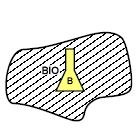|GFMPNB--------X|TACGRP.MOBSU.CBRN.BIOCA|Biologically Contaminated Area|AREA|B||
|1047|YES|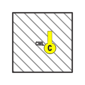|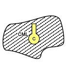|GFMPNC--------X|TACGRP.MOBSU.CBRN.CMLCA|Chemically Contaminated Area|AREA|B||
|1060|YES|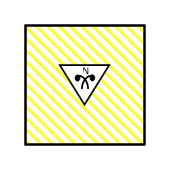|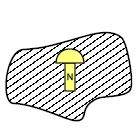|GFMPNR--------X|TACGRP.MOBSU.CBRN.RADA|Radioactive Area|AREA|B||
|1208|YES||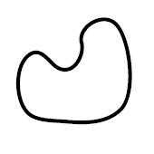|WA-DBAFF----A--|METOC.AMPHC.BDAWTH.ODFF|Operator-Defined Freeform|AREA|C||
|1219|YES||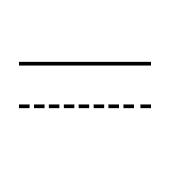|WA-DIPFF---L---|METOC.AMPHC.ISP.ODFF|Operator-Defined Freeform|LINE|C||
|1240|YES|||WA-DPXCV---L---|METOC.AMPHC.PRS.LNE.CNGLNE|Convergance Line|LINE|C||
|1250|YES||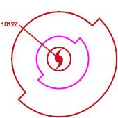|WA-DWSTSWA--A--|METOC.AMPHC.WTH.TPLSYS.TSWADL|Tropical Storm Wind Areas And Date-Time Labels|AREA|C||
|1298|YES||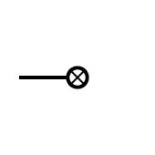|WAS-WP----P----|METOC.AMPHC.WND.PLT|Wind Plot|LINE|C||
|1326|YES|||WAS-WSM-MHP----|METOC.AMPHC.WTH.RASN.RDSMH|Rain Or Drizzle And Snow - Moderate/Heavy|POINT|C||
|1368|YES||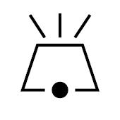|WAS-WSVE--P----|METOC.AMPHC.WTH.VOLERN|Volcanic Eruption|POINT|C||
|1428|YES||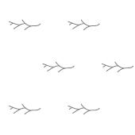|WO-DHHDK----A--|METOC.OCA.HYDGRY.DANHAZ.KLP1.KLP3|Kelp3-Seaweed|AREA|C||
|1429|YES||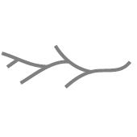|WO-DHHDK--P----|METOC.OCA.HYDGRY.DANHAZ.KLP1.KLP2|Kelp2-Seaweed|POINT|C||
|1434|YES||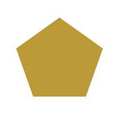|WO-DHPMO----A--|METOC.OCA.HYDGRY.PRTHBR.FAC.OSLF3|Offshore Loading Facility|AREA|C||
|1435|YES|||WO-DHPMO---L---|METOC.OCA.HYDGRY.PRTHBR.FAC.OSLF2|Offshore Loading Facility|LINE|C||
|1442|YES||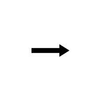|WO-DIDID---L---|METOC.OCA.ISYS.DYNPRO.ID|Ice Drift (Direction)|POINT|C||
|1496|YES|||WOS-HDS---P----|METOC.OCA.HYDGRY.DPH.SNDG|Soundings|POINT|C||
|1499|YES||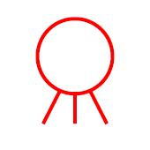|WOS-HHDMDBP----|METOC.OCA.HYDGRY.DANHAZ.MNENAV.DBT|Mine-Naval (Doubtful)|POINT|C||
|1500|YES||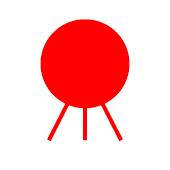|WOS-HHDMDFP----|METOC.OCA.HYDGRY.DANHAZ.MNENAV.DEFN|Mine-Naval (Definite)|POINT|C||
|1501|YES||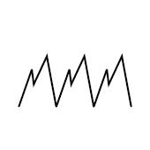|WOS-HHDR---L---|METOC.OCA.HYDGRY.DANHAZ.REEF|Reef|LINE|C||
