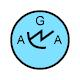

|ID|Significant Issue?|Image from DR_Export|Image from Standard|Full SIDC|Hierarchy Code|Name|Geometry|Appendix|Notes/Issue Description/Details|
|---|---|---|---|---|---|---|---|---|---|
|120|YES|||SFFPGP---------|WAR.SOFUNT.GRD.PSYOP|Sof Unit Psychological Operations (Psyop)|POINT|A||
|122|YES|||SFFPGR---------|WAR.SOFUNT.GRD.RGR|Sof Unit Ranger|POINT|A||
|300|YES|||SFGPIMFA--H----|WAR.GRDTRK.INS.MMF.NENY.ATMER|Atomic Energy Reactor|POINT|A||
|301|YES|||SFGPIMF---H----|WAR.GRDTRK.INS.MMF.NENY|Nuclear Energy|POINT|A||
|302|YES|||SFGPIMFP--H----|WAR.GRDTRK.INS.MMF.NENY.NMP|Nuclear Material Production|POINT|A||
|304|YES|||SFGPIMFS--H----|WAR.GRDTRK.INS.MMF.NENY.NMS|Nuclear Material Storage|POINT|A||
|503|YES|||SFGPUH---------|WAR.GRDTRK.UNT.C2HQ|Special C2 Headquarters Component|POINT|A||
|760|YES|||SFSPO----------|WAR.SSUF.OWN|Own Track|POINT|A||
|791|YES|||SFUPSNA--------|WAR.SBSUF.SUB.NPRN.ATK|Attack Submarine (Ssn)|POINT|A||
|792|YES|||SFUPSNB--------|WAR.SBSUF.SUB.NPRN.BLST|Ballistic Missile Submarine (Ssbn)|POINT|A||
|805|YES|||SFUPWD---------|WAR.SBSUF.UH2DCY|Underwater Decoy|POINT|A|Switch Icon mapping to SFSPCD---------|
|843|YES|||GFFPAZBC------X|TACGRP.FSUPP.ARS.TGTAQZ.TBA.CIRCLR|Target Build Up Area (Tba)  Circular|AREA|B||
|844|YES|||GFFPAZBI------X|TACGRP.FSUPP.ARS.TGTAQZ.TBA.IRR|Target Build Up Area (Tba)  Irregular|AREA|B||
|845|YES|||GFFPAZBR------X|TACGRP.FSUPP.ARS.TGTAQZ.TBA.RTG|Target Build Up Area (Tba)  Rectangular|AREA|B||
|846|YES|||GFFPAZCC------X|TACGRP.FSUPP.ARS.TGTAQZ.CNS.CIRCLR|CENSOR ZONE, CIRCULAR|AREA|B||
|849|YES|||GFFPAZDC------X|TACGRP.FSUPP.ARS.TGTAQZ.DA.CIRCLR|Dead Space Area (Da)  Circular|AREA|B||
|850|YES|||GFFPAZDI------X|TACGRP.FSUPP.ARS.TGTAQZ.DA.IRR|Dead Space Area (Da)  Irregular|AREA|B||
|851|YES|||GFFPAZDR------X|TACGRP.FSUPP.ARS.TGTAQZ.DA.RTG|Dead Space Area (Da)  Rectangular|AREA|B||
|852|YES|||GFFPAZFC------X|TACGRP.FSUPP.ARS.TGTAQZ.CFZ.CIRCLR|CRITICAL FRIENDLY ZONE (CFZ), CIRCULAR|AREA|B||
|855|YES|||GFFPAZIC------X|TACGRP.FSUPP.ARS.TGTAQZ.ATIZ.CIRCLR|ARTILLERY TARGET INTELLIGENCE (ATI) ZONE, CIRCULAR|AREA|B||
|858|YES|||GFFPAZSC------X|TACGRP.FSUPP.ARS.TGTAQZ.SNSZ.CIRCLR|Sensor Zone  Circular|AREA|B||
|859|YES|||GFFPAZSI------X|TACGRP.FSUPP.ARS.TGTAQZ.SNSZ.IRR|Sensor Zone  Irregular|AREA|B||
|860|YES|||GFFPAZSR------X|TACGRP.FSUPP.ARS.TGTAQZ.SNSZ.RTG|Sensor Zone  Rectangular|AREA|B||
|861|YES|||GFFPAZVC------X|TACGRP.FSUPP.ARS.TGTAQZ.TVAR.CIRCLR|Target Value Area (Tvar)  Circular|AREA|B||
|862|YES|||GFFPAZVI------X|TACGRP.FSUPP.ARS.TGTAQZ.TVAR.IRR|Target Value Area (Tvar)  Irregular|AREA|B||
|863|YES|||GFFPAZVR------X|TACGRP.FSUPP.ARS.TGTAQZ.TVAR.RTG|Target Value Area (Tvar)  Rectangular|AREA|B||
|864|YES|||GFFPAZXC------X|TACGRP.FSUPP.ARS.TGTAQZ.CFFZ.CIRCLR|CALL FOR FIRE ZONE (CFFZ), CIRCULAR|AREA|B||
|867|YES|||GFFPAZZC------X|TACGRP.FSUPP.ARS.TGTAQZ.ZOR.CIRCLR|Zone Of Responsibility (Zor)  Circular|AREA|B||
|868|YES|||GFFPAZZI------X|TACGRP.FSUPP.ARS.TGTAQZ.ZOR.IRR|Zone Of Responsibility (Zor)  Irregular|AREA|B||
|869|YES|||GFFPAZZR------X|TACGRP.FSUPP.ARS.TGTAQZ.ZOR.RTG|Zone Of Responsibility (Zor)  Rectangular|AREA|B||
|873|YES|||GFFPLCR-------X|TACGRP.FSUPP.LNE.C2LNE.RFL|Restrictive Fire Line (Rfl)|LINE|B|BCL' instead of 'RFL'|
|901|YES|||GFGPDABP------X|TACGRP.C2GM.DEF.ARS.BTLPSN.PBNO|Prepared But Not Occupied|POINT|B|Extra 'B' in Label|
|917|YES|||GFGPGAG-------X|TACGRP.C2GM.GNL.ARS.GENARA|General Area|AREA|B||
|925|YES|||GFGPGLC-------X|TACGRP.C2GM.GNL.LNE.LOC|Line Of Contact|LINE|B||
|929|YES|||GFGPGPAA------X|TACGRP.C2GM.GNL.PNT.ACTL.ASBWF|Antisubmarine Warfare  Fixed Wing|POINT|B||
|930|YES|||GFGPGPAC------X|TACGRP.C2GM.GNL.PNT.ACTL.CRDRTB|Corridor Tab|POINT|B||
|931|YES|||GFGPGPAH------X|TACGRP.C2GM.GNL.PNT.ACTL.ASBWR|Antisubmarine Warfare  Rotary Wing|POINT|B||
|932|YES|||GFGPGPAK------X|TACGRP.C2GM.GNL.PNT.ACTL.TAK|Tanking|POINT|B||
|933|YES|||GFGPGPAL------X|TACGRP.C2GM.GNL.PNT.ACTL.RPH|Replenish|POINT|B||
|934|YES|||GFGPGPAM------X|TACGRP.C2GM.GNL.PNT.ACTL.MRSH|Marshall|POINT|B||
|935|YES|||GFGPGPAO------X|TACGRP.C2GM.GNL.PNT.ACTL.TMC|Tomcat|POINT|B||
|937|YES|||GFGPGPAR------X|TACGRP.C2GM.GNL.PNT.ACTL.RSC|Rescue|POINT|B||
|938|YES|||GFGPGPAS------X|TACGRP.C2GM.GNL.PNT.ACTL.SKEIP|Strike Ip|POINT|B||
|939|YES|||GFGPGPAT------X|TACGRP.C2GM.GNL.PNT.ACTL.TCN|Tacan|POINT|B||
|949|YES|||GFGPGPOP------X|TACGRP.C2GM.GNL.PNT.RTE.PIM|Pim|POINT|B||
|950|YES|||GFGPGPOR------X|TACGRP.C2GM.GNL.PNT.RTE.PNTR|Point R|POINT|B||
|966|YES|||GFGPGPRD------X|TACGRP.C2GM.GNL.PNT.REFPNT.DLRP|Dlrp|POINT|B||
|968|YES|||GFGPGPRN------X|TACGRP.C2GM.GNL.PNT.REFPNT.NAVREF|Navigational Reference Point|POINT|B||
|969|YES|||GFGPGPRS------X|TACGRP.C2GM.GNL.PNT.REFPNT.SPLPNT|Special Point|POINT|B||
|1046|YES|||GFMPNB--------X|TACGRP.MOBSU.CBRN.BIOCA|Biologically Contaminated Area|AREA|B||
|1047|YES|||GFMPNC--------X|TACGRP.MOBSU.CBRN.CMLCA|Chemically Contaminated Area|AREA|B||
|1059|YES|||GFMPNM--------X|TACGRP.MOBSU.CBRN.MSDZ|Minimum Safe Distance Zones|POINT|B||
|1060|YES|||GFMPNR--------X|TACGRP.MOBSU.CBRN.RADA|Radioactive Area|AREA|B||
|1061|YES|||GFMPNZ--------X|TACGRP.MOBSU.CBRN.NDGZ|Nuclear Detonations Ground Zero|POINT|B||
|1133|YES|||GFOPSBWD------X|TACGRP.OTH.SSUBSR.BTMRTN.WRKD|Wreck  Dangerous|POINT|B||
|1208|YES|||WA-DBAFF----A--|METOC.AMPHC.BDAWTH.ODFF|Operator-Defined Freeform|AREA|C||
|1219|YES|||WA-DIPFF---L---|METOC.AMPHC.ISP.ODFF|Operator-Defined Freeform|LINE|C||
|1240|YES|||WA-DPXCV---L---|METOC.AMPHC.PRS.LNE.CNGLNE|Convergance Line|LINE|C||
|1250|YES|||WA-DWSTSWA--A--|METOC.AMPHC.WTH.TPLSYS.TSWADL|Tropical Storm Wind Areas And Date-Time Labels|AREA|C||
|1289|YES|||WAS-PHT---P----|METOC.AMPHC.PRS.HGHCTR.TROPHG|Tropopause High|POINT|C||
|1291|YES|||WAS-PLT---P----|METOC.AMPHC.PRS.LOWCTR.TROPLW|Tropopause Low|POINT|C||
|1298|YES|||WAS-WP----P----|METOC.AMPHC.WND.PLT|Wind Plot|LINE|C||
|1326|YES|||WAS-WSM-MHP----|METOC.AMPHC.WTH.RASN.RDSMH|Rain Or Drizzle And Snow - Moderate/Heavy|POINT|C||
|1368|YES|||WAS-WSVE--P----|METOC.AMPHC.WTH.VOLERN|Volcanic Eruption|POINT|C||
|1428|YES|||WO-DHHDK----A--|METOC.OCA.HYDGRY.DANHAZ.KLP1.KLP3|Kelp3-Seaweed|AREA|C||
|1429|YES|||WO-DHHDK--P----|METOC.OCA.HYDGRY.DANHAZ.KLP1.KLP2|Kelp2-Seaweed|POINT|C||
|1434|YES|||WO-DHPMO----A--|METOC.OCA.HYDGRY.PRTHBR.FAC.OSLF3|Offshore Loading Facility|AREA|C||
|1435|YES|||WO-DHPMO---L---|METOC.OCA.HYDGRY.PRTHBR.FAC.OSLF2|Offshore Loading Facility|LINE|C||
|1442|YES|||WO-DIDID---L---|METOC.OCA.ISYS.DYNPRO.ID|Ice Drift (Direction)|POINT|C||
|1496|YES|||WOS-HDS---P----|METOC.OCA.HYDGRY.DPH.SNDG|Soundings|POINT|C||
|1499|YES|||WOS-HHDMDBP----|METOC.OCA.HYDGRY.DANHAZ.MNENAV.DBT|Mine-Naval (Doubtful)|POINT|C||
|1500|YES|||WOS-HHDMDFP----|METOC.OCA.HYDGRY.DANHAZ.MNENAV.DEFN|Mine-Naval (Definite)|POINT|C||
|1501|YES|||WOS-HHDR---L---|METOC.OCA.HYDGRY.DANHAZ.REEF|Reef|LINE|C||
|1553|YES|||IFAPSCC--------|SIGINT.AIRTRK.SIGINC.COMM.CELL|Cellular/Mobile|POINT|D||
|1578|YES|||IFGPSRAA-------|SIGINT.GRDTRK.SIGINC.RAD.AA/C|ANTI-AIRCRAFT|POINT|D||
|1653|YES|||OFOPHA---------|STBOPS.OPN.HJKG.APL|Hijacking (Airplane)|POINT|E||
|1668|YES|||OFVPA----------|STBOPS.VIOATY.ASN|Arson/Fire|POINT|E||
