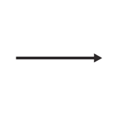

|id|Significant Issue?|Image from DR_Export|Image from Standard|Image from JMSML|Full SIDC|Hierarchy Code|Name|Geometry|Appendix|Notes / Issue Description / Details|
|---|---|---|---|---|---|---|---|---|---|---|
|1240|YES||||WA-DPXCV---L---|METOC.AMPHC.PRS.LNE.CNGLNE|Convergance Line|LINE|C||
|1242|YES||||WA-DPXITCZ-L---|METOC.AMPHC.PRS.LNE.ITCZ|Inter-Tropical Convergance Zone|LINE|C||
|1250|YES||||WA-DWSTSWA--A--|METOC.AMPHC.WTH.TPLSYS.TSWADL|Tropical Storm Wind Areas And Date-Time Labels|AREA|C||
|1417|YES||||WO-DHCF-----A--|METOC.OCA.HYDGRY.CSTHYD.FSH1.FSH3|Foreshore|AREA|C||
|1428|YES||||WO-DHHDK----A--|METOC.OCA.HYDGRY.DANHAZ.KLP1.KLP3|Kelp3-Seaweed|AREA|C||
|1429|YES||||WO-DHHDK--P----|METOC.OCA.HYDGRY.DANHAZ.KLP1.KLP2|Kelp2-Seaweed|POINT|C||
|1434|YES||||WO-DHPMO----A--|METOC.OCA.HYDGRY.PRTHBR.FAC.OSLF3|Offshore Loading Facility|AREA|C||
|1435|YES||||WO-DHPMO---L---|METOC.OCA.HYDGRY.PRTHBR.FAC.OSLF2|Offshore Loading Facility|LINE|C||
|1442|YES||||WO-DIDID---L---|METOC.OCA.ISYS.DYNPRO.ID|Ice Drift (Direction)|LINE|C|JMSML is better|
|1501|YES||||WOS-HHDR---L---|METOC.OCA.HYDGRY.DANHAZ.REEF|Reef|LINE|C||
|1515|YES||||WOS-HPFS--P----|METOC.OCA.HYDGRY.PRTHBR.FSG.FSTK1|Fish Stakes-Traps-Weirs Fstk1|POINT|C||
