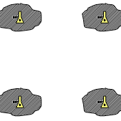
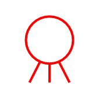
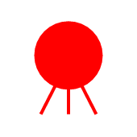

|id|Significant Issue?|Image from DR_Export|Image from Standard|Image from JMSML|Full SIDC|Hierarchy Code|Name|Geometry|Appendix|Notes / Issue Description / Details|
|---|---|---|---|---|---|---|---|---|---|---|
|1046|JMSML||||GFMPNB--------X|TACGRP.MOBSU.CBRN.BIOCA|Biologically Contaminated Area|AREA|B||
|1047|JMSML||||GFMPNC--------X|TACGRP.MOBSU.CBRN.CMLCA|Chemically Contaminated Area|AREA|B||
|1060|JMSML||||GFMPNR--------X|TACGRP.MOBSU.CBRN.RADA|Radioactive Area|AREA|B||
|1289|JMSML||||WAS-PHT---P----|METOC.AMPHC.PRS.HGHCTR.TROPHG|Tropopause High|POINT|C||
|1291|JMSML||||WAS-PLT---P----|METOC.AMPHC.PRS.LOWCTR.TROPLW|Tropopause Low|POINT|C||
|1418|JMSML||||WO-DHCF----L---|METOC.OCA.HYDGRY.CSTHYD.FSH1.FSH2|Foreshore|LINE|C||
|1436|JMSML||||WO-DHPMO--P----|METOC.OCA.HYDGRY.PRTHBR.FAC.OSLF1|Offshore Loading Facility|POINT|C||
|1499|JMSML||||WOS-HHDMDBP----|METOC.OCA.HYDGRY.DANHAZ.MNENAV.DBT|Mine-Naval (Doubtful)|POINT|C||
|1500|JMSML||||WOS-HHDMDFP----|METOC.OCA.HYDGRY.DANHAZ.MNENAV.DEFN|Mine-Naval (Definite)|POINT|C||
