|Count|Significant Issue?|Image from DR_Export|Image from Standard|Full SIDC|Hierarchy Code|Name|Geometry|Appendix|
|---|---|---|---|---|---|---|---|---|
|1|||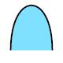|SFAP-----------|WAR.AIRTRK|Air Track|POINT|A|
|2|||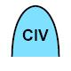|SFAPC----------|WAR.AIRTRK.CVL|Civil Aircraft|POINT|A|
|3||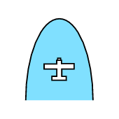||SFAPCF---------|WAR.AIRTRK.CVL.FIXD|Fixed Wing|POINT|A|
|4||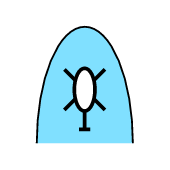|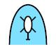|SFAPCH---------|WAR.AIRTRK.CVL.ROT|Rotary Wing|POINT|A|
|5||||SFAPCL---------|WAR.AIRTRK.CVL.LTA|Lighter Than Air|POINT|A|
|6||||SFAPM----------|WAR.AIRTRK.MIL|Military|POINT|A|
|7||||SFAPMF---------|WAR.AIRTRK.MIL.FIXD|Fixed Wing|POINT|A|
|8||||SFAPMFA--------|WAR.AIRTRK.MIL.FIXD.ATK|Attack/Strike|POINT|A|
|9||||SFAPMFB--------|WAR.AIRTRK.MIL.FIXD.BMB|Bomber|POINT|A|
|10||||SFAPMFC--------|WAR.AIRTRK.MIL.FIXD.CGOALT|Cargo Airlift (Transport)|POINT|A|
|11||||SFAPMFCH-------|WAR.AIRTRK.MIL.FIXD.CGOALT.HVY|Cargo Airlift (Heavy)|POINT|A|
|12||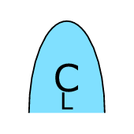|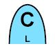|SFAPMFCL-------|WAR.AIRTRK.MIL.FIXD.CGOALT.LIT|Cargo Airlift (Light)|POINT|A|
|13|||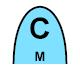|SFAPMFCM-------|WAR.AIRTRK.MIL.FIXD.CGOALT.MDM|Cargo Airlift (Medium)|POINT|A|
|14||||SFAPMFD--------|WAR.AIRTRK.MIL.FIXD.ABNCP|Airborne Command Post (C2)|POINT|A|
|15||||SFAPMFF--------|WAR.AIRTRK.MIL.FIXD.FTR|Fighter|POINT|A|
|16|||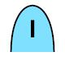|SFAPMFFI-------|WAR.AIRTRK.MIL.FIXD.FTR.INCR|Interceptor|POINT|A|
|17||||SFAPMFH--------|WAR.AIRTRK.MIL.FIXD.CSAR|Combat Search And Rescue (Csar)|POINT|A|
|18||||SFAPMFJ--------|WAR.AIRTRK.MIL.FIXD.ECM|Electronic Countermeasures (Ecm/Jammer)|POINT|A|
|19||||SFAPMFK--------|WAR.AIRTRK.MIL.FIXD.TNK|Tanker|POINT|A|
|20|||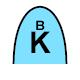|SFAPMFKB-------|WAR.AIRTRK.MIL.FIXD.TNK.BOOM|Tanker Boom-Only|POINT|A|
|21|||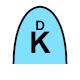|SFAPMFKD-------|WAR.AIRTRK.MIL.FIXD.TNK.DROG|Tanker Drogue-Only|POINT|A|
|22|||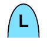|SFAPMFL--------|WAR.AIRTRK.MIL.FIXD.VSTOL|V/Stol|POINT|A|
|23|||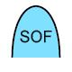|SFAPMFM--------|WAR.AIRTRK.MIL.FIXD.SOF|Special Operations Forces (Sof)|POINT|A|
|24||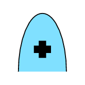||SFAPMFO--------|WAR.AIRTRK.MIL.FIXD.MEDV|Medical Evacuation (Medevac)|POINT|A|
|25||||SFAPMFP--------|WAR.AIRTRK.MIL.FIXD.PAT|Patrol|POINT|A|
|26||||SFAPMFPM-------|WAR.AIRTRK.MIL.FIXD.PAT.MNECM|Mine Countermeasures|POINT|A|
|27||||SFAPMFPN-------|WAR.AIRTRK.MIL.FIXD.PAT.ASUW|Antisurface Warfare (Asuw)|POINT|A|
|28||||SFAPMFQ--------|WAR.AIRTRK.MIL.FIXD.DRN|Drone (Rpv/Ua)|POINT|A|
|29||||SFAPMFQA-------|WAR.AIRTRK.MIL.FIXD.DRN.ATK|Attack|POINT|A|
|30||||SFAPMFQB-------|WAR.AIRTRK.MIL.FIXD.DRN.BMB|Bomber|POINT|A|
|31||||SFAPMFQC-------|WAR.AIRTRK.MIL.FIXD.DRN.CGO|Cargo|POINT|A|
|32||||SFAPMFQD-------|WAR.AIRTRK.MIL.FIXD.DRN.ABNCP|Airborne Command Post|POINT|A|
|33||||SFAPMFQF-------|WAR.AIRTRK.MIL.FIXD.DRN.FTR|Fighter|POINT|A|
|34|||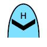|SFAPMFQH-------|WAR.AIRTRK.MIL.FIXD.DRN.CSAR|Search & Rescue (Csar)|POINT|A|
|35||||SFAPMFQI-------|WAR.AIRTRK.MIL.FIXD.DRN.MNECM|Mine Countermeasures|POINT|A|
|36||||SFAPMFQJ-------|WAR.AIRTRK.MIL.FIXD.DRN.ECM|Electronic Countermeasures (Jammer)|POINT|A|
|37|||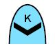|SFAPMFQK-------|WAR.AIRTRK.MIL.FIXD.DRN.TNK|Tanker|POINT|A|
|38||||SFAPMFQL-------|WAR.AIRTRK.MIL.FIXD.DRN.VSTOL|V/Stol|POINT|A|
|39||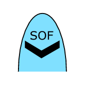|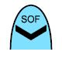|SFAPMFQM-------|WAR.AIRTRK.MIL.FIXD.DRN.SOF|Special Operations Forces (Sof)|POINT|A|
|40||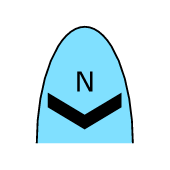|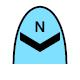|SFAPMFQN-------|WAR.AIRTRK.MIL.FIXD.DRN.ASUW|Antisurface Warfare (Asuw)|POINT|A|
|41||||SFAPMFQO-------|WAR.AIRTRK.MIL.FIXD.DRN.MEDV|Medevac|POINT|A|
|42||||SFAPMFQP-------|WAR.AIRTRK.MIL.FIXD.DRN.PAT|Patrol|POINT|A|
|43|||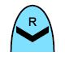|SFAPMFQR-------|WAR.AIRTRK.MIL.FIXD.DRN.RECON|Reconnaissance|POINT|A|
|44||||SFAPMFQRW------|WAR.AIRTRK.MIL.FIXD.DRN.RECON.ABNEW|Airborne Early Warning (Aew)|POINT|A|
|45||||SFAPMFQRX------|WAR.AIRTRK.MIL.FIXD.DRN.RECON.PHG|Photographic|POINT|A|
|46||||SFAPMFQRZ------|WAR.AIRTRK.MIL.FIXD.DRN.RECON.ESM|Electronic Surveillance Measures|POINT|A|
|47||||SFAPMFQS-------|WAR.AIRTRK.MIL.FIXD.DRN.ASBW|Antisubmarine Warfare (Asw)|POINT|A|
|48||||SFAPMFQT-------|WAR.AIRTRK.MIL.FIXD.DRN.TNE|Trainer|POINT|A|
|49||||SFAPMFQU-------|WAR.AIRTRK.MIL.FIXD.DRN.UTY|Utility|POINT|A|
|50||||SFAPMFQY-------|WAR.AIRTRK.MIL.FIXD.DRN.COMM|Communications|POINT|A|
|51||||SFAPMFR--------|WAR.AIRTRK.MIL.FIXD.RECON|Reconnaissance|POINT|A|
|52||||SFAPMFRW-------|WAR.AIRTRK.MIL.FIXD.RECON.ABNEW|Airborne Early Warning (Aew)|POINT|A|
|53||||SFAPMFRX-------|WAR.AIRTRK.MIL.FIXD.RECON.PHG|Photographic|POINT|A|
|54||||SFAPMFRZ-------|WAR.AIRTRK.MIL.FIXD.RECON.ESM|Electronic Surveillance Measures|POINT|A|
|55||||SFAPMFS--------|WAR.AIRTRK.MIL.FIXD.ASBWCB|Antisubmarine Warfare (Asw) Carrier Based|POINT|A|
|56||||SFAPMFT--------|WAR.AIRTRK.MIL.FIXD.TNE|Trainer|POINT|A|
|57||||SFAPMFU--------|WAR.AIRTRK.MIL.FIXD.UTY|Utility|POINT|A|
|58||||SFAPMFUH-------|WAR.AIRTRK.MIL.FIXD.UTY.HVY|Utility (Heavy)|POINT|A|
|59||||SFAPMFUL-------|WAR.AIRTRK.MIL.FIXD.UTY.LIT|Utility (Light)|POINT|A|
|60||||SFAPMFUM-------|WAR.AIRTRK.MIL.FIXD.UTY.MDM|Utility (Medium)|POINT|A|
|61||||SFAPMFY--------|WAR.AIRTRK.MIL.FIXD.COMM|Communications|POINT|A|
|62||||SFAPMH---------|WAR.AIRTRK.MIL.ROT|Rotary Wing|POINT|A|
|63||||SFAPMHA--------|WAR.AIRTRK.MIL.ROT.ATK|Attack|POINT|A|
|64||||SFAPMHC--------|WAR.AIRTRK.MIL.ROT.CGOALT|Cargo Airlift (Transport)|POINT|A|
|65||||SFAPMHCH-------|WAR.AIRTRK.MIL.ROT.CGOALT.HVY|Cargo Airlift (Heavy)|POINT|A|
|66|||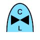|SFAPMHCL-------|WAR.AIRTRK.MIL.ROT.CGOALT.LIT|Cargo Airlift (Light)|POINT|A|
|67|||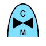|SFAPMHCM-------|WAR.AIRTRK.MIL.ROT.CGOALT.MDM|Cargo Airlift (Medium)|POINT|A|
|68||||SFAPMHD--------|WAR.AIRTRK.MIL.ROT.ABNCP|Airborne Command Post (C2)|POINT|A|
|69||||SFAPMHH--------|WAR.AIRTRK.MIL.ROT.CSAR|Combat Search And Rescue (Csar)|POINT|A|
|70||||SFAPMHI--------|WAR.AIRTRK.MIL.ROT.MNECM|Mine Countermeasures|POINT|A|
|71||||SFAPMHJ--------|WAR.AIRTRK.MIL.ROT.ECM|Electronic Countermeasures (Ecm/Jammer)|POINT|A|
|72||||SFAPMHK--------|WAR.AIRTRK.MIL.ROT.TNK|Tanker|POINT|A|
|73||||SFAPMHM--------|WAR.AIRTRK.MIL.ROT.SOF|Special Operations Forces (Sof)|POINT|A|
|74||||SFAPMHO--------|WAR.AIRTRK.MIL.ROT.MEDV|Medevac|POINT|A|
|75||||SFAPMHQ--------|WAR.AIRTRK.MIL.ROT.DRN|Drone (Rpv/Ua)|POINT|A|
|76||||SFAPMHR--------|WAR.AIRTRK.MIL.ROT.RECON|Reconnaissance|POINT|A|
|77||||SFAPMHS--------|WAR.AIRTRK.MIL.ROT.ASBW|Antisubmarine Warfare/Mpa|POINT|A|
|78||||SFAPMHT--------|WAR.AIRTRK.MIL.ROT.TNE|Trainer|POINT|A|
|79||||SFAPMHU--------|WAR.AIRTRK.MIL.ROT.UTY|Utility|POINT|A|
|80||||SFAPMHUH-------|WAR.AIRTRK.MIL.ROT.UTY.HVY|Utility (Heavy)|POINT|A|
|81||||SFAPMHUL-------|WAR.AIRTRK.MIL.ROT.UTY.LIT|Utility (Light)|POINT|A|
|82||||SFAPMHUM-------|WAR.AIRTRK.MIL.ROT.UTY.MDM|Utility (Medium)|POINT|A|
|83||||SFAPML---------|WAR.AIRTRK.MIL.LTA|Lighter Than Air|POINT|A|
|84||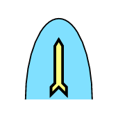||SFAPW----------|WAR.AIRTRK.WPN|Weapon|POINT|A|
|85||||SFAPWB---------|WAR.AIRTRK.WPN.BM|Bomb|POINT|A|
|86||||SFAPWD---------|WAR.AIRTRK.WPN.DCY|Decoy|POINT|A|
|87||||SFAPWM---------|WAR.AIRTRK.WPN.MSLIF|Missile In Flight|POINT|A|
|88||||SFAPWMA--------|WAR.AIRTRK.WPN.MSLIF.ALM|Air Launched Missile|POINT|A|
|89||||SFAPWMAA-------|WAR.AIRTRK.WPN.MSLIF.ALM.AAM|Air-To-Air Missile (Aam)|POINT|A|
|90||||SFAPWMAP-------|WAR.AIRTRK.WPN.MSLIF.ALM.ASPC|Air-To-Space Missile|POINT|A|
|91||||SFAPWMAS-------|WAR.AIRTRK.WPN.MSLIF.ALM.ASM|Air-To-Surface Missile (Asm)|POINT|A|
|92||||SFAPWMB--------|WAR.AIRTRK.WPN.MSLIF.BLST|Ballistic Missile|POINT|A|
|93||||SFAPWMCM-------|WAR.AIRTRK.WPN.MSLIF.CM|Cruise Missile|POINT|A|
|94||||SFAPWMS--------|WAR.AIRTRK.WPN.MSLIF.SLM|Surface Launched Missile|POINT|A|
|95||||SFAPWMSA-------|WAR.AIRTRK.WPN.MSLIF.SLM.SAM|Surface-To-Air Missile (Sam)|POINT|A|
|96||||SFAPWMSB-------|WAR.AIRTRK.WPN.MSLIF.SLM.ABM|Antiballistic Missile (Abm)|POINT|A|
|97||||SFAPWMSS-------|WAR.AIRTRK.WPN.MSLIF.SLM.SSM|Surface-To-Surface Missile (Ssm)|POINT|A|
|98||||SFAPWMSU-------|WAR.AIRTRK.WPN.MSLIF.SLM.SSUM|Surface-To-Subsurface Missile|POINT|A|
|99||||SFAPWMU--------|WAR.AIRTRK.WPN.MSLIF.SBSM|Subsurface-To-Surface Missile (S/Ssm)|POINT|A|
|100|||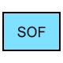|SFFP-----------|WAR.SOFUNT|Special Operations Forces (Sof) Unit|POINT|A|
|101|||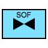|SFFPA----------|WAR.SOFUNT.AVN|Sof Unit Aviation|POINT|A|
|102|||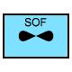|SFFPAF---------|WAR.SOFUNT.AVN.FIXD|Sof Unit Fixed Wing|POINT|A|
|103|||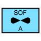|SFFPAFA--------|WAR.SOFUNT.AVN.FIXD.ATK|Sof Unit Attack|POINT|A|
|104|||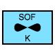|SFFPAFK--------|WAR.SOFUNT.AVN.FIXD.RFE|Sof Unit Refuel|POINT|A|
|105|||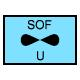|SFFPAFU--------|WAR.SOFUNT.AVN.FIXD.UTY|Sof Unit Utility|POINT|A|
|106|||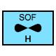|SFFPAFUH-------|WAR.SOFUNT.AVN.FIXD.UTY.HVY|Sof Unit Utility (Heavy)|POINT|A|
|107||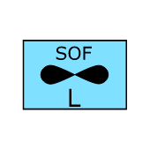|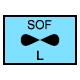|SFFPAFUL-------|WAR.SOFUNT.AVN.FIXD.UTY.LIT|Sof Unit Utility (Light)|POINT|A|
|108||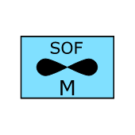|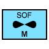|SFFPAFUM-------|WAR.SOFUNT.AVN.FIXD.UTY.MDM|Sof Unit Utility (Medium)|POINT|A|
|109|||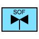|SFFPAH---------|WAR.SOFUNT.AVN.ROT|Sof Unit Rotary Wing|POINT|A|
|110||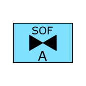||SFFPAHA--------|WAR.SOFUNT.AVN.ROT.ATK|Sof Unit Attack|POINT|A|
|111|||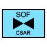|SFFPAHH--------|WAR.SOFUNT.AVN.ROT.CSAR|Sof Unit Combat Search And Rescue|POINT|A|
|112|||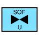|SFFPAHU--------|WAR.SOFUNT.AVN.ROT.UTY|Sof Unit Utility|POINT|A|
|113||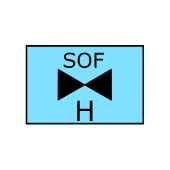|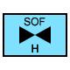|SFFPAHUH-------|WAR.SOFUNT.AVN.ROT.UTY.HVY|Sof Unit Utility (Heavy)|POINT|A|
|114|||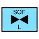|SFFPAHUL-------|WAR.SOFUNT.AVN.ROT.UTY.LIT|Sof Unit Utility (Light)|POINT|A|
|115||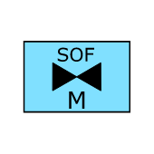|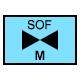|SFFPAHUM-------|WAR.SOFUNT.AVN.ROT.UTY.MDM|Sof Unit Utility (Medium)|POINT|A|
|116|||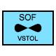|SFFPAV---------|WAR.SOFUNT.AVN.VSTOL|Sof Unit V/Stol|POINT|A|
|117|||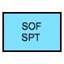|SFFPB----------|WAR.SOFUNT.SUP|Sof Unit Support|POINT|A|
|118|||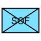|SFFPG----------|WAR.SOFUNT.GRD|Sof Unit Ground|POINT|A|
|119|||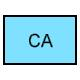|SFFPGC---------|WAR.SOFUNT.GRD.CVLAFF|Sof Unit Civil Affairs|POINT|A|
|120||||SFFPGP---------|WAR.SOFUNT.GRD.PSYOP|Sof Unit Psychological Operations (Psyop)|POINT|A|
|121||||SFFPGPA--------|WAR.SOFUNT.GRD.PSYOP.FIXAVN|Sof Unit Fixed Wing Aviation|POINT|A|
|122||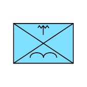|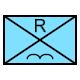|SFFPGR---------|WAR.SOFUNT.GRD.RGR|Sof Unit Ranger|POINT|A|
|123||||SFFPGS---------|WAR.SOFUNT.GRD.SOF|Sof Unit Special Forces|POINT|A|
|124||||SFFPN----------|WAR.SOFUNT.NAV|Sof Unit Sof Unit Naval|POINT|A|
|125||||SFFPNB---------|WAR.SOFUNT.NAV.SBT|Sof Unit Special Boat|POINT|A|
|126||||SFFPNN---------|WAR.SOFUNT.NAV.SSSNR|Sof Unit Special Ssnr|POINT|A|
|127||||SFFPNS---------|WAR.SOFUNT.NAV.SEAL|Sof Unit Seal|POINT|A|
|128||||SFFPNU---------|WAR.SOFUNT.NAV.UH2DML|Sof Unit Underwater Demolition Team|POINT|A|
|129||||SFGP-----------|WAR.GRDTRK|Ground Track|POINT|A|
|130||||SFGPE----------|WAR.GRDTRK.EQT|Ground Track Equipment|POINT|A|
|131||||SFGPES---------|WAR.GRDTRK.EQT.SNS|Sensor|POINT|A|
|132||||SFGPESE--------|WAR.GRDTRK.EQT.SNS.EMP|Emplaced Sensor|POINT|A|
|133||||SFGPESR--------|WAR.GRDTRK.EQT.SNS.RAD|Radar|POINT|A|
|134||||SFGPEV---------|WAR.GRDTRK.EQT.GRDVEH|Ground Vehicle|POINT|A|
|135||||SFGPEVA--------|WAR.GRDTRK.EQT.GRDVEH.ARMD|Armored Vehicle|POINT|A|
|136||||SFGPEVAA-------|WAR.GRDTRK.EQT.GRDVEH.ARMD.ARMPC|Armored Personnel Carrier|POINT|A|
|137||||SFGPEVAAR------|WAR.GRDTRK.EQT.GRDVEH.ARMD.ARMPC.RCY|Armored Personnel Carrier Recovery|POINT|A|
|138||||SFGPEVAC-------|WAR.GRDTRK.EQT.GRDVEH.ARMD.C2V|C2V/Acv|POINT|A|
|139||||SFGPEVAI-------|WAR.GRDTRK.EQT.GRDVEH.ARMD.ARMINF|Armored Infantry|POINT|A|
|140||||SFGPEVAL-------|WAR.GRDTRK.EQT.GRDVEH.ARMD.LARMVH|Light Armored Vehicle|POINT|A|
|141||||SFGPEVAS-------|WAR.GRDTRK.EQT.GRDVEH.ARMD.CSSVEH|Combat Service Support Vehicle|POINT|A|
|142||||SFGPEVAT-------|WAR.GRDTRK.EQT.GRDVEH.ARMD.TANK|Tank|POINT|A|
|143||||SFGPEVATH------|WAR.GRDTRK.EQT.GRDVEH.ARMD.TANK.HVY|Tank Heavy|POINT|A|
|144||||SFGPEVATHR-----|WAR.GRDTRK.EQT.GRDVEH.ARMD.TANK.HVY.RCY|Tank Heavy Recovery|POINT|A|
|145||||SFGPEVATL------|WAR.GRDTRK.EQT.GRDVEH.ARMD.TANK.LIT|Tank Light|POINT|A|
|146||||SFGPEVATLR-----|WAR.GRDTRK.EQT.GRDVEH.ARMD.TANK.LIT.RCY|Tank Light Recovery|POINT|A|
|147||||SFGPEVATM------|WAR.GRDTRK.EQT.GRDVEH.ARMD.TANK.MDM|Tank Medium|POINT|A|
|148||||SFGPEVATMR-----|WAR.GRDTRK.EQT.GRDVEH.ARMD.TANK.MDM.RCY|Tank Medium Recovery|POINT|A|
|149||||SFGPEVC--------|WAR.GRDTRK.EQT.GRDVEH.CVLVEH|Civilian Vehicle|POINT|A|
|150||||SFGPEVCA-------|WAR.GRDTRK.EQT.GRDVEH.CVLVEH.AUT|Automobile|POINT|A|
|151||||SFGPEVCAH------|WAR.GRDTRK.EQT.GRDVEH.CVLVEH.AUT.SDN|Sedan Automobile|POINT|A|
|152||||SFGPEVCAL------|WAR.GRDTRK.EQT.GRDVEH.CVLVEH.AUT.CPCT|Compact Automobile|POINT|A|
|153||||SFGPEVCAM------|WAR.GRDTRK.EQT.GRDVEH.CVLVEH.AUT.MDSZ|Midsize Automobile|POINT|A|
|154||||SFGPEVCF-------|WAR.GRDTRK.EQT.GRDVEH.CVLVEH.TRTRLF|Tractor Trailer Truck With Flatbed Trailer|POINT|A|
|155||||SFGPEVCFH------|WAR.GRDTRK.EQT.GRDVEH.CVLVEH.TRTRLF.LRG|Large/Heavy Flatbed Trailer Tractor Trailer Truck|POINT|A|
|156||||SFGPEVCFL------|WAR.GRDTRK.EQT.GRDVEH.CVLVEH.TRTRLF.SMAL|Small/Light Flatbed Trailer Tractor Trailer Truck|POINT|A|
|157||||SFGPEVCFM------|WAR.GRDTRK.EQT.GRDVEH.CVLVEH.TRTRLF.MDM|Medium Flatbed Trailer Tractor Trailer Truck|POINT|A|
|158||||SFGPEVCJ-------|WAR.GRDTRK.EQT.GRDVEH.CVLVEH.JP|Jeep Type Vehicle|POINT|A|
|159||||SFGPEVCJH------|WAR.GRDTRK.EQT.GRDVEH.CVLVEH.JP.LRG|Large/Heavy Jeep Type Vehicle|POINT|A|
|160||||SFGPEVCJL------|WAR.GRDTRK.EQT.GRDVEH.CVLVEH.JP.SMAL|Small/Light Jeep Type Vehicle|POINT|A|
|161||||SFGPEVCJM------|WAR.GRDTRK.EQT.GRDVEH.CVLVEH.JP.MDM|Medium Jeep Type Vehicle|POINT|A|
|162||||SFGPEVCM-------|WAR.GRDTRK.EQT.GRDVEH.CVLVEH.MPV|Multiple Passenger Vehicle|POINT|A|
|163||||SFGPEVCMH------|WAR.GRDTRK.EQT.GRDVEH.CVLVEH.MPV.LBUS|Large Bus Multiple Passenger Vehicle|POINT|A|
|164||||SFGPEVCML------|WAR.GRDTRK.EQT.GRDVEH.CVLVEH.MPV.VAN|Van Multiple Passenger Vehicle|POINT|A|
|165||||SFGPEVCMM------|WAR.GRDTRK.EQT.GRDVEH.CVLVEH.MPV.SBUS|Small Bus Multiple Passenger Vehicle|POINT|A|
|166||||SFGPEVCO-------|WAR.GRDTRK.EQT.GRDVEH.CVLVEH.OBTRK|Open-Bed Truck|POINT|A|
|167||||SFGPEVCOH------|WAR.GRDTRK.EQT.GRDVEH.CVLVEH.OBTRK.LRG|Large Open-Bed Truck|POINT|A|
|168||||SFGPEVCOL------|WAR.GRDTRK.EQT.GRDVEH.CVLVEH.OBTRK.PU|Pickup Open-Bed Truck|POINT|A|
|169||||SFGPEVCOM------|WAR.GRDTRK.EQT.GRDVEH.CVLVEH.OBTRK.SMAL|Small Open-Bed Truck|POINT|A|
|170||||SFGPEVCT-------|WAR.GRDTRK.EQT.GRDVEH.CVLVEH.TRTRL|Tractor Trailer Truck With Box Trailer|POINT|A|
|171||||SFGPEVCTH------|WAR.GRDTRK.EQT.GRDVEH.CVLVEH.TRTRL.LRG|Large/Heavy Box Trailer Tractor Trailer Truck|POINT|A|
|172||||SFGPEVCTL------|WAR.GRDTRK.EQT.GRDVEH.CVLVEH.TRTRL.SMAL|Small/Light Box Trailer Tractor Trailer Truck|POINT|A|
|173||||SFGPEVCTM------|WAR.GRDTRK.EQT.GRDVEH.CVLVEH.TRTRL.MDM|Medium Box Trailer Tractor Trailer Truck|POINT|A|
|174||||SFGPEVCU-------|WAR.GRDTRK.EQT.GRDVEH.CVLVEH.UTYVEH|Utility Vehicle|POINT|A|
|175||||SFGPEVCUH------|WAR.GRDTRK.EQT.GRDVEH.CVLVEH.UTYVEH.LBOX|Large Box Truck Utility Vehicle|POINT|A|
|176||||SFGPEVCUL------|WAR.GRDTRK.EQT.GRDVEH.CVLVEH.UTYVEH.SUV|Sport Utility Vehicle (Suv) Utility Vehicle|POINT|A|
|177||||SFGPEVCUM------|WAR.GRDTRK.EQT.GRDVEH.CVLVEH.UTYVEH.SBOX|Small Box Truck Utility Vehicle|POINT|A|
|178||||SFGPEVE--------|WAR.GRDTRK.EQT.GRDVEH.ENGVEH|Engineer Vehicle|POINT|A|
|179||||SFGPEVEA-------|WAR.GRDTRK.EQT.GRDVEH.ENGVEH.MCVEH|Mine Clearing Vehicle|POINT|A|
|180||||SFGPEVEAA------|WAR.GRDTRK.EQT.GRDVEH.ENGVEH.MCVEH.ARMVM|Armored Mounted Mine Clearing Vehicle|POINT|A|
|181||||SFGPEVEAT------|WAR.GRDTRK.EQT.GRDVEH.ENGVEH.MCVEH.TM|Trailer Mounted Mine Clearing Vehicle|POINT|A|
|182||||SFGPEVEB-------|WAR.GRDTRK.EQT.GRDVEH.ENGVEH.BRG|Bridge|POINT|A|
|183||||SFGPEVEC-------|WAR.GRDTRK.EQT.GRDVEH.ENGVEH.CSNVEH|Construction Vehicle|POINT|A|
|184||||SFGPEVED-------|WAR.GRDTRK.EQT.GRDVEH.ENGVEH.DZR|Dozer|POINT|A|
|185||||SFGPEVEDA------|WAR.GRDTRK.EQT.GRDVEH.ENGVEH.DZR.ARMD|Armored Dozer|POINT|A|
|186||||SFGPEVEE-------|WAR.GRDTRK.EQT.GRDVEH.ENGVEH.ERHMR|Earthmover|POINT|A|
|187||||SFGPEVEF-------|WAR.GRDTRK.EQT.GRDVEH.ENGVEH.FRYTSP|Ferry Transporter|POINT|A|
|188||||SFGPEVEH-------|WAR.GRDTRK.EQT.GRDVEH.ENGVEH.BH|Backhoe|POINT|A|
|189||||SFGPEVEM-------|WAR.GRDTRK.EQT.GRDVEH.ENGVEH.MLVEH|Mine Laying Vehicle|POINT|A|
|190||||SFGPEVEML------|WAR.GRDTRK.EQT.GRDVEH.ENGVEH.MLVEH.TRKMV|Truck Mounted With Volcano|POINT|A|
|191||||SFGPEVEMV------|WAR.GRDTRK.EQT.GRDVEH.ENGVEH.MLVEH.ARMCV|Armored Carrier With Volcano|POINT|A|
|192||||SFGPEVER-------|WAR.GRDTRK.EQT.GRDVEH.ENGVEH.ARMERV|Armored Engineer Recon Vehicle (Aerv)|POINT|A|
|193||||SFGPEVES-------|WAR.GRDTRK.EQT.GRDVEH.ENGVEH.AST|Armored Assault|POINT|A|
|194||||SFGPEVM--------|WAR.GRDTRK.EQT.GRDVEH.PKAN|Pack Animal(S)|POINT|A|
|195||||SFGPEVS--------|WAR.GRDTRK.EQT.GRDVEH.MSLSPT|Missile Support Vehicle|POINT|A|
|196||||SFGPEVSC-------|WAR.GRDTRK.EQT.GRDVEH.MSLSPT.CRN|Missile Support Vehicle Crane/Loading Device|POINT|A|
|197||||SFGPEVSP-------|WAR.GRDTRK.EQT.GRDVEH.MSLSPT.PLNT|Missile Support Vehicle Propellant Transporter|POINT|A|
|198||||SFGPEVSR-------|WAR.GRDTRK.EQT.GRDVEH.MSLSPT.TPTR|Missile Support Vehicle Transporter|POINT|A|
|199||||SFGPEVST-------|WAR.GRDTRK.EQT.GRDVEH.MSLSPT.TLDR|Missile Support Vehicle Transloader|POINT|A|
|200||||SFGPEVSW-------|WAR.GRDTRK.EQT.GRDVEH.MSLSPT.WH|Missile Support Vehicle Warhead Transporter|POINT|A|
|201||||SFGPEVT--------|WAR.GRDTRK.EQT.GRDVEH.TRNLCO|Train Locomotive|POINT|A|
|202||||SFGPEVU--------|WAR.GRDTRK.EQT.GRDVEH.UTYVEH|Utility Vehicle|POINT|A|
|203||||SFGPEVUA-------|WAR.GRDTRK.EQT.GRDVEH.UTYVEH.AMBLNC|Ambulance|POINT|A|
|204||||SFGPEVUAA------|WAR.GRDTRK.EQT.GRDVEH.UTYVEH.AMBLNC.ARMD|Armored Ambulance|POINT|A|
|205||||SFGPEVUB-------|WAR.GRDTRK.EQT.GRDVEH.UTYVEH.BUS|Bus|POINT|A|
|206||||SFGPEVUL-------|WAR.GRDTRK.EQT.GRDVEH.UTYVEH.LCCTRK|Limited Cross-Country Truck|POINT|A|
|207||||SFGPEVUR-------|WAR.GRDTRK.EQT.GRDVEH.UTYVEH.H2OCRT|Water Craft|POINT|A|
|208||||SFGPEVUS-------|WAR.GRDTRK.EQT.GRDVEH.UTYVEH.SEMI|Semi|POINT|A|
|209||||SFGPEVUSH------|WAR.GRDTRK.EQT.GRDVEH.UTYVEH.SEMI.HVY|Semi Heavy|POINT|A|
|210||||SFGPEVUSL------|WAR.GRDTRK.EQT.GRDVEH.UTYVEH.SEMI.LIT|Semi Light|POINT|A|
|211||||SFGPEVUSM------|WAR.GRDTRK.EQT.GRDVEH.UTYVEH.SEMI.MDM|Semi Medium|POINT|A|
|212||||SFGPEVUT-------|WAR.GRDTRK.EQT.GRDVEH.UTYVEH.TOWTRK|Tow Truck|POINT|A|
|213||||SFGPEVUTH------|WAR.GRDTRK.EQT.GRDVEH.UTYVEH.TOWTRK.HVY|Tow Truck Heavy|POINT|A|
|214||||SFGPEVUTL------|WAR.GRDTRK.EQT.GRDVEH.UTYVEH.TOWTRK.LIT|Tow Truck Light|POINT|A|
|215||||SFGPEVUX-------|WAR.GRDTRK.EQT.GRDVEH.UTYVEH.CCTRK|Cross-Country Truck|POINT|A|
|216||||SFGPEWA--------|WAR.GRDTRK.EQT.WPN.ADFG|Air Defense Gun|POINT|A|
|217||||SFGPEWAH-------|WAR.GRDTRK.EQT.WPN.ADFG.HVY|Air Defense Gun Heavy|POINT|A|
|218||||SFGPEWAL-------|WAR.GRDTRK.EQT.WPN.ADFG.LIT|Air Defense Gun Light|POINT|A|
|219||||SFGPEWAM-------|WAR.GRDTRK.EQT.WPN.ADFG.MDM|Air Defense Gun Medium|POINT|A|
|220||||SFGPEWD--------|WAR.GRDTRK.EQT.WPN.DFG|Direct Fire Gun|POINT|A|
|221||||SFGPEWDH-------|WAR.GRDTRK.EQT.WPN.DFG.HVY|Direct Fire Gun Heavy|POINT|A|
|222||||SFGPEWDHS------|WAR.GRDTRK.EQT.WPN.DFG.HVY.SPD|Direct Fire Gun Heavy Self-Propelled|POINT|A|
|223||||SFGPEWDL-------|WAR.GRDTRK.EQT.WPN.DFG.LIT|Direct Fire Gun Light|POINT|A|
|224||||SFGPEWDLS------|WAR.GRDTRK.EQT.WPN.DFG.LIT.SPD|Direct Fire Gun Light Self-Propelled|POINT|A|
|225||||SFGPEWDM-------|WAR.GRDTRK.EQT.WPN.DFG.MDM|Direct Fire Gun Medium|POINT|A|
|226||||SFGPEWDMS------|WAR.GRDTRK.EQT.WPN.DFG.MDM.SPD|Direct Fire Gun Medium Self-Propelled|POINT|A|
|227||||SFGPEWG--------|WAR.GRDTRK.EQT.WPN.ATG|Antitank Gun|POINT|A|
|228||||SFGPEWGH-------|WAR.GRDTRK.EQT.WPN.ATG.HVY|Antitank Gun Heavy|POINT|A|
|229||||SFGPEWGL-------|WAR.GRDTRK.EQT.WPN.ATG.LIT|Antitank Gun Light|POINT|A|
|230||||SFGPEWGM-------|WAR.GRDTRK.EQT.WPN.ATG.MDM|Antitank Gun Medium|POINT|A|
|231||||SFGPEWGR-------|WAR.GRDTRK.EQT.WPN.ATG.RECL|Antitank Gun Recoilless|POINT|A|
|232||||SFGPEWH--------|WAR.GRDTRK.EQT.WPN.HOW|Howitzer|POINT|A|
|233||||SFGPEWHH-------|WAR.GRDTRK.EQT.WPN.HOW.HVY|Howitzer Heavy|POINT|A|
|234||||SFGPEWHHS------|WAR.GRDTRK.EQT.WPN.HOW.HVY.SPD|Howitzer Heavy Self-Propelled|POINT|A|
|235||||SFGPEWHL-------|WAR.GRDTRK.EQT.WPN.HOW.LIT|Howitzer Light|POINT|A|
|236||||SFGPEWHLS------|WAR.GRDTRK.EQT.WPN.HOW.LIT.SPD|Howitzer Light Self-Propelled|POINT|A|
|237||||SFGPEWHM-------|WAR.GRDTRK.EQT.WPN.HOW.MDM|Howitzer Medium|POINT|A|
|238||||SFGPEWHMS------|WAR.GRDTRK.EQT.WPN.HOW.MDM.SPD|Howitzer Medium Self-Propelled|POINT|A|
|239||||SFGPEWM--------|WAR.GRDTRK.EQT.WPN.MSLL|Missile Launcher|POINT|A|
|240||||SFGPEWMA-------|WAR.GRDTRK.EQT.WPN.MSLL.ADFAD|Air Defense (Ad) Missile Launcher|POINT|A|
|241||||SFGPEWMAI------|WAR.GRDTRK.EQT.WPN.MSLL.ADFAD.INTMR|Intermediate Range Ad Missile Launcher|POINT|A|
|242||||SFGPEWMAIE-----|WAR.GRDTRK.EQT.WPN.MSLL.ADFAD.INTMR.TELAR|Transporter Erector Launcher And Radar (Telar)|POINT|A|
|243||||SFGPEWMAIR-----|WAR.GRDTRK.EQT.WPN.MSLL.ADFAD.INTMR.TLAR|Transporter Launcher And Radar (Tlar)|POINT|A|
|244||||SFGPEWMAL------|WAR.GRDTRK.EQT.WPN.MSLL.ADFAD.LNGR|Long Range Ad Missile Launcher|POINT|A|
|245||||SFGPEWMALE-----|WAR.GRDTRK.EQT.WPN.MSLL.ADFAD.LNGR.TELAR|Transporter Erector Launcher And Radar (Telar)|POINT|A|
|246||||SFGPEWMALR-----|WAR.GRDTRK.EQT.WPN.MSLL.ADFAD.LNGR.TLAR|Transporter Launcher And Radar (Tlar)|POINT|A|
|247||||SFGPEWMAS------|WAR.GRDTRK.EQT.WPN.MSLL.ADFAD.SHTR|Short Range Ad Missile Launcher|POINT|A|
|248||||SFGPEWMASE-----|WAR.GRDTRK.EQT.WPN.MSLL.ADFAD.SHTR.TELAR|Transporter Erector Launcher And Radar (Telar)|POINT|A|
|249||||SFGPEWMASR-----|WAR.GRDTRK.EQT.WPN.MSLL.ADFAD.SHTR.TLAR|Transporter Launcher And Radar (Tlar)|POINT|A|
|250||||SFGPEWMAT------|WAR.GRDTRK.EQT.WPN.MSLL.ADFAD.THT|Ad Missile Launcher Theater|POINT|A|
|251||||SFGPEWMATE-----|WAR.GRDTRK.EQT.WPN.MSLL.ADFAD.THT.TELAR|Transporter Erector Launcher And Radar (Telar)|POINT|A|
|252||||SFGPEWMATR-----|WAR.GRDTRK.EQT.WPN.MSLL.ADFAD.THT.TLAR|Transporter Launcher And Radar (Tlar)|POINT|A|
|253||||SFGPEWMS-------|WAR.GRDTRK.EQT.WPN.MSLL.SUF|Surf-Surf (Ss) Missile Launcher|POINT|A|
|254||||SFGPEWMSI------|WAR.GRDTRK.EQT.WPN.MSLL.SUF.INTMR|Intermediate Range Ss Missile Launcher|POINT|A|
|255||||SFGPEWMSL------|WAR.GRDTRK.EQT.WPN.MSLL.SUF.LNGR|Long Range Ss Missile Launcher|POINT|A|
|256||||SFGPEWMSS------|WAR.GRDTRK.EQT.WPN.MSLL.SUF.SHTR|Short Range Ss Missile Launcher|POINT|A|
|257||||SFGPEWMT-------|WAR.GRDTRK.EQT.WPN.MSLL.AT|Missile Launcher Antitank (At)|POINT|A|
|258||||SFGPEWMTH------|WAR.GRDTRK.EQT.WPN.MSLL.AT.HVY|Missile Launcher At Heavy|POINT|A|
|259||||SFGPEWMTL------|WAR.GRDTRK.EQT.WPN.MSLL.AT.LIT|Missile Launcher At Light|POINT|A|
|260||||SFGPEWMTM------|WAR.GRDTRK.EQT.WPN.MSLL.AT.MDM|Missile Launcher At Medium|POINT|A|
|261||||SFGPEWO--------|WAR.GRDTRK.EQT.WPN.MORT|Mortar|POINT|A|
|262||||SFGPEWOH-------|WAR.GRDTRK.EQT.WPN.MORT.HVY|Mortar Heavy|POINT|A|
|263||||SFGPEWOL-------|WAR.GRDTRK.EQT.WPN.MORT.LIT|Mortar Light|POINT|A|
|264||||SFGPEWOM-------|WAR.GRDTRK.EQT.WPN.MORT.MDM|Mortar Medium|POINT|A|
|265||||SFGPEWR--------|WAR.GRDTRK.EQT.WPN.RIFWPN|Rifle/Automatic Weapon|POINT|A|
|266||||SFGPEWRH-------|WAR.GRDTRK.EQT.WPN.RIFWPN.HMG|Heavy Machine Gun|POINT|A|
|267||||SFGPEWRL-------|WAR.GRDTRK.EQT.WPN.RIFWPN.LMG|Light Machine Gun|POINT|A|
|268||||SFGPEWRR-------|WAR.GRDTRK.EQT.WPN.RIFWPN.RIF|Rifle|POINT|A|
|269||||SFGPEWS--------|WAR.GRDTRK.EQT.WPN.SRL|Single Rocket Launcher|POINT|A|
|270||||SFGPEWSH-------|WAR.GRDTRK.EQT.WPN.SRL.HVY|Single Rocket Launcher Heavy|POINT|A|
|271||||SFGPEWSL-------|WAR.GRDTRK.EQT.WPN.SRL.LIT|Single Rocket Launcher Light|POINT|A|
|272||||SFGPEWSM-------|WAR.GRDTRK.EQT.WPN.SRL.MDM|Single Rocket Launcher Medium|POINT|A|
|273||||SFGPEWT--------|WAR.GRDTRK.EQT.WPN.ATRL|Antitank Rocket Launcher|POINT|A|
|274||||SFGPEWTH-------|WAR.GRDTRK.EQT.WPN.ATRL.HVY|Antitank Rocket Launcher Heavy|POINT|A|
|275||||SFGPEWTL-------|WAR.GRDTRK.EQT.WPN.ATRL.LIT|Antitank Rocket Launcher Light|POINT|A|
|276||||SFGPEWTM-------|WAR.GRDTRK.EQT.WPN.ATRL.MDM|Antitank Rocket Launcher Medium|POINT|A|
|277||||SFGPEWX--------|WAR.GRDTRK.EQT.WPN.MRL|Multiple Rocket Launcher|POINT|A|
|278||||SFGPEWXH-------|WAR.GRDTRK.EQT.WPN.MRL.HVY|Multiple Rocket Launcher Heavy|POINT|A|
|279||||SFGPEWXL-------|WAR.GRDTRK.EQT.WPN.MRL.LIT|Multiple Rocket Launcher Light|POINT|A|
|280||||SFGPEWXM-------|WAR.GRDTRK.EQT.WPN.MRL.MDM|Multiple Rocket Launcher Medium|POINT|A|
|281||||SFGPEWZ--------|WAR.GRDTRK.EQT.WPN.GREL|Grenade Launcher|POINT|A|
|282||||SFGPEWZH-------|WAR.GRDTRK.EQT.WPN.GREL.HVY|Grenade Launcher Heavy|POINT|A|
|283||||SFGPEWZL-------|WAR.GRDTRK.EQT.WPN.GREL.LIT|Grenade Launcher Light|POINT|A|
|284||||SFGPEWZM-------|WAR.GRDTRK.EQT.WPN.GREL.MDM|Grenade Launcher Medium|POINT|A|
|285||||SFGPEXF--------|WAR.GRDTRK.EQT.SPL.FLMTHR|Flame Thrower|POINT|A|
|286||||SFGPEXL--------|WAR.GRDTRK.EQT.SPL.LSR|Laser|POINT|A|
|287||||SFGPEXM--------|WAR.GRDTRK.EQT.SPL.LNDMNE|Land Mines|POINT|A|
|288||||SFGPEXMC-------|WAR.GRDTRK.EQT.SPL.LNDMNE.CLM|Claymore|POINT|A|
|289||||SFGPEXML-------|WAR.GRDTRK.EQT.SPL.LNDMNE.LTL|Less Than Lethal|POINT|A|
|290||||SFGPEXN--------|WAR.GRDTRK.EQT.SPL.CBRNEQ|Cbrn Equipment|POINT|A|
|291||||SFGPIBA---H----|WAR.GRDTRK.INS.MILBF.AB|Airport/Airbase|POINT|A|
|292||||SFGPIB----H----|WAR.GRDTRK.INS.MILBF|Military Base/Facility|POINT|A|
|293||||SFGPIBN---H----|WAR.GRDTRK.INS.MILBF.SP|Seaport/Naval Base|POINT|A|
|294||||SFGPIE----H----|WAR.GRDTRK.INS.EQTMNF|Equipment Manufacture|POINT|A|
|295||||SFGPIG----H----|WAR.GRDTRK.INS.GOVLDR|Government Leadership|POINT|A|
|296||||SFGPI-----H----|WAR.GRDTRK.INS|Installation|POINT|A|
|297||||SFGPIMA---H----|WAR.GRDTRK.INS.MMF.APA|Aircraft Production & Assembly|POINT|A|
|298||||SFGPIMC---H----|WAR.GRDTRK.INS.MMF.CBWP|Chemical & Biological Warfare Production|POINT|A|
|299||||SFGPIME---H----|WAR.GRDTRK.INS.MMF.AMEP|Ammunition And Explosives Production|POINT|A|
|300||||SFGPIMFA--H----|WAR.GRDTRK.INS.MMF.NENY.ATMER|Atomic Energy Reactor|POINT|A|
|301||||SFGPIMF---H----|WAR.GRDTRK.INS.MMF.NENY|Nuclear Energy|POINT|A|
|302||||SFGPIMFP--H----|WAR.GRDTRK.INS.MMF.NENY.NMP|Nuclear Material Production|POINT|A|
|303||||SFGPIMFPW-H----|WAR.GRDTRK.INS.MMF.NENY.NMP.WPNGR|Weapons Grade|POINT|A|
|304||||SFGPIMFS--H----|WAR.GRDTRK.INS.MMF.NENY.NMS|Nuclear Material Storage|POINT|A|
|305||||SFGPIMG---H----|WAR.GRDTRK.INS.MMF.AMTP|Armament Production|POINT|A|
|306||||SFGPIMM---H----|WAR.GRDTRK.INS.MMF.MSSP|Missile & Space System Production|POINT|A|
|307||||SFGPIMNB--H----|WAR.GRDTRK.INS.MMF.ENGEP.BRG|Bridge|POINT|A|
|308||||SFGPIMN---H----|WAR.GRDTRK.INS.MMF.ENGEP|Engineering Equipment Production|POINT|A|
|309||||SFGPIMS---H----|WAR.GRDTRK.INS.MMF.SHPCSN|Ship Construction|POINT|A|
|310||||SFGPIMV---H----|WAR.GRDTRK.INS.MMF.MILVP|Military Vehicle Production|POINT|A|
|311||||SFGPIPD---H----|WAR.GRDTRK.INS.PF.DECON|Decontamination|POINT|A|
|312||||SFGPIP----H----|WAR.GRDTRK.INS.PF|Processing Facility|POINT|A|
|313||||SFGPIR----H----|WAR.GRDTRK.INS.RMP|Raw Material Production/Storage|POINT|A|
|314||||SFGPIRM---H----|WAR.GRDTRK.INS.RMP.MNE|Mine|POINT|A|
|315||||SFGPIRNB--H----|WAR.GRDTRK.INS.RMP.CBRN.BIO|Biological|POINT|A|
|316||||SFGPIRNC--H----|WAR.GRDTRK.INS.RMP.CBRN.CML|Chemical|POINT|A|
|317||||SFGPIRN---H----|WAR.GRDTRK.INS.RMP.CBRN|Cbrn|POINT|A|
|318||||SFGPIRNN--H----|WAR.GRDTRK.INS.RMP.CBRN.NUC|Nuclear|POINT|A|
|319||||SFGPIRP---H----|WAR.GRDTRK.INS.RMP.PGO|Petroleum/Gas/Oil|POINT|A|
|320||||SFGPIT----H----|WAR.GRDTRK.INS.TSPF|Transport Facility|POINT|A|
|321||||SFGPIUED--H----|WAR.GRDTRK.INS.SRUF.EPF.DAM|Dam|POINT|A|
|322||||SFGPIUEF--H----|WAR.GRDTRK.INS.SRUF.EPF.FOSF|Fossil Fuel|POINT|A|
|323||||SFGPIUE---H----|WAR.GRDTRK.INS.SRUF.EPF|Electric Power Facility|POINT|A|
|324||||SFGPIUEN--H----|WAR.GRDTRK.INS.SRUF.EPF.NPT|Nuclear Plant|POINT|A|
|325||||SFGPIU----H----|WAR.GRDTRK.INS.SRUF|Service Research Utility Facility|POINT|A|
|326||||SFGPIUP---H----|WAR.GRDTRK.INS.SRUF.PWS|Public Water Services|POINT|A|
|327||||SFGPIUR---H----|WAR.GRDTRK.INS.SRUF.TRF|Technological Research Facility|POINT|A|
|328||||SFGPIUT---H----|WAR.GRDTRK.INS.SRUF.TCF|Telecommunications Facility|POINT|A|
|329||||SFGPIX----H----|WAR.GRDTRK.INS.MEDF|Medical Facility|POINT|A|
|330||||SFGPIXH---H----|WAR.GRDTRK.INS.MEDF.HSP|Hospital|POINT|A|
|331||||SFGPU----------|WAR.GRDTRK.UNT|Unit|POINT|A|
|332||||SFGPUC---------|WAR.GRDTRK.UNT.CBT|Combat|POINT|A|
|333||||SFGPUCA--------|WAR.GRDTRK.UNT.CBT.ARM|Armor|POINT|A|
|334||||SFGPUCAA-------|WAR.GRDTRK.UNT.CBT.AARM|Antiarmor|POINT|A|
|335||||SFGPUCAAA------|WAR.GRDTRK.UNT.CBT.AARM.ARMD|Antiarmor Armored|POINT|A|
|336||||SFGPUCAAAS-----|WAR.GRDTRK.UNT.CBT.AARM.ARMD.AAST|Antiarmor Armored Air Assault|POINT|A|
|337||||SFGPUCAAAT-----|WAR.GRDTRK.UNT.CBT.AARM.ARMD.TKD|Antiarmor Armored Tracked|POINT|A|
|338||||SFGPUCAAAW-----|WAR.GRDTRK.UNT.CBT.AARM.ARMD.WHD|Antiarmor Armored Wheeled|POINT|A|
|339||||SFGPUCAAC------|WAR.GRDTRK.UNT.CBT.AARM.ARC|Antiarmor Arctic|POINT|A|
|340||||SFGPUCAAD------|WAR.GRDTRK.UNT.CBT.AARM.DMD|Antiarmor Dismounted|POINT|A|
|341||||SFGPUCAAL------|WAR.GRDTRK.UNT.CBT.AARM.LIT|Antiarmor Light|POINT|A|
|342||||SFGPUCAAM------|WAR.GRDTRK.UNT.CBT.AARM.ABN|Antiarmor Airborne|POINT|A|
|343||||SFGPUCAAO------|WAR.GRDTRK.UNT.CBT.AARM.MOT|Antiarmor Motorized|POINT|A|
|344||||SFGPUCAAOS-----|WAR.GRDTRK.UNT.CBT.AARM.MOT.AAST|Antiarmor Motorized Air Assault|POINT|A|
|345||||SFGPUCAAS------|WAR.GRDTRK.UNT.CBT.AARM.AAST|Antiarmor Air Assault|POINT|A|
|346||||SFGPUCAAU------|WAR.GRDTRK.UNT.CBT.AARM.MNT|Antiarmor Mountain|POINT|A|
|347||||SFGPUCAT-------|WAR.GRDTRK.UNT.CBT.ARM.TRK|Armor Track|POINT|A|
|348||||SFGPUCATA------|WAR.GRDTRK.UNT.CBT.ARM.TRK.ABN|Armor Track Airborne|POINT|A|
|349||||SFGPUCATH------|WAR.GRDTRK.UNT.CBT.ARM.TRK.HVY|Armor Track Heavy|POINT|A|
|350||||SFGPUCATL------|WAR.GRDTRK.UNT.CBT.ARM.TRK.LIT|Armor Track Light|POINT|A|
|351||||SFGPUCATM------|WAR.GRDTRK.UNT.CBT.ARM.TRK.MDM|Armor Track Medium|POINT|A|
|352||||SFGPUCATR------|WAR.GRDTRK.UNT.CBT.ARM.TRK.RCY|Armor Track Recovery|POINT|A|
|353||||SFGPUCATW------|WAR.GRDTRK.UNT.CBT.ARM.TRK.AMP|Armor Track Amphibious|POINT|A|
|354||||SFGPUCATWR-----|WAR.GRDTRK.UNT.CBT.ARM.TRK.AMP.RCY|Armor Track Amphibious Recovery|POINT|A|
|355||||SFGPUCAW-------|WAR.GRDTRK.UNT.CBT.ARM.WHD|Armor Wheeled|POINT|A|
|356||||SFGPUCAWA------|WAR.GRDTRK.UNT.CBT.ARM.WHD.ABN|Armor Wheeled Airborne|POINT|A|
|357||||SFGPUCAWH------|WAR.GRDTRK.UNT.CBT.ARM.WHD.HVY|Armor Wheeled Heavy|POINT|A|
|358||||SFGPUCAWL------|WAR.GRDTRK.UNT.CBT.ARM.WHD.LIT|Armor Wheeled Light|POINT|A|
|359||||SFGPUCAWM------|WAR.GRDTRK.UNT.CBT.ARM.WHD.MDM|Armor Wheeled Medium|POINT|A|
|360||||SFGPUCAWR------|WAR.GRDTRK.UNT.CBT.ARM.WHD.RCY|Armor Wheeled Recovery|POINT|A|
|361||||SFGPUCAWS------|WAR.GRDTRK.UNT.CBT.ARM.WHD.AAST|Armor Wheeled Air Assault|POINT|A|
|362||||SFGPUCAWW------|WAR.GRDTRK.UNT.CBT.ARM.WHD.AMP|Armor Wheeled Amphibious|POINT|A|
|363||||SFGPUCAWWR-----|WAR.GRDTRK.UNT.CBT.ARM.WHD.AMP.RCY|Armor Wheeled Amphibious Recovery|POINT|A|
|364||||SFGPUCD--------|WAR.GRDTRK.UNT.CBT.ADF|Air Defense|POINT|A|
|365||||SFGPUCDC-------|WAR.GRDTRK.UNT.CBT.ADF.CMPS|Composite|POINT|A|
|366||||SFGPUCDG-------|WAR.GRDTRK.UNT.CBT.ADF.GUNUNT|Gun Unit|POINT|A|
|367||||SFGPUCDH-------|WAR.GRDTRK.UNT.CBT.ADF.MSL.HMAD|H/Mad|POINT|A|
|368||||SFGPUCDHH------|WAR.GRDTRK.UNT.CBT.ADF.MSL.HMAD.HWK|Hawk|POINT|A|
|369||||SFGPUCDHP------|WAR.GRDTRK.UNT.CBT.ADF.MSL.HMAD.PATT|Patriot|POINT|A|
|370||||SFGPUCDM-------|WAR.GRDTRK.UNT.CBT.ADF.MSL|Air Defense Missile|POINT|A|
|371||||SFGPUCDMH------|WAR.GRDTRK.UNT.CBT.ADF.MSL.HVY|Air Defense Missile Heavy|POINT|A|
|372||||SFGPUCDML------|WAR.GRDTRK.UNT.CBT.ADF.MSL.LIT|Air Defense Missile Light|POINT|A|
|373||||SFGPUCDMLA-----|WAR.GRDTRK.UNT.CBT.ADF.MSL.LIT.MOT|Air Defense Missile Motorized (Avenger)|POINT|A|
|374||||SFGPUCDMM------|WAR.GRDTRK.UNT.CBT.ADF.MSL.MDM|Air Defense Missile Medium|POINT|A|
|375||||SFGPUCDO-------|WAR.GRDTRK.UNT.CBT.ADF.TMDU|Theater Missile Defense Unit|POINT|A|
|376||||SFGPUCDS-------|WAR.GRDTRK.UNT.CBT.ADF.SHTR|Short Range|POINT|A|
|377||||SFGPUCDSC------|WAR.GRDTRK.UNT.CBT.ADF.SHTR.CPL|Chaparral|POINT|A|
|378||||SFGPUCDSS------|WAR.GRDTRK.UNT.CBT.ADF.SHTR.STG|Stinger|POINT|A|
|379||||SFGPUCDSV------|WAR.GRDTRK.UNT.CBT.ADF.SHTR.VUL|Vulcan|POINT|A|
|380||||SFGPUCDT-------|WAR.GRDTRK.UNT.CBT.ADF.TGTGUT|Targeting Unit|POINT|A|
|381||||SFGPUCE--------|WAR.GRDTRK.UNT.CBT.ENG|Engineer|POINT|A|
|382||||SFGPUCEC-------|WAR.GRDTRK.UNT.CBT.ENG.CBT|Engineer Combat|POINT|A|
|383||||SFGPUCECA------|WAR.GRDTRK.UNT.CBT.ENG.CBT.ABN|Engineer Combat Airborne|POINT|A|
|384||||SFGPUCECC------|WAR.GRDTRK.UNT.CBT.ENG.CBT.ARC|Engineer Combat Arctic|POINT|A|
|385||||SFGPUCECH------|WAR.GRDTRK.UNT.CBT.ENG.CBT.HVY|Engineer Combat Heavy|POINT|A|
|386||||SFGPUCECL------|WAR.GRDTRK.UNT.CBT.ENG.CBT.LIT|Engineer Combat Light (Sapper)|POINT|A|
|387||||SFGPUCECM------|WAR.GRDTRK.UNT.CBT.ENG.CBT.MDM|Engineer Combat Medium|POINT|A|
|388||||SFGPUCECO------|WAR.GRDTRK.UNT.CBT.ENG.CBT.MNT|Engineer Combat Mountain|POINT|A|
|389||||SFGPUCECR------|WAR.GRDTRK.UNT.CBT.ENG.CBT.RECON|Engineer Combat Recon|POINT|A|
|390||||SFGPUCECS------|WAR.GRDTRK.UNT.CBT.ENG.CBT.AAST|Engineer Combat Air Assault|POINT|A|
|391||||SFGPUCECT------|WAR.GRDTRK.UNT.CBT.ENG.CBT.MECH|Engineer Combat Mechanized (Track)|POINT|A|
|392||||SFGPUCECW------|WAR.GRDTRK.UNT.CBT.ENG.CBT.MOT|Engineer Combat Motorized|POINT|A|
|393||||SFGPUCEN-------|WAR.GRDTRK.UNT.CBT.ENG.CSN|Engineer Construction|POINT|A|
|394||||SFGPUCENN------|WAR.GRDTRK.UNT.CBT.ENG.CSN.NAV|Engineer Naval Construction|POINT|A|
|395||||SFGPUCF--------|WAR.GRDTRK.UNT.CBT.FLDART|Field Artillery|POINT|A|
|396||||SFGPUCFH-------|WAR.GRDTRK.UNT.CBT.FLDART.HOW|Howitzer/Gun|POINT|A|
|397||||SFGPUCFHA------|WAR.GRDTRK.UNT.CBT.FLDART.HOW.ABN|Airborne|POINT|A|
|398||||SFGPUCFHC------|WAR.GRDTRK.UNT.CBT.FLDART.HOW.ARC|Arctic|POINT|A|
|399||||SFGPUCFHE------|WAR.GRDTRK.UNT.CBT.FLDART.HOW.SPD|Self-Propelled|POINT|A|
|400||||SFGPUCFHH------|WAR.GRDTRK.UNT.CBT.FLDART.HOW.HVY|Heavy|POINT|A|
|401||||SFGPUCFHL------|WAR.GRDTRK.UNT.CBT.FLDART.HOW.LIT|Light|POINT|A|
|402||||SFGPUCFHM------|WAR.GRDTRK.UNT.CBT.FLDART.HOW.MDM|Medium|POINT|A|
|403||||SFGPUCFHO------|WAR.GRDTRK.UNT.CBT.FLDART.HOW.MNT|Mountain|POINT|A|
|404||||SFGPUCFHS------|WAR.GRDTRK.UNT.CBT.FLDART.HOW.AAST|Air Assault|POINT|A|
|405||||SFGPUCFHX------|WAR.GRDTRK.UNT.CBT.FLDART.HOW.AMP|Amphibious|POINT|A|
|406||||SFGPUCFM-------|WAR.GRDTRK.UNT.CBT.FLDART.MORT|Mortar|POINT|A|
|407||||SFGPUCFML------|WAR.GRDTRK.UNT.CBT.FLDART.MORT.AMP|Amphibious Mortar|POINT|A|
|408||||SFGPUCFMS------|WAR.GRDTRK.UNT.CBT.FLDART.MORT.SPDTRK|Self-Propelled (Sp) Tracked Mortar|POINT|A|
|409||||SFGPUCFMT------|WAR.GRDTRK.UNT.CBT.FLDART.MORT.TOW|Towed Mortar|POINT|A|
|410||||SFGPUCFMTA-----|WAR.GRDTRK.UNT.CBT.FLDART.MORT.TOW.ABN|Towed Airborne Mortar|POINT|A|
|411||||SFGPUCFMTC-----|WAR.GRDTRK.UNT.CBT.FLDART.MORT.TOW.ARC|Towed Arctic Mortar|POINT|A|
|412||||SFGPUCFMTO-----|WAR.GRDTRK.UNT.CBT.FLDART.MORT.TOW.MNT|Towed Mountain Mortar|POINT|A|
|413||||SFGPUCFMTS-----|WAR.GRDTRK.UNT.CBT.FLDART.MORT.TOW.AAST|Towed Air Assault Mortar|POINT|A|
|414||||SFGPUCFMW------|WAR.GRDTRK.UNT.CBT.FLDART.MORT.SPDWHD|Sp Wheeled Mortar|POINT|A|
|415||||SFGPUCFO-------|WAR.GRDTRK.UNT.CBT.FLDART.METO|Meteorological|POINT|A|
|416||||SFGPUCFOA------|WAR.GRDTRK.UNT.CBT.FLDART.METO.ABN|Airborne Meteorological|POINT|A|
|417||||SFGPUCFOL------|WAR.GRDTRK.UNT.CBT.FLDART.METO.LIT|Light Meteorological|POINT|A|
|418||||SFGPUCFOO------|WAR.GRDTRK.UNT.CBT.FLDART.METO.MNT|Mountain Meteorological|POINT|A|
|419||||SFGPUCFOS------|WAR.GRDTRK.UNT.CBT.FLDART.METO.AAST|Air Assault Meteorological|POINT|A|
|420||||SFGPUCFR-------|WAR.GRDTRK.UNT.CBT.FLDART.ROC|Rocket|POINT|A|
|421||||SFGPUCFRM------|WAR.GRDTRK.UNT.CBT.FLDART.ROC.MRL|Multiple Rocket Launcher|POINT|A|
|422||||SFGPUCFRMR-----|WAR.GRDTRK.UNT.CBT.FLDART.ROC.MRL.MRTRK|Multiple Rocket Truck|POINT|A|
|423||||SFGPUCFRMS-----|WAR.GRDTRK.UNT.CBT.FLDART.ROC.MRL.MRSPD|Multiple Rocket Self-Propelled|POINT|A|
|424||||SFGPUCFRMT-----|WAR.GRDTRK.UNT.CBT.FLDART.ROC.MRL.MRTOW|Multiple Rocket Towed|POINT|A|
|425||||SFGPUCFRS------|WAR.GRDTRK.UNT.CBT.FLDART.ROC.SRL|Single Rocket Launcher|POINT|A|
|426||||SFGPUCFRSR-----|WAR.GRDTRK.UNT.CBT.FLDART.ROC.SRL.SRTRK|Single Rocket Truck|POINT|A|
|427||||SFGPUCFRSS-----|WAR.GRDTRK.UNT.CBT.FLDART.ROC.SRL.SRSPD|Single Rocket Self-Propelled|POINT|A|
|428||||SFGPUCFRST-----|WAR.GRDTRK.UNT.CBT.FLDART.ROC.SRL.SRTOW|Single Rocket Towed|POINT|A|
|429||||SFGPUCFS-------|WAR.GRDTRK.UNT.CBT.FLDART.ARTSVY|Artillery Survey|POINT|A|
|430||||SFGPUCFSA------|WAR.GRDTRK.UNT.CBT.FLDART.ARTSVY.ABN|Airborne|POINT|A|
|431||||SFGPUCFSL------|WAR.GRDTRK.UNT.CBT.FLDART.ARTSVY.LIT|Light|POINT|A|
|432||||SFGPUCFSO------|WAR.GRDTRK.UNT.CBT.FLDART.ARTSVY.MNT|Mountain|POINT|A|
|433||||SFGPUCFSS------|WAR.GRDTRK.UNT.CBT.FLDART.ARTSVY.AAST|Air Assault|POINT|A|
|434||||SFGPUCFT-------|WAR.GRDTRK.UNT.CBT.FLDART.TGTAQ|Target Acquisition|POINT|A|
|435||||SFGPUCFTA------|WAR.GRDTRK.UNT.CBT.FLDART.TGTAQ.ANG|Anglico|POINT|A|
|436||||SFGPUCFTC------|WAR.GRDTRK.UNT.CBT.FLDART.TGTAQ.CLT|Colt/Fist|POINT|A|
|437||||SFGPUCFTCD-----|WAR.GRDTRK.UNT.CBT.FLDART.TGTAQ.CLT.DMD|Dismounted Colt/Fist|POINT|A|
|438||||SFGPUCFTCM-----|WAR.GRDTRK.UNT.CBT.FLDART.TGTAQ.CLT.TKD|Tracked Colt/Fist|POINT|A|
|439||||SFGPUCFTF------|WAR.GRDTRK.UNT.CBT.FLDART.TGTAQ.FLH|Flash (Optical)|POINT|A|
|440||||SFGPUCFTR------|WAR.GRDTRK.UNT.CBT.FLDART.TGTAQ.RAD|Radar|POINT|A|
|441||||SFGPUCFTS------|WAR.GRDTRK.UNT.CBT.FLDART.TGTAQ.SND|Sound|POINT|A|
|442||||SFGPUCI--------|WAR.GRDTRK.UNT.CBT.INF|Infantry|POINT|A|
|443||||SFGPUCIA-------|WAR.GRDTRK.UNT.CBT.INF.ABN|Infantry Airborne|POINT|A|
|444||||SFGPUCIC-------|WAR.GRDTRK.UNT.CBT.INF.ARC|Infantry Arctic|POINT|A|
|445||||SFGPUCII-------|WAR.GRDTRK.UNT.CBT.INF.INFFV|Infantry Fighting Vehicle|POINT|A|
|446||||SFGPUCIL-------|WAR.GRDTRK.UNT.CBT.INF.LIT|Infantry Light|POINT|A|
|447||||SFGPUCIM-------|WAR.GRDTRK.UNT.CBT.INF.MOT|Infantry Motorized|POINT|A|
|448||||SFGPUCIN-------|WAR.GRDTRK.UNT.CBT.INF.NAV|Infantry Naval|POINT|A|
|449||||SFGPUCIO-------|WAR.GRDTRK.UNT.CBT.INF.MNT|Infantry Mountain|POINT|A|
|450||||SFGPUCIS-------|WAR.GRDTRK.UNT.CBT.INF.AAST|Infantry Air Assault|POINT|A|
|451||||SFGPUCIZ-------|WAR.GRDTRK.UNT.CBT.INF.MECH|Infantry Mechanized|POINT|A|
|452||||SFGPUCM--------|WAR.GRDTRK.UNT.CBT.MSL|Missile (Surf-Surf)|POINT|A|
|453||||SFGPUCMS-------|WAR.GRDTRK.UNT.CBT.MSL.STGC|Missile (Surf-Surf) Strategic|POINT|A|
|454||||SFGPUCMT-------|WAR.GRDTRK.UNT.CBT.MSL.TAC|Missile (Surf-Surf) Tactical|POINT|A|
|455||||SFGPUCR--------|WAR.GRDTRK.UNT.CBT.RECON|Reconnaissance|POINT|A|
|456||||SFGPUCRA-------|WAR.GRDTRK.UNT.CBT.RECON.ABN|Reconnaissance Airborne|POINT|A|
|457||||SFGPUCRC-------|WAR.GRDTRK.UNT.CBT.RECON.ARC|Reconnaissance Arctic|POINT|A|
|458||||SFGPUCRH-------|WAR.GRDTRK.UNT.CBT.RECON.HRE|Reconnaissance Horse|POINT|A|
|459||||SFGPUCRL-------|WAR.GRDTRK.UNT.CBT.RECON.LIT|Reconnaissance Light|POINT|A|
|460||||SFGPUCRO-------|WAR.GRDTRK.UNT.CBT.RECON.MNT|Reconnaissance Mountain|POINT|A|
|461||||SFGPUCRR-------|WAR.GRDTRK.UNT.CBT.RECON.MAR|Reconnaissance Marine|POINT|A|
|462||||SFGPUCRRD------|WAR.GRDTRK.UNT.CBT.RECON.MAR.DIV|Reconnaissance Marine Division|POINT|A|
|463||||SFGPUCRRF------|WAR.GRDTRK.UNT.CBT.RECON.MAR.FOR|Reconnaissance Marine Force|POINT|A|
|464||||SFGPUCRRL------|WAR.GRDTRK.UNT.CBT.RECON.MAR.LAR|Reconnaissance Marine Light Armored Reconnaissnace (Lar)|POINT|A|
|465||||SFGPUCRS-------|WAR.GRDTRK.UNT.CBT.RECON.AAST|Reconnaissance Air Assault|POINT|A|
|466||||SFGPUCRV-------|WAR.GRDTRK.UNT.CBT.RECON.CVY|Reconnaissance Cavalry|POINT|A|
|467||||SFGPUCRVA------|WAR.GRDTRK.UNT.CBT.RECON.CVY.ARMD|Reconnaissance Cavalry Armored|POINT|A|
|468||||SFGPUCRVG------|WAR.GRDTRK.UNT.CBT.RECON.CVY.GRD|Reconnaissance Cavalry Ground|POINT|A|
|469||||SFGPUCRVM------|WAR.GRDTRK.UNT.CBT.RECON.CVY.MOT|Reconnaissance Cavalry Motorized|POINT|A|
|470||||SFGPUCRVO------|WAR.GRDTRK.UNT.CBT.RECON.CVY.AIR|Reconnaissance Cavalry Air|POINT|A|
|471||||SFGPUCRX-------|WAR.GRDTRK.UNT.CBT.RECON.LRS|Reconnaissance Long Range Surveillance (Lrs)|POINT|A|
|472||||SFGPUCS--------|WAR.GRDTRK.UNT.CBT.ISF|Internal Security Forces|POINT|A|
|473||||SFGPUCSA-------|WAR.GRDTRK.UNT.CBT.ISF.AVN|Aviation|POINT|A|
|474||||SFGPUCSG-------|WAR.GRDTRK.UNT.CBT.ISF.GRD|Ground|POINT|A|
|475||||SFGPUCSGA------|WAR.GRDTRK.UNT.CBT.ISF.GRD.MECH|Mechanized Ground|POINT|A|
|476||||SFGPUCSGD------|WAR.GRDTRK.UNT.CBT.ISF.GRD.DMD|Dismounted Ground|POINT|A|
|477||||SFGPUCSGM------|WAR.GRDTRK.UNT.CBT.ISF.GRD.MOT|Motorized Ground|POINT|A|
|478||||SFGPUCSM-------|WAR.GRDTRK.UNT.CBT.ISF.WHMECH|Wheeled Mechanized|POINT|A|
|479||||SFGPUCSR-------|WAR.GRDTRK.UNT.CBT.ISF.RALRD|Railroad|POINT|A|
|480||||SFGPUCSW-------|WAR.GRDTRK.UNT.CBT.ISF.RIV|Riverine|POINT|A|
|481||||SFGPUCV--------|WAR.GRDTRK.UNT.CBT.AVN|Aviation|POINT|A|
|482||||SFGPUCVC-------|WAR.GRDTRK.UNT.CBT.AVN.CMPS|Composite|POINT|A|
|483||||SFGPUCVF-------|WAR.GRDTRK.UNT.CBT.AVN.FIXD|Fixed Wing|POINT|A|
|484||||SFGPUCVFA------|WAR.GRDTRK.UNT.CBT.AVN.FIXD.ATK|Attack Fixed Wing|POINT|A|
|485||||SFGPUCVFR------|WAR.GRDTRK.UNT.CBT.AVN.FIXD.RECON|Recon Fixed Wing|POINT|A|
|486||||SFGPUCVFU------|WAR.GRDTRK.UNT.CBT.AVN.FIXD.UTY|Utility Fixed Wing|POINT|A|
|487||||SFGPUCVR-------|WAR.GRDTRK.UNT.CBT.AVN.ROT|Rotary Wing|POINT|A|
|488||||SFGPUCVRA------|WAR.GRDTRK.UNT.CBT.AVN.ROT.ATK|Attack Rotary Wing|POINT|A|
|489||||SFGPUCVRM------|WAR.GRDTRK.UNT.CBT.AVN.ROT.MNECM|Mine Countermeasure Rotary Wing|POINT|A|
|490||||SFGPUCVRS------|WAR.GRDTRK.UNT.CBT.AVN.ROT.SCUT|Scout Rotary Wing|POINT|A|
|491||||SFGPUCVRU------|WAR.GRDTRK.UNT.CBT.AVN.ROT.UTY|Utility Rotary Wing|POINT|A|
|492||||SFGPUCVRUC-----|WAR.GRDTRK.UNT.CBT.AVN.ROT.C2|C2 Rotary Wing|POINT|A|
|493||||SFGPUCVRUE-----|WAR.GRDTRK.UNT.CBT.AVN.ROT.MEDV|Medevac Rotary Wing|POINT|A|
|494||||SFGPUCVRUH-----|WAR.GRDTRK.UNT.CBT.AVN.ROT.UTY.HVY|Heavy Utility Rotary Wing|POINT|A|
|495||||SFGPUCVRUL-----|WAR.GRDTRK.UNT.CBT.AVN.ROT.UTY.LIT|Light Utility Rotary Wing|POINT|A|
|496||||SFGPUCVRUM-----|WAR.GRDTRK.UNT.CBT.AVN.ROT.UTY.MDM|Medium Utility Rotary Wing|POINT|A|
|497||||SFGPUCVRW------|WAR.GRDTRK.UNT.CBT.AVN.ROT.ASBW|Antisubmarine Warfare Rotary Wing|POINT|A|
|498||||SFGPUCVS-------|WAR.GRDTRK.UNT.CBT.AVN.SAR|Search And Rescue|POINT|A|
|499||||SFGPUCVU-------|WAR.GRDTRK.UNT.CBT.AVN.UA|Unmanned Aircraft|POINT|A|
|500||||SFGPUCVUF------|WAR.GRDTRK.UNT.CBT.AVN.UA.FIXD|Unmanned Aircraft Fixed Wing|POINT|A|
|501||||SFGPUCVUR------|WAR.GRDTRK.UNT.CBT.AVN.UA.ROT|Unmanned Aircraft Rotary Wing|POINT|A|
|502||||SFGPUCVV-------|WAR.GRDTRK.UNT.CBT.AVN.VSTOL|Vertical And/Or Short Takeoff And Landing Aircraft (V/Stol)|POINT|A|
|503||||SFGPUH---------|WAR.GRDTRK.UNT.C2HQ|Special C2 Headquarters Component|POINT|A|
|504||||SFGPUS---------|WAR.GRDTRK.UNT.CSS|Combat Service Support|POINT|A|
|505||||SFGPUSA--------|WAR.GRDTRK.UNT.CSS.ADMIN|Administrative (Admin)|POINT|A|
|506||||SFGPUSAC-------|WAR.GRDTRK.UNT.CSS.ADMIN.CRP|Admin Corps|POINT|A|
|507||||SFGPUSAF-------|WAR.GRDTRK.UNT.CSS.ADMIN.FIN|Finance|POINT|A|
|508||||SFGPUSAFC------|WAR.GRDTRK.UNT.CSS.ADMIN.FIN.CRP|Finance Corps|POINT|A|
|509||||SFGPUSAFT------|WAR.GRDTRK.UNT.CSS.ADMIN.FIN.THT|Finance Theater|POINT|A|
|510||||SFGPUSAJ-------|WAR.GRDTRK.UNT.CSS.ADMIN.JAG|Judge Advocate General (Jag)|POINT|A|
|511||||SFGPUSAJC------|WAR.GRDTRK.UNT.CSS.ADMIN.JAG.CRP|Jag Corps|POINT|A|
|512||||SFGPUSAJT------|WAR.GRDTRK.UNT.CSS.ADMIN.JAG.THT|Jag Theater|POINT|A|
|513||||SFGPUSAL-------|WAR.GRDTRK.UNT.CSS.ADMIN.LBR|Labor|POINT|A|
|514||||SFGPUSALC------|WAR.GRDTRK.UNT.CSS.ADMIN.LBR.CRP|Labor Corps|POINT|A|
|515||||SFGPUSALT------|WAR.GRDTRK.UNT.CSS.ADMIN.LBR.THT|Labor Theater|POINT|A|
|516||||SFGPUSAM-------|WAR.GRDTRK.UNT.CSS.ADMIN.MTRY|Mortuary/Graves Registry|POINT|A|
|517||||SFGPUSAMC------|WAR.GRDTRK.UNT.CSS.ADMIN.MTRY.CRP|Mortuary/Graves Registry Corps|POINT|A|
|518||||SFGPUSAMT------|WAR.GRDTRK.UNT.CSS.ADMIN.MTRY.THT|Mortuary/Graves Registry Theater|POINT|A|
|519||||SFGPUSAO-------|WAR.GRDTRK.UNT.CSS.ADMIN.PST|Postal|POINT|A|
|520||||SFGPUSAOC------|WAR.GRDTRK.UNT.CSS.ADMIN.PST.CRP|Postal Corps|POINT|A|
|521||||SFGPUSAOT------|WAR.GRDTRK.UNT.CSS.ADMIN.PST.THT|Postal Theater|POINT|A|
|522||||SFGPUSAP-------|WAR.GRDTRK.UNT.CSS.ADMIN.PUBAFF|Public Affairs|POINT|A|
|523||||SFGPUSAPB------|WAR.GRDTRK.UNT.CSS.ADMIN.PUBAFF.BRCT|Public Affairs Broadcast|POINT|A|
|524||||SFGPUSAPBC-----|WAR.GRDTRK.UNT.CSS.ADMIN.PUBAFF.BRCT.CRP|Public Affairs Broadcast Corps|POINT|A|
|525||||SFGPUSAPBT-----|WAR.GRDTRK.UNT.CSS.ADMIN.PUBAFF.BRCT.THT|Public Affairs Broadcast Theater|POINT|A|
|526||||SFGPUSAPC------|WAR.GRDTRK.UNT.CSS.ADMIN.PUBAFF.CRP|Public Affairs Corps|POINT|A|
|527||||SFGPUSAPM------|WAR.GRDTRK.UNT.CSS.ADMIN.PUBAFF.JIB|Public Affairs Joint Information Bureau (Jib)|POINT|A|
|528||||SFGPUSAPMC-----|WAR.GRDTRK.UNT.CSS.ADMIN.PUBAFF.JIB.CRP|Public Affairs Jib Corps|POINT|A|
|529||||SFGPUSAPMT-----|WAR.GRDTRK.UNT.CSS.ADMIN.PUBAFF.JIB.THT|Public Affairs Jib Theater|POINT|A|
|530||||SFGPUSAPT------|WAR.GRDTRK.UNT.CSS.ADMIN.PUBAFF.THT|Public Affairs Theater|POINT|A|
|531||||SFGPUSAQ-------|WAR.GRDTRK.UNT.CSS.ADMIN.SUPPLY|Quartermaster (Supply)|POINT|A|
|532||||SFGPUSAQC------|WAR.GRDTRK.UNT.CSS.ADMIN.SUPPLY.CRP|Quartermaster (Supply) Corps|POINT|A|
|533||||SFGPUSAQT------|WAR.GRDTRK.UNT.CSS.ADMIN.SUPPLY.THT|Quartermaster (Supply) Theater|POINT|A|
|534||||SFGPUSAR-------|WAR.GRDTRK.UNT.CSS.ADMIN.RELG|Religious/Chaplain|POINT|A|
|535||||SFGPUSARC------|WAR.GRDTRK.UNT.CSS.ADMIN.RELG.CRP|Religious/Chaplain Corps|POINT|A|
|536||||SFGPUSART------|WAR.GRDTRK.UNT.CSS.ADMIN.RELG.THT|Religious/Chaplain Theater|POINT|A|
|537||||SFGPUSAS-------|WAR.GRDTRK.UNT.CSS.ADMIN.PERSVC|Personnel Services|POINT|A|
|538||||SFGPUSASC------|WAR.GRDTRK.UNT.CSS.ADMIN.PERSVC.CRP|Personnel Corps|POINT|A|
|539||||SFGPUSAST------|WAR.GRDTRK.UNT.CSS.ADMIN.PERSVC.THT|Personnel Theater|POINT|A|
|540||||SFGPUSAT-------|WAR.GRDTRK.UNT.CSS.ADMIN.THT|Admin Theater|POINT|A|
|541||||SFGPUSAW-------|WAR.GRDTRK.UNT.CSS.ADMIN.MWR|Morale Welfare Recreation (Mwr)|POINT|A|
|542||||SFGPUSAWC------|WAR.GRDTRK.UNT.CSS.ADMIN.MWR.CRP|Mwr Corps|POINT|A|
|543||||SFGPUSAWT------|WAR.GRDTRK.UNT.CSS.ADMIN.MWR.THT|Mwr Theater|POINT|A|
|544||||SFGPUSAX-------|WAR.GRDTRK.UNT.CSS.ADMIN.RHU|Replacement Holding Unit (Rhu)|POINT|A|
|545||||SFGPUSAXC------|WAR.GRDTRK.UNT.CSS.ADMIN.RHU.CRP|Rhu Corps|POINT|A|
|546||||SFGPUSAXT------|WAR.GRDTRK.UNT.CSS.ADMIN.RHU.THT|Rhu Theater|POINT|A|
|547||||SFGPUSM--------|WAR.GRDTRK.UNT.CSS.MED|Medical|POINT|A|
|548||||SFGPUSMC-------|WAR.GRDTRK.UNT.CSS.MED.CRP|Medical Corps|POINT|A|
|549||||SFGPUSMD-------|WAR.GRDTRK.UNT.CSS.MED.DEN|Medical Dental|POINT|A|
|550||||SFGPUSMDC------|WAR.GRDTRK.UNT.CSS.MED.DEN.CRP|Medical Dental Corps|POINT|A|
|551||||SFGPUSMDT------|WAR.GRDTRK.UNT.CSS.MED.DEN.THT|Medical Dental Theater|POINT|A|
|552||||SFGPUSMM-------|WAR.GRDTRK.UNT.CSS.MED.MEDTF|Medical Treatment Facility|POINT|A|
|553||||SFGPUSMMC------|WAR.GRDTRK.UNT.CSS.MED.MEDTF.CRP|Medical Treatment Facility Corps|POINT|A|
|554||||SFGPUSMMT------|WAR.GRDTRK.UNT.CSS.MED.MEDTF.THT|Medical Treatment Facility Theater|POINT|A|
|555||||SFGPUSMP-------|WAR.GRDTRK.UNT.CSS.MED.PSY|Medical Psychological|POINT|A|
|556||||SFGPUSMPC------|WAR.GRDTRK.UNT.CSS.MED.PSY.CRP|Medical Psychological Corps|POINT|A|
|557||||SFGPUSMPT------|WAR.GRDTRK.UNT.CSS.MED.PSY.THT|Medical Psychological Theater|POINT|A|
|558||||SFGPUSMT-------|WAR.GRDTRK.UNT.CSS.MED.THT|Medical Theater|POINT|A|
|559||||SFGPUSMV-------|WAR.GRDTRK.UNT.CSS.MED.VNY|Medical Veterinary|POINT|A|
|560||||SFGPUSMVC------|WAR.GRDTRK.UNT.CSS.MED.VNY.CRP|Medical Veterinary Corps|POINT|A|
|561||||SFGPUSMVT------|WAR.GRDTRK.UNT.CSS.MED.VNY.THT|Medical Veterinary Theater|POINT|A|
|562||||SFGPUSS--------|WAR.GRDTRK.UNT.CSS.SLP|Supply|POINT|A|
|563||||SFGPUSS1-------|WAR.GRDTRK.UNT.CSS.SLP.CLS1|Supply Class I|POINT|A|
|564||||SFGPUSS1C------|WAR.GRDTRK.UNT.CSS.SLP.CLS1.CRP|Supply Class I Corps|POINT|A|
|565||||SFGPUSS1T------|WAR.GRDTRK.UNT.CSS.SLP.CLS1.THT|Supply Class I Theater|POINT|A|
|566||||SFGPUSS2-------|WAR.GRDTRK.UNT.CSS.SLP.CLS2|Supply Class Ii|POINT|A|
|567||||SFGPUSS2C------|WAR.GRDTRK.UNT.CSS.SLP.CLS2.CRP|Supply Class Ii Corps|POINT|A|
|568||||SFGPUSS2T------|WAR.GRDTRK.UNT.CSS.SLP.CLS2.THT|Supply Class Ii Theater|POINT|A|
|569||||SFGPUSS3-------|WAR.GRDTRK.UNT.CSS.SLP.CLS3|Supply Class Iii|POINT|A|
|570||||SFGPUSS3A------|WAR.GRDTRK.UNT.CSS.SLP.CLS3.AVN|Supply Class Iii Aviation|POINT|A|
|571||||SFGPUSS3AC-----|WAR.GRDTRK.UNT.CSS.SLP.CLS3.AVN.CRP|Supply Class Iii Aviation Corps|POINT|A|
|572||||SFGPUSS3AT-----|WAR.GRDTRK.UNT.CSS.SLP.CLS3.AVN.THT|Supply Class Iii Aviation Theater|POINT|A|
|573||||SFGPUSS3C------|WAR.GRDTRK.UNT.CSS.SLP.CLS3.CRP|Supply Class Iii Corps|POINT|A|
|574||||SFGPUSS3T------|WAR.GRDTRK.UNT.CSS.SLP.CLS3.THT|Supply Class Iii Theater|POINT|A|
|575||||SFGPUSS4-------|WAR.GRDTRK.UNT.CSS.SLP.CLS4|Supply Class Iv|POINT|A|
|576||||SFGPUSS4C------|WAR.GRDTRK.UNT.CSS.SLP.CLS4.CRP|Supply Class Iv Corps|POINT|A|
|577||||SFGPUSS4T------|WAR.GRDTRK.UNT.CSS.SLP.CLS4.THT|Supply Class Iv Theater|POINT|A|
|578||||SFGPUSS5-------|WAR.GRDTRK.UNT.CSS.SLP.CLS5|Supply Class V|POINT|A|
|579||||SFGPUSS5C------|WAR.GRDTRK.UNT.CSS.SLP.CLS5.CRP|Supply Class V Corps|POINT|A|
|580||||SFGPUSS5T------|WAR.GRDTRK.UNT.CSS.SLP.CLS5.THT|Supply Class V Theater|POINT|A|
|581||||SFGPUSS6-------|WAR.GRDTRK.UNT.CSS.SLP.CLS6|Supply Class Vi|POINT|A|
|582||||SFGPUSS6C------|WAR.GRDTRK.UNT.CSS.SLP.CLS6.CRP|Supply Class Vi Corps|POINT|A|
|583||||SFGPUSS6T------|WAR.GRDTRK.UNT.CSS.SLP.CLS6.THT|Supply Class Vi Theater|POINT|A|
|584||||SFGPUSS7-------|WAR.GRDTRK.UNT.CSS.SLP.CLS7|Supply Class Vii|POINT|A|
|585||||SFGPUSS7C------|WAR.GRDTRK.UNT.CSS.SLP.CLS7.CRP|Supply Class Vii Corps|POINT|A|
|586||||SFGPUSS7T------|WAR.GRDTRK.UNT.CSS.SLP.CLS7.THT|Supply Class Vii Theater|POINT|A|
|587||||SFGPUSS8-------|WAR.GRDTRK.UNT.CSS.SLP.CLS8|Supply Class Viii|POINT|A|
|588||||SFGPUSS8C------|WAR.GRDTRK.UNT.CSS.SLP.CLS8.CRP|Supply Class Viii Corps|POINT|A|
|589||||SFGPUSS8T------|WAR.GRDTRK.UNT.CSS.SLP.CLS8.THT|Supply Class Viii Theater|POINT|A|
|590||||SFGPUSS9-------|WAR.GRDTRK.UNT.CSS.SLP.CLS9|Supply Class Ix|POINT|A|
|591||||SFGPUSS9C------|WAR.GRDTRK.UNT.CSS.SLP.CLS9.CRP|Supply Class Ix Corps|POINT|A|
|592||||SFGPUSS9T------|WAR.GRDTRK.UNT.CSS.SLP.CLS9.THT|Supply Class Ix Theater|POINT|A|
|593||||SFGPUSSC-------|WAR.GRDTRK.UNT.CSS.SLP.CRP|Supply Corps|POINT|A|
|594||||SFGPUSSL-------|WAR.GRDTRK.UNT.CSS.SLP.LDY|Supply Laundry/Bath|POINT|A|
|595||||SFGPUSSLC------|WAR.GRDTRK.UNT.CSS.SLP.LDY.CRP|Supply Laundry/Bath Corps|POINT|A|
|596||||SFGPUSSLT------|WAR.GRDTRK.UNT.CSS.SLP.LDY.THT|Supply Laundry/Bath Theater|POINT|A|
|597||||SFGPUSST-------|WAR.GRDTRK.UNT.CSS.SLP.THT|Supply Theater|POINT|A|
|598||||SFGPUSSW-------|WAR.GRDTRK.UNT.CSS.SLP.H2O|Supply Water|POINT|A|
|599||||SFGPUSSWC------|WAR.GRDTRK.UNT.CSS.SLP.H2O.CRP|Supply Water Corps|POINT|A|
|600||||SFGPUSSWP------|WAR.GRDTRK.UNT.CSS.SLP.H2O.PUR|Supply Water Purification|POINT|A|
|601||||SFGPUSSWPC-----|WAR.GRDTRK.UNT.CSS.SLP.H2O.PUR.CRP|Supply Water Purification Corps|POINT|A|
|602||||SFGPUSSWPT-----|WAR.GRDTRK.UNT.CSS.SLP.H2O.PUR.THT|Supply Water Purification Theater|POINT|A|
|603||||SFGPUSSWT------|WAR.GRDTRK.UNT.CSS.SLP.H2O.THT|Supply Water Theater|POINT|A|
|604||||SFGPUSSX-------|WAR.GRDTRK.UNT.CSS.SLP.CLS10|Supply Class X|POINT|A|
|605||||SFGPUSSXC------|WAR.GRDTRK.UNT.CSS.SLP.CLS10.CRP|Supply Class X Corps|POINT|A|
|606||||SFGPUSSXT------|WAR.GRDTRK.UNT.CSS.SLP.CLS10.THT|Supply Class X Theater|POINT|A|
|607||||SFGPUST--------|WAR.GRDTRK.UNT.CSS.TPT|Transportation|POINT|A|
|608||||SFGPUSTA-------|WAR.GRDTRK.UNT.CSS.TPT.APOD|Apod/Apoe|POINT|A|
|609||||SFGPUSTAC------|WAR.GRDTRK.UNT.CSS.TPT.APOD.CRP|Apod/Apoe Corps|POINT|A|
|610||||SFGPUSTAT------|WAR.GRDTRK.UNT.CSS.TPT.APOD.THT|Apod/Apoe Theater|POINT|A|
|611||||SFGPUSTC-------|WAR.GRDTRK.UNT.CSS.TPT.CRP|Transportation Corps|POINT|A|
|612||||SFGPUSTI-------|WAR.GRDTRK.UNT.CSS.TPT.MSL|Missile|POINT|A|
|613||||SFGPUSTIC------|WAR.GRDTRK.UNT.CSS.TPT.MSL.CRP|Missile Corps|POINT|A|
|614||||SFGPUSTIT------|WAR.GRDTRK.UNT.CSS.TPT.MSL.THT|Missile Theater|POINT|A|
|615||||SFGPUSTM-------|WAR.GRDTRK.UNT.CSS.TPT.MCC|Movement Control Center (Mcc)|POINT|A|
|616||||SFGPUSTMC------|WAR.GRDTRK.UNT.CSS.TPT.MCC.CRP|Mcc Corps|POINT|A|
|617||||SFGPUSTMT------|WAR.GRDTRK.UNT.CSS.TPT.MCC.THT|Mcc Theater|POINT|A|
|618||||SFGPUSTR-------|WAR.GRDTRK.UNT.CSS.TPT.RHD|Railhead|POINT|A|
|619||||SFGPUSTRC------|WAR.GRDTRK.UNT.CSS.TPT.RHD.CRP|Railhead Corps|POINT|A|
|620||||SFGPUSTRT------|WAR.GRDTRK.UNT.CSS.TPT.RHD.THT|Railhead Theater|POINT|A|
|621||||SFGPUSTS-------|WAR.GRDTRK.UNT.CSS.TPT.SPOD|Spod/Spoe|POINT|A|
|622||||SFGPUSTSC------|WAR.GRDTRK.UNT.CSS.TPT.SPOD.CRP|Spod/Spoe Corps|POINT|A|
|623||||SFGPUSTST------|WAR.GRDTRK.UNT.CSS.TPT.SPOD.THT|Spod/Spoe Theater|POINT|A|
|624||||SFGPUSTT-------|WAR.GRDTRK.UNT.CSS.TPT.THT|Transportation Theater|POINT|A|
|625||||SFGPUSX--------|WAR.GRDTRK.UNT.CSS.MAINT|Maintenance|POINT|A|
|626||||SFGPUSXC-------|WAR.GRDTRK.UNT.CSS.MAINT.CRP|Maintenance Corps|POINT|A|
|627||||SFGPUSXE-------|WAR.GRDTRK.UNT.CSS.MAINT.EOP|Electro-Optical|POINT|A|
|628||||SFGPUSXEC------|WAR.GRDTRK.UNT.CSS.MAINT.EOP.CRP|Electro-Optical Corps|POINT|A|
|629||||SFGPUSXET------|WAR.GRDTRK.UNT.CSS.MAINT.EOP.THT|Electro-Optical Theater|POINT|A|
|630||||SFGPUSXH-------|WAR.GRDTRK.UNT.CSS.MAINT.HVY|Maintenance Heavy|POINT|A|
|631||||SFGPUSXHC------|WAR.GRDTRK.UNT.CSS.MAINT.HVY.CRP|Maintenance Heavy Corps|POINT|A|
|632||||SFGPUSXHT------|WAR.GRDTRK.UNT.CSS.MAINT.HVY.THT|Maintenance Heavy Theater|POINT|A|
|633||||SFGPUSXO-------|WAR.GRDTRK.UNT.CSS.MAINT.ORD|Ordnance|POINT|A|
|634||||SFGPUSXOC------|WAR.GRDTRK.UNT.CSS.MAINT.ORD.CRP|Ordnance Corps|POINT|A|
|635||||SFGPUSXOM------|WAR.GRDTRK.UNT.CSS.MAINT.ORD.MSL|Ordnance Missile|POINT|A|
|636||||SFGPUSXOMC-----|WAR.GRDTRK.UNT.CSS.MAINT.ORD.MSL.CRP|Ordnance Missile Corps|POINT|A|
|637||||SFGPUSXOMT-----|WAR.GRDTRK.UNT.CSS.MAINT.ORD.MSL.THT|Ordnance Missile Theater|POINT|A|
|638||||SFGPUSXOT------|WAR.GRDTRK.UNT.CSS.MAINT.ORD.THT|Ordnance Theater|POINT|A|
|639||||SFGPUSXR-------|WAR.GRDTRK.UNT.CSS.MAINT.RCY|Maintenance Recovery|POINT|A|
|640||||SFGPUSXRC------|WAR.GRDTRK.UNT.CSS.MAINT.RCY.CRP|Maintenance Recovery Corps|POINT|A|
|641||||SFGPUSXRT------|WAR.GRDTRK.UNT.CSS.MAINT.RCY.THT|Maintenance Recovery Theater|POINT|A|
|642||||SFGPUSXT-------|WAR.GRDTRK.UNT.CSS.MAINT.THT|Maintenance Theater|POINT|A|
|643||||SFGPUU---------|WAR.GRDTRK.UNT.CS|Combat Support|POINT|A|
|644||||SFGPUUA--------|WAR.GRDTRK.UNT.CS.CBRN|Combat Support Cbrn|POINT|A|
|645||||SFGPUUAB-------|WAR.GRDTRK.UNT.CS.CBRN.BIO|Biological|POINT|A|
|646||||SFGPUUABR------|WAR.GRDTRK.UNT.CS.CBRN.BIO.RECEQP|Recon Equipped|POINT|A|
|647||||SFGPUUAC-------|WAR.GRDTRK.UNT.CS.CBRN.CML|Chemical|POINT|A|
|648||||SFGPUUACC------|WAR.GRDTRK.UNT.CS.CBRN.CML.SMKDEC|Smoke/Decon|POINT|A|
|649||||SFGPUUACCK-----|WAR.GRDTRK.UNT.CS.CBRN.CML.SMKDEC.MECH|Mechanized Smoke/Decon|POINT|A|
|650||||SFGPUUACCM-----|WAR.GRDTRK.UNT.CS.CBRN.CML.SMKDEC.MOT|Motorized Smoke/Decon|POINT|A|
|651||||SFGPUUACR------|WAR.GRDTRK.UNT.CS.CBRN.CML.RECON|Chemical Recon|POINT|A|
|652||||SFGPUUACRS-----|WAR.GRDTRK.UNT.CS.CBRN.CML.RECON.WAVS|Chemical Wheeled Armored Vehicle Reconnaissance Surveillance|POINT|A|
|653||||SFGPUUACRW-----|WAR.GRDTRK.UNT.CS.CBRN.CML.RECON.WARMVH|Chemical Wheeled Armored Vehicle|POINT|A|
|654||||SFGPUUACS------|WAR.GRDTRK.UNT.CS.CBRN.CML.SMK|Smoke|POINT|A|
|655||||SFGPUUACSA-----|WAR.GRDTRK.UNT.CS.CBRN.CML.SMK.ARM|Armor Smoke|POINT|A|
|656||||SFGPUUACSM-----|WAR.GRDTRK.UNT.CS.CBRN.CML.SMK.MOT|Motorized Smoke|POINT|A|
|657||||SFGPUUAD-------|WAR.GRDTRK.UNT.CS.CBRN.DECON|Decontamination|POINT|A|
|658||||SFGPUUAN-------|WAR.GRDTRK.UNT.CS.CBRN.NUC|Nuclear|POINT|A|
|659||||SFGPUUE--------|WAR.GRDTRK.UNT.CS.EOD|Explosive Ordnance Disposal|POINT|A|
|660||||SFGPUUI--------|WAR.GRDTRK.UNT.CS.IWU|Information Warfare Unit|POINT|A|
|661||||SFGPUUL--------|WAR.GRDTRK.UNT.CS.LAWENU|Law Enforcement Unit|POINT|A|
|662||||SFGPUULC-------|WAR.GRDTRK.UNT.CS.LAWENU.CLE|Civilian Law Enforcement|POINT|A|
|663||||SFGPUULD-------|WAR.GRDTRK.UNT.CS.LAWENU.CID|Central Intelligence Division (Cid)|POINT|A|
|664||||SFGPUULF-------|WAR.GRDTRK.UNT.CS.LAWENU.SECPOL|Security Police (Air)|POINT|A|
|665||||SFGPUULM-------|WAR.GRDTRK.UNT.CS.LAWENU.MILP|Military Police|POINT|A|
|666||||SFGPUULS-------|WAR.GRDTRK.UNT.CS.LAWENU.SHRPAT|Shore Patrol|POINT|A|
|667||||SFGPUUM--------|WAR.GRDTRK.UNT.CS.MILINT|Military Intelligence|POINT|A|
|668||||SFGPUUMA-------|WAR.GRDTRK.UNT.CS.MILINT.AEREXP|Aerial Exploitation|POINT|A|
|669||||SFGPUUMC-------|WAR.GRDTRK.UNT.CS.MILINT.CINT|Counterintelligence|POINT|A|
|670||||SFGPUUMJ-------|WAR.GRDTRK.UNT.CS.MILINT.JINTCT|Joint Intelligence Center|POINT|A|
|671||||SFGPUUMMO------|WAR.GRDTRK.UNT.CS.MILINT.SVL.METO|Meteorological|POINT|A|
|672||||SFGPUUMO-------|WAR.GRDTRK.UNT.CS.MILINT.OPN|Operations|POINT|A|
|673||||SFGPUUMQ-------|WAR.GRDTRK.UNT.CS.MILINT.INTGN|Interrogation|POINT|A|
|674||||SFGPUUMR-------|WAR.GRDTRK.UNT.CS.MILINT.SVL|Surveillance|POINT|A|
|675||||SFGPUUMRG------|WAR.GRDTRK.UNT.CS.MILINT.SVL.GRDSR|Ground Surveillance Radar|POINT|A|
|676||||SFGPUUMRS------|WAR.GRDTRK.UNT.CS.MILINT.SVL.SNS|Sensor|POINT|A|
|677||||SFGPUUMRSS-----|WAR.GRDTRK.UNT.CS.MILINT.SVL.SNS.SCM|Sensor Scm|POINT|A|
|678||||SFGPUUMRX------|WAR.GRDTRK.UNT.CS.MILINT.SVL.GRDSM|Ground Station Module|POINT|A|
|679||||SFGPUUMS-------|WAR.GRDTRK.UNT.CS.MILINT.SIGINT|Signal Intelligence (Sigint)|POINT|A|
|680||||SFGPUUMSE------|WAR.GRDTRK.UNT.CS.MILINT.SIGINT.ECW|Electronic Warfare|POINT|A|
|681||||SFGPUUMSEA-----|WAR.GRDTRK.UNT.CS.MILINT.SIGINT.ECW.ARMWVH|Armored Wheeled Vehicle|POINT|A|
|682||||SFGPUUMSEC-----|WAR.GRDTRK.UNT.CS.MILINT.SIGINT.ECW.CRP|Corps|POINT|A|
|683||||SFGPUUMSED-----|WAR.GRDTRK.UNT.CS.MILINT.SIGINT.ECW.DFN|Direction Finding|POINT|A|
|684||||SFGPUUMSEI-----|WAR.GRDTRK.UNT.CS.MILINT.SIGINT.ECW.INC|Intercept|POINT|A|
|685||||SFGPUUMSEJ-----|WAR.GRDTRK.UNT.CS.MILINT.SIGINT.ECW.JMG|Jamming|POINT|A|
|686||||SFGPUUMSET-----|WAR.GRDTRK.UNT.CS.MILINT.SIGINT.ECW.THT|Theater|POINT|A|
|687||||SFGPUUMT-------|WAR.GRDTRK.UNT.CS.MILINT.TACEXP|Tactical Exploit|POINT|A|
|688||||SFGPUUP--------|WAR.GRDTRK.UNT.CS.LNDSUP|Landing Support|POINT|A|
|689||||SFGPUUS--------|WAR.GRDTRK.UNT.CS.SIGUNT|Signal Unit|POINT|A|
|690||||SFGPUUSA-------|WAR.GRDTRK.UNT.CS.SIGUNT.ARA|Area|POINT|A|
|691||||SFGPUUSC-------|WAR.GRDTRK.UNT.CS.SIGUNT.COMCP|Communication Configured Package|POINT|A|
|692||||SFGPUUSCL------|WAR.GRDTRK.UNT.CS.SIGUNT.COMCP.LCCP|Large Communication Configured Package (Lccp)|POINT|A|
|693||||SFGPUUSF-------|WAR.GRDTRK.UNT.CS.SIGUNT.FWDCOM|Forward Communications|POINT|A|
|694||||SFGPUUSM-------|WAR.GRDTRK.UNT.CS.SIGUNT.MSE|Multiple Subscriber Element|POINT|A|
|695||||SFGPUUSML------|WAR.GRDTRK.UNT.CS.SIGUNT.MSE.LEN|Large Extension Node|POINT|A|
|696||||SFGPUUSMN------|WAR.GRDTRK.UNT.CS.SIGUNT.MSE.NODCTR|Node Center|POINT|A|
|697||||SFGPUUSMS------|WAR.GRDTRK.UNT.CS.SIGUNT.MSE.SEN|Small Extension Node|POINT|A|
|698||||SFGPUUSO-------|WAR.GRDTRK.UNT.CS.SIGUNT.CMDOPN|Command Operations|POINT|A|
|699||||SFGPUUSR-------|WAR.GRDTRK.UNT.CS.SIGUNT.RDOUNT|Radio Unit|POINT|A|
|700||||SFGPUUSRS------|WAR.GRDTRK.UNT.CS.SIGUNT.RDOUNT.TACSAT|Tactical Satellite|POINT|A|
|701||||SFGPUUSRT------|WAR.GRDTRK.UNT.CS.SIGUNT.RDOUNT.TTYCTR|Teletype Center|POINT|A|
|702||||SFGPUUSRW------|WAR.GRDTRK.UNT.CS.SIGUNT.RDOUNT.RLY|Relay|POINT|A|
|703||||SFGPUUSS-------|WAR.GRDTRK.UNT.CS.SIGUNT.SIGSUP|Signal Support|POINT|A|
|704||||SFGPUUSW-------|WAR.GRDTRK.UNT.CS.SIGUNT.PHOSWT|Telephone Switch|POINT|A|
|705||||SFGPUUSX-------|WAR.GRDTRK.UNT.CS.SIGUNT.ECRG|Electronic Ranging|POINT|A|
|706||||SFPP-----------|WAR.SPC|Space Track|POINT|A|
|707||||SFPPL----------|WAR.SPC.SLV|Space Launch Vehicle|POINT|A|
|708||||SFPPS----------|WAR.SPC.SAT|Satellite|POINT|A|
|709||||SFPPT----------|WAR.SPC.SST|Space Station|POINT|A|
|710||||SFPPV----------|WAR.SPC.CSV|Crewed Space Vehicle|POINT|A|
|711||||SFSP-----------|WAR.SSUF|Sea Surface Track|POINT|A|
|712||||SFSPC----------|WAR.SSUF.CBTT|Combatant|POINT|A|
|713||||SFSPCA---------|WAR.SSUF.CBTT.AMPWS|Amphibious Warfare Ship|POINT|A|
|714||||SFSPCALA-------|WAR.SSUF.CBTT.AMPWS.ASTVES|Assault Vessel|POINT|A|
|715||||SFSPCALC-------|WAR.SSUF.CBTT.AMPWS.LNDCRT|Landing Craft|POINT|A|
|716||||SFSPCALS-------|WAR.SSUF.CBTT.AMPWS.LNDSHP|Landing Ship|POINT|A|
|717||||SFSPCALSM------|WAR.SSUF.CBTT.AMPWS.LNDSHP.MDM|Landing Ship Medium|POINT|A|
|718||||SFSPCALST------|WAR.SSUF.CBTT.AMPWS.LNDSHP.TANK|Landing Ship Tank|POINT|A|
|719||||SFSPCD---------|WAR.SSUF.CBTT.SUFDCY|Surface Decoy|POINT|A|
|720||||SFSPCH---------|WAR.SSUF.CBTT.HOV|Hovercraft|POINT|A|
|721||||SFSPCL---------|WAR.SSUF.CBTT.LNE|Line|POINT|A|
|722||||SFSPCLBB-------|WAR.SSUF.CBTT.LNE.BBS|Battleship|POINT|A|
|723||||SFSPCLCC-------|WAR.SSUF.CBTT.LNE.CRU|Cruiser|POINT|A|
|724||||SFSPCLCV-------|WAR.SSUF.CBTT.LNE.CRR|Carrier|POINT|A|
|725||||SFSPCLDD-------|WAR.SSUF.CBTT.LNE.DD|Destroyer|POINT|A|
|726||||SFSPCLFF-------|WAR.SSUF.CBTT.LNE.FFR|Frigate/Corvette|POINT|A|
|727||||SFSPCLLL-------|WAR.SSUF.CBTT.LNE.LL|Littoral Combatant|POINT|A|
|728||||SFSPCLLLAS-----|WAR.SSUF.CBTT.LNE.LL.ASBW|Antisubmarine Warfare Mission Package|POINT|A|
|729||||SFSPCLLLMI-----|WAR.SSUF.CBTT.LNE.LL.MNEW|Mine Warfare Mission Package|POINT|A|
|730||||SFSPCLLLSU-----|WAR.SSUF.CBTT.LNE.LL.SUW|Surface Warfare (Suw) Mission Package|POINT|A|
|731||||SFSPCM---------|WAR.SSUF.CBTT.MNEWV|Mine Warfare Vessel|POINT|A|
|732||||SFSPCMMA-------|WAR.SSUF.CBTT.MNEWV.MCMSUP|Mcm Support|POINT|A|
|733||||SFSPCMMH-------|WAR.SSUF.CBTT.MNEWV.MNEHNT|Minehunter|POINT|A|
|734||||SFSPCMML-------|WAR.SSUF.CBTT.MNEWV.MNELYR|Minelayer|POINT|A|
|735||||SFSPCMMS-------|WAR.SSUF.CBTT.MNEWV.MNESWE|Minesweeper|POINT|A|
|736||||SFSPCP---------|WAR.SSUF.CBTT.PAT|Patrol|POINT|A|
|737||||SFSPCPSB-------|WAR.SSUF.CBTT.PAT.ASBW|Antisubmarine Warfare|POINT|A|
|738||||SFSPCPSU-------|WAR.SSUF.CBTT.PAT.ASUW|Antisurface Warfare|POINT|A|
|739||||SFSPCPSUG------|WAR.SSUF.CBTT.PAT.ASUW.GUN|Gun Patrol Craft|POINT|A|
|740||||SFSPCPSUM------|WAR.SSUF.CBTT.PAT.ASUW.ASMSL|Antiship Missile Patrol Craft|POINT|A|
|741||||SFSPCPSUT------|WAR.SSUF.CBTT.PAT.ASUW.TPD|Torpedo Patrol Craft|POINT|A|
|742||||SFSPCU---------|WAR.SSUF.CBTT.USV|Unmanned Surface Vehicle|POINT|A|
|743||||SFSPCUM--------|WAR.SSUF.CBTT.USV.MNECM|Mine Countermeasures Surface Drone|POINT|A|
|744||||SFSPCUN--------|WAR.SSUF.CBTT.USV.ASUW|Antisurface Warfare Surface Drone|POINT|A|
|745||||SFSPCUS--------|WAR.SSUF.CBTT.USV.ASBW|Antisubmarine Warfare Surface Drone|POINT|A|
|746||||SFSPG----------|WAR.SSUF.CBTT.NAVGRP|Navy Group|POINT|A|
|747||||SFSPGC---------|WAR.SSUF.CBTT.NAVGRP.CNY|Convoy|POINT|A|
|748||||SFSPGG---------|WAR.SSUF.CBTT.NAVGRP.NAVTG|Navy Task Group|POINT|A|
|749||||SFSPGT---------|WAR.SSUF.CBTT.NAVGRP.NAVTF|Navy Task Force|POINT|A|
|750||||SFSPGU---------|WAR.SSUF.CBTT.NAVGRP.NAVTU|Navy Task Unit|POINT|A|
|751||||SFSPN----------|WAR.SSUF.NCBTT|Noncombatant|POINT|A|
|752||||SFSPNF---------|WAR.SSUF.NCBTT.FLTSUP|Fleet Support|POINT|A|
|753||||SFSPNH---------|WAR.SSUF.NCBTT.HOV|Hovercraft|POINT|A|
|754||||SFSPNI---------|WAR.SSUF.NCBTT.INT|Intelligence|POINT|A|
|755||||SFSPNM---------|WAR.SSUF.NCBTT.HSPSHP|Hospital Ship|POINT|A|
|756||||SFSPNN---------|WAR.SSUF.NCBTT.STN|STATION|POINT|A|
|757||||SFSPNNR--------|WAR.SSUF.NCBTT.STN.RSC|RESCUE|POINT|A|
|758||||SFSPNR---------|WAR.SSUF.NCBTT.UWRPM|Underway Replenishment|POINT|A|
|759||||SFSPNS---------|WAR.SSUF.NCBTT.SSH|Service & Support Harbor|POINT|A|
|760||||SFSPO----------|WAR.SSUF.OWN|Own Track|POINT|A|
|761||||SFSPS----------|WAR.SSUF.CBTT.STN|STATION|POINT|A|
|762||||SFSPSA---------|WAR.SSUF.CBTT.STN.ASWSHP|ASW SHIP|POINT|A|
|763||||SFSPSP---------|WAR.SSUF.CBTT.STN.PKT|PICKET|POINT|A|
|764||||SFSPXF---------|WAR.SSUF.NMIL.FSG|Fishing|POINT|A|
|765||||SFSPXFDF-------|WAR.SSUF.NMIL.FSG.DRFT|Drifter|POINT|A|
|766||||SFSPXFDR-------|WAR.SSUF.NMIL.FSG.DRG|Dredge|POINT|A|
|767||||SFSPXFTR-------|WAR.SSUF.NMIL.FSG.TRW|Trawler|POINT|A|
|768||||SFSPXH---------|WAR.SSUF.NMIL.HOV|Hovercraft|POINT|A|
|769||||SFSPXL---------|WAR.SSUF.NMIL.LAWENV|Law Enforcement Vessel|POINT|A|
|770||||SFSPXM---------|WAR.SSUF.NMIL.MCT|Merchant|POINT|A|
|771||||SFSPXMC--------|WAR.SSUF.NMIL.MCT.CGO|Cargo|POINT|A|
|772||||SFSPXMF--------|WAR.SSUF.NMIL.MCT.FRY|Ferry|POINT|A|
|773||||SFSPXMH--------|WAR.SSUF.NMIL.MCT.HAZMAT|Hazardous Materials (Hazmat)|POINT|A|
|774||||SFSPXMO--------|WAR.SSUF.NMIL.MCT.OLR|Oiler/Tanker|POINT|A|
|775||||SFSPXMP--------|WAR.SSUF.NMIL.MCT.PSG|Passenger|POINT|A|
|776||||SFSPXMR--------|WAR.SSUF.NMIL.MCT.RORO|Roll On/Roll Off|POINT|A|
|777||||SFSPXMTO-------|WAR.SSUF.NMIL.MCT.TOWVES|Towing Vessel|POINT|A|
|778||||SFSPXMTU-------|WAR.SSUF.NMIL.MCT.TUG|Tug|POINT|A|
|779||||SFSPXR---------|WAR.SSUF.NMIL.LESCRT|Leisure Craft|POINT|A|
|780||||SFUP-----------|WAR.SBSUF|Subsurface Track|POINT|A|
|781||||SFUPND---------|WAR.SBSUF.NSUB.DVR|Diver|POINT|A|
|782||||SFUPS----------|WAR.SBSUF.SUB|Submarine|POINT|A|
|783||||SFUPSC---------|WAR.SBSUF.SUB.CNVPRN|Conventional Propulsion|POINT|A|
|784||||SFUPSCA--------|WAR.SBSUF.SUB.CNVPRN.ATK|Attack Submarine (Ss)|POINT|A|
|785||||SFUPSCB--------|WAR.SBSUF.SUB.CNVPRN.BLST|Ballistic Missile Submarine (Ssb)|POINT|A|
|786||||SFUPSCF--------|WAR.SBSUF.SUB.CNVPRN.SURF|Surfaced Conventional Propulsion Submarine|POINT|A|
|787||||SFUPSCG--------|WAR.SBSUF.SUB.CNVPRN.GDD|Guided Missile Submarine (Ssg)|POINT|A|
|788||||SFUPSCM--------|WAR.SBSUF.SUB.CNVPRN.MSL|Missile Submarine (Type Unknown)|POINT|A|
|789||||SFUPSF---------|WAR.SBSUF.SUB.SURF|Surfaced Submarine|POINT|A|
|790||||SFUPSN---------|WAR.SBSUF.SUB.NPRN|Nuclear Propulsion|POINT|A|
|791||||SFUPSNA--------|WAR.SBSUF.SUB.NPRN.ATK|Attack Submarine (Ssn)|POINT|A|
|792||||SFUPSNB--------|WAR.SBSUF.SUB.NPRN.BLST|Ballistic Missile Submarine (Ssbn)|POINT|A|
|793||||SFUPSNF--------|WAR.SBSUF.SUB.NPRN.SURF|Surfaced Nuclear Propulsion Submarine|POINT|A|
|794||||SFUPSNG--------|WAR.SBSUF.SUB.NPRN.GDD|Guided Missile Submarine (Ssgn)|POINT|A|
|795||||SFUPSNM--------|WAR.SBSUF.SUB.NPRN.MSL|Missile Submarine (Type Unknown)|POINT|A|
|796||||SFUPSO---------|WAR.SBSUF.SUB.OTH|Other Submersible|POINT|A|
|797||||SFUPSOF--------|WAR.SBSUF.SUB.OTH.SURF|Surfaced Other Submersible|POINT|A|
|798||||SFUPSS---------|WAR.SBSUF.SUB.STN|STATION|POINT|A|
|799||||SFUPSSA--------|WAR.SBSUF.SUB.STN.ASWSUB|ASW SUBMARINE|POINT|A|
|800||||SFUPSU---------|WAR.SBSUF.SUB.UUV|Unmanned Underwater Vehicle (Uuv)|POINT|A|
|801||||SFUPSUM--------|WAR.SBSUF.SUB.UUV.MNEW|Mine Warfare Subsurface Drone|POINT|A|
|802||||SFUPSUN--------|WAR.SBSUF.SUB.UUV.ASUW|Antisurface Warfare Subsurface Drone|POINT|A|
|803||||SFUPSUS--------|WAR.SBSUF.SUB.UUV.ASBW|Antisubmarine Warfare Subsurface Drone|POINT|A|
|804||||SFUPW----------|WAR.SBSUF.UH2WPN|Underwater Weapon|POINT|A|
|805||||SFUPWD---------|WAR.SBSUF.UH2DCY|Underwater Decoy|POINT|A|
|806||||SFUPWDM--------|WAR.SBSUF.UH2DCY.SMDCY|Sea Mine Decoy|POINT|A|
|807||||SFUPWM---------|WAR.SBSUF.UH2WPN.SMNE|Sea Mine|POINT|A|
|808||||SFUPWMD--------|WAR.SBSUF.UH2WPN.SMNE.NTRLZD|Sea Mine Neutralized|POINT|A|
|809||||SFUPWMF--------|WAR.SBSUF.UH2WPN.SMNE.SMF|Sea Mine (Floating)|POINT|A|
|810||||SFUPWMFD-------|WAR.SBSUF.UH2WPN.SMNE.SMF.NTRLZD|Sea Mine (Floating) Neutralized|POINT|A|
|811||||SFUPWMG--------|WAR.SBSUF.UH2WPN.SMNE.SMG|Sea Mine (Ground)|POINT|A|
|812||||SFUPWMGD-------|WAR.SBSUF.UH2WPN.SMNE.SMG.NTRLZD|Sea Mine (Ground) Neutralized|POINT|A|
|813||||SFUPWMM--------|WAR.SBSUF.UH2WPN.SMNE.SMM|Sea Mine (Moored)|POINT|A|
|814||||SFUPWMMD-------|WAR.SBSUF.UH2WPN.SMNE.SMM.NTRLZD|Sea Mine (Moored) Neutralized|POINT|A|
|815||||SFUPWMO--------|WAR.SBSUF.UH2WPN.SMNE.SMOP|Sea Mine (Other Position)|POINT|A|
|816||||SFUPWMOD-------|WAR.SBSUF.UH2WPN.SMNE.SMOP.NTRLZD|Sea Mine (Other Position) Neutralized|POINT|A|
|817||||SFUPWT---------|WAR.SBSUF.UH2WPN.TPD|Torpedo|POINT|A|
|818||||GFFPACAC------X|TACGRP.FSUPP.ARS.C2ARS.ACA.CIRCLR|Airspace Coordination Area (Aca)  Circular|AREA|B|
|819||||GFFPACAI------X|TACGRP.FSUPP.ARS.C2ARS.ACA.IRR|Airspace Coordination Area (Aca)  Irregular|AREA|B|
|820||||GFFPACAR------X|TACGRP.FSUPP.ARS.C2ARS.ACA.RTG|Airspace Coordination Area (Aca)  Rectangular|AREA|B|
|821||||GFFPACFC------X|TACGRP.FSUPP.ARS.C2ARS.FFA.CIRCLR|Free Fire Area (Ffa)  Circular|AREA|B|
|822||||GFFPACFI------X|TACGRP.FSUPP.ARS.C2ARS.FFA.IRR|Free Fire Area (Ffa)  Irregular|AREA|B|
|823||||GFFPACFR------X|TACGRP.FSUPP.ARS.C2ARS.FFA.RTG|Free Fire Area (Ffa)  Rectangular|AREA|B|
|824||||GFFPACNC------X|TACGRP.FSUPP.ARS.C2ARS.NFA.CIRCLR|No Fire Area (Nfa)  Circular|AREA|B|
|825||||GFFPACNI------X|TACGRP.FSUPP.ARS.C2ARS.NFA.IRR|No Fire Area (Nfa)  Irregular|AREA|B|
|826||||GFFPACNR------X|TACGRP.FSUPP.ARS.C2ARS.NFA.RTG|No Fire Area (Nfa)  Rectangular|AREA|B|
|827||||GFFPACPC------X|TACGRP.FSUPP.ARS.C2ARS.PAA.CIRCLR|Position Area For Artillery (Paa)  Circular|AREA|B|
|828||||GFFPACPR------X|TACGRP.FSUPP.ARS.C2ARS.PAA.RTG|Position Area For Artillery (Paa)  Rectangular|AREA|B|
|829||||GFFPACRC------X|TACGRP.FSUPP.ARS.C2ARS.RFA.CIRCLR|Restrictive Fire Area (Rfa)  Circular|AREA|B|
|830||||GFFPACRI------X|TACGRP.FSUPP.ARS.C2ARS.RFA.IRR|Restrictive Fire Area (Rfa)  Irregular|AREA|B|
|831||||GFFPACRR------X|TACGRP.FSUPP.ARS.C2ARS.RFA.RTG|Restrictive Fire Area (Rfa)  Rectangular|AREA|B|
|832||||GFFPACSC------X|TACGRP.FSUPP.ARS.C2ARS.FSA.CIRCLR|Fire Support Area (Fsa)  Circular|AREA|B|
|833||||GFFPACSI------X|TACGRP.FSUPP.ARS.C2ARS.FSA.IRR|Fire Support Area (Fsa)  Irregular|AREA|B|
|834||||GFFPACSR------X|TACGRP.FSUPP.ARS.C2ARS.FSA.RTG|Fire Support Area (Fsa)  Rectangular|AREA|B|
|835||||GFFPATB-------X|TACGRP.FSUPP.ARS.ARATGT.BMARA|Bomb Area|AREA|B|
|836||||GFFPATC-------X|TACGRP.FSUPP.ARS.ARATGT.CIRTGT|Circular Target|AREA|B|
|837||||GFFPATG-------X|TACGRP.FSUPP.ARS.ARATGT.SGTGT|Series Or Group Of Targets|AREA|B|
|838||||GFFPATR-------X|TACGRP.FSUPP.ARS.ARATGT.RTGTGT|Rectangular Target|AREA|B|
|839||||GFFPATS-------X|TACGRP.FSUPP.ARS.ARATGT.SMK|Smoke|AREA|B|
|840||||GFFPAT--------X|TACGRP.FSUPP.ARS.ARATGT|Area Target|AREA|B|
|841||||GFFPAXC-------X|TACGRP.FSUPP.ARS.WPNRF.CIRCLR|Weapon/Sensor Range Fan  Circular|AREA|B|
|842||||GFFPAXS-------X|TACGRP.FSUPP.ARS.WPNRF.SCR|Weapon/Sensor Range Fan  Sector|AREA|B|
|843||||GFFPAZBC------X|TACGRP.FSUPP.ARS.TGTAQZ.TBA.CIRCLR|Target Build Up Area (Tba)  Circular|AREA|B|
|844||||GFFPAZBI------X|TACGRP.FSUPP.ARS.TGTAQZ.TBA.IRR|Target Build Up Area (Tba)  Irregular|AREA|B|
|845||||GFFPAZBR------X|TACGRP.FSUPP.ARS.TGTAQZ.TBA.RTG|Target Build Up Area (Tba)  Rectangular|AREA|B|
|846||||GFFPAZCC------X|TACGRP.FSUPP.ARS.TGTAQZ.CNS.CIRCLR|CENSOR ZONE, CIRCULAR|AREA|B|
|847||||GFFPAZCI------X|TACGRP.FSUPP.ARS.TGTAQZ.CNS.IRR|Censor Zone  Irregular|AREA|B|
|848||||GFFPAZCR------X|TACGRP.FSUPP.ARS.TGTAQZ.CNS.RTG|Censor Zone  Rectangular|AREA|B|
|849||||GFFPAZDC------X|TACGRP.FSUPP.ARS.TGTAQZ.DA.CIRCLR|Dead Space Area (Da)  Circular|AREA|B|
|850||||GFFPAZDI------X|TACGRP.FSUPP.ARS.TGTAQZ.DA.IRR|Dead Space Area (Da)  Irregular|AREA|B|
|851||||GFFPAZDR------X|TACGRP.FSUPP.ARS.TGTAQZ.DA.RTG|Dead Space Area (Da)  Rectangular|AREA|B|
|852||||GFFPAZFC------X|TACGRP.FSUPP.ARS.TGTAQZ.CFZ.CIRCLR|CRITICAL FRIENDLY ZONE (CFZ), CIRCULAR|AREA|B|
|853||||GFFPAZFI------X|TACGRP.FSUPP.ARS.TGTAQZ.CFZ.IRR|Critical Friendly Zone (Cfz)  Irregular|AREA|B|
|854||||GFFPAZFR------X|TACGRP.FSUPP.ARS.TGTAQZ.CFZ.RTG|Critical Friendly Zone (Cfz)  Rectangular|AREA|B|
|855||||GFFPAZIC------X|TACGRP.FSUPP.ARS.TGTAQZ.ATIZ.CIRCLR|ARTILLERY TARGET INTELLIGENCE (ATI) ZONE, CIRCULAR|AREA|B|
|856||||GFFPAZII------X|TACGRP.FSUPP.ARS.TGTAQZ.ATIZ.IRR|Artillery Target Intelligence (Ati) Zone  Irregular|AREA|B|
|857||||GFFPAZIR------X|TACGRP.FSUPP.ARS.TGTAQZ.ATIZ.RTG|Artillery Target Intelligence (Ati) Zone  Rectangular|AREA|B|
|858||||GFFPAZSC------X|TACGRP.FSUPP.ARS.TGTAQZ.SNSZ.CIRCLR|Sensor Zone  Circular|AREA|B|
|859||||GFFPAZSI------X|TACGRP.FSUPP.ARS.TGTAQZ.SNSZ.IRR|Sensor Zone  Irregular|AREA|B|
|860||||GFFPAZSR------X|TACGRP.FSUPP.ARS.TGTAQZ.SNSZ.RTG|Sensor Zone  Rectangular|AREA|B|
|861||||GFFPAZVC------X|TACGRP.FSUPP.ARS.TGTAQZ.TVAR.CIRCLR|Target Value Area (Tvar)  Circular|AREA|B|
|862||||GFFPAZVI------X|TACGRP.FSUPP.ARS.TGTAQZ.TVAR.IRR|Target Value Area (Tvar)  Irregular|AREA|B|
|863||||GFFPAZVR------X|TACGRP.FSUPP.ARS.TGTAQZ.TVAR.RTG|Target Value Area (Tvar)  Rectangular|AREA|B|
|864||||GFFPAZXC------X|TACGRP.FSUPP.ARS.TGTAQZ.CFFZ.CIRCLR|CALL FOR FIRE ZONE (CFFZ), CIRCULAR|AREA|B|
|865||||GFFPAZXI------X|TACGRP.FSUPP.ARS.TGTAQZ.CFFZ.IRR|Call For Fire Zone (Cffz)  Irregular|AREA|B|
|866||||GFFPAZXR------X|TACGRP.FSUPP.ARS.TGTAQZ.CFFZ.RTG|Call For Fire Zone (Cffz)  Rectangular|AREA|B|
|867||||GFFPAZZC------X|TACGRP.FSUPP.ARS.TGTAQZ.ZOR.CIRCLR|Zone Of Responsibility (Zor)  Circular|AREA|B|
|868||||GFFPAZZI------X|TACGRP.FSUPP.ARS.TGTAQZ.ZOR.IRR|Zone Of Responsibility (Zor)  Irregular|AREA|B|
|869||||GFFPAZZR------X|TACGRP.FSUPP.ARS.TGTAQZ.ZOR.RTG|Zone Of Responsibility (Zor)  Rectangular|AREA|B|
|870||||GFFPLCC-------X|TACGRP.FSUPP.LNE.C2LNE.CFL|Coordinated Fire Line (Cfl)|LINE|B|
|871||||GFFPLCF-------X|TACGRP.FSUPP.LNE.C2LNE.FSCL|Fire Support Coordination Line (Fscl)|LINE|B|
|872||||GFFPLCN-------X|TACGRP.FSUPP.LNE.C2LNE.NFL|No-Fire Line (Nfl)|LINE|B|
|873||||GFFPLCR-------X|TACGRP.FSUPP.LNE.C2LNE.RFL|Restrictive Fire Line (Rfl)|LINE|B|
|874||||GFFPLTF-------X|TACGRP.FSUPP.LNE.LNRTGT.FPF|Final Protective Fire (Fpf)|LINE|B|
|875||||GFFPLTS-------X|TACGRP.FSUPP.LNE.LNRTGT.LSTGT|Linear Smoke Target|LINE|B|
|876||||GFFPLT--------X|TACGRP.FSUPP.LNE.LNRTGT|Linear Target|LINE|B|
|877||||GFFPPCB-------X|TACGRP.FSUPP.PNT.C2PNT.FP|Firing Point|POINT|B|
|878||||GFFPPCF-------X|TACGRP.FSUPP.PNT.C2PNT.FSS|Fire Support Station|POINT|B|
|879||||GFFPPCH-------X|TACGRP.FSUPP.PNT.C2PNT.HP|Hide Point|POINT|B|
|880||||GFFPPCL-------X|TACGRP.FSUPP.PNT.C2PNT.LP|Launch Point|POINT|B|
|881||||GFFPPCR-------X|TACGRP.FSUPP.PNT.C2PNT.RP|Reload Point|POINT|B|
|882||||GFFPPCS-------X|TACGRP.FSUPP.PNT.C2PNT.SCP|Survey Control Point|POINT|B|
|883||||GFFPPTN-------X|TACGRP.FSUPP.PNT.TGT.NUCTGT|Nuclear Target|POINT|B|
|884||||GFFPPTS-------X|TACGRP.FSUPP.PNT.TGT.PTGT|Point/Single Target|POINT|B|
|885||||GFGPAAF-------X|TACGRP.C2GM.AVN.ARS.FAADEZ|FORWARD AREA AIR DEFENSE ZONE (FAADEZ)|AREA|B|
|886||||GFGPAAH-------X|TACGRP.C2GM.AVN.ARS.HIDACZ|High Density Airspace Control Zone (Hidacz)|AREA|B|
|887||||GFGPAAMH------X|TACGRP.C2GM.AVN.ARS.MEZ.HAMEZ|High Altitude Mez|AREA|B|
|888||||GFGPAAML------X|TACGRP.C2GM.AVN.ARS.MEZ.LAMEZ|Low Altitude Mez|AREA|B|
|889||||GFGPAAM-------X|TACGRP.C2GM.AVN.ARS.MEZ|Missile Engagement Zone (Mez)|AREA|B|
|890||||GFGPAAR-------X|TACGRP.C2GM.AVN.ARS.ROZ|Restricted Operations Zone (Roz)|AREA|B|
|891||||GFGPAAW-------X|TACGRP.C2GM.AVN.ARS.WFZ|Weapons Free Zone|AREA|B|
|892||||GFGPALC-------X|TACGRP.C2GM.AVN.LNE.ACDR|Air Corridor|LINE|B|
|893||||GFGPALL-------X|TACGRP.C2GM.AVN.LNE.LLTR|Low Level Transit Route (Lltr)|LINE|B|
|894||||GFGPALM-------X|TACGRP.C2GM.AVN.LNE.MRR|Minimum Risk Route (Mrr)|LINE|B|
|895||||GFGPALS-------X|TACGRP.C2GM.AVN.LNE.SAAFR|Standard-Use Army Aircraft Flight Route (Saafr)|LINE|B|
|896||||GFGPALU-------X|TACGRP.C2GM.AVN.LNE.UAR|Unmanned Aircraft (Ua) Route|LINE|B|
|897||||GFGPAPC-------X|TACGRP.C2GM.AVN.PNT.COMMCP|Communications Checkpoint (Ccp)|POINT|B|
|898||||GFGPAPD-------X|TACGRP.C2GM.AVN.PNT.DAPP|Downed Aircrew Pickup Point|POINT|B|
|899||||GFGPAPP-------X|TACGRP.C2GM.AVN.PNT.ACP|Air Control Point (Acp)|POINT|B|
|900||||GFGPAPU-------X|TACGRP.C2GM.AVN.PNT.PUP|Pull-Up Point (Pup)|POINT|B|
|901||||GFGPDABP------X|TACGRP.C2GM.DEF.ARS.BTLPSN.PBNO|Prepared But Not Occupied|POINT|B|
|902||||GFGPDAB-------X|TACGRP.C2GM.DEF.ARS.BTLPSN|Battle Position|POINT|B|
|903||||GFGPDAE-------X|TACGRP.C2GM.DEF.ARS.EMTARA|Engagement Area|AREA|B|
|904||||GFGPDLF-------X|TACGRP.C2GM.DEF.LNE.FEBA|Forward Edge Of Battle Area (Feba)|LINE|B|
|905||||GFGPDLP-------X|TACGRP.C2GM.DEF.LNE.PDF|Principal Direction Of Fire (Pdf)|LINE|B|
|906||||GFGPDPOC------X|TACGRP.C2GM.DEF.PNT.OBSPST.CBTPST|Combat Outpost|POINT|B|
|907||||GFGPDPOF------X|TACGRP.C2GM.DEF.PNT.OBSPST.FWDOP|Forward Observer Position|POINT|B|
|908||||GFGPDPON------X|TACGRP.C2GM.DEF.PNT.OBSPST.CBRNOP|Cbrn Observation Post (Dismounted)|POINT|B|
|909||||GFGPDPOR------X|TACGRP.C2GM.DEF.PNT.OBSPST.RECON|Observation Post Occupied By Dismounted Scouts Or Reconnaissance|POINT|B|
|910||||GFGPDPOS------X|TACGRP.C2GM.DEF.PNT.OBSPST.SOP|Sensor Outpost/Listening Post (Op/Lp)|POINT|B|
|911||||GFGPDPO-------X|TACGRP.C2GM.DEF.PNT.OBSPST|Observation Post/Outpost|POINT|B|
|912||||GFGPDPT-------X|TACGRP.C2GM.DEF.PNT.TGTREF|Target Reference Point (Trp)|POINT|B|
|913||||GFGPGAA-------X|TACGRP.C2GM.GNL.ARS.ABYARA|Assembly Area|AREA|B|
|914||||GFGPGAD-------X|TACGRP.C2GM.GNL.ARS.DRPZ|Drop Zone|POINT|B|
|915||||GFGPGAE-------X|TACGRP.C2GM.GNL.ARS.EMTARA|Engagement Area|AREA|B|
|916||||GFGPGAF-------X|TACGRP.C2GM.GNL.ARS.FTFDAR|Fortified Area|AREA|B|
|917||||GFGPGAG-------X|TACGRP.C2GM.GNL.ARS.GENARA|General Area|AREA|B|
|918||||GFGPGAL-------X|TACGRP.C2GM.GNL.ARS.LZ|Landing Zone (Lz)|POINT|B|
|919||||GFGPGAP-------X|TACGRP.C2GM.GNL.ARS.PZ|Pickup Zone (Pz)|POINT|B|
|920||||GFGPGAS-------X|TACGRP.C2GM.GNL.ARS.SRHARA|Search Area/Reconnaissance Area|LINE|B|
|921||||GFGPGAX-------X|TACGRP.C2GM.GNL.ARS.EZ|Extraction Zone (Ez)|POINT|B|
|922||||GFGPGAY-------X|TACGRP.C2GM.GNL.ARS.LAARA|Limited Access Area|AREA|B|
|923||||GFGPGAZ-------X|TACGRP.C2GM.GNL.ARS.AIRFZ|Airfield Zone|POINT|B|
|924||||GFGPGLB-------X|TACGRP.C2GM.GNL.LNE.BNDS|Boundaries|LINE|B|
|925||||GFGPGLC-------X|TACGRP.C2GM.GNL.LNE.LOC|Line Of Contact|LINE|B|
|926||||GFGPGLF-------X|TACGRP.C2GM.GNL.LNE.FLOT|Forward Line Of Own Troops (Flot)|LINE|B|
|927||||GFGPGLL-------X|TACGRP.C2GM.GNL.LNE.LITLNE|Light Line|LINE|B|
|928||||GFGPGLP-------X|TACGRP.C2GM.GNL.LNE.PHELNE|Phase Line|LINE|B|
|929||||GFGPGPAA------X|TACGRP.C2GM.GNL.PNT.ACTL.ASBWF|Antisubmarine Warfare  Fixed Wing|POINT|B|
|930||||GFGPGPAC------X|TACGRP.C2GM.GNL.PNT.ACTL.CRDRTB|Corridor Tab|POINT|B|
|931||||GFGPGPAH------X|TACGRP.C2GM.GNL.PNT.ACTL.ASBWR|Antisubmarine Warfare  Rotary Wing|POINT|B|
|932||||GFGPGPAK------X|TACGRP.C2GM.GNL.PNT.ACTL.TAK|Tanking|POINT|B|
|933||||GFGPGPAL------X|TACGRP.C2GM.GNL.PNT.ACTL.RPH|Replenish|POINT|B|
|934||||GFGPGPAM------X|TACGRP.C2GM.GNL.PNT.ACTL.MRSH|Marshall|POINT|B|
|935||||GFGPGPAO------X|TACGRP.C2GM.GNL.PNT.ACTL.TMC|Tomcat|POINT|B|
|936||||GFGPGPAP------X|TACGRP.C2GM.GNL.PNT.ACTL.CAP|Combat Air Patrol (Cap)|POINT|B|
|937||||GFGPGPAR------X|TACGRP.C2GM.GNL.PNT.ACTL.RSC|Rescue|POINT|B|
|938||||GFGPGPAS------X|TACGRP.C2GM.GNL.PNT.ACTL.SKEIP|Strike Ip|POINT|B|
|939||||GFGPGPAT------X|TACGRP.C2GM.GNL.PNT.ACTL.TCN|Tacan|POINT|B|
|940||||GFGPGPAW------X|TACGRP.C2GM.GNL.PNT.ACTL.ABNEW|Airborne Early Warning (Aew)|POINT|B|
|942||||GFGPGPF-------X|TACGRP.C2GM.GNL.PNT.FRMN|Formation|POINT|B|
|943||||GFGPGPHA------X|TACGRP.C2GM.GNL.PNT.HBR.PNTA|Point A|POINT|B|
|944||||GFGPGPHQ------X|TACGRP.C2GM.GNL.PNT.HBR.PNTQ|Point Q|POINT|B|
|945||||GFGPGPH-------X|TACGRP.C2GM.GNL.PNT.HBR|Harbor (General)|POINT|B|
|946||||GFGPGPHX------X|TACGRP.C2GM.GNL.PNT.HBR.PNTX|Point X|POINT|B|
|947||||GFGPGPHY------X|TACGRP.C2GM.GNL.PNT.HBR.PNTY|Point Y|POINT|B|
|948||||GFGPGPOD------X|TACGRP.C2GM.GNL.PNT.RTE.DVSN|Diversions|POINT|B|
|949||||GFGPGPOP------X|TACGRP.C2GM.GNL.PNT.RTE.PIM|Pim|POINT|B|
|950||||GFGPGPOR------X|TACGRP.C2GM.GNL.PNT.RTE.PNTR|Point R|POINT|B|
|951||||GFGPGPOW------X|TACGRP.C2GM.GNL.PNT.RTE.WAP|Waypoint|POINT|B|
|952||||GFGPGPO-------X|TACGRP.C2GM.GNL.PNT.RTE|Route|POINT|B|
|953||||GFGPGPOZ------X|TACGRP.C2GM.GNL.PNT.RTE.RDV|Rendezvous|POINT|B|
|954||||GFGPGPPA------X|TACGRP.C2GM.GNL.PNT.ACTPNT.AMNPNT|Amnesty Point|POINT|B|
|955||||GFGPGPPC------X|TACGRP.C2GM.GNL.PNT.ACTPNT.CONPNT|Contact Point|POINT|B|
|956||||GFGPGPPD------X|TACGRP.C2GM.GNL.PNT.ACTPNT.DCNPNT|Decision Point|POINT|B|
|957||||GFGPGPPE------X|TACGRP.C2GM.GNL.PNT.ACTPNT.RELPNT|Release Point|POINT|B|
|958||||GFGPGPPK------X|TACGRP.C2GM.GNL.PNT.ACTPNT.CHKPNT|Check Point|POINT|B|
|959||||GFGPGPPL------X|TACGRP.C2GM.GNL.PNT.ACTPNT.LNKUPT|Linkup Point|POINT|B|
|960||||GFGPGPPO------X|TACGRP.C2GM.GNL.PNT.ACTPNT.CRDPNT|Coordination Point|POINT|B|
|961||||GFGPGPPP------X|TACGRP.C2GM.GNL.PNT.ACTPNT.PSSPNT|Passage Point|POINT|B|
|962||||GFGPGPPR------X|TACGRP.C2GM.GNL.PNT.ACTPNT.RAYPNT|Rally Point|POINT|B|
|963||||GFGPGPPS------X|TACGRP.C2GM.GNL.PNT.ACTPNT.STRPNT|Start Point|POINT|B|
|964||||GFGPGPPW------X|TACGRP.C2GM.GNL.PNT.ACTPNT.WAP|Waypoint|POINT|B|
|965||||GFGPGPP-------X|TACGRP.C2GM.GNL.PNT.ACTPNT|Action Points (General)|POINT|B|
|966||||GFGPGPRD------X|TACGRP.C2GM.GNL.PNT.REFPNT.DLRP|Dlrp|POINT|B|
|967||||GFGPGPRI------X|TACGRP.C2GM.GNL.PNT.REFPNT.PNTINR|Point Of Interest|POINT|B|
|968||||GFGPGPRN------X|TACGRP.C2GM.GNL.PNT.REFPNT.NAVREF|Navigational Reference Point|POINT|B|
|969||||GFGPGPRS------X|TACGRP.C2GM.GNL.PNT.REFPNT.SPLPNT|Special Point|POINT|B|
|971||||GFGPGPUSA-----X|TACGRP.C2GM.GNL.PNT.USW.SRH.ARA|Search Area|POINT|B|
|972||||GFGPGPUSC-----X|TACGRP.C2GM.GNL.PNT.USW.SRH.CTR|Search Center|POINT|B|
|973||||GFGPGPUSD-----X|TACGRP.C2GM.GNL.PNT.USW.SRH.DIPPSN|Dip Position|POINT|B|
|974||||GFGPGPUS------X|TACGRP.C2GM.GNL.PNT.USW.SRH|Search|POINT|B|
|975||||GFGPGPUUB-----X|TACGRP.C2GM.GNL.PNT.USW.UH2.BCON|Brief Contact|POINT|B|
|976||||GFGPGPUUD-----X|TACGRP.C2GM.GNL.PNT.USW.UH2.DTM|Datum|POINT|B|
|977||||GFGPGPUUL-----X|TACGRP.C2GM.GNL.PNT.USW.UH2.LCON|Lost Contact|POINT|B|
|978||||GFGPGPUUS-----X|TACGRP.C2GM.GNL.PNT.USW.UH2.SNK|Sinker|POINT|B|
|979||||GFGPGPUYA-----X|TACGRP.C2GM.GNL.PNT.USW.SNBY.ANM|Anm|POINT|B|
|980||||GFGPGPUYB-----X|TACGRP.C2GM.GNL.PNT.USW.SNBY.BT|Bathythermograph Transmitting (Bt)|POINT|B|
|981||||GFGPGPUYC-----X|TACGRP.C2GM.GNL.PNT.USW.SNBY.CASS|Command Active Sonobuoy System (Cass)|POINT|B|
|982||||GFGPGPUYD-----X|TACGRP.C2GM.GNL.PNT.USW.SNBY.DIFAR|Directional Frequency Analyzing And Recording (Difar)|POINT|B|
|983||||GFGPGPUYK-----X|TACGRP.C2GM.GNL.PNT.USW.SNBY.KGP|Kingpin|POINT|B|
|984||||GFGPGPUYL-----X|TACGRP.C2GM.GNL.PNT.USW.SNBY.LOFAR|Low Frequency Analyzing And Recording (Lofar)|POINT|B|
|985||||GFGPGPUYP-----X|TACGRP.C2GM.GNL.PNT.USW.SNBY.PTNCTR|Pattern Center|POINT|B|
|986||||GFGPGPUYR-----X|TACGRP.C2GM.GNL.PNT.USW.SNBY.RO|Range Only (Ro)|POINT|B|
|987||||GFGPGPUYS-----X|TACGRP.C2GM.GNL.PNT.USW.SNBY.DICASS|Directional Command Active Sonobuoy System (Dicass)|POINT|B|
|988||||GFGPGPUYT-----X|TACGRP.C2GM.GNL.PNT.USW.SNBY.ATAC|Atac|POINT|B|
|989||||GFGPGPUYV-----X|TACGRP.C2GM.GNL.PNT.USW.SNBY.VLAD|Vertical Line Array Difar (Vlad)|POINT|B|
|990||||GFGPGPUY------X|TACGRP.C2GM.GNL.PNT.USW.SNBY|Sonobuoy|POINT|B|
|991||||GFGPGPWA------X|TACGRP.C2GM.GNL.PNT.WPN.AIMPNT|Aim Point|POINT|B|
|992||||GFGPGPWD------X|TACGRP.C2GM.GNL.PNT.WPN.DRPPNT|Drop Point|POINT|B|
|993||||GFGPGPWE------X|TACGRP.C2GM.GNL.PNT.WPN.ENTPNT|Entry Point|POINT|B|
|994||||GFGPGPWG------X|TACGRP.C2GM.GNL.PNT.WPN.GRDZRO|Ground Zero|POINT|B|
|995||||GFGPGPWI------X|TACGRP.C2GM.GNL.PNT.WPN.IMTPNT|Impact Point|POINT|B|
|996||||GFGPGPWM------X|TACGRP.C2GM.GNL.PNT.WPN.MSLPNT|Msl Detect Point|POINT|B|
|997||||GFGPGPWP------X|TACGRP.C2GM.GNL.PNT.WPN.PIPNT|Predicted Impact Point|POINT|B|
|998||||GFGPOAA-------X|TACGRP.C2GM.OFF.ARS.ASTPSN|Assault Position|AREA|B|
|999||||GFGPOAF-------X|TACGRP.C2GM.OFF.ARS.AFP|Attack By Fire Position|AREA|B|
|1000||||GFGPOAK-------X|TACGRP.C2GM.OFF.ARS.ATKPSN|Attack Position|AREA|B|
|1001||||GFGPOAO-------X|TACGRP.C2GM.OFF.ARS.OBJ|Objective|AREA|B|
|1002||||GFGPOAP-------X|TACGRP.C2GM.OFF.ARS.PBX|Penetration Box|AREA|B|
|1003||||GFGPOAS-------X|TACGRP.C2GM.OFF.ARS.SFP|Support By Fire Position|LINE|B|
|1004||||GFGPOLAA------X|TACGRP.C2GM.OFF.LNE.AXSADV.ABN|Airborne|LINE|B|
|1005||||GFGPOLAGM-----X|TACGRP.C2GM.OFF.LNE.AXSADV.GRD.MANATK|Main Attack|LINE|B|
|1006||||GFGPOLAGS-----X|TACGRP.C2GM.OFF.LNE.AXSADV.GRD.SUPATK|Supporting Attack|LINE|B|
|1007||||GFGPOLAR------X|TACGRP.C2GM.OFF.LNE.AXSADV.ATK|Attack  Rotary Wing|LINE|B|
|1008||||GFGPOLAV------X|TACGRP.C2GM.OFF.LNE.AXSADV.AVN|Aviation|LINE|B|
|1009||||GFGPOLC-------X|TACGRP.C2GM.OFF.LNE.LDLC|Line Of Departure/Line Of Contact (Ld/Lc)|LINE|B|
|1010||||GFGPOLF-------X|TACGRP.C2GM.OFF.LNE.FCL|Final Coordination Line|LINE|B|
|1011||||GFGPOLI-------X|TACGRP.C2GM.OFF.LNE.INFNLE|Infiltration Lane|LINE|B|
|1012||||GFGPOLKA------X|TACGRP.C2GM.OFF.LNE.DIRATK.AVN|Aviation|LINE|B|
|1013||||GFGPOLKGM-----X|TACGRP.C2GM.OFF.LNE.DIRATK.GRD.MANATK|Main Attack|LINE|B|
|1014||||GFGPOLKGS-----X|TACGRP.C2GM.OFF.LNE.DIRATK.GRD.SUPATK|Supporting Attack|LINE|B|
|1015||||GFGPOLL-------X|TACGRP.C2GM.OFF.LNE.LMTADV|Limit Of Advance|LINE|B|
|1016||||GFGPOLP-------X|TACGRP.C2GM.OFF.LNE.PLD|Probable Line Of Deployment (Pld)|LINE|B|
|1017||||GFGPOLT-------X|TACGRP.C2GM.OFF.LNE.LD|Line Of Departure|LINE|B|
|1018||||GFGPOPP-------X|TACGRP.C2GM.OFF.PNT.PNTD|Point Of Departure|POINT|B|
|1019||||GFGPPA--------X|TACGRP.C2GM.DCPN.AAFF|Axis Of Advance For Feint|POINT|B|
|1020||||GFGPPC--------X|TACGRP.C2GM.DCPN.DMYMD|Dummy Minefield (Dynamic)|POINT|B|
|1021||||GFGPPD--------X|TACGRP.C2GM.DCPN.DMY|Dummy (Deception/Decoy)|POINT|B|
|1022||||GFGPPF--------X|TACGRP.C2GM.DCPN.DAFF|Direction Of Attack For Feint|POINT|B|
|1023||||GFGPPM--------X|TACGRP.C2GM.DCPN.DMA|Decoy Mined Area|AREA|B|
|1024||||GFGPPN--------X|TACGRP.C2GM.DCPN.DMYMS|Dummy Minefield (Static)|POINT|B|
|1025||||GFGPPY--------X|TACGRP.C2GM.DCPN.DMAF|Decoy Mined Area  Fenced|AREA|B|
|1026||||GFGPSAA-------X|TACGRP.C2GM.SPL.ARA.AHD|Airhead|AREA|B|
|1027||||GFGPSAE-------X|TACGRP.C2GM.SPL.ARA.ENCMT|Encirclement|AREA|B|
|1028||||GFGPSAN-------X|TACGRP.C2GM.SPL.ARA.NAI|Named Area Of Interest (Nai)|AREA|B|
|1029||||GFGPSAO-------X|TACGRP.C2GM.SPL.ARA.AOO|Area Of Operations (Ao)|AREA|B|
|1030||||GFGPSAT-------X|TACGRP.C2GM.SPL.ARA.TAI|Targeted Area Of Interest (Tai)|AREA|B|
|1031||||GFGPSLA-------X|TACGRP.C2GM.SPL.LNE.AMB|Ambush|LINE|B|
|1032||||GFGPSLB-------X|TACGRP.C2GM.SPL.LNE.BRGH|Bridgehead|LINE|B|
|1033||||GFGPSLH-------X|TACGRP.C2GM.SPL.LNE.HGL|Holding Line|LINE|B|
|1034||||GFGPSLR-------X|TACGRP.C2GM.SPL.LNE.REL|Release Line|LINE|B|
|1035||||GFMPBCA-------X|TACGRP.MOBSU.OBSTBP.CSGSTE.ASTCA|Assault Crossing Area|LINE|B|
|1036||||GFMPBCB-------X|TACGRP.MOBSU.OBSTBP.CSGSTE.BRG|Bridge Or Gap|LINE|B|
|1037||||GFMPBCD-------X|TACGRP.MOBSU.OBSTBP.CSGSTE.FRDDFT|Ford Difficult|LINE|B|
|1038||||GFMPBCE-------X|TACGRP.MOBSU.OBSTBP.CSGSTE.FRDESY|Ford Easy|LINE|B|
|1039||||GFMPBCF-------X|TACGRP.MOBSU.OBSTBP.CSGSTE.FRY|Ferry|LINE|B|
|1040||||GFMPBCL-------X|TACGRP.MOBSU.OBSTBP.CSGSTE.LANE|Lane|LINE|B|
|1041||||GFMPBCP-------X|TACGRP.MOBSU.OBSTBP.CSGSTE.ERP|Engineer Regulating Point|LINE|B|
|1042||||GFMPBCR-------X|TACGRP.MOBSU.OBSTBP.CSGSTE.RFT|Raft Site|LINE|B|
|1043||||GFMPBDD-------X|TACGRP.MOBSU.OBSTBP.DFTY.DFT|Bypass Difficult|LINE|B|
|1044||||GFMPBDE-------X|TACGRP.MOBSU.OBSTBP.DFTY.ESY|Bypass Easy|LINE|B|
|1045||||GFMPBDI-------X|TACGRP.MOBSU.OBSTBP.DFTY.IMP|Bypass Impossible|LINE|B|
|1046||||GFMPNB--------X|TACGRP.MOBSU.CBRN.BIOCA|Biologically Contaminated Area|AREA|B|
|1047||||GFMPNC--------X|TACGRP.MOBSU.CBRN.CMLCA|Chemically Contaminated Area|AREA|B|
|1048||||GFMPNDA-------X|TACGRP.MOBSU.CBRN.DECONP.ALTUSP|Alternate Decon Site/Point (Unspecified)|POINT|B|
|1049||||GFMPNDB-------X|TACGRP.MOBSU.CBRN.DECONP.EQTTRP|Decon Site/Point (Equipment And Troops)|POINT|B|
|1050||||GFMPNDD-------X|TACGRP.MOBSU.CBRN.DECONP.TRGH|Decon Site/Point (Thorough Decontamination)|POINT|B|
|1051||||GFMPNDE-------X|TACGRP.MOBSU.CBRN.DECONP.EQT|Decon Site/Point (Equipment)|POINT|B|
|1052||||GFMPNDO-------X|TACGRP.MOBSU.CBRN.DECONP.OPDECN|Decon Site/Point (Operational Decontamination)|POINT|B|
|1053||||GFMPNDP-------X|TACGRP.MOBSU.CBRN.DECONP.USP|Decon Site/Point (Unspecified)|POINT|B|
|1054||||GFMPNDT-------X|TACGRP.MOBSU.CBRN.DECONP.TRP|Decon Site/Point (Troops)|POINT|B|
|1055||||GFMPNEB-------X|TACGRP.MOBSU.CBRN.REEVNT.BIO|Biological|POINT|B|
|1056||||GFMPNEC-------X|TACGRP.MOBSU.CBRN.REEVNT.CML|Chemical|POINT|B|
|1057||||GFMPNF--------X|TACGRP.MOBSU.CBRN.FAOTP|Fallout Producing|POINT|B|
|1058||||GFMPNL--------X|TACGRP.MOBSU.CBRN.DRCL|Dose Rate Contour Lines|AREA|B|
|1059||||GFMPNM--------X|TACGRP.MOBSU.CBRN.MSDZ|Minimum Safe Distance Zones|POINT|B|
|1060||||GFMPNR--------X|TACGRP.MOBSU.CBRN.RADA|Radioactive Area|AREA|B|
|1061||||GFMPNZ--------X|TACGRP.MOBSU.CBRN.NDGZ|Nuclear Detonations Ground Zero|POINT|B|
|1062||||GFMPOADC------X|TACGRP.MOBSU.OBST.ATO.ATD.ATDC|Complete|LINE|B|
|1063||||GFMPOADU------X|TACGRP.MOBSU.OBST.ATO.ATD.ATDUC|Under Construction|LINE|B|
|1065||||GFMPOAOF------X|TACGRP.MOBSU.OBST.ATO.TDTSM.FIXPFD|Fixed And Prefabricated|POINT|B|
|1066||||GFMPOAOM------X|TACGRP.MOBSU.OBST.ATO.TDTSM.MVB|Moveable|POINT|B|
|1067||||GFMPOAOP------X|TACGRP.MOBSU.OBST.ATO.TDTSM.MVBPFD|Moveable And Prefabricated|POINT|B|
|1069||||GFMPOAR-------X|TACGRP.MOBSU.OBST.ATO.ATDATM|Antitank Ditch Reinforced With Antitank Mines|LINE|B|
|1070||||GFMPOAW-------X|TACGRP.MOBSU.OBST.ATO.ATW|Antitank Wall|LINE|B|
|1072||||GFMPOB--------X|TACGRP.MOBSU.OBST.BBY|Booby Trap|POINT|B|
|1073||||GFMPOEB-------X|TACGRP.MOBSU.OBST.OBSEFT.BLK|Block|LINE|B|
|1074||||GFMPOED-------X|TACGRP.MOBSU.OBST.OBSEFT.DRT|Disrupt|LINE|B|
|1075||||GFMPOEF-------X|TACGRP.MOBSU.OBST.OBSEFT.FIX|Fix|LINE|B|
|1076||||GFMPOET-------X|TACGRP.MOBSU.OBST.OBSEFT.TUR|Turn|LINE|B|
|1077||||GFMPOFA-------X|TACGRP.MOBSU.OBST.MNEFLD.MNDARA|Mined Area|AREA|B|
|1078||||GFMPOFD-------X|TACGRP.MOBSU.OBST.MNEFLD.DYN|Dynamic Depiction|AREA|B|
|1079||||GFMPOFG-------X|TACGRP.MOBSU.OBST.MNEFLD.GAP|Gap|LINE|B|
|1080||||GFMPOFS-------X|TACGRP.MOBSU.OBST.MNEFLD.STC|Static Depiction|POINT|B|
|1081||||GFMPOGB-------X|TACGRP.MOBSU.OBST.GNL.BLT|Belt|AREA|B|
|1082||||GFMPOGF-------X|TACGRP.MOBSU.OBST.GNL.OFA|Obstacle Free Area|AREA|B|
|1083||||GFMPOGL-------X|TACGRP.MOBSU.OBST.GNL.LNE|Line|LINE|B|
|1084||||GFMPOGR-------X|TACGRP.MOBSU.OBST.GNL.ORA|Obstacle Restricted Area|AREA|B|
|1085||||GFMPOGZ-------X|TACGRP.MOBSU.OBST.GNL.Z|Zone|AREA|B|
|1086||||GFMPOMC-------X|TACGRP.MOBSU.OBST.MNE.MCLST|Mine Cluster|LINE|B|
|1087||||GFMPOMD-------X|TACGRP.MOBSU.OBST.MNE.ATMAHD|Antitank Mine With Antihandling Device|POINT|B|
|1088||||GFMPOME-------X|TACGRP.MOBSU.OBST.MNE.ATMDIR|Antitank Mine (Directional)|POINT|B|
|1089||||GFMPOMP-------X|TACGRP.MOBSU.OBST.MNE.APMNE|Antipersonnel (Ap) Mines|POINT|B|
|1090||||GFMPOMT-------X|TACGRP.MOBSU.OBST.MNE.ATMNE|Antitank Mine (At)|POINT|B|
|1091||||GFMPOMU-------X|TACGRP.MOBSU.OBST.MNE.USPMNE|Unspecified Mine|POINT|B|
|1092||||GFMPOMW-------X|TACGRP.MOBSU.OBST.MNE.WAMNE|Wide Area Mines|POINT|B|
|1093||||GFMPORA-------X|TACGRP.MOBSU.OBST.RCBB.ABP|Explosives  State Of Readiness 2 (Armed-But Passable)|LINE|B|
|1094||||GFMPORC-------X|TACGRP.MOBSU.OBST.RCBB.EXCD|Roadblock Complete (Executed)|LINE|B|
|1095||||GFMPORP-------X|TACGRP.MOBSU.OBST.RCBB.PLND|Planned|LINE|B|
|1096||||GFMPORS-------X|TACGRP.MOBSU.OBST.RCBB.SAFE|Explosives  State Of Readiness 1 (Safe)|LINE|B|
|1097||||GFMPOS--------X|TACGRP.MOBSU.OBST.ABS|Abatis|LINE|B|
|1098||||GFMPOT--------X|TACGRP.MOBSU.OBST.TRIPWR|Trip Wire|LINE|B|
|1099||||GFMPOU--------X|TACGRP.MOBSU.OBST.UXO|Unexploded Ordnance Area (Uxo)|AREA|B|
|1100||||GFMPOWA-------X|TACGRP.MOBSU.OBST.WREOBS.DAFNC|Double Apron Fence|LINE|B|
|1101||||GFMPOWCD------X|TACGRP.MOBSU.OBST.WREOBS.CCTA.DBLSTD|Double Strand Concertina|LINE|B|
|1102||||GFMPOWCS------X|TACGRP.MOBSU.OBST.WREOBS.CCTA.SNG|Single Concertina|LINE|B|
|1103||||GFMPOWCT------X|TACGRP.MOBSU.OBST.WREOBS.CCTA.TRISTD|Triple Strand Concertina|LINE|B|
|1104||||GFMPOWD-------X|TACGRP.MOBSU.OBST.WREOBS.DBLFNC|Double Fence|LINE|B|
|1105||||GFMPOWH-------X|TACGRP.MOBSU.OBST.WREOBS.HWFNC|High Wire Fence|LINE|B|
|1106||||GFMPOWL-------X|TACGRP.MOBSU.OBST.WREOBS.LWFNC|Low Wire Fence|LINE|B|
|1107||||GFMPOWS-------X|TACGRP.MOBSU.OBST.WREOBS.SNGFNC|Single Fence|LINE|B|
|1108||||GFMPOWU-------X|TACGRP.MOBSU.OBST.WREOBS.USP|Unspecified|LINE|B|
|1109||||GFMPSE--------X|TACGRP.MOBSU.SU.ESTOF|Earthwork  Small Trench Or Fortification|POINT|B|
|1110||||GFMPSF--------X|TACGRP.MOBSU.SU.FRT|Fort|POINT|B|
|1111||||GFMPSL--------X|TACGRP.MOBSU.SU.FTFDLN|Fortified Line|LINE|B|
|1112||||GFMPSP--------X|TACGRP.MOBSU.SU.STRGPT|Strong Point|AREA|B|
|1113||||GFMPSS--------X|TACGRP.MOBSU.SU.SUFSHL|Surface Shelter|POINT|B|
|1114||||GFMPSU--------X|TACGRP.MOBSU.SU.UGDSHL|Underground Shelter|POINT|B|
|1115||||GFMPSW--------X|TACGRP.MOBSU.SU.FEWS|Foxhole  Emplacement Or Weapon Site|LINE|B|
|1116||||GFOPBA--------X|TACGRP.OTH.BERLNE.ACU|Acoustic|LINE|B|
|1117||||GFOPBE--------X|TACGRP.OTH.BERLNE.ELC|Electronic|LINE|B|
|1118||||GFOPBO--------X|TACGRP.OTH.BERLNE.EOPI|Electro-Optical Intercept|LINE|B|
|1119||||GFOPBT--------X|TACGRP.OTH.BERLNE.TPD|Torpedo|LINE|B|
|1120||||GFOPB---------X|TACGRP.OTH.BERLNE|Bearing Line|LINE|B|
|1121||||GFOPED--------X|TACGRP.OTH.ER.DTHAC|Ditched Aircraft|POINT|B|
|1122||||GFOPEP--------X|TACGRP.OTH.ER.PIW|Person In Water|POINT|B|
|1123||||GFOPEV--------X|TACGRP.OTH.ER.DSTVES|Distressed Vessel|POINT|B|
|1124||||GFOPFA--------X|TACGRP.OTH.FIX.ACU|Acoustic|POINT|B|
|1125||||GFOPFE--------X|TACGRP.OTH.FIX.EM|Electro-Magnetic|POINT|B|
|1126||||GFOPFO--------X|TACGRP.OTH.FIX.EOP|Electro-Optical|POINT|B|
|1127||||GFOPHI--------X|TACGRP.OTH.HAZ.IB|Iceberg|POINT|B|
|1128||||GFOPHM--------X|TACGRP.OTH.HAZ.SML|Sea Mine-Like|POINT|B|
|1129||||GFOPHN--------X|TACGRP.OTH.HAZ.NVGL|Navigational|LINE|B|
|1130||||GFOPHO--------X|TACGRP.OTH.HAZ.OLRG|Oil Rig|POINT|B|
|1131||||GFOPSBM-------X|TACGRP.OTH.SSUBSR.BTMRTN.INS|Installation/Manmade|POINT|B|
|1132||||GFOPSBN-------X|TACGRP.OTH.SSUBSR.BTMRTN.SBRSOO|Seabed Rock/Stone  Obstacle  Other|POINT|B|
|1133||||GFOPSBWD------X|TACGRP.OTH.SSUBSR.BTMRTN.WRKD|Wreck  Dangerous|POINT|B|
|1134||||GFOPSBW-------X|TACGRP.OTH.SSUBSR.BTMRTN.WRKND|Wreck  Non Dangerous|POINT|B|
|1135||||GFOPSB--------X|TACGRP.OTH.SSUBSR.BTMRTN|Bottom Return/Non-Milco|POINT|B|
|1136||||GFOPSM--------X|TACGRP.OTH.SSUBSR.MARLFE|Marine Life|POINT|B|
|1137||||GFOPSS--------X|TACGRP.OTH.SSUBSR.SA|Sea Anomaly (Wake  Current  Knuckle)|POINT|B|
|1138||||GFSPAD--------X|TACGRP.CSS.ARA.DHA|Detainee Holding Area|AREA|B|
|1139||||GFSPAE--------X|TACGRP.CSS.ARA.EPWHA|Enemy Prisoner Of War (Epw) Holding Area|AREA|B|
|1140||||GFSPAH--------X|TACGRP.CSS.ARA.RHA|Refugee Holding Area|AREA|B|
|1141||||GFSPAR--------X|TACGRP.CSS.ARA.FARP|Forward Arming And Refueling Area (Farp)|AREA|B|
|1142||||GFSPASB-------X|TACGRP.CSS.ARA.SUPARS.BSA|Brigade (Bsa)|AREA|B|
|1143||||GFSPASD-------X|TACGRP.CSS.ARA.SUPARS.DSA|Division (Dsa)|AREA|B|
|1144||||GFSPASR-------X|TACGRP.CSS.ARA.SUPARS.RSA|Regimental (Rsa)|AREA|B|
|1145||||GFSPLCH-------X|TACGRP.CSS.LNE.CNY.HCNY|Halted Convoy|LINE|B|
|1146||||GFSPLCM-------X|TACGRP.CSS.LNE.CNY.MCNY|Moving Convoy|LINE|B|
|1147||||GFSPLRA-------X|TACGRP.CSS.LNE.SLPRUT.ASRUT|Alternate Supply Route|LINE|B|
|1148||||GFSPLRM-------X|TACGRP.CSS.LNE.SLPRUT.MSRUT|Main Supply Route|LINE|B|
|1149||||GFSPLRO-------X|TACGRP.CSS.LNE.SLPRUT.1WTRFF|One-Way Traffic|LINE|B|
|1150||||GFSPLRT-------X|TACGRP.CSS.LNE.SLPRUT.ATRFF|Alternating Traffic|LINE|B|
|1151||||GFSPLRW-------X|TACGRP.CSS.LNE.SLPRUT.2WTRFF|Two-Way Traffic|LINE|B|
|1152||||GFSPPAS-------X|TACGRP.CSS.PNT.AP.ASP|Ammunition Supply Point (Asp)|POINT|B|
|1153||||GFSPPAT-------X|TACGRP.CSS.PNT.AP.ATP|Ammunition Transfer Point (Atp)|POINT|B|
|1154||||GFSPPC--------X|TACGRP.CSS.PNT.CBNP|Cannibalization Point|POINT|B|
|1155||||GFSPPD--------X|TACGRP.CSS.PNT.DCP|Detainee Collection Point|POINT|B|
|1156||||GFSPPE--------X|TACGRP.CSS.PNT.EPWCP|Enemy Prisoner Of War (Epw) Collection Point|POINT|B|
|1157||||GFSPPI--------X|TACGRP.CSS.PNT.TTP|Trailer Transfer Point|POINT|B|
|1158||||GFSPPL--------X|TACGRP.CSS.PNT.LRP|Logistics Release Point (Lrp)|POINT|B|
|1159||||GFSPPM--------X|TACGRP.CSS.PNT.MCP|Maintenance Collection Point|POINT|B|
|1160||||GFSPPN--------X|TACGRP.CSS.PNT.UMC|Unit Maintenance Collection Point|POINT|B|
|1161||||GFSPPO--------X|TACGRP.CSS.PNT.TCP|Traffic Control Post (Tcp)|POINT|B|
|1162||||GFSPPR--------X|TACGRP.CSS.PNT.RRRP|Rearm  Refuel And Resupply Point|POINT|B|
|1163||||GFSPPSA-------X|TACGRP.CSS.PNT.SPT.CLS1|Class I|POINT|B|
|1164||||GFSPPSB-------X|TACGRP.CSS.PNT.SPT.CLS2|Class Ii|POINT|B|
|1165||||GFSPPSC-------X|TACGRP.CSS.PNT.SPT.CLS3|Class Iii|POINT|B|
|1166||||GFSPPSD-------X|TACGRP.CSS.PNT.SPT.CLS4|Class Iv|POINT|B|
|1167||||GFSPPSE-------X|TACGRP.CSS.PNT.SPT.CLS5|Class V|POINT|B|
|1168||||GFSPPSF-------X|TACGRP.CSS.PNT.SPT.CLS6|Class Vi|POINT|B|
|1169||||GFSPPSG-------X|TACGRP.CSS.PNT.SPT.CLS7|Class Vii|POINT|B|
|1170||||GFSPPSH-------X|TACGRP.CSS.PNT.SPT.CLS8|Class Viii|POINT|B|
|1171||||GFSPPSI-------X|TACGRP.CSS.PNT.SPT.CLS9|Class Ix|POINT|B|
|1172||||GFSPPSJ-------X|TACGRP.CSS.PNT.SPT.CLS10|Class X|POINT|B|
|1173||||GFSPPSZ-------X|TACGRP.CSS.PNT.SPT.GNL|General|POINT|B|
|1174||||GFSPPT--------X|TACGRP.CSS.PNT.CVP|Civilian Collection Point|POINT|B|
|1175||||GFSPPU--------X|TACGRP.CSS.PNT.ROM|Refuel On The Move (Rom) Point|POINT|B|
|1176||||GFSPPX--------X|TACGRP.CSS.PNT.AEP|Ambulance Exchange Point|POINT|B|
|1177||||GFSPPY--------X|TACGRP.CSS.PNT.CCP|Casualty Collection Point|POINT|B|
|1178||||GFTPAS--------X|TACGRP.TSK.FLWASS.FLWSUP|Follow And Support|LINE|B|
|1179||||GFTPA---------X|TACGRP.TSK.FLWASS|Follow And Assume|LINE|B|
|1180||||GFTPB---------X|TACGRP.TSK.BLK|Block|LINE|B|
|1181||||GFTPC---------X|TACGRP.TSK.CNZ|Canalize|LINE|B|
|1182||||GFTPD---------X|TACGRP.TSK.DSTY|Destroy|POINT|B|
|1183||||GFTPE---------X|TACGRP.TSK.ISL|Isolate|POINT|B|
|1184||||GFTPF---------X|TACGRP.TSK.FIX|Fix|LINE|B|
|1185||||GFTPH---------X|TACGRP.TSK.BRH|Breach|LINE|B|
|1186||||GFTPI---------X|TACGRP.TSK.ITDT|Interdict|POINT|B|
|1187||||GFTPJ---------X|TACGRP.TSK.CNT|Contain|LINE|B|
|1188||||GFTPKF--------X|TACGRP.TSK.CATK.CATKF|Counterattack By Fire|LINE|B|
|1189||||GFTPK---------X|TACGRP.TSK.CATK|Counterattack (Catk)|LINE|B|
|1190||||GFTPL---------X|TACGRP.TSK.DLY|Delay|LINE|B|
|1191||||GFTPM---------X|TACGRP.TSK.RTM|Retirement|LINE|B|
|1192||||GFTPN---------X|TACGRP.TSK.NEUT|Neutralize|POINT|B|
|1193||||GFTPO---------X|TACGRP.TSK.OCC|Occupy|LINE|B|
|1194||||GFTPP---------X|TACGRP.TSK.PNE|Penetrate|LINE|B|
|1195||||GFTPQ---------X|TACGRP.TSK.RTN|Retain|LINE|B|
|1196||||GFTPR---------X|TACGRP.TSK.RIP|Relief In Place (Rip)|LINE|B|
|1197||||GFTPS---------X|TACGRP.TSK.SCE|Secure|LINE|B|
|1198||||GFTPT---------X|TACGRP.TSK.DRT|Disrupt|LINE|B|
|1199||||GFTPUC--------X|TACGRP.TSK.SEC.COV|Cover|LINE|B|
|1200||||GFTPUG--------X|TACGRP.TSK.SEC.GUD|Guard|LINE|B|
|1201||||GFTPUS--------X|TACGRP.TSK.SEC.SCN|Screen|LINE|B|
|1202||||GFTPWP--------X|TACGRP.TSK.WDR.WDRUP|Withdraw Under Pressure|LINE|B|
|1203||||GFTPW---------X|TACGRP.TSK.WDR|Withdraw|LINE|B|
|1204||||GFTPX---------X|TACGRP.TSK.CLR|Clear|LINE|B|
|1205||||GFTPY---------X|TACGRP.TSK.BYS|Bypass|LINE|B|
|1206||||GFTPZ---------X|TACGRP.TSK.SZE|Seize|LINE|B|
|1207||||WA-DBAD-----A--|METOC.AMPHC.BDAWTH.DT-SD|Dust Or Sand|AREA|C|
|1208||||WA-DBAFF----A--|METOC.AMPHC.BDAWTH.ODFF|Operator-Defined Freeform|AREA|C|
|1209||||WA-DBAFG----A--|METOC.AMPHC.BDAWTH.FG|Fog|AREA|C|
|1210||||WA-DBAFP----A--|METOC.AMPHC.BDAWTH.FZPPN|Freezing-Frozen Precipitation|AREA|C|
|1211||||WA-DBAI-----A--|METOC.AMPHC.BDAWTH.ICG|Icing|AREA|C|
|1212||||WA-DBAIF----A--|METOC.AMPHC.BDAWTH.IFR|Instrument Flight Rule (Ifr)|AREA|C|
|1213||||WA-DBALPC---A--|METOC.AMPHC.BDAWTH.LPNCI.LPC|Liquid Precipitation - Convective|AREA|C|
|1214||||WA-DBALPNC--A--|METOC.AMPHC.BDAWTH.LPNCI|Liquid Precipitation - Non-Convective Continuous Or Intermittent|AREA|C|
|1215||||WA-DBAMV----A--|METOC.AMPHC.BDAWTH.MVFR|Marginal Visual Flight Rule (Mvfr)|AREA|C|
|1216||||WA-DBAT-----A--|METOC.AMPHC.BDAWTH.TS|Thunderstorms|AREA|C|
|1217||||WA-DBATB----A--|METOC.AMPHC.BDAWTH.TRB|Turbulence|AREA|C|
|1218||||WA-DIPCO---L---|METOC.AMPHC.ISP.CTUR|Contour - Upper Air|LINE|C|
|1219||||WA-DIPFF---L---|METOC.AMPHC.ISP.ODFF|Operator-Defined Freeform|LINE|C|
|1220||||WA-DIPIB---L---|METOC.AMPHC.ISP.ISB|Isobar - Surface|LINE|C|
|1221||||WA-DIPID---L---|METOC.AMPHC.ISP.ISD|Isodrosotherm|LINE|C|
|1222||||WA-DIPIS---L---|METOC.AMPHC.ISP.IST|Isotherm|LINE|C|
|1223||||WA-DIPIT---L---|METOC.AMPHC.ISP.ISH|Isotach|LINE|C|
|1224||||WA-DIPTH---L---|METOC.AMPHC.ISP.THK|Thickness|LINE|C|
|1225||||WA-DPFC-FG-L---|METOC.AMPHC.PRS.FRNSYS.CLDFRN.FRGS|Cold Frontogenesis|LINE|C|
|1226||||WA-DPFC-FY-L---|METOC.AMPHC.PRS.FRNSYS.CLDFRN.FRLS|Cold Frontolysis|LINE|C|
|1227||||WA-DPFC----L---|METOC.AMPHC.PRS.FRNSYS.CLDFRN|Cold Front|LINE|C|
|1228||||WA-DPFCU---L---|METOC.AMPHC.PRS.FRNSYS.CLDFRN.UPP|Upper Cold Front|LINE|C|
|1229||||WA-DPFO-FY-L---|METOC.AMPHC.PRS.FRNSYS.OCD.FRLS|Occluded Frontolysis|LINE|C|
|1230||||WA-DPFO----L---|METOC.AMPHC.PRS.FRNSYS.OCD|Occluded Front|LINE|C|
|1231||||WA-DPFOU---L---|METOC.AMPHC.PRS.FRNSYS.OCD.UPP|Upper Occluded Front|LINE|C|
|1232||||WA-DPFS-FG-L---|METOC.AMPHC.PRS.FRNSYS.STAT.FRGS|Stationary Frontogenesis|LINE|C|
|1233||||WA-DPFS-FY-L---|METOC.AMPHC.PRS.FRNSYS.STAT.FRLS|Stationary Frontolysis|LINE|C|
|1234||||WA-DPFS----L---|METOC.AMPHC.PRS.FRNSYS.STAT|Stationary Front|LINE|C|
|1235||||WA-DPFSU---L---|METOC.AMPHC.PRS.FRNSYS.STAT.UPP|Upper Stationary Front|LINE|C|
|1236||||WA-DPFW-FG-L---|METOC.AMPHC.PRS.FRNSYS.WRMFRN.FRGS|Warm Frontogenesis|LINE|C|
|1237||||WA-DPFW-FY-L---|METOC.AMPHC.PRS.FRNSYS.WRMFRN.FRLS|Warm Frontolysis|LINE|C|
|1238||||WA-DPFW----L---|METOC.AMPHC.PRS.FRNSYS.WRMFRN|Warm Front|LINE|C|
|1239||||WA-DPFWU---L---|METOC.AMPHC.PRS.FRNSYS.WRMFRN.UPP|Upper Warm Front|LINE|C|
|1240||||WA-DPXCV---L---|METOC.AMPHC.PRS.LNE.CNGLNE|Convergance Line|LINE|C|
|1241||||WA-DPXIL---L---|METOC.AMPHC.PRS.LNE.ISTB|Instability Line|LINE|C|
|1242||||WA-DPXITCZ-L---|METOC.AMPHC.PRS.LNE.ITCZ|Inter-Tropical Convergance Zone|LINE|C|
|1243||||WA-DPXITD--L---|METOC.AMPHC.PRS.LNE.ITD|Inter-Tropical Discontinuity|LINE|C|
|1244||||WA-DPXR----L---|METOC.AMPHC.PRS.LNE.RDGAXS|Ridge Axis|LINE|C|
|1245||||WA-DPXSH---L---|METOC.AMPHC.PRS.LNE.SHA|Shear Line|LINE|C|
|1246||||WA-DPXSQ---L---|METOC.AMPHC.PRS.LNE.SSL|Severe Squall Line|LINE|C|
|1247||||WA-DPXT----L---|METOC.AMPHC.PRS.LNE.TRUAXS|Trough Axis|LINE|C|
|1248||||WA-DWJ-----L---|METOC.AMPHC.WND.JTSM|Jet Stream|LINE|C|
|1249||||WA-DWS-----L---|METOC.AMPHC.WND.SMLNE|Stream Line|LINE|C|
|1250||||WA-DWSTSWA--A--|METOC.AMPHC.WTH.TPLSYS.TSWADL|Tropical Storm Wind Areas And Date-Time Labels|AREA|C|
|1251||||WAS-CCCSBCP----|METOC.AMPHC.CUDCOV.SYM.BKN|Broken Coverage|POINT|C|
|1252||||WAS-CCCSCSP----|METOC.AMPHC.CUDCOV.SYM.SKC|Clear Sky|POINT|C|
|1253||||WAS-CCCSFCP----|METOC.AMPHC.CUDCOV.SYM.FEW|Few Coverage|POINT|C|
|1254||||WAS-CCCSOBP----|METOC.AMPHC.CUDCOV.SYM.STOPO|Sky Totally Or Partially Obscured|POINT|C|
|1255||||WAS-CCCSOCP----|METOC.AMPHC.CUDCOV.SYM.OVC|Overcast Coverage|POINT|C|
|1256||||WAS-CCCSSCP----|METOC.AMPHC.CUDCOV.SYM.SCT|Scattered Coverage|POINT|C|
|1257||||WAS-GNDEWCP----|METOC.AMPHC.STOG.WOSMIC.EXTDWC|Extremely Dry With Cracks|POINT|C|
|1258||||WAS-GND-NCP----|METOC.AMPHC.STOG.WOSMIC.SUFDRY|Surface Dry Without Cracks Or Appreciable Dust Or Loose Sand|POINT|C|
|1259||||WAS-GNFL--P----|METOC.AMPHC.STOG.WOSMIC.SUFFLD|Surface Flooded|POINT|C|
|1260||||WAS-GNFZ--P----|METOC.AMPHC.STOG.WOSMIC.SUFFZN|Surface Frozen|POINT|C|
|1261||||WAS-GNG-TIP----|METOC.AMPHC.STOG.WOSMIC.GLZGRD|Glaze (Thin Ice) On Ground|POINT|C|
|1262||||WAS-GNLDMCP----|METOC.AMPHC.STOG.WOSMIC.MLDCGC|Moderate/Thick Loose Dry Dust Or Sand Covering Ground Completely|POINT|C|
|1263||||WAS-GNLDN-P----|METOC.AMPHC.STOG.WOSMIC.LDNCGC|Loose Dry Dust Or Sand Not Covering Ground Completely|POINT|C|
|1264||||WAS-GNLDTCP----|METOC.AMPHC.STOG.WOSMIC.TLDCGC|Thin Loose Dry Dust Or Sand Covering Ground Completely|POINT|C|
|1265||||WAS-GNM---P----|METOC.AMPHC.STOG.WOSMIC.SUFMST|Surface Moist|POINT|C|
|1266||||WAS-GNW-SWP----|METOC.AMPHC.STOG.WOSMIC.SUFWET|Surface Wet  Standing Water In Small Or Large Pools|POINT|C|
|1267||||WAS-GSI---P----|METOC.AMPHC.STOG.WSMIC.PDMIC|Predominately Ice Covered|POINT|C|
|1268||||WAS-GSSCCEP----|METOC.AMPHC.STOG.WSMIC.ELCSCG|Even Layer Of Compact Or Wet Snow Covering Ground Completely|POINT|C|
|1269||||WAS-GSSCCUP----|METOC.AMPHC.STOG.WSMIC.ULCSCG|Uneven Layer Of Compact Or Wet Snow Covering Ground Completely|POINT|C|
|1270||||WAS-GSSCH-P----|METOC.AMPHC.STOG.WSMIC.CSNALH|Compact Or Wet Snow (With Or Without Ice) Covering At Least One-Half Ground  But Ground Not Completely Covered|POINT|C|
|1271||||WAS-GSSCL-P----|METOC.AMPHC.STOG.WSMIC.CWSNLH|Compact Or Wet Snow (With Or Without Ice) Covering Less Than One-Half Of Ground|POINT|C|
|1272||||WAS-GSSDC-P----|METOC.AMPHC.STOG.WSMIC.SCGC|Snow Covering Ground Completely; Deep Drifts|POINT|C|
|1273||||WAS-GSSLCEP----|METOC.AMPHC.STOG.WSMIC.ELDSCG|Even Layer Of Loose Dry Snow Covering Ground Completely|POINT|C|
|1274||||WAS-GSSLCUP----|METOC.AMPHC.STOG.WSMIC.ULDSCG|Uneven Layer Of Loose Dry Snow Covering Ground Completely|POINT|C|
|1275||||WAS-GSSLH-P----|METOC.AMPHC.STOG.WSMIC.LDSALH|Loose Dry Snow Covering At Least One-Half Ground  But Ground Not Completely Covered|POINT|C|
|1276||||WAS-GSSLL-P----|METOC.AMPHC.STOG.WSMIC.LDSNLH|Loose Dry Snow Covering Less Than One-Half Of Ground|POINT|C|
|1277||||WAS-ICL---P----|METOC.AMPHC.ICG.CLR.LIT|Clear Icing - Light|POINT|C|
|1278||||WAS-ICM---P----|METOC.AMPHC.ICG.CLR.MOD|Clear Icing - Moderate|POINT|C|
|1279||||WAS-ICS---P----|METOC.AMPHC.ICG.CLR.SVR|Clear Icing - Severe|POINT|C|
|1280||||WAS-IML---P----|METOC.AMPHC.ICG.MIX.LIT|Mixed Icing - Light|POINT|C|
|1281||||WAS-IMM---P----|METOC.AMPHC.ICG.MIX.MOD|Mixed Icing - Moderate|POINT|C|
|1282||||WAS-IMS---P----|METOC.AMPHC.ICG.MIX.SVR|Mixed Icing - Severe|POINT|C|
|1283||||WAS-IRL---P----|METOC.AMPHC.ICG.RIME.LIT|Rime Icing - Light|POINT|C|
|1284||||WAS-IRM---P----|METOC.AMPHC.ICG.RIME.MOD|Rime Icing - Moderate|POINT|C|
|1285||||WAS-IRS---P----|METOC.AMPHC.ICG.RIME.SVR|Rime Icing - Severe|POINT|C|
|1286||||WAS-PA----P----|METOC.AMPHC.PRS.HGHCTR.ACYC|Anticyclone Center|POINT|C|
|1287||||WAS-PC----P----|METOC.AMPHC.PRS.LOWCTR.CYC|Cyclone Center|POINT|C|
|1288||||WAS-PH----P----|METOC.AMPHC.PRS.HGHCTR|High Pressure Center|POINT|C|
|1289||||WAS-PHT---P----|METOC.AMPHC.PRS.HGHCTR.TROPHG|Tropopause High|POINT|C|
|1290||||WAS-PL----P----|METOC.AMPHC.PRS.LOWCTR|Low Pressure Center|POINT|C|
|1291||||WAS-PLT---P----|METOC.AMPHC.PRS.LOWCTR.TROPLW|Tropopause Low|POINT|C|
|1292||||WAS-TE----P----|METOC.AMPHC.TRB.EXT|Turbulence - Extreme|POINT|C|
|1293||||WAS-TL----P----|METOC.AMPHC.TRB.LIT|Turbulence - Light|POINT|C|
|1294||||WAS-TM----P----|METOC.AMPHC.TRB.MOD|Turbulence - Moderate|POINT|C|
|1295||||WAS-T-MW--P----|METOC.AMPHC.TRB.MNTWAV|Mountain Waves|POINT|C|
|1296||||WAS-TS----P----|METOC.AMPHC.TRB.SVR|Turbulence - Severe|POINT|C|
|1297||||WAS-WC----P----|METOC.AMPHC.WND.CALM|Calm Winds|POINT|C|
|1298||||WAS-WP----P----|METOC.AMPHC.WND.PLT|Wind Plot|LINE|C|
|1299||||WAS-WSBR--P----|METOC.AMPHC.WTH.MIST|Mist|POINT|C|
|1300||||WAS-WSDB--P----|METOC.AMPHC.WTH.DT-SD.BLDTSD|Blowing Dust Or Sand|POINT|C|
|1301||||WAS-WSDD--P----|METOC.AMPHC.WTH.DT-SD.DTDVL|Dust Devil|POINT|C|
|1302||||WAS-WSDFL-P----|METOC.AMPHC.WTH.FZDZ.LIT|Freezing Drizzle - Light|POINT|C|
|1303||||WAS-WSDFMHP----|METOC.AMPHC.WTH.FZDZ.MODHVY|Freezing Drizzle - Moderate/Heavy|POINT|C|
|1304||||WAS-WSD-HCP----|METOC.AMPHC.WTH.DZ.INMHVY.CTSHVY|Drizzle - Continuous Heavy|POINT|C|
|1305||||WAS-WSD-HIP----|METOC.AMPHC.WTH.DZ.INMHVY|Drizzle - Intermittent Heavy|POINT|C|
|1306||||WAS-WSD-LCP----|METOC.AMPHC.WTH.DZ.INMLIT.CTSLIT|Drizzle - Continuous Light|POINT|C|
|1307||||WAS-WSD-LIP----|METOC.AMPHC.WTH.DZ.INMLIT|Drizzle - Intermittent Light|POINT|C|
|1308||||WAS-WSD-MCP----|METOC.AMPHC.WTH.DZ.INMMOD.CTSMOD|Drizzle - Continuous Moderate|POINT|C|
|1309||||WAS-WSD-MIP----|METOC.AMPHC.WTH.DZ.INMMOD|Drizzle - Intermittent Moderate|POINT|C|
|1310||||WAS-WSDSLMP----|METOC.AMPHC.WTH.DT-SD.LITMOD|Dust-Sand Storm - Light To Moderate|POINT|C|
|1311||||WAS-WSDSS-P----|METOC.AMPHC.WTH.DT-SD.SVR|Dust-Sand Storm - Severe|POINT|C|
|1312||||WAS-WSFGCSP----|METOC.AMPHC.WTH.FG.SHWCTS|Fog - Shallow Continuous|POINT|C|
|1313||||WAS-WSFGFOP----|METOC.AMPHC.WTH.FG.FZSNV|Fog - Freezing  Sky Not Visible|POINT|C|
|1314||||WAS-WSFGFVP----|METOC.AMPHC.WTH.FG.FZSV|Fog - Freezing  Sky Visible|POINT|C|
|1315||||WAS-WSFGP-P----|METOC.AMPHC.WTH.FG.PTHY|Fog - Patchy|POINT|C|
|1316||||WAS-WSFGPSP----|METOC.AMPHC.WTH.FG.SHWPTH|Fog - Shallow Patches|POINT|C|
|1317||||WAS-WSFGSOP----|METOC.AMPHC.WTH.FG.SKYOBD|Fog - Sky Obscured|POINT|C|
|1318||||WAS-WSFGSVP----|METOC.AMPHC.WTH.FG.SKYVSB|Fog - Sky Visible|POINT|C|
|1319||||WAS-WSF-LVP----|METOC.AMPHC.WTH.FZLVL|Freezing Level|POINT|C|
|1320||||WAS-WSFU--P----|METOC.AMPHC.WTH.FU|Smoke|POINT|C|
|1321||||WAS-WSGRL-P----|METOC.AMPHC.WTH.HL.LIT|Hail - Light Not Associated With Thunder|POINT|C|
|1322||||WAS-WSGRMHP----|METOC.AMPHC.WTH.HL.MODHVY|Hail - Moderate/Heavy Not Associated With Thunder|POINT|C|
|1323||||WAS-WSHZ--P----|METOC.AMPHC.WTH.HZ|Haze|POINT|C|
|1324||||WAS-WSIC--P----|METOC.AMPHC.WTH.IC|Ice Crystals (Diamond Dust)|POINT|C|
|1325||||WAS-WSM-L-P----|METOC.AMPHC.WTH.RASN.RDSLIT|Rain Or Drizzle And Snow - Light|POINT|C|
|1326||||WAS-WSM-MHP----|METOC.AMPHC.WTH.RASN.RDSMH|Rain Or Drizzle And Snow - Moderate/Heavy|POINT|C|
|1327||||WAS-WSMSL-P----|METOC.AMPHC.WTH.RASN.SWRLIT|Rain And Snow Showers - Light|POINT|C|
|1328||||WAS-WSMSMHP----|METOC.AMPHC.WTH.RASN.SWRMOD|Rain And Snow Showers - Moderate/Heavy|POINT|C|
|1329||||WAS-WSPLH-P----|METOC.AMPHC.WTH.PE.HVY|Ice Pellets - Heavy|POINT|C|
|1330||||WAS-WSPLL-P----|METOC.AMPHC.WTH.PE.LIT|Ice Pellets - Light|POINT|C|
|1331||||WAS-WSPLM-P----|METOC.AMPHC.WTH.PE.MOD|Ice Pellets - Moderate|POINT|C|
|1332||||WAS-WSRFL-P----|METOC.AMPHC.WTH.FZRA.LIT|Freezing Rain - Light|POINT|C|
|1333||||WAS-WSRFMHP----|METOC.AMPHC.WTH.FZRA.MODHVY|Freezing Rain - Moderate/Heavy|POINT|C|
|1334||||WAS-WSR-HCP----|METOC.AMPHC.WTH.RA.INMHVY.CTSHVY|Rain - Continuous Heavy|POINT|C|
|1335||||WAS-WSR-HIP----|METOC.AMPHC.WTH.RA.INMHVY|Rain - Intermittent Heavy|POINT|C|
|1336||||WAS-WSR-LCP----|METOC.AMPHC.WTH.RA.INMLIT.CTSLIT|Rain - Continuous Light|POINT|C|
|1337||||WAS-WSR-LIP----|METOC.AMPHC.WTH.RA.INMLIT|Rain - Intermittent Light|POINT|C|
|1338||||WAS-WSR-MCP----|METOC.AMPHC.WTH.RA.INMMOD.CTSMOD|Rain - Continuous Moderate|POINT|C|
|1339||||WAS-WSR-MIP----|METOC.AMPHC.WTH.RA.INMMOD|Rain - Intermittent Moderate|POINT|C|
|1340||||WAS-WSRSL-P----|METOC.AMPHC.WTH.RASWR.LIT|Rain Showers - Light|POINT|C|
|1341||||WAS-WSRSMHP----|METOC.AMPHC.WTH.RASWR.MODHVY|Rain Showers - Moderate/Heavy|POINT|C|
|1342||||WAS-WSRST-P----|METOC.AMPHC.WTH.RASWR.TOR|Rain Showers - Torrential|POINT|C|
|1343||||WAS-WSSBH-P----|METOC.AMPHC.WTH.SN.BLSNHY|Blowing Snow - Heavy|POINT|C|
|1344||||WAS-WSSBLMP----|METOC.AMPHC.WTH.SN.BLSNLM|Blowing Snow - Light/Moderate|POINT|C|
|1345||||WAS-WSSG--P----|METOC.AMPHC.WTH.SG|Snow Grains|POINT|C|
|1346||||WAS-WSS-HCP----|METOC.AMPHC.WTH.SN.INMHVY.CTSHVY|Snow - Continuous Heavy|POINT|C|
|1347||||WAS-WSS-HIP----|METOC.AMPHC.WTH.SN.INMHVY|Snow - Intermittent Heavy|POINT|C|
|1348||||WAS-WSS-LCP----|METOC.AMPHC.WTH.SN.INMLIT.CTSLIT|Snow - Continuous Light|POINT|C|
|1349||||WAS-WSS-LIP----|METOC.AMPHC.WTH.SN.INMLIT|Snow - Intermittent Light|POINT|C|
|1350||||WAS-WSS-MCP----|METOC.AMPHC.WTH.SN.INMMOD.CTSMOD|Snow - Continuous Moderate|POINT|C|
|1351||||WAS-WSS-MIP----|METOC.AMPHC.WTH.SN.INMMOD|Snow - Intermittent Moderate|POINT|C|
|1352||||WAS-WSSSL-P----|METOC.AMPHC.WTH.SSWR.LIT|Snow Showers - Light|POINT|C|
|1353||||WAS-WSSSMHP----|METOC.AMPHC.WTH.SSWR.MODHVY|Snow Showers - Moderate/Heavy|POINT|C|
|1354||||WAS-WST-FCP----|METOC.AMPHC.WTH.STMS.FC|Funnel Cloud (Tornado-Waterspout)|POINT|C|
|1355||||WAS-WSTHH-P----|METOC.AMPHC.WTH.STMS.TSHVWH|Thunderstorm Heavy - With Hail|POINT|C|
|1356||||WAS-WSTHR-P----|METOC.AMPHC.WTH.STMS.TSHVNH|Thunderstorm Heavy With Rain-Snow - No Hail|POINT|C|
|1357||||WAS-WST-LGP----|METOC.AMPHC.WTH.STMS.LTG|Lightning|POINT|C|
|1358||||WAS-WST-LVP----|METOC.AMPHC.WTH.TROPLV|Tropopause Level|POINT|C|
|1359||||WAS-WSTMH-P----|METOC.AMPHC.WTH.STMS.TSLMWH|Thunderstorm Light To Moderate - With Hail|POINT|C|
|1360||||WAS-WSTMR-P----|METOC.AMPHC.WTH.STMS.TSLMNH|Thunderstorm Light To Moderate With Rain/Snow - No Hail|POINT|C|
|1361||||WAS-WST-NPP----|METOC.AMPHC.WTH.STMS.TS|Thunderstorm - No Precipitation|POINT|C|
|1362||||WAS-WSTSD-P----|METOC.AMPHC.WTH.TPLSYS.TROPDN|Tropical Depression|POINT|C|
|1363||||WAS-WSTSH-P----|METOC.AMPHC.WTH.TPLSYS.HC|Hurricane-Typhoon|POINT|C|
|1364||||WAS-WST-SQP----|METOC.AMPHC.WTH.STMS.SQL|Squall|POINT|C|
|1365||||WAS-WSTSS-P----|METOC.AMPHC.WTH.TPLSYS.TROPSM|Tropical Storm|POINT|C|
|1366||||WAS-WSUKP-P----|METOC.AMPHC.WTH.POUTAI|Precipitation Of Unknown Type And Intensity|POINT|C|
|1367||||WAS-WSVA--P----|METOC.AMPHC.WTH.VOLERN.VOLASH|Volcanic Ash|POINT|C|
|1368||||WAS-WSVE--P----|METOC.AMPHC.WTH.VOLERN|Volcanic Eruption|POINT|C|
|1369||||WO-DBSF-----A--|METOC.OCA.OCNGRY.BEHSPE.FLT|Flat|AREA|C|
|1370||||WO-DBSG-----A--|METOC.OCA.OCNGRY.BEHSPE.GTL|Gentle|AREA|C|
|1371||||WO-DBSM-----A--|METOC.OCA.OCNGRY.BEHSPE.MOD|Moderate|AREA|C|
|1372||||WO-DBST-----A--|METOC.OCA.OCNGRY.BEHSPE.STP|Steep|AREA|C|
|1373||||WO-DGMBCA---A--|METOC.OCA.GPHY.MNEWBD.MIWBC.A|A|AREA|C|
|1374||||WO-DGMBCB---A--|METOC.OCA.GPHY.MNEWBD.MIWBC.B|B|AREA|C|
|1375||||WO-DGMBCC---A--|METOC.OCA.GPHY.MNEWBD.MIWBC.C|C|AREA|C|
|1376||||WO-DGMBTA---A--|METOC.OCA.GPHY.MNEWBD.MIWBT.A1|A1|AREA|C|
|1377||||WO-DGMBTB---A--|METOC.OCA.GPHY.MNEWBD.MIWBT.A2|A2|AREA|C|
|1378||||WO-DGMBTC---A--|METOC.OCA.GPHY.MNEWBD.MIWBT.A3|A3|AREA|C|
|1379||||WO-DGMBTD---A--|METOC.OCA.GPHY.MNEWBD.MIWBT.B1|B1|AREA|C|
|1380||||WO-DGMBTE---A--|METOC.OCA.GPHY.MNEWBD.MIWBT.B2|B2|AREA|C|
|1381||||WO-DGMBTF---A--|METOC.OCA.GPHY.MNEWBD.MIWBT.B3|B3|AREA|C|
|1382||||WO-DGMBTG---A--|METOC.OCA.GPHY.MNEWBD.MIWBT.C1|C1|AREA|C|
|1383||||WO-DGMBTH---A--|METOC.OCA.GPHY.MNEWBD.MIWBT.C2|C2|AREA|C|
|1384||||WO-DGMBTI---A--|METOC.OCA.GPHY.MNEWBD.MIWBT.C3|C3|AREA|C|
|1385||||WO-DGMCH----A--|METOC.OCA.GPHY.MNEWBD.CTRB.HGH|High|AREA|C|
|1386||||WO-DGMCL----A--|METOC.OCA.GPHY.MNEWBD.CTRB.LW|Low|AREA|C|
|1387||||WO-DGMCM----A--|METOC.OCA.GPHY.MNEWBD.CTRB.MDM|Medium|AREA|C|
|1388||||WO-DGMIBA---A--|METOC.OCA.GPHY.MNEWBD.IMTBUR.0%|0|AREA|C|
|1389||||WO-DGMIBB---A--|METOC.OCA.GPHY.MNEWBD.IMTBUR.0-10-|0-10-|AREA|C|
|1390||||WO-DGMIBC---A--|METOC.OCA.GPHY.MNEWBD.IMTBUR.10-20-|10-20-|AREA|C|
|1391||||WO-DGMIBD---A--|METOC.OCA.GPHY.MNEWBD.IMTBUR.20-75-|20-75-|AREA|C|
|1392||||WO-DGMIBE---A--|METOC.OCA.GPHY.MNEWBD.IMTBUR.-75-|-75-|AREA|C|
|1393||||WO-DGML-----A--|METOC.OCA.GPHY.MNEWBD.MIWBS.LND|Land|AREA|C|
|1394||||WO-DGMN-----A--|METOC.OCA.GPHY.MNEWBD.MIWBS.NODAT|No Data|AREA|C|
|1395||||WO-DGMRM----A--|METOC.OCA.GPHY.MNEWBD.BTMRGN.MOD|Moderate|AREA|C|
|1396||||WO-DGMRR----A--|METOC.OCA.GPHY.MNEWBD.BTMRGN.RGH|Rough|AREA|C|
|1397||||WO-DGMRS----A--|METOC.OCA.GPHY.MNEWBD.BTMRGN.SMH|Smooth|AREA|C|
|1398||||WO-DGMSB----A--|METOC.OCA.GPHY.MNEWBD.MIWBS.BLDS|Boulders|AREA|C|
|1399||||WO-DGMSC----A--|METOC.OCA.GPHY.MNEWBD.MIWBS.CLAY|Clay|AREA|C|
|1400||||WO-DGMS-CO--A--|METOC.OCA.GPHY.MNEWBD.MIWBS.COBLOS|Cobbles  Oyster Shells|AREA|C|
|1401||||WO-DGMSIC---A--|METOC.OCA.GPHY.MNEWBD.MIWBS.CSESLT|Coarse Silt|AREA|C|
|1402||||WO-DGMSIF---A--|METOC.OCA.GPHY.MNEWBD.MIWBS.FNESLT|Fine Silt|AREA|C|
|1403||||WO-DGMSIM---A--|METOC.OCA.GPHY.MNEWBD.MIWBS.MDMSLT|Medium Silt|AREA|C|
|1404||||WO-DGMSIVF--A--|METOC.OCA.GPHY.MNEWBD.MIWBS.VFNSLT|Very Fine Silt|AREA|C|
|1405||||WO-DGMS-PH--A--|METOC.OCA.GPHY.MNEWBD.MIWBS.PBLSHE|Pebbles  Shells|AREA|C|
|1406||||WO-DGMSR----A--|METOC.OCA.GPHY.MNEWBD.MIWBS.SLDRCK|Solid Rock|AREA|C|
|1407||||WO-DGMSSC---A--|METOC.OCA.GPHY.MNEWBD.MIWBS.CSESD|Coarse Sand|AREA|C|
|1408||||WO-DGMSSF---A--|METOC.OCA.GPHY.MNEWBD.MIWBS.FNESD|Fine Sand|AREA|C|
|1409||||WO-DGMS-SH--A--|METOC.OCA.GPHY.MNEWBD.MIWBS.SD&SHE|Sand And Shells|AREA|C|
|1410||||WO-DGMSSM---A--|METOC.OCA.GPHY.MNEWBD.MIWBS.MDMSD|Medium Sand|AREA|C|
|1411||||WO-DGMSSVF--A--|METOC.OCA.GPHY.MNEWBD.MIWBS.VFNESD|Very Fine Sand|AREA|C|
|1412||||WO-DGMSSVS--A--|METOC.OCA.GPHY.MNEWBD.MIWBS.VCSESD|Very Coarse Sand|AREA|C|
|1413||||WO-DHABP----A--|METOC.OCA.HYDGRY.ATN.PRH1.PRH3|Perches-Stakes|POINT|C|
|1414||||WO-DHALLA--L---|METOC.OCA.HYDGRY.ATN.LDGLNE|Leading Line|LINE|C|
|1415||||WO-DHCB-----A--|METOC.OCA.HYDGRY.CSTHYD.BEH|Beach|AREA|C|
|1416||||WO-DHCC----L---|METOC.OCA.HYDGRY.CSTHYD.CSTLN|Coastline|LINE|C|
|1417||||WO-DHCF-----A--|METOC.OCA.HYDGRY.CSTHYD.FSH1.FSH3|Foreshore|AREA|C|
|1418||||WO-DHCF----L---|METOC.OCA.HYDGRY.CSTHYD.FSH1.FSH2|Foreshore|LINE|C|
|1419||||WO-DHCI-----A--|METOC.OCA.HYDGRY.CSTHYD.ISND|Island|AREA|C|
|1420||||WO-DHCW-----A--|METOC.OCA.HYDGRY.CSTHYD.H2O|Water|AREA|C|
|1421||||WO-DHDDA----A--|METOC.OCA.HYDGRY.DPH.ARA|Depth Area|POINT|C|
|1422||||WO-DHDDC---L---|METOC.OCA.HYDGRY.DPH.CTUR|Depth Contour|LINE|C|
|1423||||WO-DHDDL---L---|METOC.OCA.HYDGRY.DPH.CRV|Depth Curve|LINE|C|
|1424||||WO-DHHD-----A--|METOC.OCA.HYDGRY.DANHAZ.UH2DAN|Underwater Danger-Hazard|AREA|C|
|1425||||WO-DHHDB---L---|METOC.OCA.HYDGRY.DANHAZ.BRKS|Breakers|LINE|C|
|1426||||WO-DHHDD----A--|METOC.OCA.HYDGRY.DANHAZ.DCDH2O|Discolored Water|AREA|C|
|1427||||WO-DHHDF----A--|METOC.OCA.HYDGRY.DANHAZ.FLGRD1.FLGRD3|Foul Ground|AREA|C|
|1428||||WO-DHHDK----A--|METOC.OCA.HYDGRY.DANHAZ.KLP1.KLP3|Kelp3-Seaweed|AREA|C|
|1429||||WO-DHHDK--P----|METOC.OCA.HYDGRY.DANHAZ.KLP1.KLP2|Kelp2-Seaweed|POINT|C|
|1430||||WO-DHPBA----A--|METOC.OCA.HYDGRY.PRTHBR.PRT.ANCRG3|Anchorage|AREA|C|
|1431||||WO-DHPBA---L---|METOC.OCA.HYDGRY.PRTHBR.PRT.ANCRG2|Anchorage|LINE|C|
|1432||||WO-DHPBP---L---|METOC.OCA.HYDGRY.PRTHBR.PRT.PWQ|Pier-Wharf-Quay|LINE|C|
|1433||||WO-DHPMD----A--|METOC.OCA.HYDGRY.PRTHBR.FAC.DDCK|Drydock|AREA|C|
|1434||||WO-DHPMO----A--|METOC.OCA.HYDGRY.PRTHBR.FAC.OSLF3|Offshore Loading Facility|AREA|C|
|1435||||WO-DHPMO---L---|METOC.OCA.HYDGRY.PRTHBR.FAC.OSLF2|Offshore Loading Facility|LINE|C|
|1436||||WO-DHPMO--P----|METOC.OCA.HYDGRY.PRTHBR.FAC.OSLF1|Offshore Loading Facility|POINT|C|
|1437||||WO-DHPMRA--L---|METOC.OCA.HYDGRY.PRTHBR.FAC.RAMPAW|Ramp (Above Water)|LINE|C|
|1438||||WO-DHPMRB--L---|METOC.OCA.HYDGRY.PRTHBR.FAC.RAMPBW|Ramp (Below Water)|LINE|C|
|1439||||WO-DHPSPA--L---|METOC.OCA.HYDGRY.PRTHBR.SHRLNE.BWGJAW|Breakwater-Groin-Jetty (Above Water)|LINE|C|
|1440||||WO-DHPSPB--L---|METOC.OCA.HYDGRY.PRTHBR.SHRLNE.BWGJBW|Breakwater-Groin-Jetty (Below Water)|LINE|C|
|1441||||WO-DHPSPS--L---|METOC.OCA.HYDGRY.PRTHBR.SHRLNE.SW|Seawall|LINE|C|
|1442||||WO-DIDID---L---|METOC.OCA.ISYS.DYNPRO.ID|Ice Drift (Direction)|POINT|C|
|1443||||WO-DILIEE--L---|METOC.OCA.ISYS.LMT.EIEOB|Estimated Ice Edge Or Boundary|LINE|C|
|1444||||WO-DILIEO--L---|METOC.OCA.ISYS.LMT.OIEOB|Observed Ice Edge Or Boundary|LINE|C|
|1445||||WO-DILIER--L---|METOC.OCA.ISYS.LMT.IEOBFR|Ice Edge Or Boundary From Radar|LINE|C|
|1446||||WO-DILOR---L---|METOC.OCA.ISYS.LMT.LORO|Limit Of Radar Observation|LINE|C|
|1447||||WO-DILOV---L---|METOC.OCA.ISYS.LMT.LOVO|Limit Of Visual Observation|LINE|C|
|1448||||WO-DILUC---L---|METOC.OCA.ISYS.LMT.LOU|Limit Of Undercast|LINE|C|
|1449||||WO-DIOC----L---|METOC.OCA.ISYS.OITI.CRK|Cracks|LINE|C|
|1450||||WO-DIOCS---L---|METOC.OCA.ISYS.OITI.CRKASL|Cracks At A Specific Location|LINE|C|
|1451||||WO-DIOLF---L---|METOC.OCA.ISYS.OITI.FZLED|Frozen Lead|LINE|C|
|1452||||WO-DIOL----L---|METOC.OCA.ISYS.OITI.LED|Lead|LINE|C|
|1453||||WO-DL-MA----A--|METOC.OCA.LMT.MARTAR|Maritime Area|AREA|C|
|1454||||WO-DL-ML---L---|METOC.OCA.LMT.MARTLB|Maritime Limit Boundary|LINE|C|
|1455||||WO-DL-O-----A--|METOC.OCA.LMT.OD|Operator-Defined|AREA|C|
|1456||||WO-DL-RA---L---|METOC.OCA.LMT.RSDARA|Restricted Area|LINE|C|
|1457||||WO-DL-SA----A--|METOC.OCA.LMT.SWPARA|Swept Area|AREA|C|
|1458||||WO-DL-TA----A--|METOC.OCA.LMT.TRGARA|Training Area|AREA|C|
|1459||||WO-DMCA----L---|METOC.OCA.MMD.SUBCBL|Submarine Cable|LINE|C|
|1460||||WO-DMCC-----A--|METOC.OCA.MMD.SBMCRB|Submerged Crib|AREA|C|
|1461||||WO-DMCD----L---|METOC.OCA.MMD.CNL|Canal|LINE|C|
|1462||||WO-DMOA-----A--|METOC.OCA.MMD.OLRGFD|Oil/Gas Rig Field|AREA|C|
|1463||||WO-DMPA----L---|METOC.OCA.MMD.PPELNE|Pipelines/Pipe|LINE|C|
|1464||||WO-DOBVA----A--|METOC.OCA.OCNGRY.BIOLUM.VDR1-2|Vdr Level 1-2|AREA|C|
|1465||||WO-DOBVB----A--|METOC.OCA.OCNGRY.BIOLUM.VDR2-3|Vdr Level 2-3|AREA|C|
|1466||||WO-DOBVC----A--|METOC.OCA.OCNGRY.BIOLUM.VDR3-4|Vdr Level 3-4|AREA|C|
|1467||||WO-DOBVD----A--|METOC.OCA.OCNGRY.BIOLUM.VDR4-5|Vdr Level 4-5|AREA|C|
|1468||||WO-DOBVE----A--|METOC.OCA.OCNGRY.BIOLUM.VDR5-6|Vdr Level 5-6|AREA|C|
|1469||||WO-DOBVF----A--|METOC.OCA.OCNGRY.BIOLUM.VDR6-7|Vdr Level 6-7|AREA|C|
|1470||||WO-DOBVG----A--|METOC.OCA.OCNGRY.BIOLUM.VDR7-8|Vdr Level 7-8|AREA|C|
|1471||||WO-DOBVH----A--|METOC.OCA.OCNGRY.BIOLUM.VDR8-9|Vdr Level 8-9|AREA|C|
|1472||||WO-DOBVI----A--|METOC.OCA.OCNGRY.BIOLUM.VDR9-0|Vdr Level 9-10|AREA|C|
|1473||||WO-DTCCCFE-L---|METOC.OCA.HYDGRY.TDECUR.EBB|Current Flow - Ebb|LINE|C|
|1474||||WO-DTCCCFF-L---|METOC.OCA.HYDGRY.TDECUR.FLOOD|Current Flow - Flood|LINE|C|
|1475||||WOS-BFC-CBP----|METOC.OCA.HYDGRY.BTMFAT.BTMCHR.COBL|Cobbles|POINT|C|
|1476||||WOS-BFC-CLP----|METOC.OCA.HYDGRY.BTMFAT.BTMCHR.CLAY|Clay|POINT|C|
|1477||||WOS-BFC-COP----|METOC.OCA.HYDGRY.BTMFAT.BTMCHR.CRL|Coral|POINT|C|
|1478||||WOS-BFC-G-P----|METOC.OCA.HYDGRY.BTMFAT.BTMCHR.GVL|Gravel|POINT|C|
|1479||||WOS-BFC-M-P----|METOC.OCA.HYDGRY.BTMFAT.BTMCHR.MUD|Mud|POINT|C|
|1480||||WOS-BFC-P-P----|METOC.OCA.HYDGRY.BTMFAT.BTMCHR.PBL|Pebbles|POINT|C|
|1481||||WOS-BFC-R-P----|METOC.OCA.HYDGRY.BTMFAT.BTMCHR.RCK|Rock|POINT|C|
|1482||||WOS-BFC-SHP----|METOC.OCA.HYDGRY.BTMFAT.BTMCHR.SHE|Shell|POINT|C|
|1483||||WOS-BFC-SIP----|METOC.OCA.HYDGRY.BTMFAT.BTMCHR.SLT|Silt|POINT|C|
|1484||||WOS-BFC-S-P----|METOC.OCA.HYDGRY.BTMFAT.BTMCHR.SD|Sand|POINT|C|
|1485||||WOS-BFC-STP----|METOC.OCA.HYDGRY.BTMFAT.BTMCHR.STNE|Stones|POINT|C|
|1486||||WOS-BFQ-C-P----|METOC.OCA.HYDGRY.BTMFAT.QLFYTM.CSE|Coarse|POINT|C|
|1487||||WOS-BFQ-F-P----|METOC.OCA.HYDGRY.BTMFAT.QLFYTM.FNE|Fine|POINT|C|
|1488||||WOS-BFQ-M-P----|METOC.OCA.HYDGRY.BTMFAT.QLFYTM.MDM|Medium|POINT|C|
|1489||||WOS-HABA--P----|METOC.OCA.HYDGRY.ATN.BCN|Beacon|POINT|C|
|1490||||WOS-HABB--P----|METOC.OCA.HYDGRY.ATN.BUOY|Buoy Default|POINT|C|
|1491||||WOS-HABM--P----|METOC.OCA.HYDGRY.ATN.MRK|Marker|POINT|C|
|1492||||WOS-HABP--P----|METOC.OCA.HYDGRY.ATN.PRH1.PRH2|Perches-Stakes|POINT|C|
|1493||||WOS-HALH--P----|METOC.OCA.HYDGRY.ATN.LITHSE|Lighthouse|POINT|C|
|1494||||WOS-HAL---P----|METOC.OCA.HYDGRY.ATN.LIT|Light|POINT|C|
|1495||||WOS-HALV--P----|METOC.OCA.HYDGRY.ATN.LITVES|Light Vessel-Lightship|POINT|C|
|1496||||WOS-HDS---P----|METOC.OCA.HYDGRY.DPH.SNDG|Soundings|POINT|C|
|1497||||WOS-HHDE--P----|METOC.OCA.HYDGRY.DANHAZ.EOTR|Eddies-Overfalls-Tide Rips|POINT|C|
|1498||||WOS-HHDF--P----|METOC.OCA.HYDGRY.DANHAZ.FLGRD1.FLGRD2|Foul Ground|POINT|C|
|1499||||WOS-HHDMDBP----|METOC.OCA.HYDGRY.DANHAZ.MNENAV.DBT|Mine-Naval (Doubtful)|POINT|C|
|1500||||WOS-HHDMDFP----|METOC.OCA.HYDGRY.DANHAZ.MNENAV.DEFN|Mine-Naval (Definite)|POINT|C|
|1501||||WOS-HHDR---L---|METOC.OCA.HYDGRY.DANHAZ.REEF|Reef|LINE|C|
|1502||||WOS-HHDS--P----|METOC.OCA.HYDGRY.DANHAZ.SNAG|Snags-Stumps|POINT|C|
|1503||||WOS-HHDWA-P----|METOC.OCA.HYDGRY.DANHAZ.WRK.UCOV|Wreck (Uncovers)|POINT|C|
|1504||||WOS-HHDWB-P----|METOC.OCA.HYDGRY.DANHAZ.WRK.SBM|Wreck (Submerged)|POINT|C|
|1505||||WOS-HHRA--P----|METOC.OCA.HYDGRY.DANHAZ.RCKAWD|Rock Awashed|POINT|C|
|1506||||WOS-HHRS--P----|METOC.OCA.HYDGRY.DANHAZ.RCKSBM|Rock Submergered|POINT|C|
|1507||||WOS-HPBA--P----|METOC.OCA.HYDGRY.PRTHBR.PRT.ANCRG1|Anchorage|POINT|C|
|1508||||WOS-HPB-A-P----|METOC.OCA.HYDGRY.PRTHBR.PRT.BRHSA|Berths (Anchor)|POINT|C|
|1509||||WOS-HPB-O-P----|METOC.OCA.HYDGRY.PRTHBR.PRT.BRHSO|Berths (Onshore)|POINT|C|
|1510||||WOS-HPCP--P----|METOC.OCA.HYDGRY.PRTHBR.PRT.CIP|Call In Point|POINT|C|
|1511||||WOS-HPD---P----|METOC.OCA.HYDGRY.PRTHBR.FAC.DOPN|Dolphin|POINT|C|
|1512||||WOS-HPFF----A--|METOC.OCA.HYDGRY.PRTHBR.FSG.FSTK3|Fish Stakes-Traps-Weirs Fstk3|AREA|C|
|1513||||WOS-HPFH--P----|METOC.OCA.HYDGRY.PRTHBR.FSG.FSGHBR|Fishing Harbor|POINT|C|
|1514||||WOS-HPFS---L---|METOC.OCA.HYDGRY.PRTHBR.FSG.FSTK2|Fish Stakes-Traps-Weirs Fstk2|POINT|C|
|1515||||WOS-HPFS--P----|METOC.OCA.HYDGRY.PRTHBR.FSG.FSTK1|Fish Stakes-Traps-Weirs Fstk1|POINT|C|
|1516||||WOS-HPM-CC-L---|METOC.OCA.HYDGRY.PRTHBR.FAC.CFCSG|Cable Ferry Crossing|POINT|C|
|1517||||WOS-HPM-FC-L---|METOC.OCA.HYDGRY.PRTHBR.FAC.FRYCSG|Ferry Crossing|POINT|C|
|1518||||WOS-HPML--P----|METOC.OCA.HYDGRY.PRTHBR.FAC.LNDPLC|Landing Place|POINT|C|
|1519||||WOS-HPM-R-P----|METOC.OCA.HYDGRY.PRTHBR.FAC.LNDRNG|Landing Ring|POINT|C|
|1520||||WOS-IBBBM-P----|METOC.OCA.ISYS.IB.MNYBB|Many Bergy Bits|POINT|C|
|1521||||WOS-IBBB--P----|METOC.OCA.ISYS.IB.BB|Bergy Bit|POINT|C|
|1522||||WOS-IBBS--P----|METOC.OCA.ISYS.IB.BAS|Belts And Strips|POINT|C|
|1523||||WOS-IBF---P----|METOC.OCA.ISYS.IB.FBG|Floeberg|POINT|C|
|1524||||WOS-IBGLM-P----|METOC.OCA.ISYS.IB.MNYGWL|Many Growlers|POINT|C|
|1525||||WOS-IBGL--P----|METOC.OCA.ISYS.IB.GWL|Growler|POINT|C|
|1526||||WOS-IBG---P----|METOC.OCA.ISYS.IB.GNL|Iceberg - General|POINT|C|
|1527||||WOS-IBII--P----|METOC.OCA.ISYS.IB.II|Ice Island|POINT|C|
|1528||||WOS-IBMG--P----|METOC.OCA.ISYS.IB.MNYGNL|Many Icebergs - General|POINT|C|
|1529||||WOS-IBM---P----|METOC.OCA.ISYS.IB.MNY|Many Icebergs|POINT|C|
|1530||||WOS-IB----P----|METOC.OCA.ISYS.IB|Icebergs|POINT|C|
|1531||||WOS-ICIF--P----|METOC.OCA.ISYS.ICN.IF|Ice Free|POINT|C|
|1532||||WOS-ICWB--P----|METOC.OCA.ISYS.ICN.BW|Bergy Water|POINT|C|
|1533||||WOS-ICWR--P----|METOC.OCA.ISYS.ICN.WWRT|Water With Radar Targets|POINT|C|
|1534||||WOS-IDC---P----|METOC.OCA.ISYS.DYNPRO.CNG|Convergence|POINT|C|
|1535||||WOS-IDD---P----|METOC.OCA.ISYS.DYNPRO.DVG|Divergence|POINT|C|
|1536||||WOS-IDS---P----|METOC.OCA.ISYS.DYNPRO.SHAZ|Shearing Or Shear Zone|POINT|C|
|1537||||WOS-II----P----|METOC.OCA.ISYS.SI|Sea Ice|POINT|C|
|1538||||WOS-IIP---P----|METOC.OCA.ISYS.SI.MPOFI|Melt Puddles Or Flooded Ice|POINT|C|
|1539||||WOS-IITE--P----|METOC.OCA.ISYS.SI.ITEST|Ice Thickness (Estimated)|POINT|C|
|1540||||WOS-IITM--P----|METOC.OCA.ISYS.SI.ITOBS|Ice Thickness (Observed)|POINT|C|
|1541||||WOS-ISC---P----|METOC.OCA.ISYS.SC|Snow Cover|POINT|C|
|1542||||WOS-ISS---P----|METOC.OCA.ISYS.SC.SWO|Sastrugi (With Orientation)|POINT|C|
|1543||||WOS-ITBB--P----|METOC.OCA.ISYS.TOPFTR.JBB|Jammed Brash Barrier|POINT|C|
|1544||||WOS-ITRH--P----|METOC.OCA.ISYS.TOPFTR.HUM|Ridges Or Hummocks|POINT|C|
|1545||||WOS-ITR---P----|METOC.OCA.ISYS.TOPFTR.RFTG|Rafting|POINT|C|
|1546||||WOS-MF----P----|METOC.OCA.MMD.FRD|Ford|POINT|C|
|1547||||WOS-ML----P----|METOC.OCA.MMD.LCK|Lock|POINT|C|
|1548||||WOS-MOA---P----|METOC.OCA.MMD.OLRG|Oil/Gas Rig|POINT|C|
|1549||||WOS-MPA---P----|METOC.OCA.MMD.PLE|Pile/Piling/Post|POINT|C|
|1550||||WOS-TCCTD-P----|METOC.OCA.HYDGRY.TDECUR.TDEDP|Tide Data Point|POINT|C|
|1551||||WOS-TCCTG-P----|METOC.OCA.HYDGRY.TDECUR.TDEG|Tide Gauge|POINT|C|
|1552||||WOS-TCCW--P----|METOC.OCA.HYDGRY.TDECUR.H2OTRB|Water Turbulence|POINT|C|
|1553||||IFAPSCC--------|SIGINT.AIRTRK.SIGINC.COMM.CELL|Cellular/Mobile|POINT|D|
|1554||||IFAPSCO--------|SIGINT.AIRTRK.SIGINC.COMM.OLOS|Omni-Line Of Sight (Los)|POINT|D|
|1555||||IFAPSCP--------|SIGINT.AIRTRK.SIGINC.COMM.PTPLOS|Point-To-Point Line Of Sight (Los)|POINT|D|
|1556||||IFAPSCS--------|SIGINT.AIRTRK.SIGINC.COMM.SATUL|Satellite Uplink|POINT|D|
|1557||||IFAPSRAI-------|SIGINT.AIRTRK.SIGINC.RAD.ABNINC|Airborne Intercept|POINT|D|
|1558||||IFAPSRAS-------|SIGINT.AIRTRK.SIGINC.RAD.ABNSB|Airborne Search & Bombing|POINT|D|
|1559||||IFAPSRC--------|SIGINT.AIRTRK.SIGINC.RAD.CTDINC|Controlled Intercept|POINT|D|
|1560||||IFAPSRD--------|SIGINT.AIRTRK.SIGINC.RAD.DATTMN|Data Transmission|POINT|D|
|1561||||IFAPSRE--------|SIGINT.AIRTRK.SIGINC.RAD.EW|Early Warning|POINT|D|
|1562||||IFAPSRF--------|SIGINT.AIRTRK.SIGINC.RAD.FIRCTL|Fire Control|POINT|D|
|1563||||IFAPSRI--------|SIGINT.AIRTRK.SIGINC.RAD.IFF|Iff (Transponder)|POINT|D|
|1564||||IFAPSRMA-------|SIGINT.AIRTRK.SIGINC.RAD.MSLAQ|Missile Acquisition|POINT|D|
|1565||||IFAPSRMD-------|SIGINT.AIRTRK.SIGINC.RAD.MSLDL|Missile Downlink|POINT|D|
|1566||||IFAPSRMF-------|SIGINT.AIRTRK.SIGINC.RAD.MFN|Multifunction|POINT|D|
|1567||||IFAPSRMG-------|SIGINT.AIRTRK.SIGINC.RAD.MSLGDN|Missile Guidance|POINT|D|
|1568||||IFAPSRMT-------|SIGINT.AIRTRK.SIGINC.RAD.MSLTRK|Missile Tracking|POINT|D|
|1569||||IFAPSRTA-------|SIGINT.AIRTRK.SIGINC.RAD.TGTAQ|Target Acquisition|POINT|D|
|1570||||IFAPSRTI-------|SIGINT.AIRTRK.SIGINC.RAD.TGTILL|Target Illuminator|POINT|D|
|1571||||IFAPSRTT-------|SIGINT.AIRTRK.SIGINC.RAD.TGTTRK|Target Tracking|POINT|D|
|1572||||IFAPSRU--------|SIGINT.AIRTRK.SIGINC.RAD.UNK|Unknown|POINT|D|
|1573||||IFGPSCC--------|SIGINT.GRDTRK.SIGINC.COMM.CELL|Cellular/Mobile|POINT|D|
|1574||||IFGPSCO--------|SIGINT.GRDTRK.SIGINC.COMM.OLOS|Omni-Line Of Sight (Los)|POINT|D|
|1575||||IFGPSCP--------|SIGINT.GRDTRK.SIGINC.COMM.PTPLOS|Point-To-Point Line Of Sight (Los)|POINT|D|
|1576||||IFGPSCS--------|SIGINT.GRDTRK.SIGINC.COMM.SATUL|Satellite Uplink|POINT|D|
|1577||||IFGPSCT--------|SIGINT.GRDTRK.SIGINC.COMM.TPSSCT|Tropospheric Scatter|POINT|D|
|1578||||IFGPSRA--------|SIGINT.GRDTRK.SIGINC.RAD.AA/C|ANTI-AIRCRAFT|POINT|D|
|1579||||IFGPSRAT-------|SIGINT.GRDTRK.SIGINC.RAD.ATCTL|Air Traffic Control|POINT|D|
|1580||||IFGPSRB--------|SIGINT.GRDTRK.SIGINC.RAD.BTFSVL|Battlefield Surveillance|POINT|D|
|1581||||IFGPSRCA-------|SIGINT.GRDTRK.SIGINC.RAD.CTDAPP|Controlled Approach|POINT|D|
|1582||||IFGPSRCS-------|SIGINT.GRDTRK.SIGINC.RAD.CSTSVL|Coastal Surveillance|POINT|D|
|1583||||IFGPSRD--------|SIGINT.GRDTRK.SIGINC.RAD.DATTMN|Data Transmission|POINT|D|
|1584||||IFGPSRE--------|SIGINT.GRDTRK.SIGINC.RAD.EW|Early Warning|POINT|D|
|1585||||IFGPSRF--------|SIGINT.GRDTRK.SIGINC.RAD.FIRCTL|Fire Control|POINT|D|
|1586||||IFGPSRH--------|SIGINT.GRDTRK.SIGINC.RAD.HGTFDG|Height Finding|POINT|D|
|1587||||IFGPSRI--------|SIGINT.GRDTRK.SIGINC.RAD.IDFF|Identification Friend/Foe (Interrogator)|POINT|D|
|1588||||IFGPSRMA-------|SIGINT.GRDTRK.SIGINC.RAD.MSLAQ|Missile Acquisition|POINT|D|
|1589||||IFGPSRMF-------|SIGINT.GRDTRK.SIGINC.RAD.MFN|Multifunction|POINT|D|
|1590||||IFGPSRMG-------|SIGINT.GRDTRK.SIGINC.RAD.MSLGDN|Missile Guidance|POINT|D|
|1591||||IFGPSRMM-------|SIGINT.GRDTRK.SIGINC.RAD.METO|Meteorological (Military)|POINT|D|
|1592||||IFGPSRMT-------|SIGINT.GRDTRK.SIGINC.RAD.MSLTRK|Missile Tracking|POINT|D|
|1593||||IFGPSRS--------|SIGINT.GRDTRK.SIGINC.RAD.SHETKG|Shell Tracking|POINT|D|
|1594||||IFGPSRTA-------|SIGINT.GRDTRK.SIGINC.RAD.TGTAQ|Target Acquisition|POINT|D|
|1595||||IFGPSRTI-------|SIGINT.GRDTRK.SIGINC.RAD.TGTILL|Target Illuminator|POINT|D|
|1596||||IFGPSRTT-------|SIGINT.GRDTRK.SIGINC.RAD.TGTTRK|Target Tracking|POINT|D|
|1597||||IFGPSRU--------|SIGINT.GRDTRK.SIGINC.RAD.UNK|Unknown|POINT|D|
|1598||||IFPPSCD--------|SIGINT.SPC.SIGINC.COMM.SATDL|Satellite Downlink|POINT|D|
|1599||||IFPPSRD--------|SIGINT.SPC.SIGINC.RAD.DATTMN|Data Transmission|POINT|D|
|1600||||IFPPSRE--------|SIGINT.SPC.SIGINC.RAD.ERHSVL|Earth Surveillance|POINT|D|
|1601||||IFPPSRI--------|SIGINT.SPC.SIGINC.RAD.IFF|Iff (Transponder)|POINT|D|
|1602||||IFPPSRM--------|SIGINT.SPC.SIGINC.RAD.MFN|Multifunction|POINT|D|
|1603||||IFPPSRS--------|SIGINT.SPC.SIGINC.RAD.SPC|Space|POINT|D|
|1604||||IFPPSRT--------|SIGINT.SPC.SIGINC.RAD.TGTAQ|Target Acquisition|POINT|D|
|1605||||IFPPSRU--------|SIGINT.SPC.SIGINC.RAD.UNK|Unknown|POINT|D|
|1606||||IFSPSCC--------|SIGINT.SSUF.SIGINC.COMM.CELL|Cellular-Mobile|POINT|D|
|1607||||IFSPSCO--------|SIGINT.SSUF.SIGINC.COMM.OLOS|Omni-Line Of Sight (Los)|POINT|D|
|1608||||IFSPSCP--------|SIGINT.SSUF.SIGINC.COMM.PTPLOS|Point-To-Point Line Of Sight (Los)|POINT|D|
|1609||||IFSPSCS--------|SIGINT.SSUF.SIGINC.COMM.SATUL|Satellite Uplink|POINT|D|
|1610||||IFSPSRAA-------|SIGINT.SSUF.SIGINC.RAD.AA-C|Antiaircraft|POINT|D|
|1611||||IFSPSRAT-------|SIGINT.SSUF.SIGINC.RAD.ATCTL|Air Traffic Control|POINT|D|
|1612||||IFSPSRCA-------|SIGINT.SSUF.SIGINC.RAD.CTDAPP|Controlled Approach|POINT|D|
|1613||||IFSPSRCI-------|SIGINT.SSUF.SIGINC.RAD.CTDINC|Controlled Intercept|POINT|D|
|1614||||IFSPSRD--------|SIGINT.SSUF.SIGINC.RAD.DATTMN|Data Transmission|POINT|D|
|1615||||IFSPSRE--------|SIGINT.SSUF.SIGINC.RAD.EW|Early Warning|POINT|D|
|1616||||IFSPSRF--------|SIGINT.SSUF.SIGINC.RAD.FIRCTL|Fire Control|POINT|D|
|1617||||IFSPSRH--------|SIGINT.SSUF.SIGINC.RAD.HGTFDG|Height Finding|POINT|D|
|1618||||IFSPSRI--------|SIGINT.SSUF.SIGINC.RAD.IDFF|Identification Friend-Foe (Interrogator)|POINT|D|
|1619||||IFSPSRMA-------|SIGINT.SSUF.SIGINC.RAD.MSLAQ|Missile Acquisition|POINT|D|
|1620||||IFSPSRMF-------|SIGINT.SSUF.SIGINC.RAD.MFN|Multifunction|POINT|D|
|1621||||IFSPSRMG-------|SIGINT.SSUF.SIGINC.RAD.MSLGDN|Missile Guidance|POINT|D|
|1622||||IFSPSRMM-------|SIGINT.SSUF.SIGINC.RAD.METO|Meteorological (Military)|POINT|D|
|1623||||IFSPSRMT-------|SIGINT.SSUF.SIGINC.RAD.MSLTRK|Missile Tracking|POINT|D|
|1624||||IFSPSRS--------|SIGINT.SSUF.SIGINC.RAD.SUFSRH|Surface Search|POINT|D|
|1625||||IFSPSRTA-------|SIGINT.SSUF.SIGINC.RAD.TGTAQ|Target Acquisition|POINT|D|
|1626||||IFSPSRTI-------|SIGINT.SSUF.SIGINC.RAD.TGTILL|Target Illuminator|POINT|D|
|1627||||IFSPSRTT-------|SIGINT.SSUF.SIGINC.RAD.TGTTRK|Target Tracking|POINT|D|
|1628||||IFSPSRU--------|SIGINT.SSUF.SIGINC.RAD.UNK|Unknown|POINT|D|
|1629||||IFUPSCO--------|SIGINT.SBSUF.SIGINC.COMM.OLOS|Omni-Line Of Sight (Los)|POINT|D|
|1630||||IFUPSCP--------|SIGINT.SBSUF.SIGINC.COMM.PTPLOS|Point-To-Point Line Of Sight (Los)|POINT|D|
|1631||||IFUPSCS--------|SIGINT.SBSUF.SIGINC.COMM.SATUL|Satellite Uplink|POINT|D|
|1632||||IFUPSRD--------|SIGINT.SBSUF.SIGINC.RAD.DATTMN|Data Transmission|POINT|D|
|1633||||IFUPSRE--------|SIGINT.SBSUF.SIGINC.RAD.EW|Early Warning|POINT|D|
|1634||||IFUPSRM--------|SIGINT.SBSUF.SIGINC.RAD.MFN|Multifunction|POINT|D|
|1635||||IFUPSRS--------|SIGINT.SBSUF.SIGINC.RAD.SUFSRH|Surface Search|POINT|D|
|1636||||IFUPSRT--------|SIGINT.SBSUF.SIGINC.RAD.TGTAQ|Target Acquisition|POINT|D|
|1637||||IFUPSRU--------|SIGINT.SBSUF.SIGINC.RAD.UNK|Unknown|POINT|D|
|1638||||OFIPD----------|STBOPS.ITM.DGVEH|Drug Vehicle|POINT|E|
|1639||||OFIPF----------|STBOPS.ITM.ISF|Internal Security Force|POINT|E|
|1640||||OFIPG----------|STBOPS.ITM.GRF|Graffiti|POINT|E|
|1641||||OFIPI----------|STBOPS.ITM.KNIVEH|Known Insurgent Vehicle|POINT|E|
|1642||||OFIPR----------|STBOPS.ITM.RFG|Refugees|POINT|E|
|1643||||OFIPS----------|STBOPS.ITM.SAFHSE|Safe House|POINT|E|
|1644||||OFIPV----------|STBOPS.ITM.VRLRPS|Vandalism/Loot/Ransack/Plunder/Sack|POINT|E|
|1645||||OFLPB----------|STBOPS.LOCAT.BLST|Black List Location|POINT|E|
|1646||||OFLPG----------|STBOPS.LOCAT.GLST|Gray List Location|POINT|E|
|1647||||OFLPM----------|STBOPS.LOCAT.MASS|Mass Grave Location|POINT|E|
|1648||||OFLPW----------|STBOPS.LOCAT.WLST|White List Location|POINT|E|
|1649||||OFOPA----------|STBOPS.OPN.ARR|Arrest|POINT|E|
|1650||||OFOPD----------|STBOPS.OPN.DEMO|Demonstration|POINT|E|
|1651||||OFOPE----------|STBOPS.OPN.EXTN|Extortion|POINT|E|
|1652||||OFOPF----------|STBOPS.OPN.FRGSRH|Foraging/Searching|POINT|E|
|1653||||OFOPHA---------|STBOPS.OPN.HJKG.APL|Hijacking (Airplane)|POINT|E|
|1654||||OFOPHT---------|STBOPS.OPN.HJKG.VEH|Hijacking (Vehicle)|POINT|E|
|1655||||OFOPHV---------|STBOPS.OPN.HJKG.BOAT|Hijacking (Boat)|POINT|E|
|1656||||OFOPK----------|STBOPS.OPN.KDNG|Kidnapping|POINT|E|
|1657||||OFOPM----------|STBOPS.OPN.ML|Mine Laying|POINT|E|
|1658||||OFOPO----------|STBOPS.OPN.FDDIST|Food Distribution|POINT|E|
|1659||||OFOPP----------|STBOPS.OPN.PATG|Patrolling|POINT|E|
|1660||||OFOPRC---------|STBOPS.OPN.RCMT.CRCD|Recruitment (Coerced/Impressed)|POINT|E|
|1661||||OFOPRW---------|STBOPS.OPN.RCMT.WLG|Recruitment (Willing)|POINT|E|
|1662||||OFOPS----------|STBOPS.OPN.SPY|Spy|POINT|E|
|1663||||OFOPU----------|STBOPS.OPN.DGOPN|Drug Operation|POINT|E|
|1664||||OFOPY----------|STBOPS.OPN.PSYOP|Psychological Operations (Psyop)|POINT|E|
|1665||||OFOPYH---------|STBOPS.OPN.PSYOP.HTHP|House-To-House Propaganda|POINT|E|
|1666||||OFOPYT---------|STBOPS.OPN.PSYOP.TARP|Psyop (Tv And Radio Propaganda)|POINT|E|
|1667||||OFOPYW---------|STBOPS.OPN.PSYOP.WP|Psyop (Written Propaganda)|POINT|E|
|1668||||OFVPA----------|STBOPS.VIOATY.ASN|Arson/Fire|POINT|E|
|1669||||OFVPB----------|STBOPS.VIOATY.BM|Bomb/Bombing|POINT|E|
|1670||||OFVPD----------|STBOPS.VIOATY.DBS|Drive-By Shooting|POINT|E|
|1671||||OFVPM----------|STBOPS.VIOATY.KILL|Killing (General)|POINT|E|
|1672||||OFVPMA---------|STBOPS.VIOATY.KILL.MDR|Murder|POINT|E|
|1673||||OFVPMB---------|STBOPS.VIOATY.KILL.EX|Execution|POINT|E|
|1674||||OFVPMC---------|STBOPS.VIOATY.KILL.ASS|Assassination|POINT|E|
|1675||||OFVPP----------|STBOPS.VIOATY.PSNG|Poisoning|POINT|E|
|1676||||OFVPS----------|STBOPS.VIOATY.SPG|Sniping|POINT|E|
|1677||||OFVPY----------|STBOPS.VIOATY.BBY|Booby Trap|POINT|E|
