|Count|Significant Issue?|Image from DR_Export|Image from Standard|Full SIDC|Hierarchy Code|Name|Geometry|Appendix|Issue Description/Details|
|---|---|---|---|---|---|---|---|---|---|
|1||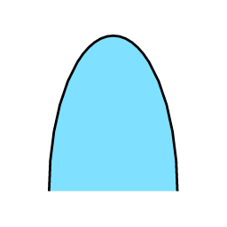||SFAP-----------|WAR.AIRTRK|Air Track|POINT|A||
|2||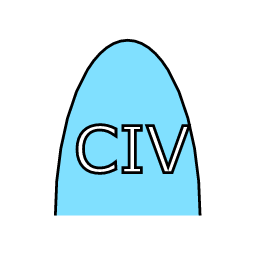||SFAPC----------|WAR.AIRTRK.CVL|Civil Aircraft|POINT|A||
|3||||SFAPCF---------|WAR.AIRTRK.CVL.FIXD|Fixed Wing|POINT|A||
|4||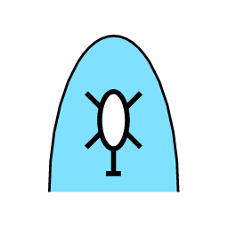|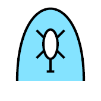|SFAPCH---------|WAR.AIRTRK.CVL.ROT|Rotary Wing|POINT|A||
|5||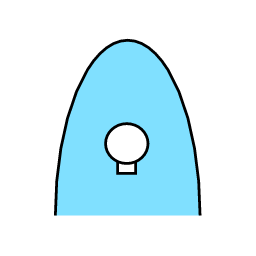||SFAPCL---------|WAR.AIRTRK.CVL.LTA|Lighter Than Air|POINT|A||
|6||||SFAPM----------|WAR.AIRTRK.MIL|Military|POINT|A||
|7|||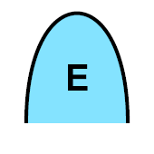|SFAPME---------|WAR.AIRTRK.MIL.ESCORT|Escort|POINT|A||
|8||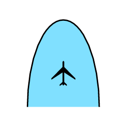||SFAPMF---------|WAR.AIRTRK.MIL.FIXD|Fixed Wing|POINT|A||
|9||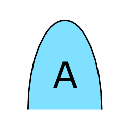|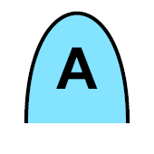|SFAPMFA--------|WAR.AIRTRK.MIL.FIXD.ATK|Attack/Strike|POINT|A||
|10||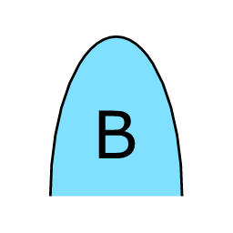||SFAPMFB--------|WAR.AIRTRK.MIL.FIXD.BMB|Bomber|POINT|A||
|11||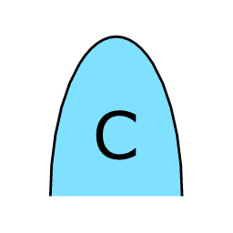||SFAPMFC--------|WAR.AIRTRK.MIL.FIXD.CGOALT|Cargo Airlift (Transport)|POINT|A||
|12||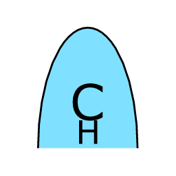|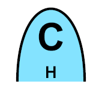|SFAPMFCH-------|WAR.AIRTRK.MIL.FIXD.CGOALT.HVY|Cargo Airlift (Heavy)|POINT|A||
|13||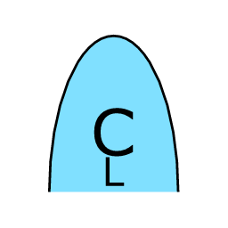||SFAPMFCL-------|WAR.AIRTRK.MIL.FIXD.CGOALT.LIT|Cargo Airlift (Light)|POINT|A||
|14||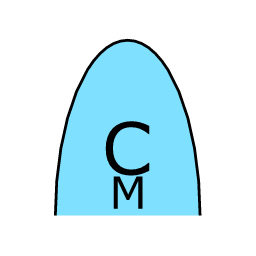|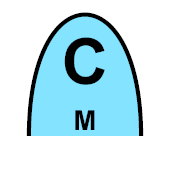|SFAPMFCM-------|WAR.AIRTRK.MIL.FIXD.CGOALT.MDM|Cargo Airlift (Medium)|POINT|A||
|15||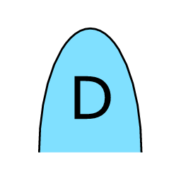||SFAPMFD--------|WAR.AIRTRK.MIL.FIXD.ABNCP|Airborne Command Post (C2)|POINT|A||
|16||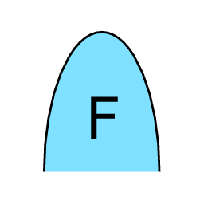||SFAPMFF--------|WAR.AIRTRK.MIL.FIXD.FTR|Fighter|POINT|A||
|17||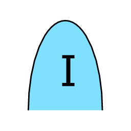|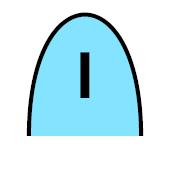|SFAPMFFI-------|WAR.AIRTRK.MIL.FIXD.FTR.INCR|Interceptor|POINT|A||
|18||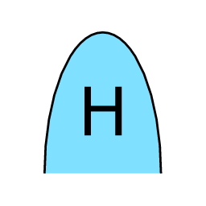||SFAPMFH--------|WAR.AIRTRK.MIL.FIXD.CSAR|Combat Search And Rescue (Csar)|POINT|A||
|19||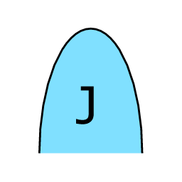||SFAPMFJ--------|WAR.AIRTRK.MIL.FIXD.ECM|Electronic Countermeasures (Ecm/Jammer)|POINT|A||
|20||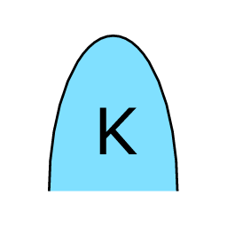||SFAPMFK--------|WAR.AIRTRK.MIL.FIXD.TNK|Tanker|POINT|A||
|21||||SFAPMFKB-------|WAR.AIRTRK.MIL.FIXD.TNK.BOOM|Tanker Boom-Only|POINT|A||
|22||||SFAPMFKD-------|WAR.AIRTRK.MIL.FIXD.TNK.DROG|Tanker Drogue-Only|POINT|A||
|23||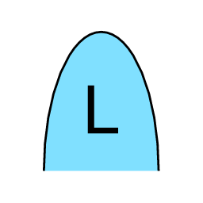|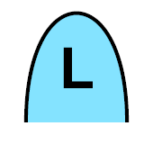|SFAPMFL--------|WAR.AIRTRK.MIL.FIXD.VSTOL|V/Stol|POINT|A||
|24||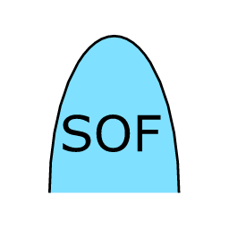|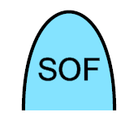|SFAPMFM--------|WAR.AIRTRK.MIL.FIXD.SOF|Special Operations Forces (Sof)|POINT|A||
|25||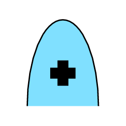|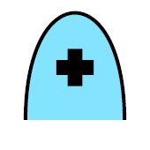|SFAPMFO--------|WAR.AIRTRK.MIL.FIXD.MEDV|Medical Evacuation (Medevac)|POINT|A||
|26||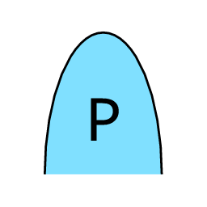||SFAPMFP--------|WAR.AIRTRK.MIL.FIXD.PAT|Patrol|POINT|A||
|27||||SFAPMFPM-------|WAR.AIRTRK.MIL.FIXD.PAT.MNECM|Mine Countermeasures|POINT|A||
|28||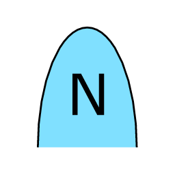||SFAPMFPN-------|WAR.AIRTRK.MIL.FIXD.PAT.ASUW|Antisurface Warfare (Asuw)|POINT|A||
|29||||SFAPMFQ--------|WAR.AIRTRK.MIL.FIXD.DRN|Drone (Rpv/Ua)|POINT|A||
|30||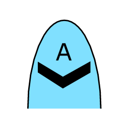||SFAPMFQA-------|WAR.AIRTRK.MIL.FIXD.DRN.ATK|Attack|POINT|A||
|31||||SFAPMFQB-------|WAR.AIRTRK.MIL.FIXD.DRN.BMB|Bomber|POINT|A||
|32||||SFAPMFQC-------|WAR.AIRTRK.MIL.FIXD.DRN.CGO|Cargo|POINT|A||
|33||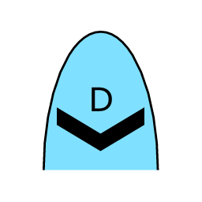||SFAPMFQD-------|WAR.AIRTRK.MIL.FIXD.DRN.ABNCP|Airborne Command Post|POINT|A||
|34||||SFAPMFQF-------|WAR.AIRTRK.MIL.FIXD.DRN.FTR|Fighter|POINT|A||
|35||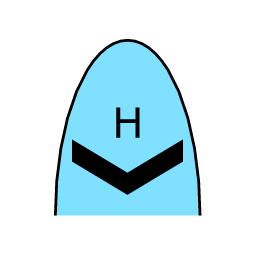|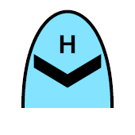|SFAPMFQH-------|WAR.AIRTRK.MIL.FIXD.DRN.CSAR|Search & Rescue (Csar)|POINT|A||
|36||||SFAPMFQI-------|WAR.AIRTRK.MIL.FIXD.DRN.MNECM|Mine Countermeasures|POINT|A||
|37||||SFAPMFQJ-------|WAR.AIRTRK.MIL.FIXD.DRN.ECM|Electronic Countermeasures (Jammer)|POINT|A||
|38||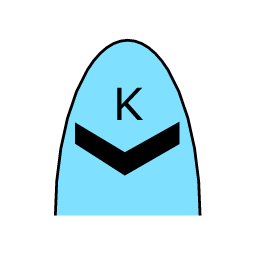||SFAPMFQK-------|WAR.AIRTRK.MIL.FIXD.DRN.TNK|Tanker|POINT|A||
|39||||SFAPMFQL-------|WAR.AIRTRK.MIL.FIXD.DRN.VSTOL|V/Stol|POINT|A||
|40||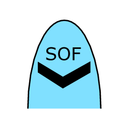|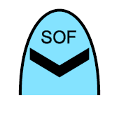|SFAPMFQM-------|WAR.AIRTRK.MIL.FIXD.DRN.SOF|Special Operations Forces (Sof)|POINT|A||
|41||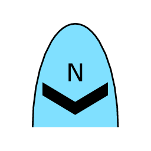|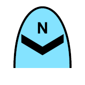|SFAPMFQN-------|WAR.AIRTRK.MIL.FIXD.DRN.ASUW|Antisurface Warfare (Asuw)|POINT|A||
|42||||SFAPMFQO-------|WAR.AIRTRK.MIL.FIXD.DRN.MEDV|Medevac|POINT|A||
|43||||SFAPMFQP-------|WAR.AIRTRK.MIL.FIXD.DRN.PAT|Patrol|POINT|A||
|44||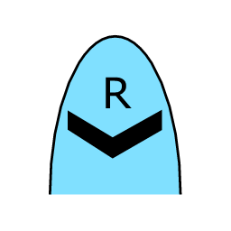||SFAPMFQR-------|WAR.AIRTRK.MIL.FIXD.DRN.RECON|Reconnaissance|POINT|A||
|45||||SFAPMFQRW------|WAR.AIRTRK.MIL.FIXD.DRN.RECON.ABNEW|Airborne Early Warning (Aew)|POINT|A||
|46||||SFAPMFQRX------|WAR.AIRTRK.MIL.FIXD.DRN.RECON.PHG|Photographic|POINT|A||
|47||||SFAPMFQRZ------|WAR.AIRTRK.MIL.FIXD.DRN.RECON.ESM|Electronic Surveillance Measures|POINT|A||
|48||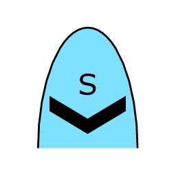||SFAPMFQS-------|WAR.AIRTRK.MIL.FIXD.DRN.ASBW|Antisubmarine Warfare (Asw)|POINT|A||
|49||||SFAPMFQT-------|WAR.AIRTRK.MIL.FIXD.DRN.TNE|Trainer|POINT|A||
|50||||SFAPMFQU-------|WAR.AIRTRK.MIL.FIXD.DRN.UTY|Utility|POINT|A||
|51||||SFAPMFQY-------|WAR.AIRTRK.MIL.FIXD.DRN.COMM|Communications|POINT|A||
|52||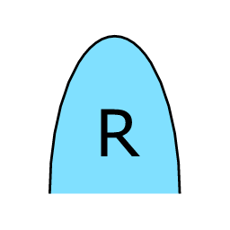||SFAPMFR--------|WAR.AIRTRK.MIL.FIXD.RECON|Reconnaissance|POINT|A||
|53||||SFAPMFRW-------|WAR.AIRTRK.MIL.FIXD.RECON.ABNEW|Airborne Early Warning (Aew)|POINT|A||
|54||||SFAPMFRX-------|WAR.AIRTRK.MIL.FIXD.RECON.PHG|Photographic|POINT|A||
|55||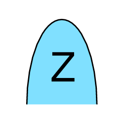||SFAPMFRZ-------|WAR.AIRTRK.MIL.FIXD.RECON.ESM|Electronic Surveillance Measures|POINT|A||
|56||||SFAPMFS--------|WAR.AIRTRK.MIL.FIXD.ASBWCB|Antisubmarine Warfare (Asw) Carrier Based|POINT|A||
|57||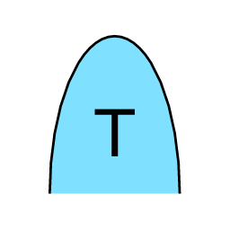||SFAPMFT--------|WAR.AIRTRK.MIL.FIXD.TNE|Trainer|POINT|A||
|58||||SFAPMFU--------|WAR.AIRTRK.MIL.FIXD.UTY|Utility|POINT|A||
|59||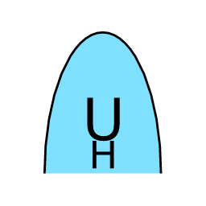||SFAPMFUH-------|WAR.AIRTRK.MIL.FIXD.UTY.HVY|Utility (Heavy)|POINT|A||
|60||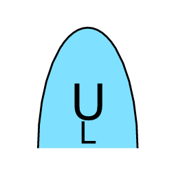||SFAPMFUL-------|WAR.AIRTRK.MIL.FIXD.UTY.LIT|Utility (Light)|POINT|A||
|61||||SFAPMFUM-------|WAR.AIRTRK.MIL.FIXD.UTY.MDM|Utility (Medium)|POINT|A||
|62||||SFAPMFY--------|WAR.AIRTRK.MIL.FIXD.COMM|Communications|POINT|A||
|63||||SFAPMH---------|WAR.AIRTRK.MIL.ROT|Rotary Wing|POINT|A||
|64||||SFAPMHA--------|WAR.AIRTRK.MIL.ROT.ATK|Attack|POINT|A||
|65||||SFAPMHC--------|WAR.AIRTRK.MIL.ROT.CGOALT|Cargo Airlift (Transport)|POINT|A||
|66||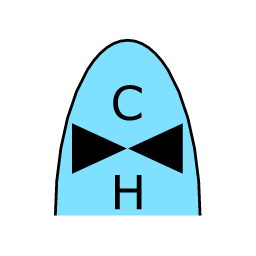||SFAPMHCH-------|WAR.AIRTRK.MIL.ROT.CGOALT.HVY|Cargo Airlift (Heavy)|POINT|A||
|67||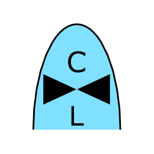|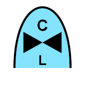|SFAPMHCL-------|WAR.AIRTRK.MIL.ROT.CGOALT.LIT|Cargo Airlift (Light)|POINT|A||
|68||||SFAPMHCM-------|WAR.AIRTRK.MIL.ROT.CGOALT.MDM|Cargo Airlift (Medium)|POINT|A||
|69||||SFAPMHD--------|WAR.AIRTRK.MIL.ROT.ABNCP|Airborne Command Post (C2)|POINT|A||
|70||||SFAPMHH--------|WAR.AIRTRK.MIL.ROT.CSAR|Combat Search And Rescue (Csar)|POINT|A||
|71||||SFAPMHI--------|WAR.AIRTRK.MIL.ROT.MNECM|Mine Countermeasures|POINT|A||
|72||||SFAPMHJ--------|WAR.AIRTRK.MIL.ROT.ECM|Electronic Countermeasures (Ecm/Jammer)|POINT|A||
|73||||SFAPMHK--------|WAR.AIRTRK.MIL.ROT.TNK|Tanker|POINT|A||
|74||||SFAPMHM--------|WAR.AIRTRK.MIL.ROT.SOF|Special Operations Forces (Sof)|POINT|A||
|75||||SFAPMHO--------|WAR.AIRTRK.MIL.ROT.MEDV|Medevac|POINT|A||
|76||||SFAPMHQ--------|WAR.AIRTRK.MIL.ROT.DRN|Drone (Rpv/Ua)|POINT|A||
|77||||SFAPMHR--------|WAR.AIRTRK.MIL.ROT.RECON|Reconnaissance|POINT|A||
|78||||SFAPMHS--------|WAR.AIRTRK.MIL.ROT.ASBW|Antisubmarine Warfare/Mpa|POINT|A||
|79||||SFAPMHT--------|WAR.AIRTRK.MIL.ROT.TNE|Trainer|POINT|A||
|80||||SFAPMHU--------|WAR.AIRTRK.MIL.ROT.UTY|Utility|POINT|A||
|81||||SFAPMHUH-------|WAR.AIRTRK.MIL.ROT.UTY.HVY|Utility (Heavy)|POINT|A||
|82||||SFAPMHUL-------|WAR.AIRTRK.MIL.ROT.UTY.LIT|Utility (Light)|POINT|A||
|83||||SFAPMHUM-------|WAR.AIRTRK.MIL.ROT.UTY.MDM|Utility (Medium)|POINT|A||
|84||||SFAPML---------|WAR.AIRTRK.MIL.LTA|Lighter Than Air|POINT|A||
|85||||SFAPMV---------|WAR.AIRTRK.MIL.VIP|Very Important Person (Vip)|POINT|A||
|86||||SFAPW----------|WAR.AIRTRK.WPN|Weapon|POINT|A||
|87||||SFAPWB---------|WAR.AIRTRK.WPN.BM|Bomb|POINT|A||
|88||||SFAPWD---------|WAR.AIRTRK.WPN.DCY|Decoy|POINT|A||
|89||||SFAPWM---------|WAR.AIRTRK.WPN.MSLIF|Missile In Flight|POINT|A||
|90||||SFAPWMA--------|WAR.AIRTRK.WPN.MSLIF.ALM|Air Launched Missile|POINT|A||
|91||||SFAPWMAA-------|WAR.AIRTRK.WPN.MSLIF.ALM.AAM|Air-To-Air Missile (Aam)|POINT|A||
|92||||SFAPWMAP-------|WAR.AIRTRK.WPN.MSLIF.ALM.ASPC|Air-To-Space Missile|POINT|A||
|93||||SFAPWMAS-------|WAR.AIRTRK.WPN.MSLIF.ALM.ASM|Air-To-Surface Missile (Asm)|POINT|A||
|94||||SFAPWMB--------|WAR.AIRTRK.WPN.MSLIF.BLST|Ballistic Missile|POINT|A||
|95||||SFAPWMCM-------|WAR.AIRTRK.WPN.MSLIF.CM|Cruise Missile|POINT|A||
|96||||SFAPWMS--------|WAR.AIRTRK.WPN.MSLIF.SLM|Surface Launched Missile|POINT|A||
|97||||SFAPWMSA-------|WAR.AIRTRK.WPN.MSLIF.SLM.SAM|Surface-To-Air Missile (Sam)|POINT|A||
|98||||SFAPWMSB-------|WAR.AIRTRK.WPN.MSLIF.SLM.ABM|Antiballistic Missile (Abm)|POINT|A||
|99||||SFAPWMSS-------|WAR.AIRTRK.WPN.MSLIF.SLM.SSM|Surface-To-Surface Missile (Ssm)|POINT|A||
|100||||SFAPWMSU-------|WAR.AIRTRK.WPN.MSLIF.SLM.SSUM|Surface-To-Subsurface Missile|POINT|A||
|101||||SFAPWMU--------|WAR.AIRTRK.WPN.MSLIF.SBSM|Subsurface-To-Surface Missile (S/Ssm)|POINT|A||
|102||||SFFP-----------|WAR.SOFUNT|Special Operations Forces (Sof) Unit|POINT|A||
|103||||SFFPA----------|WAR.SOFUNT.AVN|Sof Unit Aviation|POINT|A||
|104||||SFFPAF---------|WAR.SOFUNT.AVN.FIXD|Sof Unit Fixed Wing|POINT|A||
|105||||SFFPAFA--------|WAR.SOFUNT.AVN.FIXD.ATK|Sof Unit Attack|POINT|A||
|106||||SFFPAFK--------|WAR.SOFUNT.AVN.FIXD.RFE|Sof Unit Refuel|POINT|A||
|107||||SFFPAFU--------|WAR.SOFUNT.AVN.FIXD.UTY|Sof Unit Utility|POINT|A||
|108||||SFFPAFUH-------|WAR.SOFUNT.AVN.FIXD.UTY.HVY|Sof Unit Utility (Heavy)|POINT|A||
|109||||SFFPAFUL-------|WAR.SOFUNT.AVN.FIXD.UTY.LIT|Sof Unit Utility (Light)|POINT|A||
|110||||SFFPAFUM-------|WAR.SOFUNT.AVN.FIXD.UTY.MDM|Sof Unit Utility (Medium)|POINT|A||
|111||||SFFPAH---------|WAR.SOFUNT.AVN.ROT|Sof Unit Rotary Wing|POINT|A||
|112||||SFFPAHA--------|WAR.SOFUNT.AVN.ROT.ATK|Sof Unit Attack|POINT|A||
|113||||SFFPAHH--------|WAR.SOFUNT.AVN.ROT.CSAR|Sof Unit Combat Search And Rescue|POINT|A||
|114||||SFFPAHU--------|WAR.SOFUNT.AVN.ROT.UTY|Sof Unit Utility|POINT|A||
|115||||SFFPAHUH-------|WAR.SOFUNT.AVN.ROT.UTY.HVY|Sof Unit Utility (Heavy)|POINT|A||
|116||||SFFPAHUL-------|WAR.SOFUNT.AVN.ROT.UTY.LIT|Sof Unit Utility (Light)|POINT|A||
|117||||SFFPAHUM-------|WAR.SOFUNT.AVN.ROT.UTY.MDM|Sof Unit Utility (Medium)|POINT|A||
|118||||SFFPAV---------|WAR.SOFUNT.AVN.VSTOL|Sof Unit V/Stol|POINT|A||
|119||||SFFPB----------|WAR.SOFUNT.SUP|Sof Unit Support|POINT|A||
|120||||SFFPG----------|WAR.SOFUNT.GRD|Sof Unit Ground|POINT|A||
|121||||SFFPGC---------|WAR.SOFUNT.GRD.CVLAFF|Sof Unit Civil Affairs|POINT|A||
|122|YES|||SFFPGP---------|WAR.SOFUNT.GRD.PSYOP|Sof Unit Psychological Operations (Psyop)|POINT|A||
|123||||SFFPGPA--------|WAR.SOFUNT.GRD.PSYOP.FIXAVN|Sof Unit Fixed Wing Aviation|POINT|A||
|124|YES|||SFFPGR---------|WAR.SOFUNT.GRD.RGR|Sof Unit Ranger|POINT|A||
|125||||SFFPGS---------|WAR.SOFUNT.GRD.SOF|Sof Unit Special Forces|POINT|A||
|126||||SFFPN----------|WAR.SOFUNT.NAV|Sof Unit Sof Unit Naval|POINT|A||
|127||||SFFPNB---------|WAR.SOFUNT.NAV.SBT|Sof Unit Special Boat|POINT|A||
|128||||SFFPNN---------|WAR.SOFUNT.NAV.SSSNR|Sof Unit Special Ssnr|POINT|A||
|129||||SFFPNS---------|WAR.SOFUNT.NAV.SEAL|Sof Unit Seal|POINT|A||
|130||||SFFPNU---------|WAR.SOFUNT.NAV.UH2DML|Sof Unit Underwater Demolition Team|POINT|A||
|131||||SFGP-----------|WAR.GRDTRK|Ground Track|POINT|A||
|132||||SFGPE----------|WAR.GRDTRK.EQT|Ground Track Equipment|POINT|A||
|133||||SFGPES---------|WAR.GRDTRK.EQT.SNS|Sensor|POINT|A||
|134||||SFGPESE--------|WAR.GRDTRK.EQT.SNS.EMP|Emplaced Sensor|POINT|A||
|135||||SFGPESR--------|WAR.GRDTRK.EQT.SNS.RAD|Radar|POINT|A||
|136||||SFGPEV---------|WAR.GRDTRK.EQT.GRDVEH|Ground Vehicle|POINT|A||
|137||||SFGPEVA--------|WAR.GRDTRK.EQT.GRDVEH.ARMD|Armored Vehicle|POINT|A||
|138||||SFGPEVAA-------|WAR.GRDTRK.EQT.GRDVEH.ARMD.ARMPC|Armored Personnel Carrier|POINT|A||
|139||||SFGPEVAAR------|WAR.GRDTRK.EQT.GRDVEH.ARMD.ARMPC.RCY|Armored Personnel Carrier Recovery|POINT|A||
|140||||SFGPEVAC-------|WAR.GRDTRK.EQT.GRDVEH.ARMD.C2V|C2V/Acv|POINT|A||
|141||||SFGPEVAI-------|WAR.GRDTRK.EQT.GRDVEH.ARMD.ARMINF|Armored Infantry|POINT|A||
|142||||SFGPEVAL-------|WAR.GRDTRK.EQT.GRDVEH.ARMD.LARMVH|Light Armored Vehicle|POINT|A||
|143||||SFGPEVAS-------|WAR.GRDTRK.EQT.GRDVEH.ARMD.CSSVEH|Combat Service Support Vehicle|POINT|A||
|144||||SFGPEVAT-------|WAR.GRDTRK.EQT.GRDVEH.ARMD.TANK|Tank|POINT|A||
|145||||SFGPEVATH------|WAR.GRDTRK.EQT.GRDVEH.ARMD.TANK.HVY|Tank Heavy|POINT|A||
|146||||SFGPEVATHR-----|WAR.GRDTRK.EQT.GRDVEH.ARMD.TANK.HVY.RCY|Tank Heavy Recovery|POINT|A||
|147||||SFGPEVATL------|WAR.GRDTRK.EQT.GRDVEH.ARMD.TANK.LIT|Tank Light|POINT|A||
|148||||SFGPEVATLR-----|WAR.GRDTRK.EQT.GRDVEH.ARMD.TANK.LIT.RCY|Tank Light Recovery|POINT|A||
|149||||SFGPEVATM------|WAR.GRDTRK.EQT.GRDVEH.ARMD.TANK.MDM|Tank Medium|POINT|A||
|150||||SFGPEVATMR-----|WAR.GRDTRK.EQT.GRDVEH.ARMD.TANK.MDM.RCY|Tank Medium Recovery|POINT|A||
|151||||SFGPEVC--------|WAR.GRDTRK.EQT.GRDVEH.CVLVEH|Civilian Vehicle|POINT|A||
|152||||SFGPEVCA-------|WAR.GRDTRK.EQT.GRDVEH.CVLVEH.AUT|Automobile|POINT|A||
|153||||SFGPEVCAH------|WAR.GRDTRK.EQT.GRDVEH.CVLVEH.AUT.SDN|Sedan Automobile|POINT|A||
|154||||SFGPEVCAL------|WAR.GRDTRK.EQT.GRDVEH.CVLVEH.AUT.CPCT|Compact Automobile|POINT|A||
|155||||SFGPEVCAM------|WAR.GRDTRK.EQT.GRDVEH.CVLVEH.AUT.MDSZ|Midsize Automobile|POINT|A||
|156||||SFGPEVCF-------|WAR.GRDTRK.EQT.GRDVEH.CVLVEH.TRTRLF|Tractor Trailer Truck With Flatbed Trailer|POINT|A||
|157||||SFGPEVCFH------|WAR.GRDTRK.EQT.GRDVEH.CVLVEH.TRTRLF.LRG|Large/Heavy Flatbed Trailer Tractor Trailer Truck|POINT|A||
|158||||SFGPEVCFL------|WAR.GRDTRK.EQT.GRDVEH.CVLVEH.TRTRLF.SMAL|Small/Light Flatbed Trailer Tractor Trailer Truck|POINT|A||
|159||||SFGPEVCFM------|WAR.GRDTRK.EQT.GRDVEH.CVLVEH.TRTRLF.MDM|Medium Flatbed Trailer Tractor Trailer Truck|POINT|A||
|160||||SFGPEVCJ-------|WAR.GRDTRK.EQT.GRDVEH.CVLVEH.JP|Jeep Type Vehicle|POINT|A||
|161||||SFGPEVCJH------|WAR.GRDTRK.EQT.GRDVEH.CVLVEH.JP.LRG|Large/Heavy Jeep Type Vehicle|POINT|A||
|162||||SFGPEVCJL------|WAR.GRDTRK.EQT.GRDVEH.CVLVEH.JP.SMAL|Small/Light Jeep Type Vehicle|POINT|A||
|163||||SFGPEVCJM------|WAR.GRDTRK.EQT.GRDVEH.CVLVEH.JP.MDM|Medium Jeep Type Vehicle|POINT|A||
|164||||SFGPEVCM-------|WAR.GRDTRK.EQT.GRDVEH.CVLVEH.MPV|Multiple Passenger Vehicle|POINT|A||
|165||||SFGPEVCMH------|WAR.GRDTRK.EQT.GRDVEH.CVLVEH.MPV.LBUS|Large Bus Multiple Passenger Vehicle|POINT|A||
|166||||SFGPEVCML------|WAR.GRDTRK.EQT.GRDVEH.CVLVEH.MPV.VAN|Van Multiple Passenger Vehicle|POINT|A||
|167||||SFGPEVCMM------|WAR.GRDTRK.EQT.GRDVEH.CVLVEH.MPV.SBUS|Small Bus Multiple Passenger Vehicle|POINT|A||
|168||||SFGPEVCO-------|WAR.GRDTRK.EQT.GRDVEH.CVLVEH.OBTRK|Open-Bed Truck|POINT|A||
|169||||SFGPEVCOH------|WAR.GRDTRK.EQT.GRDVEH.CVLVEH.OBTRK.LRG|Large Open-Bed Truck|POINT|A||
|170||||SFGPEVCOL------|WAR.GRDTRK.EQT.GRDVEH.CVLVEH.OBTRK.PU|Pickup Open-Bed Truck|POINT|A||
|171||||SFGPEVCOM------|WAR.GRDTRK.EQT.GRDVEH.CVLVEH.OBTRK.SMAL|Small Open-Bed Truck|POINT|A||
|172||||SFGPEVCT-------|WAR.GRDTRK.EQT.GRDVEH.CVLVEH.TRTRL|Tractor Trailer Truck With Box Trailer|POINT|A||
|173||||SFGPEVCTH------|WAR.GRDTRK.EQT.GRDVEH.CVLVEH.TRTRL.LRG|Large/Heavy Box Trailer Tractor Trailer Truck|POINT|A||
|174||||SFGPEVCTL------|WAR.GRDTRK.EQT.GRDVEH.CVLVEH.TRTRL.SMAL|Small/Light Box Trailer Tractor Trailer Truck|POINT|A||
|175||||SFGPEVCTM------|WAR.GRDTRK.EQT.GRDVEH.CVLVEH.TRTRL.MDM|Medium Box Trailer Tractor Trailer Truck|POINT|A||
|176||||SFGPEVCU-------|WAR.GRDTRK.EQT.GRDVEH.CVLVEH.UTYVEH|Utility Vehicle|POINT|A||
|177||||SFGPEVCUH------|WAR.GRDTRK.EQT.GRDVEH.CVLVEH.UTYVEH.LBOX|Large Box Truck Utility Vehicle|POINT|A||
|178||||SFGPEVCUL------|WAR.GRDTRK.EQT.GRDVEH.CVLVEH.UTYVEH.SUV|Sport Utility Vehicle (Suv) Utility Vehicle|POINT|A||
|179||||SFGPEVCUM------|WAR.GRDTRK.EQT.GRDVEH.CVLVEH.UTYVEH.SBOX|Small Box Truck Utility Vehicle|POINT|A||
|180||||SFGPEVE--------|WAR.GRDTRK.EQT.GRDVEH.ENGVEH|Engineer Vehicle|POINT|A||
|181||||SFGPEVEA-------|WAR.GRDTRK.EQT.GRDVEH.ENGVEH.MCVEH|Mine Clearing Vehicle|POINT|A||
|182||||SFGPEVEAA------|WAR.GRDTRK.EQT.GRDVEH.ENGVEH.MCVEH.ARMVM|Armored Mounted Mine Clearing Vehicle|POINT|A||
|183||||SFGPEVEAT------|WAR.GRDTRK.EQT.GRDVEH.ENGVEH.MCVEH.TM|Trailer Mounted Mine Clearing Vehicle|POINT|A||
|184||||SFGPEVEB-------|WAR.GRDTRK.EQT.GRDVEH.ENGVEH.BRG|Bridge|POINT|A||
|185||||SFGPEVEC-------|WAR.GRDTRK.EQT.GRDVEH.ENGVEH.CSNVEH|Construction Vehicle|POINT|A||
|186||||SFGPEVED-------|WAR.GRDTRK.EQT.GRDVEH.ENGVEH.DZR|Dozer|POINT|A||
|187||||SFGPEVEDA------|WAR.GRDTRK.EQT.GRDVEH.ENGVEH.DZR.ARMD|Armored Dozer|POINT|A||
|188||||SFGPEVEE-------|WAR.GRDTRK.EQT.GRDVEH.ENGVEH.ERHMR|Earthmover|POINT|A||
|189||||SFGPEVEF-------|WAR.GRDTRK.EQT.GRDVEH.ENGVEH.FRYTSP|Ferry Transporter|POINT|A||
|190||||SFGPEVEH-------|WAR.GRDTRK.EQT.GRDVEH.ENGVEH.BH|Backhoe|POINT|A||
|191||||SFGPEVEM-------|WAR.GRDTRK.EQT.GRDVEH.ENGVEH.MLVEH|Mine Laying Vehicle|POINT|A||
|192||||SFGPEVEML------|WAR.GRDTRK.EQT.GRDVEH.ENGVEH.MLVEH.TRKMV|Truck Mounted With Volcano|POINT|A||
|193||||SFGPEVEMV------|WAR.GRDTRK.EQT.GRDVEH.ENGVEH.MLVEH.ARMCV|Armored Carrier With Volcano|POINT|A||
|194||||SFGPEVER-------|WAR.GRDTRK.EQT.GRDVEH.ENGVEH.ARMERV|Armored Engineer Recon Vehicle (Aerv)|POINT|A||
|195||||SFGPEVES-------|WAR.GRDTRK.EQT.GRDVEH.ENGVEH.AST|Armored Assault|POINT|A||
|196||||SFGPEVM--------|WAR.GRDTRK.EQT.GRDVEH.PKAN|Pack Animal(S)|POINT|A||
|197||||SFGPEVS--------|WAR.GRDTRK.EQT.GRDVEH.MSLSPT|Missile Support Vehicle|POINT|A||
|198||||SFGPEVSC-------|WAR.GRDTRK.EQT.GRDVEH.MSLSPT.CRN|Missile Support Vehicle Crane/Loading Device|POINT|A||
|199||||SFGPEVSP-------|WAR.GRDTRK.EQT.GRDVEH.MSLSPT.PLNT|Missile Support Vehicle Propellant Transporter|POINT|A||
|200||||SFGPEVSR-------|WAR.GRDTRK.EQT.GRDVEH.MSLSPT.TPTR|Missile Support Vehicle Transporter|POINT|A||
|201||||SFGPEVST-------|WAR.GRDTRK.EQT.GRDVEH.MSLSPT.TLDR|Missile Support Vehicle Transloader|POINT|A||
|202||||SFGPEVSW-------|WAR.GRDTRK.EQT.GRDVEH.MSLSPT.WH|Missile Support Vehicle Warhead Transporter|POINT|A||
|203||||SFGPEVT--------|WAR.GRDTRK.EQT.GRDVEH.TRNLCO|Train Locomotive|POINT|A||
|204||||SFGPEVU--------|WAR.GRDTRK.EQT.GRDVEH.UTYVEH|Utility Vehicle|POINT|A||
|205||||SFGPEVUA-------|WAR.GRDTRK.EQT.GRDVEH.UTYVEH.AMBLNC|Ambulance|POINT|A||
|206||||SFGPEVUAA------|WAR.GRDTRK.EQT.GRDVEH.UTYVEH.AMBLNC.ARMD|Armored Ambulance|POINT|A||
|207||||SFGPEVUB-------|WAR.GRDTRK.EQT.GRDVEH.UTYVEH.BUS|Bus|POINT|A||
|208||||SFGPEVUL-------|WAR.GRDTRK.EQT.GRDVEH.UTYVEH.LCCTRK|Limited Cross-Country Truck|POINT|A||
|209||||SFGPEVUR-------|WAR.GRDTRK.EQT.GRDVEH.UTYVEH.H2OCRT|Water Craft|POINT|A||
|210||||SFGPEVUS-------|WAR.GRDTRK.EQT.GRDVEH.UTYVEH.SEMI|Semi|POINT|A||
|211||||SFGPEVUSH------|WAR.GRDTRK.EQT.GRDVEH.UTYVEH.SEMI.HVY|Semi Heavy|POINT|A||
|212||||SFGPEVUSL------|WAR.GRDTRK.EQT.GRDVEH.UTYVEH.SEMI.LIT|Semi Light|POINT|A||
|213||||SFGPEVUSM------|WAR.GRDTRK.EQT.GRDVEH.UTYVEH.SEMI.MDM|Semi Medium|POINT|A||
|214||||SFGPEVUT-------|WAR.GRDTRK.EQT.GRDVEH.UTYVEH.TOWTRK|Tow Truck|POINT|A||
|215||||SFGPEVUTH------|WAR.GRDTRK.EQT.GRDVEH.UTYVEH.TOWTRK.HVY|Tow Truck Heavy|POINT|A||
|216||||SFGPEVUTL------|WAR.GRDTRK.EQT.GRDVEH.UTYVEH.TOWTRK.LIT|Tow Truck Light|POINT|A||
|217||||SFGPEVUX-------|WAR.GRDTRK.EQT.GRDVEH.UTYVEH.CCTRK|Cross-Country Truck|POINT|A||
|218||||SFGPEWA--------|WAR.GRDTRK.EQT.WPN.ADFG|Air Defense Gun|POINT|A||
|219||||SFGPEWAH-------|WAR.GRDTRK.EQT.WPN.ADFG.HVY|Air Defense Gun Heavy|POINT|A||
|220||||SFGPEWAL-------|WAR.GRDTRK.EQT.WPN.ADFG.LIT|Air Defense Gun Light|POINT|A||
|221||||SFGPEWAM-------|WAR.GRDTRK.EQT.WPN.ADFG.MDM|Air Defense Gun Medium|POINT|A||
|222||||SFGPEWD--------|WAR.GRDTRK.EQT.WPN.DFG|Direct Fire Gun|POINT|A||
|223||||SFGPEWDH-------|WAR.GRDTRK.EQT.WPN.DFG.HVY|Direct Fire Gun Heavy|POINT|A||
|224||||SFGPEWDHS------|WAR.GRDTRK.EQT.WPN.DFG.HVY.SPD|Direct Fire Gun Heavy Self-Propelled|POINT|A||
|225||||SFGPEWDL-------|WAR.GRDTRK.EQT.WPN.DFG.LIT|Direct Fire Gun Light|POINT|A||
|226||||SFGPEWDLS------|WAR.GRDTRK.EQT.WPN.DFG.LIT.SPD|Direct Fire Gun Light Self-Propelled|POINT|A||
|227||||SFGPEWDM-------|WAR.GRDTRK.EQT.WPN.DFG.MDM|Direct Fire Gun Medium|POINT|A||
|228||||SFGPEWDMS------|WAR.GRDTRK.EQT.WPN.DFG.MDM.SPD|Direct Fire Gun Medium Self-Propelled|POINT|A||
|229||||SFGPEWG--------|WAR.GRDTRK.EQT.WPN.ATG|Antitank Gun|POINT|A||
|230||||SFGPEWGH-------|WAR.GRDTRK.EQT.WPN.ATG.HVY|Antitank Gun Heavy|POINT|A||
|231||||SFGPEWGL-------|WAR.GRDTRK.EQT.WPN.ATG.LIT|Antitank Gun Light|POINT|A||
|232||||SFGPEWGM-------|WAR.GRDTRK.EQT.WPN.ATG.MDM|Antitank Gun Medium|POINT|A||
|233||||SFGPEWGR-------|WAR.GRDTRK.EQT.WPN.ATG.RECL|Antitank Gun Recoilless|POINT|A||
|234||||SFGPEWH--------|WAR.GRDTRK.EQT.WPN.HOW|Howitzer|POINT|A||
|235||||SFGPEWHH-------|WAR.GRDTRK.EQT.WPN.HOW.HVY|Howitzer Heavy|POINT|A||
|236||||SFGPEWHHS------|WAR.GRDTRK.EQT.WPN.HOW.HVY.SPD|Howitzer Heavy Self-Propelled|POINT|A||
|237||||SFGPEWHL-------|WAR.GRDTRK.EQT.WPN.HOW.LIT|Howitzer Light|POINT|A||
|238||||SFGPEWHLS------|WAR.GRDTRK.EQT.WPN.HOW.LIT.SPD|Howitzer Light Self-Propelled|POINT|A||
|239||||SFGPEWHM-------|WAR.GRDTRK.EQT.WPN.HOW.MDM|Howitzer Medium|POINT|A||
|240||||SFGPEWHMS------|WAR.GRDTRK.EQT.WPN.HOW.MDM.SPD|Howitzer Medium Self-Propelled|POINT|A||
|241||||SFGPEWM--------|WAR.GRDTRK.EQT.WPN.MSLL|Missile Launcher|POINT|A||
|242||||SFGPEWMA-------|WAR.GRDTRK.EQT.WPN.MSLL.ADFAD|Air Defense (Ad) Missile Launcher|POINT|A||
|243||||SFGPEWMAI------|WAR.GRDTRK.EQT.WPN.MSLL.ADFAD.INTMR|Intermediate Range Ad Missile Launcher|POINT|A||
|244||||SFGPEWMAIE-----|WAR.GRDTRK.EQT.WPN.MSLL.ADFAD.INTMR.TELAR|Transporter Erector Launcher And Radar (Telar)|POINT|A||
|245||||SFGPEWMAIR-----|WAR.GRDTRK.EQT.WPN.MSLL.ADFAD.INTMR.TLAR|Transporter Launcher And Radar (Tlar)|POINT|A||
|246||||SFGPEWMAL------|WAR.GRDTRK.EQT.WPN.MSLL.ADFAD.LNGR|Long Range Ad Missile Launcher|POINT|A||
|247||||SFGPEWMALE-----|WAR.GRDTRK.EQT.WPN.MSLL.ADFAD.LNGR.TELAR|Transporter Erector Launcher And Radar (Telar)|POINT|A||
|248||||SFGPEWMALR-----|WAR.GRDTRK.EQT.WPN.MSLL.ADFAD.LNGR.TLAR|Transporter Launcher And Radar (Tlar)|POINT|A||
|249||||SFGPEWMAS------|WAR.GRDTRK.EQT.WPN.MSLL.ADFAD.SHTR|Short Range Ad Missile Launcher|POINT|A||
|250||||SFGPEWMASE-----|WAR.GRDTRK.EQT.WPN.MSLL.ADFAD.SHTR.TELAR|Transporter Erector Launcher And Radar (Telar)|POINT|A||
|251||||SFGPEWMASR-----|WAR.GRDTRK.EQT.WPN.MSLL.ADFAD.SHTR.TLAR|Transporter Launcher And Radar (Tlar)|POINT|A||
|252||||SFGPEWMAT------|WAR.GRDTRK.EQT.WPN.MSLL.ADFAD.THT|Ad Missile Launcher Theater|POINT|A||
|253||||SFGPEWMATE-----|WAR.GRDTRK.EQT.WPN.MSLL.ADFAD.THT.TELAR|Transporter Erector Launcher And Radar (Telar)|POINT|A||
|254||||SFGPEWMATR-----|WAR.GRDTRK.EQT.WPN.MSLL.ADFAD.THT.TLAR|Transporter Launcher And Radar (Tlar)|POINT|A||
|255||||SFGPEWMS-------|WAR.GRDTRK.EQT.WPN.MSLL.SUF|Surf-Surf (Ss) Missile Launcher|POINT|A||
|256||||SFGPEWMSI------|WAR.GRDTRK.EQT.WPN.MSLL.SUF.INTMR|Intermediate Range Ss Missile Launcher|POINT|A||
|257||||SFGPEWMSL------|WAR.GRDTRK.EQT.WPN.MSLL.SUF.LNGR|Long Range Ss Missile Launcher|POINT|A||
|258||||SFGPEWMSS------|WAR.GRDTRK.EQT.WPN.MSLL.SUF.SHTR|Short Range Ss Missile Launcher|POINT|A||
|259||||SFGPEWMT-------|WAR.GRDTRK.EQT.WPN.MSLL.AT|Missile Launcher Antitank (At)|POINT|A||
|260||||SFGPEWMTH------|WAR.GRDTRK.EQT.WPN.MSLL.AT.HVY|Missile Launcher At Heavy|POINT|A||
|261||||SFGPEWMTL------|WAR.GRDTRK.EQT.WPN.MSLL.AT.LIT|Missile Launcher At Light|POINT|A||
|262||||SFGPEWMTM------|WAR.GRDTRK.EQT.WPN.MSLL.AT.MDM|Missile Launcher At Medium|POINT|A||
|263||||SFGPEWO--------|WAR.GRDTRK.EQT.WPN.MORT|Mortar|POINT|A||
|264||||SFGPEWOH-------|WAR.GRDTRK.EQT.WPN.MORT.HVY|Mortar Heavy|POINT|A||
|265||||SFGPEWOL-------|WAR.GRDTRK.EQT.WPN.MORT.LIT|Mortar Light|POINT|A||
|266||||SFGPEWOM-------|WAR.GRDTRK.EQT.WPN.MORT.MDM|Mortar Medium|POINT|A||
|267||||SFGPEWR--------|WAR.GRDTRK.EQT.WPN.RIFWPN|Rifle/Automatic Weapon|POINT|A||
|268||||SFGPEWRH-------|WAR.GRDTRK.EQT.WPN.RIFWPN.HMG|Heavy Machine Gun|POINT|A||
|269||||SFGPEWRL-------|WAR.GRDTRK.EQT.WPN.RIFWPN.LMG|Light Machine Gun|POINT|A||
|270||||SFGPEWRR-------|WAR.GRDTRK.EQT.WPN.RIFWPN.RIF|Rifle|POINT|A||
|271||||SFGPEWS--------|WAR.GRDTRK.EQT.WPN.SRL|Single Rocket Launcher|POINT|A||
|272||||SFGPEWSH-------|WAR.GRDTRK.EQT.WPN.SRL.HVY|Single Rocket Launcher Heavy|POINT|A||
|273||||SFGPEWSL-------|WAR.GRDTRK.EQT.WPN.SRL.LIT|Single Rocket Launcher Light|POINT|A||
|274||||SFGPEWSM-------|WAR.GRDTRK.EQT.WPN.SRL.MDM|Single Rocket Launcher Medium|POINT|A||
|275||||SFGPEWT--------|WAR.GRDTRK.EQT.WPN.ATRL|Antitank Rocket Launcher|POINT|A||
|276||||SFGPEWTH-------|WAR.GRDTRK.EQT.WPN.ATRL.HVY|Antitank Rocket Launcher Heavy|POINT|A||
|277||||SFGPEWTL-------|WAR.GRDTRK.EQT.WPN.ATRL.LIT|Antitank Rocket Launcher Light|POINT|A||
|278||||SFGPEWTM-------|WAR.GRDTRK.EQT.WPN.ATRL.MDM|Antitank Rocket Launcher Medium|POINT|A||
|279||||SFGPEWX--------|WAR.GRDTRK.EQT.WPN.MRL|Multiple Rocket Launcher|POINT|A||
|280||||SFGPEWXH-------|WAR.GRDTRK.EQT.WPN.MRL.HVY|Multiple Rocket Launcher Heavy|POINT|A||
|281||||SFGPEWXL-------|WAR.GRDTRK.EQT.WPN.MRL.LIT|Multiple Rocket Launcher Light|POINT|A||
|282||||SFGPEWXM-------|WAR.GRDTRK.EQT.WPN.MRL.MDM|Multiple Rocket Launcher Medium|POINT|A||
|283||||SFGPEWZ--------|WAR.GRDTRK.EQT.WPN.GREL|Grenade Launcher|POINT|A||
|284||||SFGPEWZH-------|WAR.GRDTRK.EQT.WPN.GREL.HVY|Grenade Launcher Heavy|POINT|A||
|285||||SFGPEWZL-------|WAR.GRDTRK.EQT.WPN.GREL.LIT|Grenade Launcher Light|POINT|A||
|286||||SFGPEWZM-------|WAR.GRDTRK.EQT.WPN.GREL.MDM|Grenade Launcher Medium|POINT|A||
|287||||SFGPEXF--------|WAR.GRDTRK.EQT.SPL.FLMTHR|Flame Thrower|POINT|A||
|288||||SFGPEXI--------|WAR.GRDTRK.EQT.SPL.IED|Improvised Explosive Device|POINT|A||
|289||||SFGPEXL--------|WAR.GRDTRK.EQT.SPL.LSR|Laser|POINT|A||
|290||||SFGPEXM--------|WAR.GRDTRK.EQT.SPL.LNDMNE|Land Mines|POINT|A||
|291||||SFGPEXMC-------|WAR.GRDTRK.EQT.SPL.LNDMNE.CLM|Claymore|POINT|A||
|292||||SFGPEXML-------|WAR.GRDTRK.EQT.SPL.LNDMNE.LTL|Less Than Lethal|POINT|A||
|293||||SFGPEXN--------|WAR.GRDTRK.EQT.SPL.CBRNEQ|Cbrn Equipment|POINT|A||
|294||||SFGPIBA---H----|WAR.GRDTRK.INS.MILBF.AB|Airport/Airbase|POINT|A||
|295||||SFGPIB----H----|WAR.GRDTRK.INS.MILBF|Military Base/Facility|POINT|A||
|296||||SFGPIBN---H----|WAR.GRDTRK.INS.MILBF.SP|Seaport/Naval Base|POINT|A||
|297||||SFGPIE----H----|WAR.GRDTRK.INS.EQTMNF|Equipment Manufacture|POINT|A||
|298||||SFGPIG----H----|WAR.GRDTRK.INS.GOVLDR|Government Leadership|POINT|A||
|299||||SFGPI-----H----|WAR.GRDTRK.INS|Installation|POINT|A||
|300||||SFGPIMA---H----|WAR.GRDTRK.INS.MMF.APA|Aircraft Production & Assembly|POINT|A||
|301||||SFGPIMC---H----|WAR.GRDTRK.INS.MMF.CBWP|Chemical & Biological Warfare Production|POINT|A||
|302||||SFGPIME---H----|WAR.GRDTRK.INS.MMF.AMEP|Ammunition And Explosives Production|POINT|A||
|303|PERHAPS|||SFGPIMFA--H----|WAR.GRDTRK.INS.MMF.NENY.ATMER|Atomic Energy Reactor|POINT|A||
|304|PERHAPS|||SFGPIMF---H----|WAR.GRDTRK.INS.MMF.NENY|Nuclear Energy|POINT|A||
|305|PERHAPS|||SFGPIMFP--H----|WAR.GRDTRK.INS.MMF.NENY.NMP|Nuclear Material Production|POINT|A||
|306||||SFGPIMFPW-H----|WAR.GRDTRK.INS.MMF.NENY.NMP.WPNGR|Weapons Grade|POINT|A||
|307|PERHAPS|||SFGPIMFS--H----|WAR.GRDTRK.INS.MMF.NENY.NMS|Nuclear Material Storage|POINT|A||
|308||||SFGPIMG---H----|WAR.GRDTRK.INS.MMF.AMTP|Armament Production|POINT|A||
|309||||SFGPIMM---H----|WAR.GRDTRK.INS.MMF.MSSP|Missile & Space System Production|POINT|A||
|310||||SFGPIMNB--H----|WAR.GRDTRK.INS.MMF.ENGEP.BRG|Bridge|POINT|A||
|311||||SFGPIMN---H----|WAR.GRDTRK.INS.MMF.ENGEP|Engineering Equipment Production|POINT|A||
|312||||SFGPIMS---H----|WAR.GRDTRK.INS.MMF.SHPCSN|Ship Construction|POINT|A||
|313||||SFGPIMV---H----|WAR.GRDTRK.INS.MMF.MILVP|Military Vehicle Production|POINT|A||
|314||||SFGPIPD---H----|WAR.GRDTRK.INS.PF.DECON|Decontamination|POINT|A||
|315||||SFGPIP----H----|WAR.GRDTRK.INS.PF|Processing Facility|POINT|A||
|316||||SFGPIR----H----|WAR.GRDTRK.INS.RMP|Raw Material Production/Storage|POINT|A||
|317||||SFGPIRM---H----|WAR.GRDTRK.INS.RMP.MNE|Mine|POINT|A||
|318||||SFGPIRNB--H----|WAR.GRDTRK.INS.RMP.CBRN.BIO|Biological|POINT|A||
|319||||SFGPIRNC--H----|WAR.GRDTRK.INS.RMP.CBRN.CML|Chemical|POINT|A||
|320||||SFGPIRN---H----|WAR.GRDTRK.INS.RMP.CBRN|Cbrn|POINT|A||
|321||||SFGPIRNN--H----|WAR.GRDTRK.INS.RMP.CBRN.NUC|Nuclear|POINT|A||
|322||||SFGPIRP---H----|WAR.GRDTRK.INS.RMP.PGO|Petroleum/Gas/Oil|POINT|A||
|323||||SFGPIT----H----|WAR.GRDTRK.INS.TSPF|Transport Facility|POINT|A||
|324||||SFGPIUED--H----|WAR.GRDTRK.INS.SRUF.EPF.DAM|Dam|POINT|A||
|325||||SFGPIUEF--H----|WAR.GRDTRK.INS.SRUF.EPF.FOSF|Fossil Fuel|POINT|A||
|326||||SFGPIUE---H----|WAR.GRDTRK.INS.SRUF.EPF|Electric Power Facility|POINT|A||
|327||||SFGPIUEN--H----|WAR.GRDTRK.INS.SRUF.EPF.NPT|Nuclear Plant|POINT|A||
|328||||SFGPIU----H----|WAR.GRDTRK.INS.SRUF|Service Research Utility Facility|POINT|A||
|329||||SFGPIUP---H----|WAR.GRDTRK.INS.SRUF.PWS|Public Water Services|POINT|A||
|330||||SFGPIUR---H----|WAR.GRDTRK.INS.SRUF.TRF|Technological Research Facility|POINT|A||
|331||||SFGPIUT---H----|WAR.GRDTRK.INS.SRUF.TCF|Telecommunications Facility|POINT|A||
|332||||SFGPIX----H----|WAR.GRDTRK.INS.MEDF|Medical Facility|POINT|A||
|333||||SFGPIXH---H----|WAR.GRDTRK.INS.MEDF.HSP|Hospital|POINT|A||
|334||||SFGPU----------|WAR.GRDTRK.UNT|Unit|POINT|A||
|335||||SFGPUC---------|WAR.GRDTRK.UNT.CBT|Combat|POINT|A||
|336||||SFGPUCA--------|WAR.GRDTRK.UNT.CBT.ARM|Armor|POINT|A||
|337||||SFGPUCAA-------|WAR.GRDTRK.UNT.CBT.AARM|Antiarmor|POINT|A||
|338||||SFGPUCAAA------|WAR.GRDTRK.UNT.CBT.AARM.ARMD|Antiarmor Armored|POINT|A||
|339||||SFGPUCAAAS-----|WAR.GRDTRK.UNT.CBT.AARM.ARMD.AAST|Antiarmor Armored Air Assault|POINT|A||
|340||||SFGPUCAAAT-----|WAR.GRDTRK.UNT.CBT.AARM.ARMD.TKD|Antiarmor Armored Tracked|POINT|A||
|341||||SFGPUCAAAW-----|WAR.GRDTRK.UNT.CBT.AARM.ARMD.WHD|Antiarmor Armored Wheeled|POINT|A||
|342||||SFGPUCAAC------|WAR.GRDTRK.UNT.CBT.AARM.ARC|Antiarmor Arctic|POINT|A||
|343||||SFGPUCAAD------|WAR.GRDTRK.UNT.CBT.AARM.DMD|Antiarmor Dismounted|POINT|A||
|344||||SFGPUCAAL------|WAR.GRDTRK.UNT.CBT.AARM.LIT|Antiarmor Light|POINT|A||
|345||||SFGPUCAAM------|WAR.GRDTRK.UNT.CBT.AARM.ABN|Antiarmor Airborne|POINT|A||
|346||||SFGPUCAAO------|WAR.GRDTRK.UNT.CBT.AARM.MOT|Antiarmor Motorized|POINT|A||
|347||||SFGPUCAAOS-----|WAR.GRDTRK.UNT.CBT.AARM.MOT.AAST|Antiarmor Motorized Air Assault|POINT|A||
|348||||SFGPUCAAS------|WAR.GRDTRK.UNT.CBT.AARM.AAST|Antiarmor Air Assault|POINT|A||
|349||||SFGPUCAAU------|WAR.GRDTRK.UNT.CBT.AARM.MNT|Antiarmor Mountain|POINT|A||
|350||||SFGPUCAT-------|WAR.GRDTRK.UNT.CBT.ARM.TRK|Armor Track|POINT|A||
|351||||SFGPUCATA------|WAR.GRDTRK.UNT.CBT.ARM.TRK.ABN|Armor Track Airborne|POINT|A||
|352||||SFGPUCATH------|WAR.GRDTRK.UNT.CBT.ARM.TRK.HVY|Armor Track Heavy|POINT|A||
|353||||SFGPUCATL------|WAR.GRDTRK.UNT.CBT.ARM.TRK.LIT|Armor Track Light|POINT|A||
|354||||SFGPUCATM------|WAR.GRDTRK.UNT.CBT.ARM.TRK.MDM|Armor Track Medium|POINT|A||
|355||||SFGPUCATR------|WAR.GRDTRK.UNT.CBT.ARM.TRK.RCY|Armor Track Recovery|POINT|A||
|356||||SFGPUCATW------|WAR.GRDTRK.UNT.CBT.ARM.TRK.AMP|Armor Track Amphibious|POINT|A||
|357||||SFGPUCATWR-----|WAR.GRDTRK.UNT.CBT.ARM.TRK.AMP.RCY|Armor Track Amphibious Recovery|POINT|A||
|358||||SFGPUCAW-------|WAR.GRDTRK.UNT.CBT.ARM.WHD|Armor Wheeled|POINT|A||
|359||||SFGPUCAWA------|WAR.GRDTRK.UNT.CBT.ARM.WHD.ABN|Armor Wheeled Airborne|POINT|A||
|360||||SFGPUCAWH------|WAR.GRDTRK.UNT.CBT.ARM.WHD.HVY|Armor Wheeled Heavy|POINT|A||
|361||||SFGPUCAWL------|WAR.GRDTRK.UNT.CBT.ARM.WHD.LIT|Armor Wheeled Light|POINT|A||
|362||||SFGPUCAWM------|WAR.GRDTRK.UNT.CBT.ARM.WHD.MDM|Armor Wheeled Medium|POINT|A||
|363||||SFGPUCAWR------|WAR.GRDTRK.UNT.CBT.ARM.WHD.RCY|Armor Wheeled Recovery|POINT|A||
|364||||SFGPUCAWS------|WAR.GRDTRK.UNT.CBT.ARM.WHD.AAST|Armor Wheeled Air Assault|POINT|A||
|365||||SFGPUCAWW------|WAR.GRDTRK.UNT.CBT.ARM.WHD.AMP|Armor Wheeled Amphibious|POINT|A||
|366||||SFGPUCAWWR-----|WAR.GRDTRK.UNT.CBT.ARM.WHD.AMP.RCY|Armor Wheeled Amphibious Recovery|POINT|A||
|367||||SFGPUCD--------|WAR.GRDTRK.UNT.CBT.ADF|Air Defense|POINT|A||
|368||||SFGPUCDC-------|WAR.GRDTRK.UNT.CBT.ADF.CMPS|Composite|POINT|A||
|369||||SFGPUCDG-------|WAR.GRDTRK.UNT.CBT.ADF.GUNUNT|Gun Unit|POINT|A||
|370||||SFGPUCDH-------|WAR.GRDTRK.UNT.CBT.ADF.MSL.HMAD|H/Mad|POINT|A||
|371||||SFGPUCDHH------|WAR.GRDTRK.UNT.CBT.ADF.MSL.HMAD.HWK|Hawk|POINT|A||
|372||||SFGPUCDHP------|WAR.GRDTRK.UNT.CBT.ADF.MSL.HMAD.PATT|Patriot|POINT|A||
|373||||SFGPUCDM-------|WAR.GRDTRK.UNT.CBT.ADF.MSL|Air Defense Missile|POINT|A||
|374||||SFGPUCDMH------|WAR.GRDTRK.UNT.CBT.ADF.MSL.HVY|Air Defense Missile Heavy|POINT|A||
|375||||SFGPUCDML------|WAR.GRDTRK.UNT.CBT.ADF.MSL.LIT|Air Defense Missile Light|POINT|A||
|376||||SFGPUCDMLA-----|WAR.GRDTRK.UNT.CBT.ADF.MSL.LIT.MOT|Air Defense Missile Motorized (Avenger)|POINT|A||
|377||||SFGPUCDMM------|WAR.GRDTRK.UNT.CBT.ADF.MSL.MDM|Air Defense Missile Medium|POINT|A||
|378||||SFGPUCDO-------|WAR.GRDTRK.UNT.CBT.ADF.TMDU|Theater Missile Defense Unit|POINT|A||
|379||||SFGPUCDS-------|WAR.GRDTRK.UNT.CBT.ADF.SHTR|Short Range|POINT|A||
|380||||SFGPUCDSC------|WAR.GRDTRK.UNT.CBT.ADF.SHTR.CPL|Chaparral|POINT|A||
|381||||SFGPUCDSS------|WAR.GRDTRK.UNT.CBT.ADF.SHTR.STG|Stinger|POINT|A||
|382||||SFGPUCDSV------|WAR.GRDTRK.UNT.CBT.ADF.SHTR.VUL|Vulcan|POINT|A||
|383||||SFGPUCDT-------|WAR.GRDTRK.UNT.CBT.ADF.TGTGUT|Targeting Unit|POINT|A||
|384||||SFGPUCE--------|WAR.GRDTRK.UNT.CBT.ENG|Engineer|POINT|A||
|385||||SFGPUCEC-------|WAR.GRDTRK.UNT.CBT.ENG.CBT|Engineer Combat|POINT|A||
|386||||SFGPUCECA------|WAR.GRDTRK.UNT.CBT.ENG.CBT.ABN|Engineer Combat Airborne|POINT|A||
|387||||SFGPUCECC------|WAR.GRDTRK.UNT.CBT.ENG.CBT.ARC|Engineer Combat Arctic|POINT|A||
|388||||SFGPUCECH------|WAR.GRDTRK.UNT.CBT.ENG.CBT.HVY|Engineer Combat Heavy|POINT|A||
|389||||SFGPUCECL------|WAR.GRDTRK.UNT.CBT.ENG.CBT.LIT|Engineer Combat Light (Sapper)|POINT|A||
|390||||SFGPUCECM------|WAR.GRDTRK.UNT.CBT.ENG.CBT.MDM|Engineer Combat Medium|POINT|A||
|391||||SFGPUCECO------|WAR.GRDTRK.UNT.CBT.ENG.CBT.MNT|Engineer Combat Mountain|POINT|A||
|392||||SFGPUCECR------|WAR.GRDTRK.UNT.CBT.ENG.CBT.RECON|Engineer Combat Recon|POINT|A||
|393||||SFGPUCECS------|WAR.GRDTRK.UNT.CBT.ENG.CBT.AAST|Engineer Combat Air Assault|POINT|A||
|394||||SFGPUCECT------|WAR.GRDTRK.UNT.CBT.ENG.CBT.MECH|Engineer Combat Mechanized (Track)|POINT|A||
|395||||SFGPUCECW------|WAR.GRDTRK.UNT.CBT.ENG.CBT.MOT|Engineer Combat Motorized|POINT|A||
|396||||SFGPUCEN-------|WAR.GRDTRK.UNT.CBT.ENG.CSN|Engineer Construction|POINT|A||
|397||||SFGPUCENN------|WAR.GRDTRK.UNT.CBT.ENG.CSN.NAV|Engineer Naval Construction|POINT|A||
|398||||SFGPUCF--------|WAR.GRDTRK.UNT.CBT.FLDART|Field Artillery|POINT|A||
|399||||SFGPUCFH-------|WAR.GRDTRK.UNT.CBT.FLDART.HOW|Howitzer/Gun|POINT|A||
|400||||SFGPUCFHA------|WAR.GRDTRK.UNT.CBT.FLDART.HOW.ABN|Airborne|POINT|A||
|401||||SFGPUCFHC------|WAR.GRDTRK.UNT.CBT.FLDART.HOW.ARC|Arctic|POINT|A||
|402||||SFGPUCFHE------|WAR.GRDTRK.UNT.CBT.FLDART.HOW.SPD|Self-Propelled|POINT|A||
|403||||SFGPUCFHH------|WAR.GRDTRK.UNT.CBT.FLDART.HOW.HVY|Heavy|POINT|A||
|404||||SFGPUCFHL------|WAR.GRDTRK.UNT.CBT.FLDART.HOW.LIT|Light|POINT|A||
|405||||SFGPUCFHM------|WAR.GRDTRK.UNT.CBT.FLDART.HOW.MDM|Medium|POINT|A||
|406||||SFGPUCFHO------|WAR.GRDTRK.UNT.CBT.FLDART.HOW.MNT|Mountain|POINT|A||
|407||||SFGPUCFHS------|WAR.GRDTRK.UNT.CBT.FLDART.HOW.AAST|Air Assault|POINT|A||
|408||||SFGPUCFHX------|WAR.GRDTRK.UNT.CBT.FLDART.HOW.AMP|Amphibious|POINT|A||
|409|PERHAPS|||SFGPUCFM-------|WAR.GRDTRK.UNT.CBT.FLDART.MORT|Mortar|POINT|A||
|410||||SFGPUCFML------|WAR.GRDTRK.UNT.CBT.FLDART.MORT.AMP|Amphibious Mortar|POINT|A||
|411||||SFGPUCFMS------|WAR.GRDTRK.UNT.CBT.FLDART.MORT.SPDTRK|Self-Propelled (Sp) Tracked Mortar|POINT|A||
|412||||SFGPUCFMT------|WAR.GRDTRK.UNT.CBT.FLDART.MORT.TOW|Towed Mortar|POINT|A||
|413||||SFGPUCFMTA-----|WAR.GRDTRK.UNT.CBT.FLDART.MORT.TOW.ABN|Towed Airborne Mortar|POINT|A||
|414||||SFGPUCFMTC-----|WAR.GRDTRK.UNT.CBT.FLDART.MORT.TOW.ARC|Towed Arctic Mortar|POINT|A||
|415||||SFGPUCFMTO-----|WAR.GRDTRK.UNT.CBT.FLDART.MORT.TOW.MNT|Towed Mountain Mortar|POINT|A||
|416||||SFGPUCFMTS-----|WAR.GRDTRK.UNT.CBT.FLDART.MORT.TOW.AAST|Towed Air Assault Mortar|POINT|A||
|417||||SFGPUCFMW------|WAR.GRDTRK.UNT.CBT.FLDART.MORT.SPDWHD|Sp Wheeled Mortar|POINT|A||
|418||||SFGPUCFO-------|WAR.GRDTRK.UNT.CBT.FLDART.METO|Meteorological|POINT|A||
|419||||SFGPUCFOA------|WAR.GRDTRK.UNT.CBT.FLDART.METO.ABN|Airborne Meteorological|POINT|A||
|420||||SFGPUCFOL------|WAR.GRDTRK.UNT.CBT.FLDART.METO.LIT|Light Meteorological|POINT|A||
|421||||SFGPUCFOO------|WAR.GRDTRK.UNT.CBT.FLDART.METO.MNT|Mountain Meteorological|POINT|A||
|422||||SFGPUCFOS------|WAR.GRDTRK.UNT.CBT.FLDART.METO.AAST|Air Assault Meteorological|POINT|A||
|423||||SFGPUCFR-------|WAR.GRDTRK.UNT.CBT.FLDART.ROC|Rocket|POINT|A||
|424||||SFGPUCFRM------|WAR.GRDTRK.UNT.CBT.FLDART.ROC.MRL|Multiple Rocket Launcher|POINT|A||
|425||||SFGPUCFRMR-----|WAR.GRDTRK.UNT.CBT.FLDART.ROC.MRL.MRTRK|Multiple Rocket Truck|POINT|A||
|426||||SFGPUCFRMS-----|WAR.GRDTRK.UNT.CBT.FLDART.ROC.MRL.MRSPD|Multiple Rocket Self-Propelled|POINT|A||
|427||||SFGPUCFRMT-----|WAR.GRDTRK.UNT.CBT.FLDART.ROC.MRL.MRTOW|Multiple Rocket Towed|POINT|A||
|428||||SFGPUCFRS------|WAR.GRDTRK.UNT.CBT.FLDART.ROC.SRL|Single Rocket Launcher|POINT|A||
|429||||SFGPUCFRSR-----|WAR.GRDTRK.UNT.CBT.FLDART.ROC.SRL.SRTRK|Single Rocket Truck|POINT|A||
|430||||SFGPUCFRSS-----|WAR.GRDTRK.UNT.CBT.FLDART.ROC.SRL.SRSPD|Single Rocket Self-Propelled|POINT|A||
|431||||SFGPUCFRST-----|WAR.GRDTRK.UNT.CBT.FLDART.ROC.SRL.SRTOW|Single Rocket Towed|POINT|A||
|432||||SFGPUCFS-------|WAR.GRDTRK.UNT.CBT.FLDART.ARTSVY|Artillery Survey|POINT|A||
|433||||SFGPUCFSA------|WAR.GRDTRK.UNT.CBT.FLDART.ARTSVY.ABN|Airborne|POINT|A||
|434||||SFGPUCFSL------|WAR.GRDTRK.UNT.CBT.FLDART.ARTSVY.LIT|Light|POINT|A||
|435||||SFGPUCFSO------|WAR.GRDTRK.UNT.CBT.FLDART.ARTSVY.MNT|Mountain|POINT|A||
|436||||SFGPUCFSS------|WAR.GRDTRK.UNT.CBT.FLDART.ARTSVY.AAST|Air Assault|POINT|A||
|437||||SFGPUCFT-------|WAR.GRDTRK.UNT.CBT.FLDART.TGTAQ|Target Acquisition|POINT|A||
|438||||SFGPUCFTA------|WAR.GRDTRK.UNT.CBT.FLDART.TGTAQ.ANG|Anglico|POINT|A||
|439||||SFGPUCFTC------|WAR.GRDTRK.UNT.CBT.FLDART.TGTAQ.CLT|Colt/Fist|POINT|A||
|440||||SFGPUCFTCD-----|WAR.GRDTRK.UNT.CBT.FLDART.TGTAQ.CLT.DMD|Dismounted Colt/Fist|POINT|A||
|441||||SFGPUCFTCM-----|WAR.GRDTRK.UNT.CBT.FLDART.TGTAQ.CLT.TKD|Tracked Colt/Fist|POINT|A||
|442||||SFGPUCFTF------|WAR.GRDTRK.UNT.CBT.FLDART.TGTAQ.FLH|Flash (Optical)|POINT|A||
|443||||SFGPUCFTR------|WAR.GRDTRK.UNT.CBT.FLDART.TGTAQ.RAD|Radar|POINT|A||
|444||||SFGPUCFTS------|WAR.GRDTRK.UNT.CBT.FLDART.TGTAQ.SND|Sound|POINT|A||
|445||||SFGPUCI--------|WAR.GRDTRK.UNT.CBT.INF|Infantry|POINT|A||
|446||||SFGPUCIA-------|WAR.GRDTRK.UNT.CBT.INF.ABN|Infantry Airborne|POINT|A||
|447||||SFGPUCIC-------|WAR.GRDTRK.UNT.CBT.INF.ARC|Infantry Arctic|POINT|A||
|448||||SFGPUCII-------|WAR.GRDTRK.UNT.CBT.INF.INFFV|Infantry Fighting Vehicle|POINT|A||
|449||||SFGPUCIL-------|WAR.GRDTRK.UNT.CBT.INF.LIT|Infantry Light|POINT|A||
|450||||SFGPUCIM-------|WAR.GRDTRK.UNT.CBT.INF.MOT|Infantry Motorized|POINT|A||
|451||||SFGPUCIN-------|WAR.GRDTRK.UNT.CBT.INF.NAV|Infantry Naval|POINT|A||
|452||||SFGPUCIO-------|WAR.GRDTRK.UNT.CBT.INF.MNT|Infantry Mountain|POINT|A||
|453||||SFGPUCIS-------|WAR.GRDTRK.UNT.CBT.INF.AAST|Infantry Air Assault|POINT|A||
|454||||SFGPUCIZ-------|WAR.GRDTRK.UNT.CBT.INF.MECH|Infantry Mechanized|POINT|A||
|455||||SFGPUCM--------|WAR.GRDTRK.UNT.CBT.MSL|Missile (Surf-Surf)|POINT|A||
|456||||SFGPUCMS-------|WAR.GRDTRK.UNT.CBT.MSL.STGC|Missile (Surf-Surf) Strategic|POINT|A||
|457||||SFGPUCMT-------|WAR.GRDTRK.UNT.CBT.MSL.TAC|Missile (Surf-Surf) Tactical|POINT|A||
|458||||SFGPUCR--------|WAR.GRDTRK.UNT.CBT.RECON|Reconnaissance|POINT|A||
|459||||SFGPUCRA-------|WAR.GRDTRK.UNT.CBT.RECON.ABN|Reconnaissance Airborne|POINT|A||
|460||||SFGPUCRC-------|WAR.GRDTRK.UNT.CBT.RECON.ARC|Reconnaissance Arctic|POINT|A||
|461||||SFGPUCRH-------|WAR.GRDTRK.UNT.CBT.RECON.HRE|Reconnaissance Horse|POINT|A||
|462||||SFGPUCRL-------|WAR.GRDTRK.UNT.CBT.RECON.LIT|Reconnaissance Light|POINT|A||
|463||||SFGPUCRO-------|WAR.GRDTRK.UNT.CBT.RECON.MNT|Reconnaissance Mountain|POINT|A||
|464||||SFGPUCRR-------|WAR.GRDTRK.UNT.CBT.RECON.MAR|Reconnaissance Marine|POINT|A||
|465||||SFGPUCRRD------|WAR.GRDTRK.UNT.CBT.RECON.MAR.DIV|Reconnaissance Marine Division|POINT|A||
|466||||SFGPUCRRF------|WAR.GRDTRK.UNT.CBT.RECON.MAR.FOR|Reconnaissance Marine Force|POINT|A||
|467||||SFGPUCRRL------|WAR.GRDTRK.UNT.CBT.RECON.MAR.LAR|Reconnaissance Marine Light Armored Reconnaissnace (Lar)|POINT|A||
|468||||SFGPUCRS-------|WAR.GRDTRK.UNT.CBT.RECON.AAST|Reconnaissance Air Assault|POINT|A||
|469||||SFGPUCRV-------|WAR.GRDTRK.UNT.CBT.RECON.CVY|Reconnaissance Cavalry|POINT|A||
|470||||SFGPUCRVA------|WAR.GRDTRK.UNT.CBT.RECON.CVY.ARMD|Reconnaissance Cavalry Armored|POINT|A||
|471||||SFGPUCRVG------|WAR.GRDTRK.UNT.CBT.RECON.CVY.GRD|Reconnaissance Cavalry Ground|POINT|A||
|472||||SFGPUCRVM------|WAR.GRDTRK.UNT.CBT.RECON.CVY.MOT|Reconnaissance Cavalry Motorized|POINT|A||
|473||||SFGPUCRVO------|WAR.GRDTRK.UNT.CBT.RECON.CVY.AIR|Reconnaissance Cavalry Air|POINT|A||
|474||||SFGPUCRX-------|WAR.GRDTRK.UNT.CBT.RECON.LRS|Reconnaissance Long Range Surveillance (Lrs)|POINT|A||
|475||||SFGPUCS--------|WAR.GRDTRK.UNT.CBT.ISF|Internal Security Forces|POINT|A||
|476||||SFGPUCSA-------|WAR.GRDTRK.UNT.CBT.ISF.AVN|Aviation|POINT|A||
|477||||SFGPUCSG-------|WAR.GRDTRK.UNT.CBT.ISF.GRD|Ground|POINT|A||
|478||||SFGPUCSGA------|WAR.GRDTRK.UNT.CBT.ISF.GRD.MECH|Mechanized Ground|POINT|A||
|479||||SFGPUCSGD------|WAR.GRDTRK.UNT.CBT.ISF.GRD.DMD|Dismounted Ground|POINT|A||
|480||||SFGPUCSGM------|WAR.GRDTRK.UNT.CBT.ISF.GRD.MOT|Motorized Ground|POINT|A||
|481||||SFGPUCSM-------|WAR.GRDTRK.UNT.CBT.ISF.WHMECH|Wheeled Mechanized|POINT|A||
|482||||SFGPUCSR-------|WAR.GRDTRK.UNT.CBT.ISF.RALRD|Railroad|POINT|A||
|483||||SFGPUCSW-------|WAR.GRDTRK.UNT.CBT.ISF.RIV|Riverine|POINT|A||
|484||||SFGPUCV--------|WAR.GRDTRK.UNT.CBT.AVN|Aviation|POINT|A||
|485||||SFGPUCVC-------|WAR.GRDTRK.UNT.CBT.AVN.CMPS|Composite|POINT|A||
|486||||SFGPUCVF-------|WAR.GRDTRK.UNT.CBT.AVN.FIXD|Fixed Wing|POINT|A||
|487||||SFGPUCVFA------|WAR.GRDTRK.UNT.CBT.AVN.FIXD.ATK|Attack Fixed Wing|POINT|A||
|488||||SFGPUCVFR------|WAR.GRDTRK.UNT.CBT.AVN.FIXD.RECON|Recon Fixed Wing|POINT|A||
|489||||SFGPUCVFU------|WAR.GRDTRK.UNT.CBT.AVN.FIXD.UTY|Utility Fixed Wing|POINT|A||
|490||||SFGPUCVR-------|WAR.GRDTRK.UNT.CBT.AVN.ROT|Rotary Wing|POINT|A||
|491||||SFGPUCVRA------|WAR.GRDTRK.UNT.CBT.AVN.ROT.ATK|Attack Rotary Wing|POINT|A||
|492||||SFGPUCVRM------|WAR.GRDTRK.UNT.CBT.AVN.ROT.MNECM|Mine Countermeasure Rotary Wing|POINT|A||
|493||||SFGPUCVRS------|WAR.GRDTRK.UNT.CBT.AVN.ROT.SCUT|Scout Rotary Wing|POINT|A||
|494||||SFGPUCVRU------|WAR.GRDTRK.UNT.CBT.AVN.ROT.UTY|Utility Rotary Wing|POINT|A||
|495||||SFGPUCVRUC-----|WAR.GRDTRK.UNT.CBT.AVN.ROT.C2|C2 Rotary Wing|POINT|A||
|496||||SFGPUCVRUE-----|WAR.GRDTRK.UNT.CBT.AVN.ROT.MEDV|Medevac Rotary Wing|POINT|A||
|497||||SFGPUCVRUH-----|WAR.GRDTRK.UNT.CBT.AVN.ROT.UTY.HVY|Heavy Utility Rotary Win|POINT|A||
|498||||SFGPUCVRUL-----|WAR.GRDTRK.UNT.CBT.AVN.ROT.UTY.LIT|Light Utility Rotary Wing|POINT|A||
|499||||SFGPUCVRUM-----|WAR.GRDTRK.UNT.CBT.AVN.ROT.UTY.MDM|Medium Utility Rotary Wing|POINT|A||
|500||||SFGPUCVRW------|WAR.GRDTRK.UNT.CBT.AVN.ROT.ASBW|Antisubmarine Warfare Rotary Wing|POINT|A||
|501||||SFGPUCVS-------|WAR.GRDTRK.UNT.CBT.AVN.SAR|Search And Rescue|POINT|A||
|502||||SFGPUCVU-------|WAR.GRDTRK.UNT.CBT.AVN.UA|Unmanned Aircraft|POINT|A||
|503||||SFGPUCVUF------|WAR.GRDTRK.UNT.CBT.AVN.UA.FIXD|Unmanned Aircraft Fixed Wing|POINT|A||
|504||||SFGPUCVUR------|WAR.GRDTRK.UNT.CBT.AVN.UA.ROT|Unmanned Aircraft Rotary Wing|POINT|A||
|505||||SFGPUCVV-------|WAR.GRDTRK.UNT.CBT.AVN.VSTOL|Vertical And/Or Short Takeoff And Landing Aircraft (V/Stol)|POINT|A||
|506|YES|||SFGPUH---------|WAR.GRDTRK.UNT.C2HQ|Special C2 Headquarters Component|POINT|A||
|507||||SFGPUS---------|WAR.GRDTRK.UNT.CSS|Combat Service Support|POINT|A||
|508||||SFGPUSA--------|WAR.GRDTRK.UNT.CSS.ADMIN|Administrative (Admin)|POINT|A||
|509||||SFGPUSAC-------|WAR.GRDTRK.UNT.CSS.ADMIN.CRP|Admin Corps|POINT|A||
|510||||SFGPUSAF-------|WAR.GRDTRK.UNT.CSS.ADMIN.FIN|Finance|POINT|A||
|511||||SFGPUSAFC------|WAR.GRDTRK.UNT.CSS.ADMIN.FIN.CRP|Finance Corps|POINT|A||
|512||||SFGPUSAFT------|WAR.GRDTRK.UNT.CSS.ADMIN.FIN.THT|Finance Theater|POINT|A||
|513||||SFGPUSAJ-------|WAR.GRDTRK.UNT.CSS.ADMIN.JAG|Judge Advocate General (Jag)|POINT|A||
|514||||SFGPUSAJC------|WAR.GRDTRK.UNT.CSS.ADMIN.JAG.CRP|Jag Corps|POINT|A||
|515||||SFGPUSAJT------|WAR.GRDTRK.UNT.CSS.ADMIN.JAG.THT|Jag Theater|POINT|A||
|516|PERHAPS|||SFGPUSAL-------|WAR.GRDTRK.UNT.CSS.ADMIN.LBR|Labor|POINT|A||
|517|PERHAPS|||SFGPUSALC------|WAR.GRDTRK.UNT.CSS.ADMIN.LBR.CRP|Labor Corps|POINT|A||
|518|PERHAPS|||SFGPUSALT------|WAR.GRDTRK.UNT.CSS.ADMIN.LBR.THT|Labor Theater|POINT|A||
|519|PERHAPS|||SFGPUSAM-------|WAR.GRDTRK.UNT.CSS.ADMIN.MTRY|Mortuary/Graves Registry|POINT|A||
|520|PERHAPS|||SFGPUSAMC------|WAR.GRDTRK.UNT.CSS.ADMIN.MTRY.CRP|Mortuary/Graves Registry Corps|POINT|A||
|521|PERHAPS|||SFGPUSAMT------|WAR.GRDTRK.UNT.CSS.ADMIN.MTRY.THT|Mortuary/Graves Registry Theater|POINT|A||
|522|PERHAPS|||SFGPUSAO-------|WAR.GRDTRK.UNT.CSS.ADMIN.PST|Postal|POINT|A||
|523|PERHAPS|||SFGPUSAOC------|WAR.GRDTRK.UNT.CSS.ADMIN.PST.CRP|Postal Corps|POINT|A||
|524|PERHAPS|||SFGPUSAOT------|WAR.GRDTRK.UNT.CSS.ADMIN.PST.THT|Postal Theater|POINT|A||
|525||||SFGPUSAP-------|WAR.GRDTRK.UNT.CSS.ADMIN.PUBAFF|Public Affairs|POINT|A||
|526||||SFGPUSAPB------|WAR.GRDTRK.UNT.CSS.ADMIN.PUBAFF.BRCT|Public Affairs Broadcast|POINT|A||
|527||||SFGPUSAPBC-----|WAR.GRDTRK.UNT.CSS.ADMIN.PUBAFF.BRCT.CRP|Public Affairs Broadcast Corps|POINT|A||
|528||||SFGPUSAPBT-----|WAR.GRDTRK.UNT.CSS.ADMIN.PUBAFF.BRCT.THT|Public Affairs Broadcast Theater|POINT|A||
|529||||SFGPUSAPC------|WAR.GRDTRK.UNT.CSS.ADMIN.PUBAFF.CRP|Public Affairs Corps|POINT|A||
|530||||SFGPUSAPM------|WAR.GRDTRK.UNT.CSS.ADMIN.PUBAFF.JIB|Public Affairs Joint Information Bureau (Jib)|POINT|A||
|531||||SFGPUSAPMC-----|WAR.GRDTRK.UNT.CSS.ADMIN.PUBAFF.JIB.CRP|Public Affairs Jib Corps|POINT|A||
|532||||SFGPUSAPMT-----|WAR.GRDTRK.UNT.CSS.ADMIN.PUBAFF.JIB.THT|Public Affairs Jib Theater|POINT|A||
|533||||SFGPUSAPT------|WAR.GRDTRK.UNT.CSS.ADMIN.PUBAFF.THT|Public Affairs Theater|POINT|A||
|534||||SFGPUSAQ-------|WAR.GRDTRK.UNT.CSS.ADMIN.SUPPLY|Quartermaster (Supply)|POINT|A||
|535||||SFGPUSAQC------|WAR.GRDTRK.UNT.CSS.ADMIN.SUPPLY.CRP|Quartermaster (Supply) Corps|POINT|A||
|536||||SFGPUSAQT------|WAR.GRDTRK.UNT.CSS.ADMIN.SUPPLY.THT|Quartermaster (Supply) Theater|POINT|A||
|537||||SFGPUSAR-------|WAR.GRDTRK.UNT.CSS.ADMIN.RELG|Religious/Chaplain|POINT|A||
|538||||SFGPUSARC------|WAR.GRDTRK.UNT.CSS.ADMIN.RELG.CRP|Religious/Chaplain Corps|POINT|A||
|539||||SFGPUSART------|WAR.GRDTRK.UNT.CSS.ADMIN.RELG.THT|Religious/Chaplain Theater|POINT|A||
|540||||SFGPUSAS-------|WAR.GRDTRK.UNT.CSS.ADMIN.PERSVC|Personnel Services|POINT|A||
|541||||SFGPUSASC------|WAR.GRDTRK.UNT.CSS.ADMIN.PERSVC.CRP|Personnel Corps|POINT|A||
|542||||SFGPUSAST------|WAR.GRDTRK.UNT.CSS.ADMIN.PERSVC.THT|Personnel Theater|POINT|A||
|543||||SFGPUSAT-------|WAR.GRDTRK.UNT.CSS.ADMIN.THT|Admin Theater|POINT|A||
|544||||SFGPUSAW-------|WAR.GRDTRK.UNT.CSS.ADMIN.MWR|Morale Welfare Recreation (Mwr)|POINT|A||
|545||||SFGPUSAWC------|WAR.GRDTRK.UNT.CSS.ADMIN.MWR.CRP|Mwr Corps|POINT|A||
|546||||SFGPUSAWT------|WAR.GRDTRK.UNT.CSS.ADMIN.MWR.THT|Mwr Theater|POINT|A||
|547||||SFGPUSAX-------|WAR.GRDTRK.UNT.CSS.ADMIN.RHU|Replacement Holding Unit (Rhu)|POINT|A||
|548||||SFGPUSAXC------|WAR.GRDTRK.UNT.CSS.ADMIN.RHU.CRP|Rhu Corps|POINT|A||
|549||||SFGPUSAXT------|WAR.GRDTRK.UNT.CSS.ADMIN.RHU.THT|Rhu Theater|POINT|A||
|550||||SFGPUSM--------|WAR.GRDTRK.UNT.CSS.MED|Medical|POINT|A||
|551||||SFGPUSMC-------|WAR.GRDTRK.UNT.CSS.MED.CRP|Medical Corps|POINT|A||
|552||||SFGPUSMD-------|WAR.GRDTRK.UNT.CSS.MED.DEN|Medical Dental|POINT|A||
|553||||SFGPUSMDC------|WAR.GRDTRK.UNT.CSS.MED.DEN.CRP|Medical Dental Corps|POINT|A||
|554||||SFGPUSMDT------|WAR.GRDTRK.UNT.CSS.MED.DEN.THT|Medical Dental Theater|POINT|A||
|555||||SFGPUSMM-------|WAR.GRDTRK.UNT.CSS.MED.MEDTF|Medical Treatment Facility|POINT|A||
|556||||SFGPUSMMC------|WAR.GRDTRK.UNT.CSS.MED.MEDTF.CRP|Medical Treatment Facility Corps|POINT|A||
|557||||SFGPUSMMT------|WAR.GRDTRK.UNT.CSS.MED.MEDTF.THT|Medical Treatment Facility Theater|POINT|A||
|558||||SFGPUSMP-------|WAR.GRDTRK.UNT.CSS.MED.PSY|Medical Psychological|POINT|A||
|559||||SFGPUSMPC------|WAR.GRDTRK.UNT.CSS.MED.PSY.CRP|Medical Psychological Corps|POINT|A||
|560||||SFGPUSMPT------|WAR.GRDTRK.UNT.CSS.MED.PSY.THT|Medical Psychological Theater|POINT|A||
|561||||SFGPUSMT-------|WAR.GRDTRK.UNT.CSS.MED.THT|Medical Theater|POINT|A||
|562||||SFGPUSMV-------|WAR.GRDTRK.UNT.CSS.MED.VNY|Medical Veterinary|POINT|A||
|563||||SFGPUSMVC------|WAR.GRDTRK.UNT.CSS.MED.VNY.CRP|Medical Veterinary Corps|POINT|A||
|564||||SFGPUSMVT------|WAR.GRDTRK.UNT.CSS.MED.VNY.THT|Medical Veterinary Theater|POINT|A||
|565||||SFGPUSS--------|WAR.GRDTRK.UNT.CSS.SLP|Supply|POINT|A||
|566||||SFGPUSS1-------|WAR.GRDTRK.UNT.CSS.SLP.CLS1|Supply Class I|POINT|A||
|567||||SFGPUSS1C------|WAR.GRDTRK.UNT.CSS.SLP.CLS1.CRP|Supply Class I Corps|POINT|A||
|568||||SFGPUSS1T------|WAR.GRDTRK.UNT.CSS.SLP.CLS1.THT|Supply Class I Theater|POINT|A||
|569||||SFGPUSS2-------|WAR.GRDTRK.UNT.CSS.SLP.CLS2|Supply Class Ii|POINT|A||
|570||||SFGPUSS2C------|WAR.GRDTRK.UNT.CSS.SLP.CLS2.CRP|Supply Class Ii Corps|POINT|A||
|571||||SFGPUSS2T------|WAR.GRDTRK.UNT.CSS.SLP.CLS2.THT|Supply Class Ii Theater|POINT|A||
|572||||SFGPUSS3-------|WAR.GRDTRK.UNT.CSS.SLP.CLS3|Supply Class Iii|POINT|A||
|573||||SFGPUSS3A------|WAR.GRDTRK.UNT.CSS.SLP.CLS3.AVN|Supply Class Iii Aviation|POINT|A||
|574||||SFGPUSS3AC-----|WAR.GRDTRK.UNT.CSS.SLP.CLS3.AVN.CRP|Supply Class Iii Aviation Corps|POINT|A||
|575||||SFGPUSS3AT-----|WAR.GRDTRK.UNT.CSS.SLP.CLS3.AVN.THT|Supply Class Iii Aviation Theater|POINT|A||
|576||||SFGPUSS3C------|WAR.GRDTRK.UNT.CSS.SLP.CLS3.CRP|Supply Class Iii Corps|POINT|A||
|577||||SFGPUSS3T------|WAR.GRDTRK.UNT.CSS.SLP.CLS3.THT|Supply Class Iii Theater|POINT|A||
|578||||SFGPUSS4-------|WAR.GRDTRK.UNT.CSS.SLP.CLS4|Supply Class Iv|POINT|A||
|579||||SFGPUSS4C------|WAR.GRDTRK.UNT.CSS.SLP.CLS4.CRP|Supply Class Iv Corps|POINT|A||
|580||||SFGPUSS4T------|WAR.GRDTRK.UNT.CSS.SLP.CLS4.THT|Supply Class Iv Theater|POINT|A||
|581||||SFGPUSS5-------|WAR.GRDTRK.UNT.CSS.SLP.CLS5|Supply Class V|POINT|A||
|582||||SFGPUSS5C------|WAR.GRDTRK.UNT.CSS.SLP.CLS5.CRP|Supply Class V Corps|POINT|A||
|583||||SFGPUSS5T------|WAR.GRDTRK.UNT.CSS.SLP.CLS5.THT|Supply Class V Theater|POINT|A||
|584|PERHAPS|||SFGPUSS6-------|WAR.GRDTRK.UNT.CSS.SLP.CLS6|Supply Class Vi|POINT|A||
|585|PERHAPS|||SFGPUSS6C------|WAR.GRDTRK.UNT.CSS.SLP.CLS6.CRP|Supply Class Vi Corps|POINT|A||
|586|PERHAPS|||SFGPUSS6T------|WAR.GRDTRK.UNT.CSS.SLP.CLS6.THT|Supply Class Vi Theater|POINT|A||
|587||||SFGPUSS7-------|WAR.GRDTRK.UNT.CSS.SLP.CLS7|Supply Class Vii|POINT|A||
|588||||SFGPUSS7C------|WAR.GRDTRK.UNT.CSS.SLP.CLS7.CRP|Supply Class Vii Corps|POINT|A||
|589||||SFGPUSS7T------|WAR.GRDTRK.UNT.CSS.SLP.CLS7.THT|Supply Class Vii Theater|POINT|A||
|590||||SFGPUSS8-------|WAR.GRDTRK.UNT.CSS.SLP.CLS8|Supply Class Viii|POINT|A||
|591||||SFGPUSS8C------|WAR.GRDTRK.UNT.CSS.SLP.CLS8.CRP|Supply Class Viii Corps|POINT|A||
|592||||SFGPUSS8T------|WAR.GRDTRK.UNT.CSS.SLP.CLS8.THT|Supply Class Viii Theater|POINT|A||
|593||||SFGPUSS9-------|WAR.GRDTRK.UNT.CSS.SLP.CLS9|Supply Class Ix|POINT|A||
|594||||SFGPUSS9C------|WAR.GRDTRK.UNT.CSS.SLP.CLS9.CRP|Supply Class Ix Corps|POINT|A||
|595||||SFGPUSS9T------|WAR.GRDTRK.UNT.CSS.SLP.CLS9.THT|Supply Class Ix Theater|POINT|A||
|596||||SFGPUSSC-------|WAR.GRDTRK.UNT.CSS.SLP.CRP|Supply Corps|POINT|A||
|597||||SFGPUSSL-------|WAR.GRDTRK.UNT.CSS.SLP.LDY|Supply Laundry/Bath|POINT|A||
|598||||SFGPUSSLC------|WAR.GRDTRK.UNT.CSS.SLP.LDY.CRP|Supply Laundry/Bath Corps|POINT|A||
|599||||SFGPUSSLT------|WAR.GRDTRK.UNT.CSS.SLP.LDY.THT|Supply Laundry/Bath Theater|POINT|A||
|600||||SFGPUSST-------|WAR.GRDTRK.UNT.CSS.SLP.THT|Supply Theater|POINT|A||
|601||||SFGPUSSW-------|WAR.GRDTRK.UNT.CSS.SLP.H2O|Supply Water|POINT|A||
|602||||SFGPUSSWC------|WAR.GRDTRK.UNT.CSS.SLP.H2O.CRP|Supply Water Corps|POINT|A||
|603||||SFGPUSSWP------|WAR.GRDTRK.UNT.CSS.SLP.H2O.PUR|Supply Water Purification|POINT|A||
|604||||SFGPUSSWPC-----|WAR.GRDTRK.UNT.CSS.SLP.H2O.PUR.CRP|Supply Water Purification Corps|POINT|A||
|605||||SFGPUSSWPT-----|WAR.GRDTRK.UNT.CSS.SLP.H2O.PUR.THT|Supply Water Purification Theater|POINT|A||
|606||||SFGPUSSWT------|WAR.GRDTRK.UNT.CSS.SLP.H2O.THT|Supply Water Theater|POINT|A||
|607||||SFGPUSSX-------|WAR.GRDTRK.UNT.CSS.SLP.CLS10|Supply Class X|POINT|A||
|608||||SFGPUSSXC------|WAR.GRDTRK.UNT.CSS.SLP.CLS10.CRP|Supply Class X Corps|POINT|A||
|609||||SFGPUSSXT------|WAR.GRDTRK.UNT.CSS.SLP.CLS10.THT|Supply Class X Theater|POINT|A||
|610||||SFGPUST--------|WAR.GRDTRK.UNT.CSS.TPT|Transportation|POINT|A||
|611||||SFGPUSTA-------|WAR.GRDTRK.UNT.CSS.TPT.APOD|Apod/Apoe|POINT|A||
|612||||SFGPUSTAC------|WAR.GRDTRK.UNT.CSS.TPT.APOD.CRP|Apod/Apoe Corps|POINT|A||
|613||||SFGPUSTAT------|WAR.GRDTRK.UNT.CSS.TPT.APOD.THT|Apod/Apoe Theater|POINT|A||
|614||||SFGPUSTC-------|WAR.GRDTRK.UNT.CSS.TPT.CRP|Transportation Corps|POINT|A||
|615||||SFGPUSTI-------|WAR.GRDTRK.UNT.CSS.TPT.MSL|Missile|POINT|A||
|616||||SFGPUSTIC------|WAR.GRDTRK.UNT.CSS.TPT.MSL.CRP|Missile Corps|POINT|A||
|617||||SFGPUSTIT------|WAR.GRDTRK.UNT.CSS.TPT.MSL.THT|Missile Theater|POINT|A||
|618||||SFGPUSTM-------|WAR.GRDTRK.UNT.CSS.TPT.MCC|Movement Control Center (Mcc)|POINT|A||
|619||||SFGPUSTMC------|WAR.GRDTRK.UNT.CSS.TPT.MCC.CRP|Mcc Corps|POINT|A||
|620||||SFGPUSTMT------|WAR.GRDTRK.UNT.CSS.TPT.MCC.THT|Mcc Theater|POINT|A||
|621||||SFGPUSTR-------|WAR.GRDTRK.UNT.CSS.TPT.RHD|Railhead|POINT|A||
|622||||SFGPUSTRC------|WAR.GRDTRK.UNT.CSS.TPT.RHD.CRP|Railhead Corps|POINT|A||
|623||||SFGPUSTRT------|WAR.GRDTRK.UNT.CSS.TPT.RHD.THT|Railhead Theater|POINT|A||
|624||||SFGPUSTS-------|WAR.GRDTRK.UNT.CSS.TPT.SPOD|Spod/Spoe|POINT|A||
|625||||SFGPUSTSC------|WAR.GRDTRK.UNT.CSS.TPT.SPOD.CRP|Spod/Spoe Corps|POINT|A||
|626||||SFGPUSTST------|WAR.GRDTRK.UNT.CSS.TPT.SPOD.THT|Spod/Spoe Theater|POINT|A||
|627||||SFGPUSTT-------|WAR.GRDTRK.UNT.CSS.TPT.THT|Transportation Theater|POINT|A||
|628||||SFGPUSX--------|WAR.GRDTRK.UNT.CSS.MAINT|Maintenance|POINT|A||
|629||||SFGPUSXC-------|WAR.GRDTRK.UNT.CSS.MAINT.CRP|Maintenance Corps|POINT|A||
|630||||SFGPUSXE-------|WAR.GRDTRK.UNT.CSS.MAINT.EOP|Electro-Optical|POINT|A||
|631||||SFGPUSXEC------|WAR.GRDTRK.UNT.CSS.MAINT.EOP.CRP|Electro-Optical Corps|POINT|A||
|632||||SFGPUSXET------|WAR.GRDTRK.UNT.CSS.MAINT.EOP.THT|Electro-Optical Theater|POINT|A||
|633||||SFGPUSXH-------|WAR.GRDTRK.UNT.CSS.MAINT.HVY|Maintenance Heavy|POINT|A||
|634||||SFGPUSXHC------|WAR.GRDTRK.UNT.CSS.MAINT.HVY.CRP|Maintenance Heavy Corps|POINT|A||
|635||||SFGPUSXHT------|WAR.GRDTRK.UNT.CSS.MAINT.HVY.THT|Maintenance Heavy Theater|POINT|A||
|636||||SFGPUSXO-------|WAR.GRDTRK.UNT.CSS.MAINT.ORD|Ordnance|POINT|A||
|637||||SFGPUSXOC------|WAR.GRDTRK.UNT.CSS.MAINT.ORD.CRP|Ordnance Corps|POINT|A||
|638||||SFGPUSXOM------|WAR.GRDTRK.UNT.CSS.MAINT.ORD.MSL|Ordnance Missile|POINT|A||
|639||||SFGPUSXOMC-----|WAR.GRDTRK.UNT.CSS.MAINT.ORD.MSL.CRP|Ordnance Missile Corps|POINT|A||
|640||||SFGPUSXOMT-----|WAR.GRDTRK.UNT.CSS.MAINT.ORD.MSL.THT|Ordnance Missile Theater|POINT|A||
|641||||SFGPUSXOT------|WAR.GRDTRK.UNT.CSS.MAINT.ORD.THT|Ordnance Theater|POINT|A||
|642||||SFGPUSXR-------|WAR.GRDTRK.UNT.CSS.MAINT.RCY|Maintenance Recovery|POINT|A||
|643||||SFGPUSXRC------|WAR.GRDTRK.UNT.CSS.MAINT.RCY.CRP|Maintenance Recovery Corps|POINT|A||
|644||||SFGPUSXRT------|WAR.GRDTRK.UNT.CSS.MAINT.RCY.THT|Maintenance Recovery Theater|POINT|A||
|645||||SFGPUSXT-------|WAR.GRDTRK.UNT.CSS.MAINT.THT|Maintenance Theater|POINT|A||
|646||||SFGPUU---------|WAR.GRDTRK.UNT.CS|Combat Support|POINT|A||
|647||||SFGPUUA--------|WAR.GRDTRK.UNT.CS.CBRN|Combat Support Cbrn|POINT|A||
|648||||SFGPUUAB-------|WAR.GRDTRK.UNT.CS.CBRN.BIO|Biological|POINT|A||
|649||||SFGPUUABR------|WAR.GRDTRK.UNT.CS.CBRN.BIO.RECEQP|Recon Equipped|POINT|A||
|650||||SFGPUUAC-------|WAR.GRDTRK.UNT.CS.CBRN.CML|Chemical|POINT|A||
|651||||SFGPUUACC------|WAR.GRDTRK.UNT.CS.CBRN.CML.SMKDEC|Smoke/Decon|POINT|A||
|652||||SFGPUUACCK-----|WAR.GRDTRK.UNT.CS.CBRN.CML.SMKDEC.MECH|Mechanized Smoke/Decon|POINT|A||
|653||||SFGPUUACCM-----|WAR.GRDTRK.UNT.CS.CBRN.CML.SMKDEC.MOT|Motorized Smoke/Decon|POINT|A||
|654||||SFGPUUACR------|WAR.GRDTRK.UNT.CS.CBRN.CML.RECON|Chemical Recon|POINT|A||
|655||||SFGPUUACRS-----|WAR.GRDTRK.UNT.CS.CBRN.CML.RECON.WAVS|Chemical Wheeled Armored Vehicle Reconnaissance Surveillance|POINT|A||
|656||||SFGPUUACRW-----|WAR.GRDTRK.UNT.CS.CBRN.CML.RECON.WARMVH|Chemical Wheeled Armored Vehicle|POINT|A||
|657||||SFGPUUACS------|WAR.GRDTRK.UNT.CS.CBRN.CML.SMK|Smoke|POINT|A||
|658||||SFGPUUACSA-----|WAR.GRDTRK.UNT.CS.CBRN.CML.SMK.ARM|Armor Smoke|POINT|A||
|659||||SFGPUUACSM-----|WAR.GRDTRK.UNT.CS.CBRN.CML.SMK.MOT|Motorized Smoke|POINT|A||
|660||||SFGPUUAD-------|WAR.GRDTRK.UNT.CS.CBRN.DECON|Decontamination|POINT|A||
|661||||SFGPUUAN-------|WAR.GRDTRK.UNT.CS.CBRN.NUC|Nuclear|POINT|A||
|662||||SFGPUUE--------|WAR.GRDTRK.UNT.CS.EOD|Explosive Ordnance Disposal|POINT|A||
|663||||SFGPUUI--------|WAR.GRDTRK.UNT.CS.IWU|Information Warfare Unit|POINT|A||
|664||||SFGPUUL--------|WAR.GRDTRK.UNT.CS.LAWENU|Law Enforcement Unit|POINT|A||
|665||||SFGPUULC-------|WAR.GRDTRK.UNT.CS.LAWENU.CLE|Civilian Law Enforcement|POINT|A||
|666||||SFGPUULD-------|WAR.GRDTRK.UNT.CS.LAWENU.CID|Central Intelligence Division (Cid)|POINT|A||
|667|PERHAPS|||SFGPUULF-------|WAR.GRDTRK.UNT.CS.LAWENU.SECPOL|Security Police (Air)|POINT|A||
|668||||SFGPUULM-------|WAR.GRDTRK.UNT.CS.LAWENU.MILP|Military Police|POINT|A||
|669||||SFGPUULS-------|WAR.GRDTRK.UNT.CS.LAWENU.SHRPAT|Shore Patrol|POINT|A||
|670||||SFGPUUM--------|WAR.GRDTRK.UNT.CS.MILINT|Military Intelligence|POINT|A||
|671||||SFGPUUMA-------|WAR.GRDTRK.UNT.CS.MILINT.AEREXP|Aerial Exploitation|POINT|A||
|672||||SFGPUUMC-------|WAR.GRDTRK.UNT.CS.MILINT.CINT|Counterintelligence|POINT|A||
|673||||SFGPUUMJ-------|WAR.GRDTRK.UNT.CS.MILINT.JINTCT|Joint Intelligence Center|POINT|A||
|674||||SFGPUUMMO------|WAR.GRDTRK.UNT.CS.MILINT.SVL.METO|Meteorological|POINT|A||
|675||||SFGPUUMO-------|WAR.GRDTRK.UNT.CS.MILINT.OPN|Operations|POINT|A||
|676||||SFGPUUMQ-------|WAR.GRDTRK.UNT.CS.MILINT.INTGN|Interrogation|POINT|A||
|677||||SFGPUUMR-------|WAR.GRDTRK.UNT.CS.MILINT.SVL|Surveillance|POINT|A||
|678|PERHAPS|||SFGPUUMRG------|WAR.GRDTRK.UNT.CS.MILINT.SVL.GRDSR|Ground Surveillance Radar|POINT|A||
|679||||SFGPUUMRS------|WAR.GRDTRK.UNT.CS.MILINT.SVL.SNS|Sensor|POINT|A||
|680||||SFGPUUMRSS-----|WAR.GRDTRK.UNT.CS.MILINT.SVL.SNS.SCM|Sensor Scm|POINT|A||
|681||||SFGPUUMRX------|WAR.GRDTRK.UNT.CS.MILINT.SVL.GRDSM|Ground Station Module|POINT|A||
|682||||SFGPUUMS-------|WAR.GRDTRK.UNT.CS.MILINT.SIGINT|Signal Intelligence (Sigint)|POINT|A||
|683||||SFGPUUMSE------|WAR.GRDTRK.UNT.CS.MILINT.SIGINT.ECW|Electronic Warfare|POINT|A||
|684||||SFGPUUMSEA-----|WAR.GRDTRK.UNT.CS.MILINT.SIGINT.ECW.ARMWVH|Armored Wheeled Vehicle|POINT|A||
|685||||SFGPUUMSEC-----|WAR.GRDTRK.UNT.CS.MILINT.SIGINT.ECW.CRP|Corps|POINT|A||
|686||||SFGPUUMSED-----|WAR.GRDTRK.UNT.CS.MILINT.SIGINT.ECW.DFN|Direction Finding|POINT|A||
|687||||SFGPUUMSEI-----|WAR.GRDTRK.UNT.CS.MILINT.SIGINT.ECW.INC|Intercept|POINT|A||
|688||||SFGPUUMSEJ-----|WAR.GRDTRK.UNT.CS.MILINT.SIGINT.ECW.JMG|Jamming|POINT|A||
|689||||SFGPUUMSET-----|WAR.GRDTRK.UNT.CS.MILINT.SIGINT.ECW.THT|Theater|POINT|A||
|690||||SFGPUUMT-------|WAR.GRDTRK.UNT.CS.MILINT.TACEXP|Tactical Exploit|POINT|A||
|691||||SFGPUUP--------|WAR.GRDTRK.UNT.CS.LNDSUP|Landing Support|POINT|A||
|692||||SFGPUUS--------|WAR.GRDTRK.UNT.CS.SIGUNT|Signal Unit|POINT|A||
|693||||SFGPUUSA-------|WAR.GRDTRK.UNT.CS.SIGUNT.ARA|Area|POINT|A||
|694||||SFGPUUSC-------|WAR.GRDTRK.UNT.CS.SIGUNT.COMCP|Communication Configured Package|POINT|A||
|695||||SFGPUUSCL------|WAR.GRDTRK.UNT.CS.SIGUNT.COMCP.LCCP|Large Communication Configured Package (Lccp)|POINT|A||
|696||||SFGPUUSF-------|WAR.GRDTRK.UNT.CS.SIGUNT.FWDCOM|Forward Communications|POINT|A||
|697||||SFGPUUSM-------|WAR.GRDTRK.UNT.CS.SIGUNT.MSE|Multiple Subscriber Element|POINT|A||
|698||||SFGPUUSML------|WAR.GRDTRK.UNT.CS.SIGUNT.MSE.LEN|Large Extension Node|POINT|A||
|699||||SFGPUUSMN------|WAR.GRDTRK.UNT.CS.SIGUNT.MSE.NODCTR|Node Center|POINT|A||
|700||||SFGPUUSMS------|WAR.GRDTRK.UNT.CS.SIGUNT.MSE.SEN|Small Extension Node|POINT|A||
|701||||SFGPUUSO-------|WAR.GRDTRK.UNT.CS.SIGUNT.CMDOPN|Command Operations|POINT|A||
|702||||SFGPUUSR-------|WAR.GRDTRK.UNT.CS.SIGUNT.RDOUNT|Radio Unit|POINT|A||
|703||||SFGPUUSRS------|WAR.GRDTRK.UNT.CS.SIGUNT.RDOUNT.TACSAT|Tactical Satellite|POINT|A||
|704||||SFGPUUSRT------|WAR.GRDTRK.UNT.CS.SIGUNT.RDOUNT.TTYCTR|Teletype Center|POINT|A||
|705||||SFGPUUSRW------|WAR.GRDTRK.UNT.CS.SIGUNT.RDOUNT.RLY|Relay|POINT|A||
|706||||SFGPUUSS-------|WAR.GRDTRK.UNT.CS.SIGUNT.SIGSUP|Signal Support|POINT|A||
|707||||SFGPUUSW-------|WAR.GRDTRK.UNT.CS.SIGUNT.PHOSWT|Telephone Switch|POINT|A||
|708||||SFGPUUSX-------|WAR.GRDTRK.UNT.CS.SIGUNT.ECRG|Electronic Ranging|POINT|A||
|709||||SFPP-----------|WAR.SPC|Space Track|POINT|A||
|710||||SFPPL----------|WAR.SPC.SLV|Space Launch Vehicle|POINT|A||
|711||||SFPPS----------|WAR.SPC.SAT|Satellite|POINT|A||
|712||||SFPPT----------|WAR.SPC.SST|Space Station|POINT|A||
|713||||SFPPV----------|WAR.SPC.CSV|Crewed Space Vehicle|POINT|A||
|714||||SFSP-----------|WAR.SSUF|Sea Surface Track|POINT|A||
|715||||SFSPC----------|WAR.SSUF.CBTT|Combatant|POINT|A||
|716||||SFSPCA---------|WAR.SSUF.CBTT.AMPWS|Amphibious Warfare Ship|POINT|A||
|717||||SFSPCALA-------|WAR.SSUF.CBTT.AMPWS.ASTVES|Assault Vessel|POINT|A||
|718||||SFSPCALC-------|WAR.SSUF.CBTT.AMPWS.LNDCRT|Landing Craft|POINT|A||
|719||||SFSPCALS-------|WAR.SSUF.CBTT.AMPWS.LNDSHP|Landing Ship|POINT|A||
|720||||SFSPCALSM------|WAR.SSUF.CBTT.AMPWS.LNDSHP.MDM|Landing Ship Medium|POINT|A||
|721||||SFSPCALST------|WAR.SSUF.CBTT.AMPWS.LNDSHP.TANK|Landing Ship Tank|POINT|A||
|722||||SFSPCD---------|WAR.SSUF.CBTT.SUFDCY|Surface Decoy|POINT|A||
|723||||SFSPCH---------|WAR.SSUF.CBTT.HOV|Hovercraft|POINT|A||
|724||||SFSPCL---------|WAR.SSUF.CBTT.LNE|Line|POINT|A||
|725||||SFSPCLBB-------|WAR.SSUF.CBTT.LNE.BBS|Battleship|POINT|A||
|726||||SFSPCLCC-------|WAR.SSUF.CBTT.LNE.CRU|Cruiser|POINT|A||
|727||||SFSPCLCV-------|WAR.SSUF.CBTT.LNE.CRR|Carrier|POINT|A||
|728||||SFSPCLDD-------|WAR.SSUF.CBTT.LNE.DD|Destroyer|POINT|A||
|729||||SFSPCLFF-------|WAR.SSUF.CBTT.LNE.FFR|Frigate/Corvette|POINT|A||
|730||||SFSPCLLL-------|WAR.SSUF.CBTT.LNE.LL|Littoral Combatant|POINT|A||
|731||||SFSPCLLLAS-----|WAR.SSUF.CBTT.LNE.LL.ASBW|Antisubmarine Warfare Mission Package|POINT|A||
|732||||SFSPCLLLMI-----|WAR.SSUF.CBTT.LNE.LL.MNEW|Mine Warfare Mission Package|POINT|A||
|733||||SFSPCLLLSU-----|WAR.SSUF.CBTT.LNE.LL.SUW|Surface Warfare (Suw) Mission Package|POINT|A||
|734||||SFSPCM---------|WAR.SSUF.CBTT.MNEWV|Mine Warfare Vessel|POINT|A||
|735||||SFSPCMMA-------|WAR.SSUF.CBTT.MNEWV.MCMSUP|Mcm Support|POINT|A||
|736||||SFSPCMMH-------|WAR.SSUF.CBTT.MNEWV.MNEHNT|Minehunter|POINT|A||
|737||||SFSPCMML-------|WAR.SSUF.CBTT.MNEWV.MNELYR|Minelayer|POINT|A||
|738||||SFSPCMMS-------|WAR.SSUF.CBTT.MNEWV.MNESWE|Minesweeper|POINT|A||
|739||||SFSPCP---------|WAR.SSUF.CBTT.PAT|Patrol|POINT|A||
|740||||SFSPCPSB-------|WAR.SSUF.CBTT.PAT.ASBW|Antisubmarine Warfare|POINT|A||
|741||||SFSPCPSU-------|WAR.SSUF.CBTT.PAT.ASUW|Antisurface Warfare|POINT|A||
|742||||SFSPCPSUG------|WAR.SSUF.CBTT.PAT.ASUW.GUN|Gun Patrol Craft|POINT|A||
|743||||SFSPCPSUM------|WAR.SSUF.CBTT.PAT.ASUW.ASMSL|Antiship Missile Patrol Craft|POINT|A||
|744||||SFSPCPSUT------|WAR.SSUF.CBTT.PAT.ASUW.TPD|Torpedo Patrol Craft|POINT|A||
|745||||SFSPCU---------|WAR.SSUF.CBTT.USV|Unmanned Surface Vehicle|POINT|A||
|746||||SFSPCUM--------|WAR.SSUF.CBTT.USV.MNECM|Mine Countermeasures Surface Drone|POINT|A||
|747||||SFSPCUN--------|WAR.SSUF.CBTT.USV.ASUW|Antisurface Warfare Surface Drone|POINT|A||
|748||||SFSPCUR--------|WAR.SSUF.CBTT.USV.RMV|Remote Multimission Vehicle|POINT|A||
|749||||SFSPCUS--------|WAR.SSUF.CBTT.USV.ASBW|Antisubmarine Warfare Surface Drone|POINT|A||
|750||||SFSPG----------|WAR.SSUF.CBTT.NAVGRP|Navy Group|POINT|A||
|751||||SFSPGC---------|WAR.SSUF.CBTT.NAVGRP.CNY|Convoy|POINT|A||
|752||||SFSPGG---------|WAR.SSUF.CBTT.NAVGRP.NAVTG|Navy Task Group|POINT|A||
|753||||SFSPGT---------|WAR.SSUF.CBTT.NAVGRP.NAVTF|Navy Task Force|POINT|A||
|754||||SFSPGU---------|WAR.SSUF.CBTT.NAVGRP.NAVTU|Navy Task Unit|POINT|A||
|755||||SFSPN----------|WAR.SSUF.NCBTT|Noncombatant|POINT|A||
|756||||SFSPNF---------|WAR.SSUF.NCBTT.FLTSUP|Fleet Support|POINT|A||
|757||||SFSPNH---------|WAR.SSUF.NCBTT.HOV|Hovercraft|POINT|A||
|758||||SFSPNI---------|WAR.SSUF.NCBTT.INT|Intelligence|POINT|A||
|759||||SFSPNM---------|WAR.SSUF.NCBTT.HSPSHP|Hospital Ship|POINT|A||
|760||||SFSPNR---------|WAR.SSUF.NCBTT.UWRPM|Underway Replenishment|POINT|A||
|761||||SFSPNS---------|WAR.SSUF.NCBTT.SSH|Service & Support Harbor|POINT|A||
|762|YES|||SFSPO----------|WAR.SSUF.OWN|Own Track|POINT|A||
|763|YES|||SFSPXA---------|WAR.SSUF.NMIL.FSTREC|Fast Recreactional Craft|POINT|A||
|764|YES|||SFSPXAR--------|WAR.SSUF.NMIL.FSTREC.RHIB|Rigid-Hull Inflatable Boat|POINT|A||
|765|YES|||SFSPXAS--------|WAR.SSUF.NMIL.FSTREC.SPDBT|Speed Boat|POINT|A||
|766||||SFSPXF---------|WAR.SSUF.NMIL.FSG|Fishing|POINT|A||
|767||||SFSPXFDF-------|WAR.SSUF.NMIL.FSG.DRFT|Drifter|POINT|A||
|768||||SFSPXFDR-------|WAR.SSUF.NMIL.FSG.DRG|Dredge|POINT|A||
|769||||SFSPXFTR-------|WAR.SSUF.NMIL.FSG.TRW|Trawler|POINT|A||
|770||||SFSPXH---------|WAR.SSUF.NMIL.HOV|Hovercraft|POINT|A||
|771||||SFSPXL---------|WAR.SSUF.NMIL.LAWENV|Law Enforcement Vessel|POINT|A||
|772||||SFSPXM---------|WAR.SSUF.NMIL.MCT|Merchant|POINT|A||
|773||||SFSPXMC--------|WAR.SSUF.NMIL.MCT.CGO|Cargo|POINT|A||
|774||||SFSPXMF--------|WAR.SSUF.NMIL.MCT.FRY|Ferry|POINT|A||
|775||||SFSPXMH--------|WAR.SSUF.NMIL.MCT.HAZMAT|Hazardous Materials (Hazmat)|POINT|A||
|776||||SFSPXMO--------|WAR.SSUF.NMIL.MCT.OLR|Oiler/Tanker|POINT|A||
|777||||SFSPXMP--------|WAR.SSUF.NMIL.MCT.PSG|Passenger|POINT|A||
|778||||SFSPXMR--------|WAR.SSUF.NMIL.MCT.RORO|Roll On/Roll Off|POINT|A||
|779||||SFSPXMTO-------|WAR.SSUF.NMIL.MCT.TOWVES|Towing Vessel|POINT|A||
|780||||SFSPXMTU-------|WAR.SSUF.NMIL.MCT.TUG|Tug|POINT|A||
|781|YES|||SFSPXP---------|WAR.SSUF.NMIL.PWC|Personal Watercraft|POINT|A||
|782||||SFSPXR---------|WAR.SSUF.NMIL.LESCRT|Leisure Craft|POINT|A||
|783||||SFUP-----------|WAR.SBSUF|Subsurface Track|POINT|A||
|784|YES|||SFUPE----------|WAR.SBSUF.ERL|Environmental Report Location|POINT|A||
|785||||SFUPND---------|WAR.SBSUF.NSUB.DVR|Diver|POINT|A||
|786||||SFUPS----------|WAR.SBSUF.SUB|Submarine|POINT|A||
|787||||SFUPS1---------|WAR.SBSUF.SUB.POSS1|Possible Submarine 1|POINT|A||
|788||||SFUPS2---------|WAR.SBSUF.SUB.POSS2|Possible Submarine 2|POINT|A||
|789||||SFUPS3---------|WAR.SBSUF.SUB.POSS3|Possible Submarine 3|POINT|A||
|790||||SFUPS4---------|WAR.SBSUF.SUB.POSS4|Possible Submarine 4|POINT|A||
|791||||SFUPSB---------|WAR.SBSUF.SUB.BOTTMD|Bottomed|POINT|A||
|792||||SFUPSC---------|WAR.SBSUF.SUB.CNVPRN|Conventional Propulsion|POINT|A||
|793||||SFUPSCA--------|WAR.SBSUF.SUB.CNVPRN.ATK|Attack Submarine (Ss)|POINT|A||
|794||||SFUPSCB--------|WAR.SBSUF.SUB.CNVPRN.BLST|Ballistic Missile Submarine (Ssb)|POINT|A||
|795||||SFUPSCF--------|WAR.SBSUF.SUB.CNVPRN.SURF|Surfaced Conventional Propulsion Submarine|POINT|A||
|796||||SFUPSCG--------|WAR.SBSUF.SUB.CNVPRN.GDD|Guided Missile Submarine (Ssg)|POINT|A||
|797||||SFUPSCM--------|WAR.SBSUF.SUB.CNVPRN.MSL|Missile Submarine (Type Unknown)|POINT|A||
|798||||SFUPSF---------|WAR.SBSUF.SUB.SURF|Surfaced Submarine|POINT|A||
|799||||SFUPSK---------|WAR.SBSUF.SUB.SNORKL|Snorkeling Submarine|POINT|A||
|800||||SFUPSL---------|WAR.SBSUF.SUB.PRBSUB|Probable Submarine|POINT|A||
|801||||SFUPSN---------|WAR.SBSUF.SUB.NPRN|Nuclear Propulsion|POINT|A||
|802|YES|||SFUPSNA--------|WAR.SBSUF.SUB.NPRN.ATK|Attack Submarine (Ssn)|POINT|A||
|803|YES|||SFUPSNB--------|WAR.SBSUF.SUB.NPRN.BLST|Ballistic Missile Submarine (Ssbn)|POINT|A||
|804||||SFUPSNF--------|WAR.SBSUF.SUB.NPRN.SURF|Surfaced Nuclear Propulsion Submarine|POINT|A||
|805||||SFUPSNG--------|WAR.SBSUF.SUB.NPRN.GDD|Guided Missile Submarine (Ssgn)|POINT|A||
|806||||SFUPSNM--------|WAR.SBSUF.SUB.NPRN.MSL|Missile Submarine (Type Unknown)|POINT|A||
|807||||SFUPSO---------|WAR.SBSUF.SUB.OTH|Other Submersible|POINT|A||
|808||||SFUPSOF--------|WAR.SBSUF.SUB.OTH.SURF|Surfaced Other Submersible|POINT|A||
|809||||SFUPSR---------|WAR.SBSUF.SUB.CRT|Certain Submarine|POINT|A||
|810||||SFUPSU---------|WAR.SBSUF.SUB.UUV|Unmanned Underwater Vehicle (Uuv)|POINT|A||
|811||||SFUPSUM--------|WAR.SBSUF.SUB.UUV.MNEW|Mine Warfare Subsurface Drone|POINT|A||
|812||||SFUPSUN--------|WAR.SBSUF.SUB.UUV.ASUW|Antisurface Warfare Subsurface Drone|POINT|A||
|813||||SFUPSUS--------|WAR.SBSUF.SUB.UUV.ASBW|Antisubmarine Warfare Subsurface Drone|POINT|A||
|814||||SFUPSX---------|WAR.SBSUF.SUB.NONSUB|Nonsubmarine|POINT|A||
|815|YES|||SFUPV----------|WAR.SBSUF.DRL|Dive Report Location|POINT|A||
|816||||SFUPW----------|WAR.SBSUF.UH2WPN|Underwater Weapon|POINT|A||
|817||||SFUPWD---------|WAR.SBSUF.UH2DCY|Underwater Decoy|POINT|A||
|818|YES|||SFUPWDM--------|WAR.SBSUF.UH2DCY.SMDCY|Sea Mine Decoy|POINT|A||
|819|YES|||SFUPWDMG-------|WAR.SBSUF.UH2DCY.SMDCY.GRND|Ground (Bottom) Decoy|POINT|A||
|820|YES|||SFUPWDMM-------|WAR.SBSUF.UH2DCY.SMDCY.MOORED|Moored Decoy|POINT|A||
|821|YES|||SFUPWM---------|WAR.SBSUF.UH2WPN.SMNE|Sea Mine|POINT|A||
|822|YES|||SFUPWMA--------|WAR.SBSUF.UH2WPN.SMNE.ANCHOR|General Mine Anchor|POINT|A||
|823|YES|||SFUPWMB--------|WAR.SBSUF.UH2WPN.SMNE.OBSTRC|General Obstructor|POINT|A||
|824|YES|||SFUPWMBD-------|WAR.SBSUF.UH2WPN.SMNE.OBSTRC.NTRLZD|General Neutralized Obstructor|POINT|A||
|825|YES|||SFUPWMC--------|WAR.SBSUF.UH2WPN.SMNE.MILCO|General Mine-Like Contact (Milco)|POINT|A||
|826|YES|||SFUPWMD--------|WAR.SBSUF.UH2WPN.SMNE.NTRLZD|Sea Mine Neutralized|POINT|A||
|827|YES|||SFUPWME--------|WAR.SBSUF.UH2WPN.SMNE.MILEC|General Mine-Like Echo (Milec)|POINT|A||
|828|YES|||SFUPWMF--------|WAR.SBSUF.UH2WPN.SMNE.SMF|Sea Mine (Floating)|POINT|A||
|829|YES|||SFUPWMFC-------|WAR.SBSUF.UH2WPN.SMNE.SMF.MILCO|Floating Mine-Like Contact (Milco)|POINT|A||
|830|YES|||SFUPWMFD-------|WAR.SBSUF.UH2WPN.SMNE.SMF.NTRLZD|Sea Mine (Floating) Neutralized|POINT|A||
|831|YES|||SFUPWMFE-------|WAR.SBSUF.UH2WPN.SMNE.SMF.MILEC|Floating Mine-Like Echo (Milec)|POINT|A||
|832|YES|||SFUPWMFO-------|WAR.SBSUF.UH2WPN.SMNE.SMF.NMMLCO|Floating Non-Mine Mine-Like Contact|POINT|A||
|833|YES|||SFUPWMFR-------|WAR.SBSUF.UH2WPN.SMNE.SMF.NGREAC|Floating Negative Reacquisition|POINT|A||
|834|YES|||SFUPWMFX-------|WAR.SBSUF.UH2WPN.SMNE.SMF.EXER|Floating Exercise Mine|POINT|A||
|835|YES|||SFUPWMG--------|WAR.SBSUF.UH2WPN.SMNE.SMG|Sea Mine (Ground)|POINT|A||
|836|YES|||SFUPWMGC-------|WAR.SBSUF.UH2WPN.SMNE.SMG.MILCO|Ground (Bottom) Mine-Like Contact (Milco)|POINT|A||
|837|YES|||SFUPWMGD-------|WAR.SBSUF.UH2WPN.SMNE.SMG.NTRLZD|Sea Mine (Ground) Neutralized|POINT|A||
|838|YES|||SFUPWMGE-------|WAR.SBSUF.UH2WPN.SMNE.SMG.MILEC|Ground (Bottom) Mine-Like Echo (Milec)|POINT|A||
|839|YES|||SFUPWMGO-------|WAR.SBSUF.UH2WPN.SMNE.SMG.NMMLCO|Ground (Bottom) Non-Mine Mine-Like Contact|POINT|A||
|840|YES|||SFUPWMGR-------|WAR.SBSUF.UH2WPN.SMNE.SMG.NGREAC|Ground (Bottom) Negative Reacquisition|POINT|A||
|841|YES|||SFUPWMGX-------|WAR.SBSUF.UH2WPN.SMNE.SMG.EXER|Ground (Bottom) Exercise Mine|POINT|A||
|842|YES|||SFUPWMM--------|WAR.SBSUF.UH2WPN.SMNE.SMM|Sea Mine (Moored)|POINT|A||
|843|YES|||SFUPWMMC-------|WAR.SBSUF.UH2WPN.SMNE.SMM.MILCO|Moored Mine-Like Contact|POINT|A||
|844|YES|||SFUPWMMD-------|WAR.SBSUF.UH2WPN.SMNE.SMM.NTRLZD|Sea Mine (Moored) Neutralized|POINT|A||
|845|YES|||SFUPWMME-------|WAR.SBSUF.UH2WPN.SMNE.SMM.MILEC|Moored Mine-Like Echo|POINT|A||
|846|YES|||SFUPWMMO-------|WAR.SBSUF.UH2WPN.SMNE.SMM.NMMLCO|Moored Non-Mine Mine-Like Object|POINT|A||
|847|YES|||SFUPWMMR-------|WAR.SBSUF.UH2WPN.SMNE.SMM.NGREAC|Moored Negative Reacquisition|POINT|A||
|848|YES|||SFUPWMMX-------|WAR.SBSUF.UH2WPN.SMNE.SMM.EXER|Moored Exercise Mine|POINT|A||
|849|YES|||SFUPWMN--------|WAR.SBSUF.UH2WPN.SMNE.NMMLCO|General Non-Mine Mine-Like Object|POINT|A||
|850|YES|||SFUPWMO--------|WAR.SBSUF.UH2WPN.SMNE.SMOP|Sea Mine (Other Position)|POINT|A||
|851|YES|||SFUPWMOD-------|WAR.SBSUF.UH2WPN.SMNE.SMOP.NTRLZD|Sea Mine (Other Position) Neutralized|POINT|A||
|852|YES|||SFUPWMR--------|WAR.SBSUF.UH2WPN.SMNE.NGREAC|General Negative Reacquisition|POINT|A||
|853|YES|||SFUPWMS--------|WAR.SBSUF.UH2WPN.SMNE.RISING|Rising Mine|POINT|A||
|854|YES|||SFUPWMSD-------|WAR.SBSUF.UH2WPN.SMNE.RISING.NTRLZD|Rising Neutralized Mine|POINT|A||
|855|YES|||SFUPWMSX-------|WAR.SBSUF.UH2WPN.SMNE.RISING.EXER|Rising Exercise Mine|POINT|A||
|856|YES|||SFUPWMX--------|WAR.SBSUF.UH2WPN.SMNE.EXER|General Exercise Mine|POINT|A||
|857||||SFUPWT---------|WAR.SBSUF.UH2WPN.TPD|Torpedo|POINT|A||
|858|YES|||SFUPX----------|WAR.SBSUF.UXO|Unexploded Ordnance Area|POINT|A||
|859||||GFFPACAC------X|TACGRP.FSUPP.ARS.C2ARS.ACA.CIRCLR|Airspace Coordination Area (Aca)  Circular|AREA|B||
|860||||GFFPACAI------X|TACGRP.FSUPP.ARS.C2ARS.ACA.IRR|Airspace Coordination Area (Aca)  Irregular|AREA|B||
|861||||GFFPACAR------X|TACGRP.FSUPP.ARS.C2ARS.ACA.RTG|Airspace Coordination Area (Aca)  Rectangular|AREA|B||
|862||||GFFPACBC------X|TACGRP.FSUPP.ARS.C2ARS.TBA.CIRCLR|Target Build Up Area (Tba)  Circular|AREA|B||
|863||||GFFPACBI------X|TACGRP.FSUPP.ARS.C2ARS.TBA.IRR|Target Build Up Area (Tba)  Irregular|AREA|B||
|864||||GFFPACBR------X|TACGRP.FSUPP.ARS.C2ARS.TBA.RTG|Target Build Up Area (Tba)  Rectangular|AREA|B||
|865||||GFFPACDC------X|TACGRP.FSUPP.ARS.C2ARS.DA.CIRCLR|Dead Space Area (Da)  Circular|AREA|B||
|866||||GFFPACDI------X|TACGRP.FSUPP.ARS.C2ARS.DA.IRR|Dead Space Area (Da)  Irregular|AREA|B||
|867||||GFFPACDR------X|TACGRP.FSUPP.ARS.C2ARS.DA.RTG|Dead Space Area (Da)  Rectangular|AREA|B||
|868||||GFFPACEC------X|TACGRP.FSUPP.ARS.C2ARS.SNSZ.CIRCLR|Sensor Zone  Circular|AREA|B||
|869||||GFFPACEI------X|TACGRP.FSUPP.ARS.C2ARS.SNSZ.IRR|Sensor Zone  Irregular|AREA|B||
|870||||GFFPACER------X|TACGRP.FSUPP.ARS.C2ARS.SNSZ.RTG|Sensor Zone  Rectangular|AREA|B||
|871||||GFFPACFC------X|TACGRP.FSUPP.ARS.C2ARS.FFA.CIRCLR|Free Fire Area (Ffa)  Circular|AREA|B||
|872||||GFFPACFI------X|TACGRP.FSUPP.ARS.C2ARS.FFA.IRR|Free Fire Area (Ffa)  Irregular|AREA|B||
|873||||GFFPACFR------X|TACGRP.FSUPP.ARS.C2ARS.FFA.RTG|Free Fire Area (Ffa)  Rectangular|AREA|B||
|874||||GFFPACNC------X|TACGRP.FSUPP.ARS.C2ARS.NFA.CIRCLR|No Fire Area (Nfa)  Circular|AREA|B||
|875||||GFFPACNI------X|TACGRP.FSUPP.ARS.C2ARS.NFA.IRR|No Fire Area (Nfa)  Irregular|AREA|B||
|876||||GFFPACNR------X|TACGRP.FSUPP.ARS.C2ARS.NFA.RTG|No Fire Area (Nfa)  Rectangular|AREA|B||
|877||||GFFPACPC------X|TACGRP.FSUPP.ARS.C2ARS.PAA.CIRCLR|Position Area For Artillery (Paa)  Circular|AREA|B||
|878||||GFFPACPR------X|TACGRP.FSUPP.ARS.C2ARS.PAA.RTG|Position Area For Artillery (Paa)  Rectangular|AREA|B||
|879||||GFFPACRC------X|TACGRP.FSUPP.ARS.C2ARS.RFA.CIRCLR|Restrictive Fire Area (Rfa)  Circular|AREA|B||
|880||||GFFPACRI------X|TACGRP.FSUPP.ARS.C2ARS.RFA.IRR|Restrictive Fire Area (Rfa)  Irregular|AREA|B||
|881||||GFFPACRR------X|TACGRP.FSUPP.ARS.C2ARS.RFA.RTG|Restrictive Fire Area (Rfa)  Rectangular|AREA|B||
|882||||GFFPACSC------X|TACGRP.FSUPP.ARS.C2ARS.FSA.CIRCLR|Fire Support Area (Fsa)  Circular|AREA|B||
|883||||GFFPACSI------X|TACGRP.FSUPP.ARS.C2ARS.FSA.IRR|Fire Support Area (Fsa)  Irregular|AREA|B||
|884||||GFFPACSR------X|TACGRP.FSUPP.ARS.C2ARS.FSA.RTG|Fire Support Area (Fsa)  Rectangular|AREA|B||
|885||||GFFPACT-------X|TACGRP.FSUPP.ARS.C2ARS.TGMF|Terminally Guided Munition Footprint (Tgmf)|AREA|B||
|886||||GFFPACVC------X|TACGRP.FSUPP.ARS.C2ARS.TVAR.CIRCLR|Target Value Area (Tvar)  Circular|AREA|B||
|887||||GFFPACVI------X|TACGRP.FSUPP.ARS.C2ARS.TVAR.IRR|Target Value Area (Tvar)  Irregular|AREA|B||
|888||||GFFPACVR------X|TACGRP.FSUPP.ARS.C2ARS.TVAR.RTG|Target Value Area (Tvar)  Rectangular|AREA|B||
|889||||GFFPACZC------X|TACGRP.FSUPP.ARS.C2ARS.ZOR.CIRCLR|Zone Of Responsibility (Zor)  Circular|AREA|B||
|890||||GFFPACZI------X|TACGRP.FSUPP.ARS.C2ARS.ZOR.IRR|Zone Of Responsibility (Zor)  Irregular|AREA|B||
|891||||GFFPACZR------X|TACGRP.FSUPP.ARS.C2ARS.ZOR.RTG|Zone Of Responsibility (Zor)  Rectangular|AREA|B||
|892||||GFFPAKBC------X|TACGRP.FSUPP.ARS.KLBOX.BLUE.CIRCLR|Blue Kill Box  Circular|AREA|B||
|893||||GFFPAKBI------X|TACGRP.FSUPP.ARS.KLBOX.BLUE.IRR|Blue Kill Box  Irregular|AREA|B||
|894||||GFFPAKBR------X|TACGRP.FSUPP.ARS.KLBOX.BLUE.RTG|Blue Kill Box  Rectangular|AREA|B||
|895||||GFFPAKPC------X|TACGRP.FSUPP.ARS.KLBOX.PURPLE.CIRCLR|Purple Kill Box  Circular|AREA|B||
|896||||GFFPAKPI------X|TACGRP.FSUPP.ARS.KLBOX.PURPLE.IRR|Purple Kill Box  Irregular|AREA|B||
|897||||GFFPAKPR------X|TACGRP.FSUPP.ARS.KLBOX.PURPLE.RTG|Purple Kill Box  Rectangular|AREA|B||
|898||||GFFPATB-------X|TACGRP.FSUPP.ARS.ARATGT.BMARA|Bomb Area|AREA|B||
|899||||GFFPATC-------X|TACGRP.FSUPP.ARS.ARATGT.CIRTGT|Circular Target|AREA|B||
|900||||GFFPATG-------X|TACGRP.FSUPP.ARS.ARATGT.SGTGT|Series Or Group Of Targets|AREA|B||
|901||||GFFPATR-------X|TACGRP.FSUPP.ARS.ARATGT.RTGTGT|Rectangular Target|AREA|B||
|902||||GFFPATS-------X|TACGRP.FSUPP.ARS.ARATGT.SMK|Smoke|AREA|B||
|903||||GFFPAT--------X|TACGRP.FSUPP.ARS.ARATGT|Area Target|AREA|B||
|904||||GFFPAXC-------X|TACGRP.FSUPP.ARS.WPNRF.CIRCLR|Weapon/Sensor Range Fan  Circular|AREA|B||
|905||||GFFPAXS-------X|TACGRP.FSUPP.ARS.WPNRF.SCR|Weapon/Sensor Range Fan  Sector|AREA|B||
|906||||GFFPAZCI------X|TACGRP.FSUPP.ARS.TGTAQZ.CNS.IRR|Censor Zone  Irregular|AREA|B||
|907||||GFFPAZCR------X|TACGRP.FSUPP.ARS.TGTAQZ.CNS.RTG|Censor Zone  Rectangular|AREA|B||
|908||||GFFPAZFI------X|TACGRP.FSUPP.ARS.TGTAQZ.CFZ.IRR|Critical Friendly Zone (Cfz)  Irregular|AREA|B||
|909||||GFFPAZFR------X|TACGRP.FSUPP.ARS.TGTAQZ.CFZ.RTG|Critical Friendly Zone (Cfz)  Rectangular|AREA|B||
|910||||GFFPAZII------X|TACGRP.FSUPP.ARS.TGTAQZ.ATIZ.IRR|Artillery Target Intelligence (Ati) Zone  Irregular|AREA|B||
|911||||GFFPAZIR------X|TACGRP.FSUPP.ARS.TGTAQZ.ATIZ.RTG|Artillery Target Intelligence (Ati) Zone  Rectangular|AREA|B||
|912||||GFFPAZXI------X|TACGRP.FSUPP.ARS.TGTAQZ.CFFZ.IRR|Call For Fire Zone (Cffz)  Irregular|AREA|B||
|913||||GFFPAZXR------X|TACGRP.FSUPP.ARS.TGTAQZ.CFFZ.RTG|Call For Fire Zone (Cffz)  Rectangular|AREA|B||
|914||||GFFPLCC-------X|TACGRP.FSUPP.LNE.C2LNE.CFL|Coordinated Fire Line (Cfl)|LINE|B||
|915||||GFFPLCF-------X|TACGRP.FSUPP.LNE.C2LNE.FSCL|Fire Support Coordination Line (Fscl)|LINE|B||
|916||||GFFPLCM-------X|TACGRP.FSUPP.LNE.C2LNE.MFP|Munition Flight Path (Mfp)|LINE|B||
|917||||GFFPLCN-------X|TACGRP.FSUPP.LNE.C2LNE.NFL|No-Fire Line (Nfl)|LINE|B||
|918||||GFFPLCR-------X|TACGRP.FSUPP.LNE.C2LNE.RFL|Restrictive Fire Line (Rfl)|LINE|B||
|919||||GFFPLTF-------X|TACGRP.FSUPP.LNE.LNRTGT.FPF|Final Protective Fire (Fpf)|LINE|B||
|920||||GFFPLTS-------X|TACGRP.FSUPP.LNE.LNRTGT.LSTGT|Linear Smoke Target|LINE|B||
|921||||GFFPLT--------X|TACGRP.FSUPP.LNE.LNRTGT|Linear Target|LINE|B||
|922||||GFFPPCB-------X|TACGRP.FSUPP.PNT.C2PNT.FP|Firing Point|POINT|B||
|923||||GFFPPCF-------X|TACGRP.FSUPP.PNT.C2PNT.FSS|Fire Support Station|POINT|B||
|924||||GFFPPCH-------X|TACGRP.FSUPP.PNT.C2PNT.HP|Hide Point|POINT|B||
|925||||GFFPPCL-------X|TACGRP.FSUPP.PNT.C2PNT.LP|Launch Point|POINT|B||
|926||||GFFPPCR-------X|TACGRP.FSUPP.PNT.C2PNT.RP|Reload Point|POINT|B||
|927||||GFFPPCS-------X|TACGRP.FSUPP.PNT.C2PNT.SCP|Survey Control Point|POINT|B||
|928||||GFFPPTN-------X|TACGRP.FSUPP.PNT.TGT.NUCTGT|Nuclear Target|POINT|B||
|929||||GFFPPTS-------X|TACGRP.FSUPP.PNT.TGT.PTGT|Point/Single Target|POINT|B||
|930||||GFGPAAF-------X|TACGRP.C2GM.AVN.ARS.SHRDEZ|Short-Range Air Defense Engagement Zone (Shoradez)|POINT|B||
|931||||GFGPAAH-------X|TACGRP.C2GM.AVN.ARS.HIDACZ|High Density Airspace Control Zone (Hidacz)|POINT|B||
|932||||GFGPAAMH------X|TACGRP.C2GM.AVN.ARS.MEZ.HAMEZ|High Altitude Mez|POINT|B||
|933||||GFGPAAML------X|TACGRP.C2GM.AVN.ARS.MEZ.LAMEZ|Low Altitude Mez|POINT|B||
|934||||GFGPAAM-------X|TACGRP.C2GM.AVN.ARS.MEZ|Missile Engagement Zone (Mez)|POINT|B||
|935||||GFGPAAR-------X|TACGRP.C2GM.AVN.ARS.ROZ|Restricted Operations Zone (Roz)|POINT|B||
|936||||GFGPAAW-------X|TACGRP.C2GM.AVN.ARS.WFZ|Weapons Free Zone|POINT|B||
|937||||GFGPALC-------X|TACGRP.C2GM.AVN.LNE.ACDR|Air Corridor|LINE|B||
|938||||GFGPALL-------X|TACGRP.C2GM.AVN.LNE.LLTR|Low Level Transit Route (Lltr)|LINE|B||
|939||||GFGPALM-------X|TACGRP.C2GM.AVN.LNE.MRR|Minimum Risk Route (Mrr)|LINE|B||
|940||||GFGPALS-------X|TACGRP.C2GM.AVN.LNE.SAAFR|Standard-Use Army Aircraft Flight Route (Saafr)|LINE|B||
|941||||GFGPALU-------X|TACGRP.C2GM.AVN.LNE.UAR|Unmanned Aircraft (Ua) Route|LINE|B||
|942||||GFGPAPC-------X|TACGRP.C2GM.AVN.PNT.COMMCP|Communications Checkpoint (Ccp)|POINT|B||
|943||||GFGPAPD-------X|TACGRP.C2GM.AVN.PNT.DAPP|Downed Aircrew Pickup Point|POINT|B||
|944||||GFGPAPP-------X|TACGRP.C2GM.AVN.PNT.ACP|Air Control Point (Acp)|POINT|B||
|945||||GFGPAPU-------X|TACGRP.C2GM.AVN.PNT.PUP|Pull-Up Point (Pup)|POINT|B||
|946||||GFGPDABP------X|TACGRP.C2GM.DEF.ARS.BTLPSN.PBNO|Prepared But Not Occupied|POINT|B||
|947||||GFGPDAB-------X|TACGRP.C2GM.DEF.ARS.BTLPSN|Battle Position|POINT|B||
|948||||GFGPDAE-------X|TACGRP.C2GM.DEF.ARS.EMTARA|Engagement Area|AREA|B||
|949||||GFGPDLF-------X|TACGRP.C2GM.DEF.LNE.FEBA|Forward Edge Of Battle Area (Feba)|LINE|B||
|950||||GFGPDLP-------X|TACGRP.C2GM.DEF.LNE.PDF|Principal Direction Of Fire (Pdf)|LINE|B||
|951||||GFGPDPOC------X|TACGRP.C2GM.DEF.PNT.OBSPST.CBTPST|Combat Outpost|POINT|B||
|952||||GFGPDPOF------X|TACGRP.C2GM.DEF.PNT.OBSPST.FWDOP|Forward Observer Position|POINT|B||
|953||||GFGPDPON------X|TACGRP.C2GM.DEF.PNT.OBSPST.CBRNOP|Cbrn Observation Post (Dismounted)|POINT|B||
|954||||GFGPDPOR------X|TACGRP.C2GM.DEF.PNT.OBSPST.RECON|Observation Post Occupied By Dismounted Scouts Or Reconnaissance|POINT|B||
|955||||GFGPDPOS------X|TACGRP.C2GM.DEF.PNT.OBSPST.SOP|Sensor Outpost/Listening Post (Op/Lp)|POINT|B||
|956||||GFGPDPO-------X|TACGRP.C2GM.DEF.PNT.OBSPST|Observation Post/Outpost|POINT|B||
|957||||GFGPDPT-------X|TACGRP.C2GM.DEF.PNT.TGTREF|Target Reference Point (Trp)|POINT|B||
|958||||GFGPGAA-------X|TACGRP.C2GM.GNL.ARS.ABYARA|Assembly Area|AREA|B||
|959||||GFGPGAD-------X|TACGRP.C2GM.GNL.ARS.DRPZ|Drop Zone|POINT|B||
|960||||GFGPGAE-------X|TACGRP.C2GM.GNL.ARS.EMTARA|Engagement Area|AREA|B||
|961||||GFGPGAF-------X|TACGRP.C2GM.GNL.ARS.FTFDAR|Fortified Area|AREA|B||
|962|YES|||GFGPGAG-------X|TACGRP.C2GM.GNL.ARS.GENARA|General Area|AREA|B||
|963||||GFGPGAL-------X|TACGRP.C2GM.GNL.ARS.LZ|Landing Zone (Lz)|POINT|B||
|964||||GFGPGAP-------X|TACGRP.C2GM.GNL.ARS.PZ|Pickup Zone (Pz)|POINT|B||
|965||||GFGPGAS-------X|TACGRP.C2GM.GNL.ARS.SRHARA|Search Area/Reconnaissance Area|LINE|B||
|966||||GFGPGAX-------X|TACGRP.C2GM.GNL.ARS.EZ|Extraction Zone (Ez)|POINT|B||
|967||||GFGPGAY-------X|TACGRP.C2GM.GNL.ARS.LAARA|Limited Access Area|AREA|B||
|968||||GFGPGAZ-------X|TACGRP.C2GM.GNL.ARS.AIRFZ|Airfield Zone|POINT|B||
|969||||GFGPGLB-------X|TACGRP.C2GM.GNL.LNE.BNDS|Boundaries|LINE|B||
|970|YES|||GFGPGLC-------X|TACGRP.C2GM.GNL.LNE.LOC|Line Of Contact|LINE|B||
|971||||GFGPGLF-------X|TACGRP.C2GM.GNL.LNE.FLOT|Forward Line Of Own Troops (Flot)|LINE|B||
|972||||GFGPGLL-------X|TACGRP.C2GM.GNL.LNE.LITLNE|Light Line|LINE|B||
|973||||GFGPGLP-------X|TACGRP.C2GM.GNL.LNE.PHELNE|Phase Line|LINE|B||
|974||||GFGPGPAA------X|TACGRP.C2GM.GNL.PNT.ACTL.ASBWF|Antisubmarine Warfare  Fixed Wing|POINT|B||
|975||||GFGPGPAB------X|TACGRP.C2GM.GNL.PNT.ACTL.SUWF|Sucap - Fixed Wing|POINT|B||
|976||||GFGPGPAC------X|TACGRP.C2GM.GNL.PNT.ACTL.SUWR|Sucap - Rotary Wing|POINT|B||
|977||||GFGPGPAD------X|TACGRP.C2GM.GNL.PNT.ACTL.MIWF|Miw - Fixed Wing|POINT|B||
|978||||GFGPGPAE------X|TACGRP.C2GM.GNL.PNT.ACTL.MIWR|Miw - Rotary Wing|POINT|B||
|979||||GFGPGPAF------X|TACGRP.C2GM.GNL.PNT.ACTL.UA|Unmanned Aerial System (Uas/Ua)|POINT|B||
|980||||GFGPGPAG------X|TACGRP.C2GM.GNL.PNT.ACTL.VTUA|Vtua|POINT|B||
|981||||GFGPGPAH------X|TACGRP.C2GM.GNL.PNT.ACTL.ASBWR|Antisubmarine Warfare  Rotary Wing|POINT|B||
|982||||GFGPGPAI------X|TACGRP.C2GM.GNL.PNT.ACTL.ORB|Orbit|POINT|B||
|983||||GFGPGPAJ------X|TACGRP.C2GM.GNL.PNT.ACTL.ORBF8|Orbit - Figure Eight|POINT|B||
|984||||GFGPGPAK------X|TACGRP.C2GM.GNL.PNT.ACTL.TAK|Tanking|POINT|B||
|985||||GFGPGPAL------X|TACGRP.C2GM.GNL.PNT.ACTL.RPH|Replenish|POINT|B||
|986||||GFGPGPAM------X|TACGRP.C2GM.GNL.PNT.ACTL.ORBRT|Orbit - Race Track|POINT|B||
|987||||GFGPGPAN------X|TACGRP.C2GM.GNL.PNT.ACTL.ORBRD|Orbit - Random  Closed|POINT|B||
|988||||GFGPGPAO------X|TACGRP.C2GM.GNL.PNT.ACTL.TMC|Tomcat|POINT|B||
|989||||GFGPGPAP------X|TACGRP.C2GM.GNL.PNT.ACTL.CAP|Combat Air Patrol (Cap)|POINT|B||
|990||||GFGPGPAR------X|TACGRP.C2GM.GNL.PNT.ACTL.RSC|Rescue|POINT|B||
|991||||GFGPGPAS------X|TACGRP.C2GM.GNL.PNT.ACTL.SKEIP|Strike Ip|POINT|B||
|992||||GFGPGPAT------X|TACGRP.C2GM.GNL.PNT.ACTL.TCN|Tacan|POINT|B||
|993||||GFGPGPAW------X|TACGRP.C2GM.GNL.PNT.ACTL.ABNEW|Airborne Early Warning (Aew)|POINT|B||
|994||||GFGPGPA-------X|TACGRP.C2GM.GNL.PNT.ACTL|Air Control|POINT|B||
|995||||GFGPGPBSA-----X|TACGRP.C2GM.GNL.PNT.UCTL.SBSTN.ASW|Asw Submarine Control Station|POINT|B||
|996||||GFGPGPBS------X|TACGRP.C2GM.GNL.PNT.UCTL.SBSTN|Submarine Control Station|POINT|B||
|997||||GFGPGPBUA-----X|TACGRP.C2GM.GNL.PNT.UCTL.UUV.ASW|Uuv - Antisubmarine Warfare Control Station|POINT|B||
|998||||GFGPGPBUM-----X|TACGRP.C2GM.GNL.PNT.UCTL.UUV.MIW|Uuv - Mine Warfare Control Station|POINT|B||
|999||||GFGPGPBUS-----X|TACGRP.C2GM.GNL.PNT.UCTL.UUV.SUW|Uuv - Surface Warfare Control Station|POINT|B||
|1000||||GFGPGPBU------X|TACGRP.C2GM.GNL.PNT.UCTL.UUV|Unmanned Underwater Vehicle (Uuv) Control Station|POINT|B||
|1001||||GFGPGPB-------X|TACGRP.C2GM.GNL.PNT.UCTL|Subsurface Control Station|POINT|B||
|1002||||GFGPGPCA------X|TACGRP.C2GM.GNL.PNT.SCTL.ASW|Asw Control Station|POINT|B||
|1003||||GFGPGPCC------X|TACGRP.C2GM.GNL.PNT.SCTL.RSC|Rescue Control Point|POINT|B||
|1004||||GFGPGPCE------X|TACGRP.C2GM.GNL.PNT.SCTL.REP|Replenishment Control Point|POINT|B||
|1005||||GFGPGPCM------X|TACGRP.C2GM.GNL.PNT.SCTL.MIW|Miw Control Station|POINT|B||
|1006||||GFGPGPCN------X|TACGRP.C2GM.GNL.PNT.SCTL.NCBTT|Noncombatant Control Station|POINT|B||
|1007||||GFGPGPCP------X|TACGRP.C2GM.GNL.PNT.SCTL.PKT|Picket Control Station|POINT|B||
|1008||||GFGPGPCR------X|TACGRP.C2GM.GNL.PNT.SCTL.RDV|Rendezvous Control Point|POINT|B||
|1009||||GFGPGPCS------X|TACGRP.C2GM.GNL.PNT.SCTL.SUW|Suw Control Station|POINT|B||
|1010||||GFGPGPCUA-----X|TACGRP.C2GM.GNL.PNT.SCTL.USV.ASW|Usv - Antisubmarine Warfare Control Station|POINT|B||
|1011||||GFGPGPCUM-----X|TACGRP.C2GM.GNL.PNT.SCTL.USV.MIW|Usv - Mine Warfare Control Station|POINT|B||
|1012||||GFGPGPCUR-----X|TACGRP.C2GM.GNL.PNT.SCTL.USV.RMV|Remote Multimission Vehicle (Rmv) Usv Control Station|POINT|B||
|1013||||GFGPGPCUS-----X|TACGRP.C2GM.GNL.PNT.SCTL.USV.SUW|Usv - Surface Warfare Control Station|POINT|B||
|1014||||GFGPGPCU------X|TACGRP.C2GM.GNL.PNT.SCTL.USV|Unmanned Surface Vehicle (Usv) Control Station|POINT|B||
|1015||||GFGPGPC-------X|TACGRP.C2GM.GNL.PNT.SCTL|Sea Surface Control Station|POINT|B||
|1016||||GFGPGPF-------X|TACGRP.C2GM.GNL.PNT.FRMN|Formation|POINT|B||
|1017||||GFGPGPHA------X|TACGRP.C2GM.GNL.PNT.HBR.PNTA|Point A|POINT|B||
|1018||||GFGPGPHQ------X|TACGRP.C2GM.GNL.PNT.HBR.PNTQ|Point Q|POINT|B||
|1019||||GFGPGPH-------X|TACGRP.C2GM.GNL.PNT.HBR|Harbor (General)|POINT|B||
|1020||||GFGPGPHX------X|TACGRP.C2GM.GNL.PNT.HBR.PNTX|Point X|POINT|B||
|1021||||GFGPGPHY------X|TACGRP.C2GM.GNL.PNT.HBR.PNTY|Point Y|POINT|B||
|1022||||GFGPGPOD------X|TACGRP.C2GM.GNL.PNT.RTE.DVSN|Diversions|POINT|B||
|1023|YES|||GFGPGPOP------X|TACGRP.C2GM.GNL.PNT.RTE.PIM|Pim|POINT|B||
|1024|YES|||GFGPGPOR------X|TACGRP.C2GM.GNL.PNT.RTE.PNTR|Point R|POINT|B||
|1025||||GFGPGPOW------X|TACGRP.C2GM.GNL.PNT.RTE.WAP|Waypoint|POINT|B||
|1026||||GFGPGPO-------X|TACGRP.C2GM.GNL.PNT.RTE|Route|POINT|B||
|1027||||GFGPGPOZ------X|TACGRP.C2GM.GNL.PNT.RTE.RDV|Rendezvous|POINT|B||
|1028||||GFGPGPPA------X|TACGRP.C2GM.GNL.PNT.ACTPNT.AMNPNT|Amnesty Point|POINT|B||
|1029||||GFGPGPPC------X|TACGRP.C2GM.GNL.PNT.ACTPNT.CONPNT|Contact Point|POINT|B||
|1030||||GFGPGPPD------X|TACGRP.C2GM.GNL.PNT.ACTPNT.DCNPNT|Decision Point|POINT|B||
|1031||||GFGPGPPE------X|TACGRP.C2GM.GNL.PNT.ACTPNT.RELPNT|Release Point|POINT|B||
|1032||||GFGPGPPK------X|TACGRP.C2GM.GNL.PNT.ACTPNT.CHKPNT|Check Point|POINT|B||
|1033||||GFGPGPPL------X|TACGRP.C2GM.GNL.PNT.ACTPNT.LNKUPT|Linkup Point|POINT|B||
|1034||||GFGPGPPO------X|TACGRP.C2GM.GNL.PNT.ACTPNT.CRDPNT|Coordination Point|POINT|B||
|1035||||GFGPGPPP------X|TACGRP.C2GM.GNL.PNT.ACTPNT.PSSPNT|Passage Point|POINT|B||
|1036||||GFGPGPPR------X|TACGRP.C2GM.GNL.PNT.ACTPNT.RAYPNT|Rally Point|POINT|B||
|1037||||GFGPGPPS------X|TACGRP.C2GM.GNL.PNT.ACTPNT.STRPNT|Start Point|POINT|B||
|1038||||GFGPGPPW------X|TACGRP.C2GM.GNL.PNT.ACTPNT.WAP|Waypoint|POINT|B||
|1039||||GFGPGPP-------X|TACGRP.C2GM.GNL.PNT.ACTPNT|Action Points (General)|POINT|B||
|1040||||GFGPGPRC------X|TACGRP.C2GM.GNL.PNT.REFPNT.CRDRTB|Corridor Tab|POINT|B||
|1041||||GFGPGPRD------X|TACGRP.C2GM.GNL.PNT.REFPNT.DLRP|Dlrp|POINT|B||
|1042||||GFGPGPRI------X|TACGRP.C2GM.GNL.PNT.REFPNT.PNTINR|Point Of Interest|POINT|B||
|1043||||GFGPGPRM------X|TACGRP.C2GM.GNL.PNT.REFPNT.MRSH|Marshall Point|POINT|B||
|1044||||GFGPGPRN------X|TACGRP.C2GM.GNL.PNT.REFPNT.NAVREF|Navigational Reference Point|POINT|B||
|1045||||GFGPGPRP------X|TACGRP.C2GM.GNL.PNT.REFPNT.PIM|Point Of Intended Movement (Pim)|POINT|B||
|1046||||GFGPGPRS------X|TACGRP.C2GM.GNL.PNT.REFPNT.SPLPNT|Special Point|POINT|B||
|1047||||GFGPGPRW------X|TACGRP.C2GM.GNL.PNT.REFPNT.WAP|Waypoint|POINT|B||
|1048||||GFGPGPR-------X|TACGRP.C2GM.GNL.PNT.REFPNT|Reference Point|POINT|B||
|1049||||GFGPGPUSA-----X|TACGRP.C2GM.GNL.PNT.USW.SRH.ARA|Search Area|POINT|B||
|1050||||GFGPGPUSC-----X|TACGRP.C2GM.GNL.PNT.USW.SRH.CTR|Search Center|POINT|B||
|1051||||GFGPGPUSD-----X|TACGRP.C2GM.GNL.PNT.USW.SRH.DIPPSN|Dip Position|POINT|B||
|1052||||GFGPGPUS------X|TACGRP.C2GM.GNL.PNT.USW.SRH|Search|POINT|B||
|1053||||GFGPGPUUB-----X|TACGRP.C2GM.GNL.PNT.USW.UH2.BCON|Brief Contact|POINT|B||
|1054||||GFGPGPUUD-----X|TACGRP.C2GM.GNL.PNT.USW.UH2.DTM|Datum|POINT|B||
|1055||||GFGPGPUUL-----X|TACGRP.C2GM.GNL.PNT.USW.UH2.LCON|Lost Contact|POINT|B||
|1056||||GFGPGPUUS-----X|TACGRP.C2GM.GNL.PNT.USW.UH2.SNK|Sinker|POINT|B||
|1057||||GFGPGPUYA-----X|TACGRP.C2GM.GNL.PNT.USW.SNBY.ANM|Anm|POINT|B||
|1058||||GFGPGPUYB-----X|TACGRP.C2GM.GNL.PNT.USW.SNBY.BT|Bathythermograph Transmitting (Bt)|POINT|B||
|1059||||GFGPGPUYC-----X|TACGRP.C2GM.GNL.PNT.USW.SNBY.CASS|Command Active Sonobuoy System (Cass)|POINT|B||
|1060||||GFGPGPUYD-----X|TACGRP.C2GM.GNL.PNT.USW.SNBY.DIFAR|Directional Frequency Analyzing And Recording (Difar)|POINT|B||
|1061||||GFGPGPUYK-----X|TACGRP.C2GM.GNL.PNT.USW.SNBY.KGP|Kingpin|POINT|B||
|1062||||GFGPGPUYL-----X|TACGRP.C2GM.GNL.PNT.USW.SNBY.LOFAR|Low Frequency Analyzing And Recording (Lofar)|POINT|B||
|1063||||GFGPGPUYP-----X|TACGRP.C2GM.GNL.PNT.USW.SNBY.PTNCTR|Pattern Center|POINT|B||
|1064||||GFGPGPUYR-----X|TACGRP.C2GM.GNL.PNT.USW.SNBY.RO|Range Only (Ro)|POINT|B||
|1065||||GFGPGPUYS-----X|TACGRP.C2GM.GNL.PNT.USW.SNBY.DICASS|Directional Command Active Sonobuoy System (Dicass)|POINT|B||
|1066||||GFGPGPUYT-----X|TACGRP.C2GM.GNL.PNT.USW.SNBY.ATAC|Atac|POINT|B||
|1067||||GFGPGPUYV-----X|TACGRP.C2GM.GNL.PNT.USW.SNBY.VLAD|Vertical Line Array Difar (Vlad)|POINT|B||
|1068||||GFGPGPUYX-----X|TACGRP.C2GM.GNL.PNT.USW.SNBY.EXP|Sonobuoy-Expired|POINT|B||
|1069||||GFGPGPUY------X|TACGRP.C2GM.GNL.PNT.USW.SNBY|Sonobuoy|POINT|B||
|1070||||GFGPGPWA------X|TACGRP.C2GM.GNL.PNT.WPN.AIMPNT|Aim Point|POINT|B||
|1071||||GFGPGPWD------X|TACGRP.C2GM.GNL.PNT.WPN.DRPPNT|Drop Point|POINT|B||
|1072||||GFGPGPWE------X|TACGRP.C2GM.GNL.PNT.WPN.ENTPNT|Entry Point|POINT|B||
|1073||||GFGPGPWG------X|TACGRP.C2GM.GNL.PNT.WPN.GRDZRO|Ground Zero|POINT|B||
|1074||||GFGPGPWI------X|TACGRP.C2GM.GNL.PNT.WPN.IMTPNT|Impact Point|POINT|B||
|1075||||GFGPGPWM------X|TACGRP.C2GM.GNL.PNT.WPN.MSLPNT|Msl Detect Point|POINT|B||
|1076||||GFGPGPWP------X|TACGRP.C2GM.GNL.PNT.WPN.PIPNT|Predicted Impact Point|POINT|B||
|1077||||GFGPOAA-------X|TACGRP.C2GM.OFF.ARS.ASTPSN|Assault Position|AREA|B||
|1078||||GFGPOAF-------X|TACGRP.C2GM.OFF.ARS.AFP|Attack By Fire Position|AREA|B||
|1079||||GFGPOAK-------X|TACGRP.C2GM.OFF.ARS.ATKPSN|Attack Position|AREA|B||
|1080||||GFGPOAO-------X|TACGRP.C2GM.OFF.ARS.OBJ|Objective|AREA|B||
|1081||||GFGPOAP-------X|TACGRP.C2GM.OFF.ARS.PBX|Penetration Box|AREA|B||
|1082||||GFGPOAS-------X|TACGRP.C2GM.OFF.ARS.SFP|Support By Fire Position|LINE|B||
|1083||||GFGPOLAA------X|TACGRP.C2GM.OFF.LNE.AXSADV.ABN|Airborne|LINE|B||
|1084||||GFGPOLAGM-----X|TACGRP.C2GM.OFF.LNE.AXSADV.GRD.MANATK|Main Attack|LINE|B||
|1085||||GFGPOLAGS-----X|TACGRP.C2GM.OFF.LNE.AXSADV.GRD.SUPATK|Supporting Attack|LINE|B||
|1086||||GFGPOLAR------X|TACGRP.C2GM.OFF.LNE.AXSADV.ATK|Attack  Rotary Wingv|LINE|B||
|1087||||GFGPOLAV------X|TACGRP.C2GM.OFF.LNE.AXSADV.AVN|Aviation|LINE|B||
|1088||||GFGPOLC-------X|TACGRP.C2GM.OFF.LNE.LDLC|Line Of Departure/Line Of Contact (Ld/Lc)|LINE|B||
|1089||||GFGPOLF-------X|TACGRP.C2GM.OFF.LNE.FCL|Final Coordination Line|LINE|B||
|1090||||GFGPOLI-------X|TACGRP.C2GM.OFF.LNE.INFNLE|Infiltration Lane|LINE|B||
|1091||||GFGPOLKA------X|TACGRP.C2GM.OFF.LNE.DIRATK.AVN|Aviation|LINE|B||
|1092||||GFGPOLKGM-----X|TACGRP.C2GM.OFF.LNE.DIRATK.GRD.MANATK|Main Attack|LINE|B||
|1093||||GFGPOLKGS-----X|TACGRP.C2GM.OFF.LNE.DIRATK.GRD.SUPATK|Supporting Attack|LINE|B||
|1094||||GFGPOLL-------X|TACGRP.C2GM.OFF.LNE.LMTADV|Limit Of Advance|LINE|B||
|1095||||GFGPOLP-------X|TACGRP.C2GM.OFF.LNE.PLD|Probable Line Of Deployment (Pld)|LINE|B||
|1096||||GFGPOLT-------X|TACGRP.C2GM.OFF.LNE.LD|Line Of Departure|LINE|B||
|1097||||GFGPOPP-------X|TACGRP.C2GM.OFF.PNT.PNTD|Point Of Departure|POINT|B||
|1098||||GFGPPA--------X|TACGRP.C2GM.DCPN.AAFF|Axis Of Advance For Feint|POINT|B||
|1099||||GFGPPC--------X|TACGRP.C2GM.DCPN.DMYMD|Dummy Minefield (Dynamic)|POINT|B||
|1100||||GFGPPD--------X|TACGRP.C2GM.DCPN.DMY|Dummy (Deception/Decoy)|POINT|B||
|1101||||GFGPPF--------X|TACGRP.C2GM.DCPN.DAFF|Direction Of Attack For Feint|POINT|B||
|1102||||GFGPPM--------X|TACGRP.C2GM.DCPN.DMA|Decoy Mined Area|AREA|B||
|1103||||GFGPPN--------X|TACGRP.C2GM.DCPN.DMYMS|Dummy Minefield (Static)|POINT|B||
|1104||||GFGPPY--------X|TACGRP.C2GM.DCPN.DMAF|Decoy Mined Area  Fenced|AREA|B||
|1105||||GFGPSAA-------X|TACGRP.C2GM.SPL.ARA.AHD|Airhead|AREA|B||
|1106||||GFGPSAE-------X|TACGRP.C2GM.SPL.ARA.ENCMT|Encirclement|AREA|B||
|1107||||GFGPSAN-------X|TACGRP.C2GM.SPL.ARA.NAI|Named Area Of Interest (Nai)|AREA|B||
|1108||||GFGPSAO-------X|TACGRP.C2GM.SPL.ARA.AOO|Area Of Operations (Ao)|AREA|B||
|1109||||GFGPSAT-------X|TACGRP.C2GM.SPL.ARA.TAI|Targeted Area Of Interest (Tai)|AREA|B||
|1110||||GFGPSLA-------X|TACGRP.C2GM.SPL.LNE.AMB|Ambush|LINE|B||
|1111||||GFGPSLB-------X|TACGRP.C2GM.SPL.LNE.BRGH|Bridgehead|LINE|B||
|1112||||GFGPSLH-------X|TACGRP.C2GM.SPL.LNE.HGL|Holding Line|LINE|B||
|1113||||GFGPSLR-------X|TACGRP.C2GM.SPL.LNE.REL|Release Line|LINE|B||
|1114||||GFMPBCA-------X|TACGRP.MOBSU.OBSTBP.CSGSTE.ASTCA|Assault Crossing Area|LINE|B||
|1115||||GFMPBCB-------X|TACGRP.MOBSU.OBSTBP.CSGSTE.BRG|Bridge Or Gap|LINE|B||
|1116||||GFMPBCD-------X|TACGRP.MOBSU.OBSTBP.CSGSTE.FRDDFT|Ford Difficult|LINE|B||
|1117||||GFMPBCE-------X|TACGRP.MOBSU.OBSTBP.CSGSTE.FRDESY|Ford Easy|LINE|B||
|1118||||GFMPBCF-------X|TACGRP.MOBSU.OBSTBP.CSGSTE.FRY|Ferry|LINE|B||
|1119||||GFMPBCL-------X|TACGRP.MOBSU.OBSTBP.CSGSTE.LANE|Lane|LINE|B||
|1120||||GFMPBCP-------X|TACGRP.MOBSU.OBSTBP.CSGSTE.ERP|Engineer Regulating Point|LINE|B||
|1121||||GFMPBCR-------X|TACGRP.MOBSU.OBSTBP.CSGSTE.RFT|Raft Site|LINE|B||
|1122||||GFMPBDD-------X|TACGRP.MOBSU.OBSTBP.DFTY.DFT|Bypass Difficult|LINE|B||
|1123||||GFMPBDE-------X|TACGRP.MOBSU.OBSTBP.DFTY.ESY|Bypass Easy|LINE|B||
|1124||||GFMPBDI-------X|TACGRP.MOBSU.OBSTBP.DFTY.IMP|Bypass Impossible|LINE|B||
|1125||||GFMPNB--------X|TACGRP.MOBSU.CBRN.BIOCA|Biologically Contaminated Area|AREA|B||
|1126||||GFMPNC--------X|TACGRP.MOBSU.CBRN.CMLCA|Chemically Contaminated Area|AREA|B||
|1127||||GFMPNDA-------X|TACGRP.MOBSU.CBRN.DECONP.ALTUSP|Alternate Decon Site/Point (Unspecified)|POINT|B||
|1128||||GFMPNDB-------X|TACGRP.MOBSU.CBRN.DECONP.EQTTRP|Decon Site/Point (Equipment And Troops)|POINT|B||
|1129||||GFMPNDD-------X|TACGRP.MOBSU.CBRN.DECONP.TRGH|Decon Site/Point (Thorough Decontamination)|POINT|B||
|1130||||GFMPNDE-------X|TACGRP.MOBSU.CBRN.DECONP.EQT|Decon Site/Point (Equipment)|POINT|B||
|1131||||GFMPNDO-------X|TACGRP.MOBSU.CBRN.DECONP.OPDECN|Decon Site/Point (Operational Decontamination)|POINT|B||
|1132||||GFMPNDP-------X|TACGRP.MOBSU.CBRN.DECONP.USP|Decon Site/Point (Unspecified)|POINT|B||
|1133||||GFMPNDT-------X|TACGRP.MOBSU.CBRN.DECONP.TRP|Decon Site/Point (Troops)|POINT|B||
|1134||||GFMPNEB-------X|TACGRP.MOBSU.CBRN.REEVNT.BIO|Biological|POINT|B||
|1135||||GFMPNEC-------X|TACGRP.MOBSU.CBRN.REEVNT.CML|Chemical|POINT|B||
|1136||||GFMPNF--------X|TACGRP.MOBSU.CBRN.FAOTP|Fallout Producing|POINT|B||
|1137||||GFMPNL--------X|TACGRP.MOBSU.CBRN.DRCL|Dose Rate Contour Lines|AREA|B||
|1138|YES|||GFMPNM--------X|TACGRP.MOBSU.CBRN.MSDZ|Minimum Safe Distance Zones|POINT|B||
|1139|YES|||GFMPNR--------X|TACGRP.MOBSU.CBRN.RADA|Radioactive Area|AREA|B||
|1140||||GFMPNZ--------X|TACGRP.MOBSU.CBRN.NDGZ|Nuclear Detonations Ground Zero|POINT|B||
|1141||||GFMPOADC------X|TACGRP.MOBSU.OBST.ATO.ATD.ATDC|Complete|LINE|B||
|1142||||GFMPOADU------X|TACGRP.MOBSU.OBST.ATO.ATD.ATDUC|Under Construction|LINE|B||
|1143||||GFMPOAOF------X|TACGRP.MOBSU.OBST.ATO.TDTSM.FIXPFD|Fixed And Prefabricated|POINT|B||
|1144||||GFMPOAOM------X|TACGRP.MOBSU.OBST.ATO.TDTSM.MVB|Moveable|POINT|B||
|1145||||GFMPOAOP------X|TACGRP.MOBSU.OBST.ATO.TDTSM.MVBPFD|Moveable And Prefabricated|POINT|B||
|1146||||GFMPOAR-------X|TACGRP.MOBSU.OBST.ATO.ATDATM|Antitank Ditch Reinforced With Antitank Mines|LINE|B||
|1147||||GFMPOAW-------X|TACGRP.MOBSU.OBST.ATO.ATW|Antitank Wall|LINE|B||
|1148||||GFMPOB--------X|TACGRP.MOBSU.OBST.BBY|Booby Trap|POINT|B||
|1149||||GFMPOEB-------X|TACGRP.MOBSU.OBST.OBSEFT.BLK|Block|LINE|B||
|1150||||GFMPOED-------X|TACGRP.MOBSU.OBST.OBSEFT.DRT|Disrupt|LINE|B||
|1151||||GFMPOEF-------X|TACGRP.MOBSU.OBST.OBSEFT.FIX|Fix|LINE|B||
|1152||||GFMPOET-------X|TACGRP.MOBSU.OBST.OBSEFT.TUR|Turn|LINE|B||
|1153||||GFMPOFA-------X|TACGRP.MOBSU.OBST.MNEFLD.MNDARA|Mined Area|AREA|B||
|1154||||GFMPOFD-------X|TACGRP.MOBSU.OBST.MNEFLD.DYN|Dynamic Depiction|AREA|B||
|1155||||GFMPOFG-------X|TACGRP.MOBSU.OBST.MNEFLD.GAP|Gap|LINE|B||
|1156||||GFMPOFS-------X|TACGRP.MOBSU.OBST.MNEFLD.STC|Static Depiction|POINT|B||
|1157||||GFMPOGB-------X|TACGRP.MOBSU.OBST.GNL.BLT|Belt|AREA|B||
|1158||||GFMPOGF-------X|TACGRP.MOBSU.OBST.GNL.OFA|Obstacle Free Area|AREA|B||
|1159||||GFMPOGL-------X|TACGRP.MOBSU.OBST.GNL.LNE|Line|LINE|B||
|1160||||GFMPOGR-------X|TACGRP.MOBSU.OBST.GNL.ORA|Obstacle Restricted Area|AREA|B||
|1161||||GFMPOGZ-------X|TACGRP.MOBSU.OBST.GNL.Z|Zone|AREA|B||
|1162||||GFMPOHO-------X|TACGRP.MOBSU.OBST.AVN.OHWIRE|Overhead Wire/Power Line|LINE|B||
|1163||||GFMPOHTH------X|TACGRP.MOBSU.OBST.AVN.TWR.HIGH|High|POINT|B||
|1164||||GFMPOHTL------X|TACGRP.MOBSU.OBST.AVN.TWR.LOW|Low|POINT|B||
|1165||||GFMPOMC-------X|TACGRP.MOBSU.OBST.MNE.MCLST|Mine Cluster|LINE|B||
|1166||||GFMPOMD-------X|TACGRP.MOBSU.OBST.MNE.ATMAHD|Antitank Mine With Antihandling Device|POINT|B||
|1167||||GFMPOME-------X|TACGRP.MOBSU.OBST.MNE.ATMDIR|Antitank Mine (Directional)|POINT|B||
|1168||||GFMPOMP-------X|TACGRP.MOBSU.OBST.MNE.APMNE|Antipersonnel (Ap) Mines|POINT|B||
|1169||||GFMPOMT-------X|TACGRP.MOBSU.OBST.MNE.ATMNE|Antitank Mine (At)|POINT|B||
|1170||||GFMPOMU-------X|TACGRP.MOBSU.OBST.MNE.USPMNE|Unspecified Mine|POINT|B||
|1171||||GFMPOMW-------X|TACGRP.MOBSU.OBST.MNE.WAMNE|Wide Area Mines|POINT|B||
|1172||||GFMPORA-------X|TACGRP.MOBSU.OBST.RCBB.ABP|Explosives  State Of Readiness 2 (Armed-But Passable)|LINE|B||
|1173||||GFMPORC-------X|TACGRP.MOBSU.OBST.RCBB.EXCD|Roadblock Complete (Executed)|LINE|B||
|1174||||GFMPORP-------X|TACGRP.MOBSU.OBST.RCBB.PLND|Planned|LINE|B||
|1175||||GFMPORS-------X|TACGRP.MOBSU.OBST.RCBB.SAFE|Explosives  State Of Readiness 1 (Safe)|LINE|B||
|1176||||GFMPOS--------X|TACGRP.MOBSU.OBST.ABS|Abatis|LINE|B||
|1177||||GFMPOT--------X|TACGRP.MOBSU.OBST.TRIPWR|Trip Wire|LINE|B||
|1178||||GFMPOU--------X|TACGRP.MOBSU.OBST.UXO|Unexploded Ordnance Area (Uxo)|AREA|B||
|1179||||GFMPOWA-------X|TACGRP.MOBSU.OBST.WREOBS.DAFNC|Double Apron Fence|LINE|B||
|1180||||GFMPOWCD------X|TACGRP.MOBSU.OBST.WREOBS.CCTA.DBLSTD|Double Strand Concertina|LINE|B||
|1181||||GFMPOWCS------X|TACGRP.MOBSU.OBST.WREOBS.CCTA.SNG|Single Concertina|LINE|B||
|1182||||GFMPOWCT------X|TACGRP.MOBSU.OBST.WREOBS.CCTA.TRISTD|Triple Strand Concertina|LINE|B||
|1183||||GFMPOWD-------X|TACGRP.MOBSU.OBST.WREOBS.DBLFNC|Double Fence|LINE|B||
|1184||||GFMPOWH-------X|TACGRP.MOBSU.OBST.WREOBS.HWFNC|High Wire Fence|LINE|B||
|1185||||GFMPOWL-------X|TACGRP.MOBSU.OBST.WREOBS.LWFNC|Low Wire Fence|LINE|B||
|1186||||GFMPOWS-------X|TACGRP.MOBSU.OBST.WREOBS.SNGFNC|Single Fence|LINE|B||
|1187|YES|||GFMPOWU-------X|TACGRP.MOBSU.OBST.WREOBS.USP|Unspecified|LINE|B||
|1188||||GFMPSE--------X|TACGRP.MOBSU.SU.ESTOF|Earthwork  Small Trench Or Fortification|POINT|B||
|1189||||GFMPSF--------X|TACGRP.MOBSU.SU.FRT|Fort|POINT|B||
|1190||||GFMPSL--------X|TACGRP.MOBSU.SU.FTFDLN|Fortified Line|LINE|B||
|1191||||GFMPSP--------X|TACGRP.MOBSU.SU.STRGPT|Strong Point|AREA|B||
|1192||||GFMPSS--------X|TACGRP.MOBSU.SU.SUFSHL|Surface Shelter|POINT|B||
|1193||||GFMPSU--------X|TACGRP.MOBSU.SU.UGDSHL|Underground Shelter|POINT|B||
|1194||||GFMPSW--------X|TACGRP.MOBSU.SU.FEWS|Foxhole  Emplacement Or Weapon Site|LINE|B||
|1195||||GFOPBA--------X|TACGRP.OTH.BERLNE.ACU|Acoustic|LINE|B||
|1196||||GFOPBE--------X|TACGRP.OTH.BERLNE.ELC|Electronic|LINE|B||
|1197||||GFOPBO--------X|TACGRP.OTH.BERLNE.EOPI|Electro-Optical Intercept|LINE|B||
|1198||||GFOPB---------X|TACGRP.OTH.BERLNE|Bearing Line|LINE|B||
|1199||||GFOPBT--------X|TACGRP.OTH.BERLNE.TPD|Torpedo|LINE|B||
|1200||||GFOPED--------X|TACGRP.OTH.ER.DTHAC|Ditched Aircraft|POINT|B||
|1201||||GFOPEP--------X|TACGRP.OTH.ER.PIW|Person In Water|POINT|B||
|1202||||GFOPEV--------X|TACGRP.OTH.ER.DSTVES|Distressed Vessel|POINT|B||
|1203||||GFOPFA--------X|TACGRP.OTH.FIX.ACU|Acoustic|POINT|B||
|1204||||GFOPFE--------X|TACGRP.OTH.FIX.EM|Electro-Magnetic|POINT|B||
|1205||||GFOPFO--------X|TACGRP.OTH.FIX.EOP|Electro-Optical|POINT|B||
|1206||||GFOPHI--------X|TACGRP.OTH.HAZ.IB|Iceberg|POINT|B||
|1207||||GFOPHM--------X|TACGRP.OTH.HAZ.SML|Sea Mine-Like|POINT|B||
|1208||||GFOPHN--------X|TACGRP.OTH.HAZ.NVGL|Navigational|LINE|B||
|1209||||GFOPHO--------X|TACGRP.OTH.HAZ.OLRG|Oil Rig|POINT|B||
|1210||||GFOPSBM-------X|TACGRP.OTH.SSUBSR.BTMRTN.INS|Installation/Manmade|POINT|B||
|1211||||GFOPSBN-------X|TACGRP.OTH.SSUBSR.BTMRTN.SBRSOO|Seabed Rock/Stone  Obstacle  Other|POINT|B||
|1212||||GFOPSBW-------X|TACGRP.OTH.SSUBSR.BTMRTN.WRKND|Wreck  Non Dangerous|POINT|B||
|1213||||GFOPSB--------X|TACGRP.OTH.SSUBSR.BTMRTN|Bottom Return/Non-Milco|POINT|B||
|1214||||GFOPSBX-------X|TACGRP.OTH.SSUBSR.BTMRTN.WRKD|Wreck  Dangerous|POINT|B||
|1215||||GFOPSM--------X|TACGRP.OTH.SSUBSR.MARLFE|Marine Life|POINT|B||
|1216||||GFOPSS--------X|TACGRP.OTH.SSUBSR.SA|Sea Anomaly (Wake  Current  Knuckle)|POINT|B||
|1217||||GFSPAD--------X|TACGRP.CSS.ARA.DHA|Detainee Holding Area|AREA|B||
|1218||||GFSPAE--------X|TACGRP.CSS.ARA.EPWHA|Enemy Prisoner Of War (Epw) Holding Area|AREA|B||
|1219||||GFSPAH--------X|TACGRP.CSS.ARA.RHA|Refugee Holding Area|AREA|B||
|1220||||GFSPAR--------X|TACGRP.CSS.ARA.FARP|Forward Arming And Refueling Area (Farp)|AREA|B||
|1221||||GFSPASB-------X|TACGRP.CSS.ARA.SUPARS.BSA|Brigade (Bsa)|AREA|B||
|1222||||GFSPASD-------X|TACGRP.CSS.ARA.SUPARS.DSA|Division (Dsa)|AREA|B||
|1223||||GFSPASR-------X|TACGRP.CSS.ARA.SUPARS.RSA|Regimental (Rsa)|AREA|B||
|1224||||GFSPLCH-------X|TACGRP.CSS.LNE.CNY.HCNY|Halted Convoy|LINE|B||
|1225||||GFSPLCM-------X|TACGRP.CSS.LNE.CNY.MCNY|Moving Convoy|LINE|B||
|1226||||GFSPLRA-------X|TACGRP.CSS.LNE.SLPRUT.ASRUT|Alternate Supply Route|LINE|B||
|1227||||GFSPLRM-------X|TACGRP.CSS.LNE.SLPRUT.MSRUT|Main Supply Route|LINE|B||
|1228||||GFSPLRO-------X|TACGRP.CSS.LNE.SLPRUT.1WTRFF|One-Way Traffic|LINE|B||
|1229||||GFSPLRT-------X|TACGRP.CSS.LNE.SLPRUT.ATRFF|Alternating Traffic|LINE|B||
|1230||||GFSPLRW-------X|TACGRP.CSS.LNE.SLPRUT.2WTRFF|Two-Way Traffic|LINE|B||
|1231||||GFSPPAS-------X|TACGRP.CSS.PNT.AP.ASP|Ammunition Supply Point (Asp)|POINT|B||
|1232||||GFSPPAT-------X|TACGRP.CSS.PNT.AP.ATP|Ammunition Transfer Point (Atp)|POINT|B||
|1233||||GFSPPC--------X|TACGRP.CSS.PNT.CBNP|Cannibalization Point|POINT|B||
|1234||||GFSPPD--------X|TACGRP.CSS.PNT.DCP|Detainee Collection Point|POINT|B||
|1235||||GFSPPE--------X|TACGRP.CSS.PNT.EPWCP|Enemy Prisoner Of War (Epw) Collection Point|POINT|B||
|1236||||GFSPPI--------X|TACGRP.CSS.PNT.TTP|Trailer Transfer Point|POINT|B||
|1237||||GFSPPL--------X|TACGRP.CSS.PNT.LRP|Logistics Release Point (Lrp)|POINT|B||
|1238||||GFSPPM--------X|TACGRP.CSS.PNT.MCP|Maintenance Collection Point|POINT|B||
|1239||||GFSPPN--------X|TACGRP.CSS.PNT.UMC|Unit Maintenance Collection Point|POINT|B||
|1240||||GFSPPO--------X|TACGRP.CSS.PNT.TCP|Traffic Control Post (Tcp)|POINT|B||
|1241||||GFSPPR--------X|TACGRP.CSS.PNT.RRRP|Rearm  Refuel And Resupply Point|POINT|B||
|1242||||GFSPPSA-------X|TACGRP.CSS.PNT.SPT.CLS1|Class I|POINT|B||
|1243||||GFSPPSB-------X|TACGRP.CSS.PNT.SPT.CLS2|Class Ii|POINT|B||
|1244||||GFSPPSC-------X|TACGRP.CSS.PNT.SPT.CLS3|Class Iii|POINT|B||
|1245||||GFSPPSD-------X|TACGRP.CSS.PNT.SPT.CLS4|Class Iv|POINT|B||
|1246||||GFSPPSE-------X|TACGRP.CSS.PNT.SPT.CLS5|Class V|POINT|B||
|1247||||GFSPPSF-------X|TACGRP.CSS.PNT.SPT.CLS6|Class Vi|POINT|B||
|1248||||GFSPPSG-------X|TACGRP.CSS.PNT.SPT.CLS7|Class Vii|POINT|B||
|1249||||GFSPPSH-------X|TACGRP.CSS.PNT.SPT.CLS8|Class Viii|POINT|B||
|1250||||GFSPPSI-------X|TACGRP.CSS.PNT.SPT.CLS9|Class Ix|POINT|B||
|1251||||GFSPPSJ-------X|TACGRP.CSS.PNT.SPT.CLS10|Class X|POINT|B||
|1252||||GFSPPSZ-------X|TACGRP.CSS.PNT.SPT.GNL|General|POINT|B||
|1253||||GFSPPT--------X|TACGRP.CSS.PNT.CVP|Civilian Collection Point|POINT|B||
|1254||||GFSPPU--------X|TACGRP.CSS.PNT.ROM|Refuel On The Move (Rom) Point|POINT|B||
|1255||||GFSPPX--------X|TACGRP.CSS.PNT.AEP|Ambulance Exchange Point|POINT|B||
|1256||||GFSPPY--------X|TACGRP.CSS.PNT.CCP|Casualty Collection Point|POINT|B||
|1257||||GFTPAS--------X|TACGRP.TSK.FLWASS.FLWSUP|Follow And Support|LINE|B||
|1258||||GFTPA---------X|TACGRP.TSK.FLWASS|Follow And Assume|LINE|B||
|1259||||GFTPB---------X|TACGRP.TSK.BLK|Block|LINE|B||
|1260||||GFTPC---------X|TACGRP.TSK.CNZ|Canalize|LINE|B||
|1261||||GFTPD---------X|TACGRP.TSK.DSTY|Destroy|POINT|B||
|1262||||GFTPE---------X|TACGRP.TSK.ISL|Isolate|POINT|B||
|1263||||GFTPF---------X|TACGRP.TSK.FIX|Fix|LINE|B||
|1264||||GFTPH---------X|TACGRP.TSK.BRH|Breach|LINE|B||
|1265||||GFTPI---------X|TACGRP.TSK.ITDT|Interdict|POINT|B||
|1266||||GFTPJ---------X|TACGRP.TSK.CNT|Contain|LINE|B||
|1267||||GFTPKF--------X|TACGRP.TSK.CATK.CATKF|Counterattack By Fire|LINE|B||
|1268||||GFTPK---------X|TACGRP.TSK.CATK|Counterattack (Catk)|LINE|B||
|1269||||GFTPL---------X|TACGRP.TSK.DLY|Delay|LINE|B||
|1270||||GFTPM---------X|TACGRP.TSK.RTM|Retirement|LINE|B||
|1271||||GFTPN---------X|TACGRP.TSK.NEUT|Neutralize|POINT|B||
|1272||||GFTPO---------X|TACGRP.TSK.OCC|Occupy|LINE|B||
|1273||||GFTPP---------X|TACGRP.TSK.PNE|Penetrate|LINE|B||
|1274||||GFTPQ---------X|TACGRP.TSK.RTN|Retain|LINE|B||
|1275||||GFTPR---------X|TACGRP.TSK.RIP|Relief In Place (Rip)|LINE|B||
|1276||||GFTPS---------X|TACGRP.TSK.SCE|Secure|LINE|B||
|1277||||GFTPT---------X|TACGRP.TSK.DRT|Disrupt|LINE|B||
|1278||||GFTPUC--------X|TACGRP.TSK.SEC.COV|Cover|LINE|B||
|1279||||GFTPUG--------X|TACGRP.TSK.SEC.GUD|Guard|LINE|B||
|1280||||GFTPUS--------X|TACGRP.TSK.SEC.SCN|Screen|LINE|B||
|1281||||GFTPWP--------X|TACGRP.TSK.WDR.WDRUP|Withdraw Under Pressure|LINE|B||
|1282||||GFTPW---------X|TACGRP.TSK.WDR|Withdraw|LINE|B||
|1283||||GFTPX---------X|TACGRP.TSK.CLR|Clear|LINE|B||
|1284||||GFTPY---------X|TACGRP.TSK.BYS|Bypass|LINE|B||
|1285||||GFTPZ---------X|TACGRP.TSK.SZE|Seize|LINE|B||
|1286||||WA-DBAD-----A--|METOC.AMPHC.BDAWTH.DT-SD|Dust Or Sand|AREA|C||
|1287||||WA-DBAFF----A--|METOC.AMPHC.BDAWTH.ODFF|Operator-Defined Freeform|AREA|C||
|1288||||WA-DBAFG----A--|METOC.AMPHC.BDAWTH.FG|Fog|AREA|C||
|1289||||WA-DBAFP----A--|METOC.AMPHC.BDAWTH.FZPPN|Freezing-Frozen Precipitation|AREA|C||
|1290||||WA-DBAI-----A--|METOC.AMPHC.BDAWTH.ICG|Icing|AREA|C||
|1291||||WA-DBAIF----A--|METOC.AMPHC.BDAWTH.IFR|Instrument Flight Rule (Ifr)|AREA|C||
|1292||||WA-DBALPC---A--|METOC.AMPHC.BDAWTH.LPNCI.LPC|Liquid Precipitation - Convective|AREA|C||
|1293||||WA-DBALPNC--A--|METOC.AMPHC.BDAWTH.LPNCI|Liquid Precipitation - Non-Convective Continuous Or Intermittent|AREA|C||
|1294||||WA-DBAMV----A--|METOC.AMPHC.BDAWTH.MVFR|Marginal Visual Flight Rule (Mvfr)|AREA|C||
|1295||||WA-DBAT-----A--|METOC.AMPHC.BDAWTH.TS|Thunderstorms|AREA|C||
|1296||||WA-DBATB----A--|METOC.AMPHC.BDAWTH.TRB|Turbulence|AREA|C||
|1297||||WA-DIPCO---L---|METOC.AMPHC.ISP.CTUR|Contour - Upper Air|LINE|C||
|1298|YES|||WA-DIPFF---L---|METOC.AMPHC.ISP.ODFF|Operator-Defined Freeform|LINE|C||
|1299||||WA-DIPIB---L---|METOC.AMPHC.ISP.ISB|Isobar - Surface|LINE|C||
|1300||||WA-DIPID---L---|METOC.AMPHC.ISP.ISD|Isodrosotherm|LINE|C||
|1301||||WA-DIPIS---L---|METOC.AMPHC.ISP.IST|Isotherm|LINE|C||
|1302||||WA-DIPIT---L---|METOC.AMPHC.ISP.ISH|Isotach|LINE|C||
|1303||||WA-DIPTH---L---|METOC.AMPHC.ISP.THK|Thickness|LINE|C||
|1304||||WA-DPFC-FG-L---|METOC.AMPHC.PRS.FRNSYS.CLDFRN.FRGS|Cold Frontogenesis|LINE|C||
|1305||||WA-DPFC-FY-L---|METOC.AMPHC.PRS.FRNSYS.CLDFRN.FRLS|Cold Frontolysis|LINE|C||
|1306||||WA-DPFC----L---|METOC.AMPHC.PRS.FRNSYS.CLDFRN|Cold Front|LINE|C||
|1307||||WA-DPFCU---L---|METOC.AMPHC.PRS.FRNSYS.CLDFRN.UPP|Upper Cold Front|LINE|C||
|1308||||WA-DPFO-FY-L---|METOC.AMPHC.PRS.FRNSYS.OCD.FRLS|Occluded Frontolysis|LINE|C||
|1309||||WA-DPFO----L---|METOC.AMPHC.PRS.FRNSYS.OCD|Occluded Front|LINE|C||
|1310||||WA-DPFOU---L---|METOC.AMPHC.PRS.FRNSYS.OCD.UPP|Upper Occluded Front|LINE|C||
|1311||||WA-DPFS-FG-L---|METOC.AMPHC.PRS.FRNSYS.STAT.FRGS|Stationary Frontogenesis|LINE|C||
|1312||||WA-DPFS-FY-L---|METOC.AMPHC.PRS.FRNSYS.STAT.FRLS|Stationary Frontolysis|LINE|C||
|1313||||WA-DPFS----L---|METOC.AMPHC.PRS.FRNSYS.STAT|Stationary Front|LINE|C||
|1314||||WA-DPFSU---L---|METOC.AMPHC.PRS.FRNSYS.STAT.UPP|Upper Stationary Front|LINE|C||
|1315||||WA-DPFW-FG-L---|METOC.AMPHC.PRS.FRNSYS.WRMFRN.FRGS|Warm Frontogenesis|LINE|C||
|1316||||WA-DPFW-FY-L---|METOC.AMPHC.PRS.FRNSYS.WRMFRN.FRLS|Warm Frontolysis|LINE|C||
|1317||||WA-DPFW----L---|METOC.AMPHC.PRS.FRNSYS.WRMFRN|Warm Front|LINE|C||
|1318||||WA-DPFWU---L---|METOC.AMPHC.PRS.FRNSYS.WRMFRN.UPP|Upper Warm Front|LINE|C||
|1319||||WA-DPXCV---L---|METOC.AMPHC.PRS.LNE.CNGLNE|Convergance Line|LINE|C||
|1320||||WA-DPXIL---L---|METOC.AMPHC.PRS.LNE.ISTB|Instability Line|LINE|C||
|1321||||WA-DPXITCZ-L---|METOC.AMPHC.PRS.LNE.ITCZ|Inter-Tropical Convergance Zone|LINE|C||
|1322||||WA-DPXITD--L---|METOC.AMPHC.PRS.LNE.ITD|Inter-Tropical Discontinuity|LINE|C||
|1323||||WA-DPXR----L---|METOC.AMPHC.PRS.LNE.RDGAXS|Ridge Axis|LINE|C||
|1324||||WA-DPXSH---L---|METOC.AMPHC.PRS.LNE.SHA|Shear Line|LINE|C||
|1325||||WA-DPXSQ---L---|METOC.AMPHC.PRS.LNE.SSL|Severe Squall Line|LINE|C||
|1326||||WA-DPXT----L---|METOC.AMPHC.PRS.LNE.TRUAXS|Trough Axis|LINE|C||
|1327||||WA-DWJ-----L---|METOC.AMPHC.WND.JTSM|Jet Stream|LINE|C||
|1328||||WA-DWS-----L---|METOC.AMPHC.WND.SMLNE|Stream Line|LINE|C||
|1329|YES|||WA-DWSTSWA--A--|METOC.AMPHC.WTH.TPLSYS.TSWADL|Tropical Storm Wind Areas And Date-Time Labels|AREA|C||
|1330||||WAS-CCCSBCP----|METOC.AMPHC.CUDCOV.SYM.BKN|Broken Coverage|POINT|C||
|1331||||WAS-CCCSCSP----|METOC.AMPHC.CUDCOV.SYM.SKC|Clear Sky|POINT|C||
|1332||||WAS-CCCSFCP----|METOC.AMPHC.CUDCOV.SYM.FEW|Few Coverage|POINT|C||
|1333||||WAS-CCCSOBP----|METOC.AMPHC.CUDCOV.SYM.STOPO|Sky Totally Or Partially Obscured|POINT|C||
|1334||||WAS-CCCSOCP----|METOC.AMPHC.CUDCOV.SYM.OVC|Overcast Coverage|POINT|C||
|1335||||WAS-CCCSSCP----|METOC.AMPHC.CUDCOV.SYM.SCT|Scattered Coverage|POINT|C||
|1336||||WAS-GNDEWCP----|METOC.AMPHC.STOG.WOSMIC.EXTDWC|Extremely Dry With Cracks|POINT|C||
|1337||||WAS-GND-NCP----|METOC.AMPHC.STOG.WOSMIC.SUFDRY|Surface Dry Without Cracks Or Appreciable Dust Or Loose Sand|POINT|C||
|1338||||WAS-GNFL--P----|METOC.AMPHC.STOG.WOSMIC.SUFFLD|Surface Flooded|POINT|C||
|1339||||WAS-GNFZ--P----|METOC.AMPHC.STOG.WOSMIC.SUFFZN|Surface Frozen|POINT|C||
|1340||||WAS-GNG-TIP----|METOC.AMPHC.STOG.WOSMIC.GLZGRD|Glaze (Thin Ice) On Ground|POINT|C||
|1341||||WAS-GNLDMCP----|METOC.AMPHC.STOG.WOSMIC.MLDCGC|Moderate/Thick Loose Dry Dust Or Sand Covering Ground Completely|POINT|C||
|1342||||WAS-GNLDN-P----|METOC.AMPHC.STOG.WOSMIC.LDNCGC|Loose Dry Dust Or Sand Not Covering Ground Completely|POINT|C||
|1343||||WAS-GNLDTCP----|METOC.AMPHC.STOG.WOSMIC.TLDCGC|Thin Loose Dry Dust Or Sand Covering Ground Completely|POINT|C||
|1344||||WAS-GNM---P----|METOC.AMPHC.STOG.WOSMIC.SUFMST|Surface Moist|POINT|C||
|1345||||WAS-GNW-SWP----|METOC.AMPHC.STOG.WOSMIC.SUFWET|Surface Wet  Standing Water In Small Or Large Pools|POINT|C||
|1346||||WAS-GSI---P----|METOC.AMPHC.STOG.WSMIC.PDMIC|Predominately Ice Covered|POINT|C||
|1347||||WAS-GSSCCEP----|METOC.AMPHC.STOG.WSMIC.ELCSCG|Even Layer Of Compact Or Wet Snow Covering Ground Completely|POINT|C||
|1348||||WAS-GSSCCUP----|METOC.AMPHC.STOG.WSMIC.ULCSCG|Uneven Layer Of Compact Or Wet Snow Covering Ground Completely|POINT|C||
|1349||||WAS-GSSCH-P----|METOC.AMPHC.STOG.WSMIC.CSNALH|Compact Or Wet Snow (With Or Without Ice) Covering At Least One-Half Ground  But Ground Not Completely Covered|POINT|C||
|1350||||WAS-GSSCL-P----|METOC.AMPHC.STOG.WSMIC.CWSNLH|Compact Or Wet Snow (With Or Without Ice) Covering Less Than One-Half Of Ground|POINT|C||
|1351||||WAS-GSSDC-P----|METOC.AMPHC.STOG.WSMIC.SCGC|Snow Covering Ground Completely; Deep Drifts|POINT|C||
|1352||||WAS-GSSLCEP----|METOC.AMPHC.STOG.WSMIC.ELDSCG|Even Layer Of Loose Dry Snow Covering Ground Completely|POINT|C||
|1353||||WAS-GSSLCUP----|METOC.AMPHC.STOG.WSMIC.ULDSCG|Uneven Layer Of Loose Dry Snow Covering Ground Completely|POINT|C||
|1354||||WAS-GSSLH-P----|METOC.AMPHC.STOG.WSMIC.LDSALH|Loose Dry Snow Covering At Least One-Half Ground  But Ground Not Completely Covered|POINT|C||
|1355||||WAS-GSSLL-P----|METOC.AMPHC.STOG.WSMIC.LDSNLH|Loose Dry Snow Covering Less Than One-Half Of Ground|POINT|C||
|1356||||WAS-ICL---P----|METOC.AMPHC.ICG.CLR.LIT|Clear Icing - Light|POINT|C||
|1357||||WAS-ICM---P----|METOC.AMPHC.ICG.CLR.MOD|Clear Icing - Moderate|POINT|C||
|1358||||WAS-ICS---P----|METOC.AMPHC.ICG.CLR.SVR|Clear Icing - Severe|POINT|C||
|1359||||WAS-IML---P----|METOC.AMPHC.ICG.MIX.LIT|Mixed Icing - Light|POINT|C||
|1360||||WAS-IMM---P----|METOC.AMPHC.ICG.MIX.MOD|Mixed Icing - Moderate|POINT|C||
|1361||||WAS-IMS---P----|METOC.AMPHC.ICG.MIX.SVR|Mixed Icing - Severe|POINT|C||
|1362||||WAS-IRL---P----|METOC.AMPHC.ICG.RIME.LIT|Rime Icing - Light|POINT|C||
|1363||||WAS-IRM---P----|METOC.AMPHC.ICG.RIME.MOD|Rime Icing - Moderate|POINT|C||
|1364||||WAS-IRS---P----|METOC.AMPHC.ICG.RIME.SVR|Rime Icing - Severe|POINT|C||
|1365||||WAS-PA----P----|METOC.AMPHC.PRS.HGHCTR.ACYC|Anticyclone Center|POINT|C||
|1366||||WAS-PC----P----|METOC.AMPHC.PRS.LOWCTR.CYC|Cyclone Center|POINT|C||
|1367||||WAS-PH----P----|METOC.AMPHC.PRS.HGHCTR|High Pressure Center|POINT|C||
|1368|YES|||WAS-PHT---P----|METOC.AMPHC.PRS.HGHCTR.TROPHG|Tropopause High|POINT|C||
|1369||||WAS-PL----P----|METOC.AMPHC.PRS.LOWCTR|Low Pressure Center|POINT|C||
|1370|YES|||WAS-PLT---P----|METOC.AMPHC.PRS.LOWCTR.TROPLW|Tropopause Low|POINT|C||
|1371||||WAS-TE----P----|METOC.AMPHC.TRB.EXT|Turbulence - Extreme|POINT|C||
|1372||||WAS-TL----P----|METOC.AMPHC.TRB.LIT|Turbulence - Light|POINT|C||
|1373||||WAS-TM----P----|METOC.AMPHC.TRB.MOD|Turbulence - Moderate|POINT|C||
|1374||||WAS-T-MW--P----|METOC.AMPHC.TRB.MNTWAV|Mountain Waves|POINT|C||
|1375||||WAS-TS----P----|METOC.AMPHC.TRB.SVR|Turbulence - Severe|POINT|C||
|1376||||WAS-WC----P----|METOC.AMPHC.WND.CALM|Calm Winds|POINT|C||
|1377|YES|||WAS-WP----P----|METOC.AMPHC.WND.PLT|Wind Plot|LINE|C||
|1378||||WAS-WSBR--P----|METOC.AMPHC.WTH.MIST|Mist|POINT|C||
|1379||||WAS-WSDB--P----|METOC.AMPHC.WTH.DT-SD.BLDTSD|Blowing Dust Or Sand|POINT|C||
|1380||||WAS-WSDD--P----|METOC.AMPHC.WTH.DT-SD.DTDVL|Dust Devil|POINT|C||
|1381||||WAS-WSDFL-P----|METOC.AMPHC.WTH.FZDZ.LIT|Freezing Drizzle - Light|POINT|C||
|1382||||WAS-WSDFMHP----|METOC.AMPHC.WTH.FZDZ.MODHVY|Freezing Drizzle - Moderate/Heavy|POINT|C||
|1383||||WAS-WSD-HCP----|METOC.AMPHC.WTH.DZ.INMHVY.CTSHVY|Drizzle - Continuous Heavy|POINT|C||
|1384||||WAS-WSD-HIP----|METOC.AMPHC.WTH.DZ.INMHVY|Drizzle - Intermittent Heavy|POINT|C||
|1385||||WAS-WSD-LCP----|METOC.AMPHC.WTH.DZ.INMLIT.CTSLIT|Drizzle - Continuous Light|POINT|C||
|1386||||WAS-WSD-LIP----|METOC.AMPHC.WTH.DZ.INMLIT|Drizzle - Intermittent Light|POINT|C||
|1387||||WAS-WSD-MCP----|METOC.AMPHC.WTH.DZ.INMMOD.CTSMOD|Drizzle - Continuous Moderate|POINT|C||
|1388||||WAS-WSD-MIP----|METOC.AMPHC.WTH.DZ.INMMOD|Drizzle - Intermittent Moderate|POINT|C||
|1389||||WAS-WSDSLMP----|METOC.AMPHC.WTH.DT-SD.LITMOD|Dust-Sand Storm - Light To Moderate|POINT|C||
|1390||||WAS-WSDSS-P----|METOC.AMPHC.WTH.DT-SD.SVR|Dust-Sand Storm - Severe|POINT|C||
|1391||||WAS-WSFGCSP----|METOC.AMPHC.WTH.FG.SHWCTS|Fog - Shallow Continuous|POINT|C||
|1392||||WAS-WSFGFOP----|METOC.AMPHC.WTH.FG.FZSNV|Fog - Freezing  Sky Not Visible|POINT|C||
|1393||||WAS-WSFGFVP----|METOC.AMPHC.WTH.FG.FZSV|Fog - Freezing  Sky Visible|POINT|C||
|1394||||WAS-WSFGP-P----|METOC.AMPHC.WTH.FG.PTHY|Fog - Patchy|POINT|C||
|1395||||WAS-WSFGPSP----|METOC.AMPHC.WTH.FG.SHWPTH|Fog - Shallow Patches|POINT|C||
|1396||||WAS-WSFGSOP----|METOC.AMPHC.WTH.FG.SKYOBD|Fog - Sky Obscured|POINT|C||
|1397||||WAS-WSFGSVP----|METOC.AMPHC.WTH.FG.SKYVSB|Fog - Sky Visible|POINT|C||
|1398||||WAS-WSF-LVP----|METOC.AMPHC.WTH.FZLVL|Freezing Level|POINT|C||
|1399||||WAS-WSFU--P----|METOC.AMPHC.WTH.FU|Smoke|POINT|C||
|1400||||WAS-WSGRL-P----|METOC.AMPHC.WTH.HL.LIT|Hail - Light Not Associated With Thunder|POINT|C||
|1401||||WAS-WSGRMHP----|METOC.AMPHC.WTH.HL.MODHVY|Hail - Moderate/Heavy Not Associated With Thunder|POINT|C||
|1402||||WAS-WSHZ--P----|METOC.AMPHC.WTH.HZ|Haze|POINT|C||
|1403||||WAS-WSIC--P----|METOC.AMPHC.WTH.IC|Ice Crystals (Diamond Dust)|POINT|C||
|1404||||WAS-WSM-L-P----|METOC.AMPHC.WTH.RASN.RDSLIT|Rain Or Drizzle And Snow - Light|POINT|C||
|1405|YES|||WAS-WSM-MHP----|METOC.AMPHC.WTH.RASN.RDSMH|Rain Or Drizzle And Snow - Moderate/Heavy|POINT|C||
|1406||||WAS-WSMSL-P----|METOC.AMPHC.WTH.RASN.SWRLIT|Rain And Snow Showers - Light|POINT|C||
|1407||||WAS-WSMSMHP----|METOC.AMPHC.WTH.RASN.SWRMOD|Rain And Snow Showers - Moderate/Heavy|POINT|C||
|1408||||WAS-WSPLH-P----|METOC.AMPHC.WTH.PE.HVY|Ice Pellets - Heavy|POINT|C||
|1409||||WAS-WSPLL-P----|METOC.AMPHC.WTH.PE.LIT|Ice Pellets - Light|POINT|C||
|1410||||WAS-WSPLM-P----|METOC.AMPHC.WTH.PE.MOD|Ice Pellets - Moderate|POINT|C||
|1411||||WAS-WSRFL-P----|METOC.AMPHC.WTH.FZRA.LIT|Freezing Rain - Light|POINT|C||
|1412||||WAS-WSRFMHP----|METOC.AMPHC.WTH.FZRA.MODHVY|Freezing Rain - Moderate/Heavy|POINT|C||
|1413||||WAS-WSR-HCP----|METOC.AMPHC.WTH.RA.INMHVY.CTSHVY|Rain - Continuous Heavy|POINT|C||
|1414||||WAS-WSR-HIP----|METOC.AMPHC.WTH.RA.INMHVY|Rain - Intermittent Heavy|POINT|C||
|1415||||WAS-WSR-LCP----|METOC.AMPHC.WTH.RA.INMLIT.CTSLIT|Rain - Continuous Light|POINT|C||
|1416||||WAS-WSR-LIP----|METOC.AMPHC.WTH.RA.INMLIT|Rain - Intermittent Light|POINT|C||
|1417||||WAS-WSR-MCP----|METOC.AMPHC.WTH.RA.INMMOD.CTSMOD|Rain - Continuous Moderate|POINT|C||
|1418||||WAS-WSR-MIP----|METOC.AMPHC.WTH.RA.INMMOD|Rain - Intermittent Moderate|POINT|C||
|1419||||WAS-WSRSL-P----|METOC.AMPHC.WTH.RASWR.LIT|Rain Showers - Light|POINT|C||
|1420||||WAS-WSRSMHP----|METOC.AMPHC.WTH.RASWR.MODHVY|Rain Showers - Moderate/Heavy|POINT|C||
|1421||||WAS-WSRST-P----|METOC.AMPHC.WTH.RASWR.TOR|Rain Showers - Torrential|POINT|C||
|1422||||WAS-WSSBH-P----|METOC.AMPHC.WTH.SN.BLSNHY|Blowing Snow - Heavy|POINT|C||
|1423||||WAS-WSSBLMP----|METOC.AMPHC.WTH.SN.BLSNLM|Blowing Snow - Light/Moderate|POINT|C||
|1424||||WAS-WSSG--P----|METOC.AMPHC.WTH.SG|Snow Grains|POINT|C||
|1425||||WAS-WSS-HCP----|METOC.AMPHC.WTH.SN.INMHVY.CTSHVY|Snow - Continuous Heavy|POINT|C||
|1426||||WAS-WSS-HIP----|METOC.AMPHC.WTH.SN.INMHVY|Snow - Intermittent Heavy|POINT|C||
|1427||||WAS-WSS-LCP----|METOC.AMPHC.WTH.SN.INMLIT.CTSLIT|Snow - Continuous Light|POINT|C||
|1428||||WAS-WSS-LIP----|METOC.AMPHC.WTH.SN.INMLIT|Snow - Intermittent Light|POINT|C||
|1429||||WAS-WSS-MCP----|METOC.AMPHC.WTH.SN.INMMOD.CTSMOD|Snow - Continuous Moderate|POINT|C||
|1430||||WAS-WSS-MIP----|METOC.AMPHC.WTH.SN.INMMOD|Snow - Intermittent Moderate|POINT|C||
|1431||||WAS-WSSSL-P----|METOC.AMPHC.WTH.SSWR.LIT|Snow Showers - Light|POINT|C||
|1432||||WAS-WSSSMHP----|METOC.AMPHC.WTH.SSWR.MODHVY|Snow Showers - Moderate/Heavy|POINT|C||
|1433||||WAS-WST-FCP----|METOC.AMPHC.WTH.STMS.FC|Funnel Cloud (Tornado-Waterspout)|POINT|C||
|1434||||WAS-WSTHH-P----|METOC.AMPHC.WTH.STMS.TSHVWH|Thunderstorm Heavy - With Hail|POINT|C||
|1435||||WAS-WSTHR-P----|METOC.AMPHC.WTH.STMS.TSHVNH|Thunderstorm Heavy With Rain-Snow - No Hail|POINT|C||
|1436||||WAS-WST-LGP----|METOC.AMPHC.WTH.STMS.LTG|Lightning|POINT|C||
|1437||||WAS-WST-LVP----|METOC.AMPHC.WTH.TROPLV|Tropopause Level|POINT|C||
|1438||||WAS-WSTMH-P----|METOC.AMPHC.WTH.STMS.TSLMWH|Thunderstorm Light To Moderate - With Hail|POINT|C||
|1439||||WAS-WSTMR-P----|METOC.AMPHC.WTH.STMS.TSLMNH|Thunderstorm Light To Moderate With Rain/Snow - No Hail|POINT|C||
|1440||||WAS-WST-NPP----|METOC.AMPHC.WTH.STMS.TS|Thunderstorm - No Precipitation|POINT|C||
|1441||||WAS-WSTSD-P----|METOC.AMPHC.WTH.TPLSYS.TROPDN|Tropical Depression|POINT|C||
|1442||||WAS-WSTSH-P----|METOC.AMPHC.WTH.TPLSYS.HC|Hurricane-Typhoon|POINT|C||
|1443||||WAS-WST-SQP----|METOC.AMPHC.WTH.STMS.SQL|Squall|POINT|C||
|1444||||WAS-WSTSS-P----|METOC.AMPHC.WTH.TPLSYS.TROPSM|Tropical Storm|POINT|C||
|1445||||WAS-WSUKP-P----|METOC.AMPHC.WTH.POUTAI|Precipitation Of Unknown Type And Intensity|POINT|C||
|1446||||WAS-WSVA--P----|METOC.AMPHC.WTH.VOLERN.VOLASH|Volcanic Ash|POINT|C||
|1447|YES|||WAS-WSVE--P----|METOC.AMPHC.WTH.VOLERN|Volcanic Eruption|POINT|C||
|1448||||WO-DBSF-----A--|METOC.OCA.OCNGRY.BEHSPE.FLT|Flat|AREA|C||
|1449||||WO-DBSG-----A--|METOC.OCA.OCNGRY.BEHSPE.GTL|Gentle|AREA|C||
|1450||||WO-DBSM-----A--|METOC.OCA.OCNGRY.BEHSPE.MOD|Moderate|AREA|C||
|1451||||WO-DBST-----A--|METOC.OCA.OCNGRY.BEHSPE.STP|Steep|AREA|C||
|1452||||WO-DGMBCA---A--|METOC.OCA.GPHY.MNEWBD.MIWBC.A|A|AREA|C||
|1453||||WO-DGMBCB---A--|METOC.OCA.GPHY.MNEWBD.MIWBC.B|B|AREA|C||
|1454||||WO-DGMBCC---A--|METOC.OCA.GPHY.MNEWBD.MIWBC.C|C|AREA|C||
|1455||||WO-DGMBTA---A--|METOC.OCA.GPHY.MNEWBD.MIWBT.A1|A1|AREA|C||
|1456||||WO-DGMBTB---A--|METOC.OCA.GPHY.MNEWBD.MIWBT.A2|A2|AREA|C||
|1457||||WO-DGMBTC---A--|METOC.OCA.GPHY.MNEWBD.MIWBT.A3|A3|AREA|C||
|1458||||WO-DGMBTD---A--|METOC.OCA.GPHY.MNEWBD.MIWBT.B1|B1|AREA|C||
|1459||||WO-DGMBTE---A--|METOC.OCA.GPHY.MNEWBD.MIWBT.B2|B2|AREA|C||
|1460||||WO-DGMBTF---A--|METOC.OCA.GPHY.MNEWBD.MIWBT.B3|B3|AREA|C||
|1461||||WO-DGMBTG---A--|METOC.OCA.GPHY.MNEWBD.MIWBT.C1|C1|AREA|C||
|1462||||WO-DGMBTH---A--|METOC.OCA.GPHY.MNEWBD.MIWBT.C2|C2|AREA|C||
|1463||||WO-DGMBTI---A--|METOC.OCA.GPHY.MNEWBD.MIWBT.C3|C3|AREA|C||
|1464||||WO-DGMCH----A--|METOC.OCA.GPHY.MNEWBD.CTRB.HGH|High|AREA|C||
|1465||||WO-DGMCL----A--|METOC.OCA.GPHY.MNEWBD.CTRB.LW|Low|AREA|C||
|1466||||WO-DGMCM----A--|METOC.OCA.GPHY.MNEWBD.CTRB.MDM|Medium|AREA|C||
|1467||||WO-DGMIBA---A--|METOC.OCA.GPHY.MNEWBD.IMTBUR.0%|0|AREA|C||
|1468||||WO-DGMIBB---A--|METOC.OCA.GPHY.MNEWBD.IMTBUR.0-10-|0-10-|AREA|C||
|1469||||WO-DGMIBC---A--|METOC.OCA.GPHY.MNEWBD.IMTBUR.10-20-|10-20-|AREA|C||
|1470||||WO-DGMIBD---A--|METOC.OCA.GPHY.MNEWBD.IMTBUR.20-75-|20-75-|AREA|C||
|1471||||WO-DGMIBE---A--|METOC.OCA.GPHY.MNEWBD.IMTBUR.-75-|-75-|AREA|C||
|1472||||WO-DGML-----A--|METOC.OCA.GPHY.MNEWBD.MIWBS.LND|Land|AREA|C||
|1473||||WO-DGMN-----A--|METOC.OCA.GPHY.MNEWBD.MIWBS.NODAT|No Data|AREA|C||
|1474||||WO-DGMRM----A--|METOC.OCA.GPHY.MNEWBD.BTMRGN.MOD|Moderate|AREA|C||
|1475||||WO-DGMRR----A--|METOC.OCA.GPHY.MNEWBD.BTMRGN.RGH|Rough|AREA|C||
|1476||||WO-DGMRS----A--|METOC.OCA.GPHY.MNEWBD.BTMRGN.SMH|Smooth|AREA|C||
|1477||||WO-DGMSB----A--|METOC.OCA.GPHY.MNEWBD.MIWBS.BLDS|Boulders|AREA|C||
|1478||||WO-DGMSC----A--|METOC.OCA.GPHY.MNEWBD.MIWBS.CLAY|Clay|AREA|C||
|1479||||WO-DGMS-CO--A--|METOC.OCA.GPHY.MNEWBD.MIWBS.COBLOS|Cobbles  Oyster Shells|AREA|C||
|1480||||WO-DGMSIC---A--|METOC.OCA.GPHY.MNEWBD.MIWBS.CSESLT|Coarse Silt|AREA|C||
|1481||||WO-DGMSIF---A--|METOC.OCA.GPHY.MNEWBD.MIWBS.FNESLT|Fine Silt|AREA|C||
|1482||||WO-DGMSIM---A--|METOC.OCA.GPHY.MNEWBD.MIWBS.MDMSLT|Medium Silt|AREA|C||
|1483||||WO-DGMSIVF--A--|METOC.OCA.GPHY.MNEWBD.MIWBS.VFNSLT|Very Fine Silt|AREA|C||
|1484||||WO-DGMS-PH--A--|METOC.OCA.GPHY.MNEWBD.MIWBS.PBLSHE|Pebbles  Shells|AREA|C||
|1485||||WO-DGMSR----A--|METOC.OCA.GPHY.MNEWBD.MIWBS.SLDRCK|Solid Rock|AREA|C||
|1486||||WO-DGMSSC---A--|METOC.OCA.GPHY.MNEWBD.MIWBS.CSESD|Coarse Sand|AREA|C||
|1487||||WO-DGMSSF---A--|METOC.OCA.GPHY.MNEWBD.MIWBS.FNESD|Fine Sand|AREA|C||
|1488||||WO-DGMS-SH--A--|METOC.OCA.GPHY.MNEWBD.MIWBS.SD&SHE|Sand And Shells|AREA|C||
|1489||||WO-DGMSSM---A--|METOC.OCA.GPHY.MNEWBD.MIWBS.MDMSD|Medium Sand|AREA|C||
|1490||||WO-DGMSSVF--A--|METOC.OCA.GPHY.MNEWBD.MIWBS.VFNESD|Very Fine Sand|AREA|C||
|1491||||WO-DGMSSVS--A--|METOC.OCA.GPHY.MNEWBD.MIWBS.VCSESD|Very Coarse Sand|AREA|C||
|1492||||WO-DHABP----A--|METOC.OCA.HYDGRY.ATN.PRH1.PRH3|Perches-Stakes|POINT|C||
|1493||||WO-DHALLA--L---|METOC.OCA.HYDGRY.ATN.LDGLNE|Leading Line|LINE|C||
|1494||||WO-DHCB-----A--|METOC.OCA.HYDGRY.CSTHYD.BEH|Beach|AREA|C||
|1495||||WO-DHCC----L---|METOC.OCA.HYDGRY.CSTHYD.CSTLN|Coastline|LINE|C||
|1496||||WO-DHCF-----A--|METOC.OCA.HYDGRY.CSTHYD.FSH1.FSH3|Foreshore|AREA|C||
|1497||||WO-DHCF----L---|METOC.OCA.HYDGRY.CSTHYD.FSH1.FSH2|Foreshore|LINE|C||
|1498||||WO-DHCI-----A--|METOC.OCA.HYDGRY.CSTHYD.ISND|Island|AREA|C||
|1499||||WO-DHCW-----A--|METOC.OCA.HYDGRY.CSTHYD.H2O|Water|AREA|C||
|1500||||WO-DHDDA----A--|METOC.OCA.HYDGRY.DPH.ARA|Depth Area|POINT|C||
|1501||||WO-DHDDC---L---|METOC.OCA.HYDGRY.DPH.CTUR|Depth Contour|LINE|C||
|1502||||WO-DHDDL---L---|METOC.OCA.HYDGRY.DPH.CRV|Depth Curve|LINE|C||
|1503||||WO-DHHD-----A--|METOC.OCA.HYDGRY.DANHAZ.UH2DAN|Underwater Danger-Hazard|AREA|C||
|1504||||WO-DHHDB---L---|METOC.OCA.HYDGRY.DANHAZ.BRKS|Breakers|LINE|C||
|1505||||WO-DHHDD----A--|METOC.OCA.HYDGRY.DANHAZ.DCDH2O|Discolored Water|AREA|C||
|1506||||WO-DHHDF----A--|METOC.OCA.HYDGRY.DANHAZ.FLGRD1.FLGRD3|Foul Ground|AREA|C||
|1507|YES|||WO-DHHDK----A--|METOC.OCA.HYDGRY.DANHAZ.KLP1.KLP3|Kelp3-Seaweed|AREA|C||
|1508|YES|||WO-DHHDK--P----|METOC.OCA.HYDGRY.DANHAZ.KLP1.KLP2|Kelp2-Seaweed|POINT|C||
|1509||||WO-DHPBA----A--|METOC.OCA.HYDGRY.PRTHBR.PRT.ANCRG3|Anchorage|AREA|C||
|1510||||WO-DHPBA---L---|METOC.OCA.HYDGRY.PRTHBR.PRT.ANCRG2|Anchorage|LINE|C||
|1511||||WO-DHPBP---L---|METOC.OCA.HYDGRY.PRTHBR.PRT.PWQ|Pier-Wharf-Quay|LINE|C||
|1512||||WO-DHPMD----A--|METOC.OCA.HYDGRY.PRTHBR.FAC.DDCK|Drydock|AREA|C||
|1513|YES|||WO-DHPMO----A--|METOC.OCA.HYDGRY.PRTHBR.FAC.OSLF3|Offshore Loading Facility|AREA|C||
|1514|YES|||WO-DHPMO---L---|METOC.OCA.HYDGRY.PRTHBR.FAC.OSLF2|Offshore Loading Facility|LINE|C||
|1515||||WO-DHPMO--P----|METOC.OCA.HYDGRY.PRTHBR.FAC.OSLF1|Offshore Loading Facility|POINT|C||
|1516||||WO-DHPMRA--L---|METOC.OCA.HYDGRY.PRTHBR.FAC.RAMPAW|Ramp (Above Water)|LINE|C||
|1517||||WO-DHPMRB--L---|METOC.OCA.HYDGRY.PRTHBR.FAC.RAMPBW|Ramp (Below Water)|LINE|C||
|1518||||WO-DHPSPA--L---|METOC.OCA.HYDGRY.PRTHBR.SHRLNE.BWGJAW|Breakwater-Groin-Jetty (Above Water)|LINE|C||
|1519||||WO-DHPSPB--L---|METOC.OCA.HYDGRY.PRTHBR.SHRLNE.BWGJBW|Breakwater-Groin-Jetty (Below Water)|LINE|C||
|1520||||WO-DHPSPS--L---|METOC.OCA.HYDGRY.PRTHBR.SHRLNE.SW|Seawall|LINE|C||
|1521|YES|||WO-DIDID---L---|METOC.OCA.ISYS.DYNPRO.ID|Ice Drift (Direction)|POINT|C||
|1522||||WO-DILIEE--L---|METOC.OCA.ISYS.LMT.EIEOB|Estimated Ice Edge Or Boundary|LINE|C||
|1523||||WO-DILIEO--L---|METOC.OCA.ISYS.LMT.OIEOB|Observed Ice Edge Or Boundary|LINE|C||
|1524||||WO-DILIER--L---|METOC.OCA.ISYS.LMT.IEOBFR|Ice Edge Or Boundary From Radar|LINE|C||
|1525||||WO-DILOR---L---|METOC.OCA.ISYS.LMT.LORO|Limit Of Radar Observation|LINE|C||
|1526||||WO-DILOV---L---|METOC.OCA.ISYS.LMT.LOVO|Limit Of Visual Observation|LINE|C||
|1527||||WO-DILUC---L---|METOC.OCA.ISYS.LMT.LOU|Limit Of Undercast|LINE|C||
|1528||||WO-DIOC----L---|METOC.OCA.ISYS.OITI.CRK|Cracks|LINE|C||
|1529||||WO-DIOCS---L---|METOC.OCA.ISYS.OITI.CRKASL|Cracks At A Specific Location|LINE|C||
|1530||||WO-DIOLF---L---|METOC.OCA.ISYS.OITI.FZLED|Frozen Lead|LINE|C||
|1531||||WO-DIOL----L---|METOC.OCA.ISYS.OITI.LED|Lead|LINE|C||
|1532||||WO-DL-MA----A--|METOC.OCA.LMT.MARTAR|Maritime Area|AREA|C||
|1533||||WO-DL-ML---L---|METOC.OCA.LMT.MARTLB|Maritime Limit Boundary|LINE|C||
|1534||||WO-DL-O-----A--|METOC.OCA.LMT.OD|Operator-Defined|AREA|C||
|1535||||WO-DL-RA---L---|METOC.OCA.LMT.RSDARA|Restricted Area|LINE|C||
|1536||||WO-DL-SA----A--|METOC.OCA.LMT.SWPARA|Swept Area|AREA|C||
|1537||||WO-DL-TA----A--|METOC.OCA.LMT.TRGARA|Training Area|AREA|C||
|1538||||WO-DMCA----L---|METOC.OCA.MMD.SUBCBL|Submarine Cable|LINE|C||
|1539||||WO-DMCC-----A--|METOC.OCA.MMD.SBMCRB|Submerged Crib|AREA|C||
|1540||||WO-DMCD----L---|METOC.OCA.MMD.CNL|Canal|LINE|C||
|1541||||WO-DMOA-----A--|METOC.OCA.MMD.OLRGFD|Oil/Gas Rig Field|AREA|C||
|1542||||WO-DMPA----L---|METOC.OCA.MMD.PPELNE|Pipelines/Pipe|LINE|C||
|1543||||WO-DOBVA----A--|METOC.OCA.OCNGRY.BIOLUM.VDR1-2|Vdr Level 1-2|AREA|C||
|1544||||WO-DOBVB----A--|METOC.OCA.OCNGRY.BIOLUM.VDR2-3|Vdr Level 2-3|AREA|C||
|1545||||WO-DOBVC----A--|METOC.OCA.OCNGRY.BIOLUM.VDR3-4|Vdr Level 3-4|AREA|C||
|1546||||WO-DOBVD----A--|METOC.OCA.OCNGRY.BIOLUM.VDR4-5|Vdr Level 4-5|AREA|C||
|1547||||WO-DOBVE----A--|METOC.OCA.OCNGRY.BIOLUM.VDR5-6|Vdr Level 5-6|AREA|C||
|1548||||WO-DOBVF----A--|METOC.OCA.OCNGRY.BIOLUM.VDR6-7|Vdr Level 6-7|AREA|C||
|1549||||WO-DOBVG----A--|METOC.OCA.OCNGRY.BIOLUM.VDR7-8|Vdr Level 7-8|AREA|C||
|1550||||WO-DOBVH----A--|METOC.OCA.OCNGRY.BIOLUM.VDR8-9|Vdr Level 8-9|AREA|C||
|1551||||WO-DOBVI----A--|METOC.OCA.OCNGRY.BIOLUM.VDR9-0|Vdr Level 9-10|AREA|C||
|1552||||WO-DTCCCFE-L---|METOC.OCA.HYDGRY.TDECUR.EBB|Current Flow - Ebb|LINE|C||
|1553||||WO-DTCCCFF-L---|METOC.OCA.HYDGRY.TDECUR.FLOOD|Current Flow - Flood|LINE|C||
|1554||||WOS-BFC-CBP----|METOC.OCA.HYDGRY.BTMFAT.BTMCHR.COBL|Cobbles|POINT|C||
|1555||||WOS-BFC-CLP----|METOC.OCA.HYDGRY.BTMFAT.BTMCHR.CLAY|Clay|POINT|C||
|1556||||WOS-BFC-COP----|METOC.OCA.HYDGRY.BTMFAT.BTMCHR.CRL|Coral|POINT|C||
|1557||||WOS-BFC-G-P----|METOC.OCA.HYDGRY.BTMFAT.BTMCHR.GVL|Gravel|POINT|C||
|1558||||WOS-BFC-M-P----|METOC.OCA.HYDGRY.BTMFAT.BTMCHR.MUD|Mud|POINT|C||
|1559||||WOS-BFC-P-P----|METOC.OCA.HYDGRY.BTMFAT.BTMCHR.PBL|Pebbles|POINT|C||
|1560||||WOS-BFC-R-P----|METOC.OCA.HYDGRY.BTMFAT.BTMCHR.RCK|Rock|POINT|C||
|1561||||WOS-BFC-SHP----|METOC.OCA.HYDGRY.BTMFAT.BTMCHR.SHE|Shell|POINT|C||
|1562||||WOS-BFC-SIP----|METOC.OCA.HYDGRY.BTMFAT.BTMCHR.SLT|Silt|POINT|C||
|1563||||WOS-BFC-S-P----|METOC.OCA.HYDGRY.BTMFAT.BTMCHR.SD|Sand|POINT|C||
|1564||||WOS-BFC-STP----|METOC.OCA.HYDGRY.BTMFAT.BTMCHR.STNE|Stones|POINT|C||
|1565||||WOS-BFQ-C-P----|METOC.OCA.HYDGRY.BTMFAT.QLFYTM.CSE|Coarse|POINT|C||
|1566||||WOS-BFQ-F-P----|METOC.OCA.HYDGRY.BTMFAT.QLFYTM.FNE|Fine|POINT|C||
|1567||||WOS-BFQ-M-P----|METOC.OCA.HYDGRY.BTMFAT.QLFYTM.MDM|Medium|POINT|C||
|1568||||WOS-HABA--P----|METOC.OCA.HYDGRY.ATN.BCN|Beacon|POINT|C||
|1569||||WOS-HABB--P----|METOC.OCA.HYDGRY.ATN.BUOY|Buoy Default|POINT|C||
|1570||||WOS-HABM--P----|METOC.OCA.HYDGRY.ATN.MRK|Marker|POINT|C||
|1571||||WOS-HABP--P----|METOC.OCA.HYDGRY.ATN.PRH1.PRH2|Perches-Stakes|POINT|C||
|1572||||WOS-HALH--P----|METOC.OCA.HYDGRY.ATN.LITHSE|Lighthouse|POINT|C||
|1573||||WOS-HAL---P----|METOC.OCA.HYDGRY.ATN.LIT|Light|POINT|C||
|1574||||WOS-HALV--P----|METOC.OCA.HYDGRY.ATN.LITVES|Light Vessel-Lightship|POINT|C||
|1575|YES|||WOS-HDS---P----|METOC.OCA.HYDGRY.DPH.SNDG|Soundings|POINT|C||
|1576||||WOS-HHDE--P----|METOC.OCA.HYDGRY.DANHAZ.EOTR|Eddies-Overfalls-Tide Rips|POINT|C||
|1577||||WOS-HHDF--P----|METOC.OCA.HYDGRY.DANHAZ.FLGRD1.FLGRD2|Foul Ground|POINT|C||
|1578|YES|||WOS-HHDMDBP----|METOC.OCA.HYDGRY.DANHAZ.MNENAV.DBT|Mine-Naval (Doubtful)|POINT|C||
|1579|YES|||WOS-HHDMDFP----|METOC.OCA.HYDGRY.DANHAZ.MNENAV.DEFN|Mine-Naval (Definite)|POINT|C||
|1580|YES|||WOS-HHDR---L---|METOC.OCA.HYDGRY.DANHAZ.REEF|Reef|LINE|C||
|1581||||WOS-HHDS--P----|METOC.OCA.HYDGRY.DANHAZ.SNAG|Snags-Stumps|POINT|C||
|1582||||WOS-HHDWA-P----|METOC.OCA.HYDGRY.DANHAZ.WRK.UCOV|Wreck (Uncovers)|POINT|C||
|1583||||WOS-HHDWB-P----|METOC.OCA.HYDGRY.DANHAZ.WRK.SBM|Wreck (Submerged)|POINT|C||
|1584||||WOS-HHRA--P----|METOC.OCA.HYDGRY.DANHAZ.RCKAWD|Rock Awashed|POINT|C||
|1585||||WOS-HHRS--P----|METOC.OCA.HYDGRY.DANHAZ.RCKSBM|Rock Submergered|POINT|C||
|1586||||WOS-HPBA--P----|METOC.OCA.HYDGRY.PRTHBR.PRT.ANCRG1|Anchorage|POINT|C||
|1587||||WOS-HPB-A-P----|METOC.OCA.HYDGRY.PRTHBR.PRT.BRHSA|Berths (Anchor)|POINT|C||
|1588||||WOS-HPB-O-P----|METOC.OCA.HYDGRY.PRTHBR.PRT.BRHSO|Berths (Onshore)|POINT|C||
|1589||||WOS-HPCP--P----|METOC.OCA.HYDGRY.PRTHBR.PRT.CIP|Call In Point|POINT|C||
|1590||||WOS-HPD---P----|METOC.OCA.HYDGRY.PRTHBR.FAC.DOPN|Dolphin|POINT|C||
|1591||||WOS-HPFF----A--|METOC.OCA.HYDGRY.PRTHBR.FSG.FSTK3|Fish Stakes-Traps-Weirs Fstk3|AREA|C||
|1592||||WOS-HPFH--P----|METOC.OCA.HYDGRY.PRTHBR.FSG.FSGHBR|Fishing Harbor|POINT|C||
|1593||||WOS-HPFS---L---|METOC.OCA.HYDGRY.PRTHBR.FSG.FSTK2|Fish Stakes-Traps-Weirs Fstk2|POINT|C||
|1594||||WOS-HPFS--P----|METOC.OCA.HYDGRY.PRTHBR.FSG.FSTK1|Fish Stakes-Traps-Weirs Fstk1|POINT|C||
|1595||||WOS-HPM-CC-L---|METOC.OCA.HYDGRY.PRTHBR.FAC.CFCSG|Cable Ferry Crossing|POINT|C||
|1596||||WOS-HPM-FC-L---|METOC.OCA.HYDGRY.PRTHBR.FAC.FRYCSG|Ferry Crossing|POINT|C||
|1597||||WOS-HPML--P----|METOC.OCA.HYDGRY.PRTHBR.FAC.LNDPLC|Landing Place|POINT|C||
|1598||||WOS-HPM-R-P----|METOC.OCA.HYDGRY.PRTHBR.FAC.LNDRNG|Landing Ring|POINT|C||
|1599||||WOS-IBBBM-P----|METOC.OCA.ISYS.IB.MNYBB|Many Bergy Bits|POINT|C||
|1600||||WOS-IBBB--P----|METOC.OCA.ISYS.IB.BB|Bergy Bit|POINT|C||
|1601||||WOS-IBBS--P----|METOC.OCA.ISYS.IB.BAS|Belts And Strips|POINT|C||
|1602||||WOS-IBF---P----|METOC.OCA.ISYS.IB.FBG|Floeberg|POINT|C||
|1603||||WOS-IBGLM-P----|METOC.OCA.ISYS.IB.MNYGWL|Many Growlers|POINT|C||
|1604||||WOS-IBGL--P----|METOC.OCA.ISYS.IB.GWL|Growler|POINT|C||
|1605||||WOS-IBG---P----|METOC.OCA.ISYS.IB.GNL|Iceberg - General|POINT|C||
|1606||||WOS-IBII--P----|METOC.OCA.ISYS.IB.II|Ice Island|POINT|C||
|1607||||WOS-IBMG--P----|METOC.OCA.ISYS.IB.MNYGNL|Many Icebergs - General|POINT|C||
|1608||||WOS-IBM---P----|METOC.OCA.ISYS.IB.MNY|Many Icebergs|POINT|C||
|1609||||WOS-IB----P----|METOC.OCA.ISYS.IB|Icebergs|POINT|C||
|1610||||WOS-ICIF--P----|METOC.OCA.ISYS.ICN.IF|Ice Free|POINT|C||
|1611||||WOS-ICWB--P----|METOC.OCA.ISYS.ICN.BW|Bergy Water|POINT|C||
|1612||||WOS-ICWR--P----|METOC.OCA.ISYS.ICN.WWRT|Water With Radar Targets|POINT|C||
|1613||||WOS-IDC---P----|METOC.OCA.ISYS.DYNPRO.CNG|Convergence|POINT|C||
|1614||||WOS-IDD---P----|METOC.OCA.ISYS.DYNPRO.DVG|Divergence|POINT|C||
|1615||||WOS-IDS---P----|METOC.OCA.ISYS.DYNPRO.SHAZ|Shearing Or Shear Zone|POINT|C||
|1616||||WOS-II----P----|METOC.OCA.ISYS.SI|Sea Ice|POINT|C||
|1617||||WOS-IIP---P----|METOC.OCA.ISYS.SI.MPOFI|Melt Puddles Or Flooded Ice|POINT|C||
|1618||||WOS-IITE--P----|METOC.OCA.ISYS.SI.ITEST|Ice Thickness (Estimated)|POINT|C||
|1619||||WOS-IITM--P----|METOC.OCA.ISYS.SI.ITOBS|Ice Thickness (Observed)|POINT|C||
|1620||||WOS-ISC---P----|METOC.OCA.ISYS.SC|Snow Cover|POINT|C||
|1621||||WOS-ISS---P----|METOC.OCA.ISYS.SC.SWO|Sastrugi (With Orientation)|POINT|C||
|1622||||WOS-ITBB--P----|METOC.OCA.ISYS.TOPFTR.JBB|Jammed Brash Barrier|POINT|C||
|1623||||WOS-ITRH--P----|METOC.OCA.ISYS.TOPFTR.HUM|Ridges Or Hummocks|POINT|C||
|1624||||WOS-ITR---P----|METOC.OCA.ISYS.TOPFTR.RFTG|Rafting|POINT|C||
|1625||||WOS-MF----P----|METOC.OCA.MMD.FRD|Ford|POINT|C||
|1626||||WOS-ML----P----|METOC.OCA.MMD.LCK|Lock|POINT|C||
|1627||||WOS-MOA---P----|METOC.OCA.MMD.OLRG|Oil/Gas Rig|POINT|C||
|1628||||WOS-MPA---P----|METOC.OCA.MMD.PLE|Pile/Piling/Post|POINT|C||
|1629||||WOS-TCCTD-P----|METOC.OCA.HYDGRY.TDECUR.TDEDP|Tide Data Point|POINT|C||
|1630||||WOS-TCCTG-P----|METOC.OCA.HYDGRY.TDECUR.TDEG|Tide Gauge|POINT|C||
|1631||||WOS-TCCW--P----|METOC.OCA.HYDGRY.TDECUR.H2OTRB|Water Turbulence|POINT|C||
|1632||||IFAPSCC--------|SIGINT.AIRTRK.SIGINC.COMM.CELL|Cellular/Mobile|POINT|D||
|1633||||IFAPSCO--------|SIGINT.AIRTRK.SIGINC.COMM.OLOS|Omni-Line Of Sight (Los)|POINT|D||
|1634||||IFAPSCP--------|SIGINT.AIRTRK.SIGINC.COMM.PTPLOS|Point-To-Point Line Of Sight (Los)|POINT|D||
|1635||||IFAPSCS--------|SIGINT.AIRTRK.SIGINC.COMM.SATUL|Satellite Uplink|POINT|D||
|1636||||IFAPSRAI-------|SIGINT.AIRTRK.SIGINC.RAD.ABNINC|Airborne Intercept|POINT|D||
|1637||||IFAPSRAS-------|SIGINT.AIRTRK.SIGINC.RAD.ABNSB|Airborne Search & Bombing|POINT|D||
|1638||||IFAPSRC--------|SIGINT.AIRTRK.SIGINC.RAD.CTDINC|Controlled Intercept|POINT|D||
|1639||||IFAPSRD--------|SIGINT.AIRTRK.SIGINC.RAD.DATTMN|Data Transmission|POINT|D||
|1640||||IFAPSRE--------|SIGINT.AIRTRK.SIGINC.RAD.EW|Early Warning|POINT|D||
|1641||||IFAPSRF--------|SIGINT.AIRTRK.SIGINC.RAD.FIRCTL|Fire Control|POINT|D||
|1642||||IFAPSRI--------|SIGINT.AIRTRK.SIGINC.RAD.IFF|Iff (Transponder)|POINT|D||
|1643||||IFAPSRMA-------|SIGINT.AIRTRK.SIGINC.RAD.MSLAQ|Missile Acquisition|POINT|D||
|1644||||IFAPSRMD-------|SIGINT.AIRTRK.SIGINC.RAD.MSLDL|Missile Downlink|POINT|D||
|1645||||IFAPSRMF-------|SIGINT.AIRTRK.SIGINC.RAD.MFN|Multifunction|POINT|D||
|1646||||IFAPSRMG-------|SIGINT.AIRTRK.SIGINC.RAD.MSLGDN|Missile Guidance|POINT|D||
|1647||||IFAPSRMT-------|SIGINT.AIRTRK.SIGINC.RAD.MSLTRK|Missile Tracking|POINT|D||
|1648||||IFAPSRTA-------|SIGINT.AIRTRK.SIGINC.RAD.TGTAQ|Target Acquisition|POINT|D||
|1649||||IFAPSRTI-------|SIGINT.AIRTRK.SIGINC.RAD.TGTILL|Target Illuminator|POINT|D||
|1650||||IFAPSRTT-------|SIGINT.AIRTRK.SIGINC.RAD.TGTTRK|Target Tracking|POINT|D||
|1651||||IFAPSRU--------|SIGINT.AIRTRK.SIGINC.RAD.UNK|Unknown|POINT|D||
|1652||||IFGPSCC--------|SIGINT.GRDTRK.SIGINC.COMM.CELL|Cellular/Mobile|POINT|D||
|1653||||IFGPSCO--------|SIGINT.GRDTRK.SIGINC.COMM.OLOS|Omni-Line Of Sight (Los)|POINT|D||
|1654||||IFGPSCP--------|SIGINT.GRDTRK.SIGINC.COMM.PTPLOS|Point-To-Point Line Of Sight (Los)|POINT|D||
|1655||||IFGPSCS--------|SIGINT.GRDTRK.SIGINC.COMM.SATUL|Satellite Uplink|POINT|D||
|1656||||IFGPSCT--------|SIGINT.GRDTRK.SIGINC.COMM.TPSSCT|Tropospheric Scatter|POINT|D||
|1657||||IFGPSRAT-------|SIGINT.GRDTRK.SIGINC.RAD.ATCTL|Air Traffic Control|POINT|D||
|1658||||IFGPSRB--------|SIGINT.GRDTRK.SIGINC.RAD.BTFSVL|Battlefield Surveillance|POINT|D||
|1659||||IFGPSRCA-------|SIGINT.GRDTRK.SIGINC.RAD.CTDAPP|Controlled Approach|POINT|D||
|1660||||IFGPSRCS-------|SIGINT.GRDTRK.SIGINC.RAD.CSTSVL|Coastal Surveillance|POINT|D||
|1661||||IFGPSRD--------|SIGINT.GRDTRK.SIGINC.RAD.DATTMN|Data Transmission|POINT|D||
|1662||||IFGPSRE--------|SIGINT.GRDTRK.SIGINC.RAD.EW|Early Warning|POINT|D||
|1663||||IFGPSRF--------|SIGINT.GRDTRK.SIGINC.RAD.FIRCTL|Fire Control|POINT|D||
|1664||||IFGPSRH--------|SIGINT.GRDTRK.SIGINC.RAD.HGTFDG|Height Finding|POINT|D||
|1665||||IFGPSRI--------|SIGINT.GRDTRK.SIGINC.RAD.IDFF|Identification Friend/Foe (Interrogator)|POINT|D||
|1666||||IFGPSRMA-------|SIGINT.GRDTRK.SIGINC.RAD.MSLAQ|Missile Acquisition|POINT|D||
|1667||||IFGPSRMF-------|SIGINT.GRDTRK.SIGINC.RAD.MFN|Multifunction|POINT|D||
|1668||||IFGPSRMG-------|SIGINT.GRDTRK.SIGINC.RAD.MSLGDN|Missile Guidance|POINT|D||
|1669||||IFGPSRMM-------|SIGINT.GRDTRK.SIGINC.RAD.METO|Meteorological (Military)|POINT|D||
|1670||||IFGPSRMT-------|SIGINT.GRDTRK.SIGINC.RAD.MSLTRK|Missile Tracking|POINT|D||
|1671||||IFGPSRS--------|SIGINT.GRDTRK.SIGINC.RAD.SHETKG|Shell Tracking|POINT|D||
|1672||||IFGPSRTA-------|SIGINT.GRDTRK.SIGINC.RAD.TGTAQ|Target Acquisition|POINT|D||
|1673||||IFGPSRTI-------|SIGINT.GRDTRK.SIGINC.RAD.TGTILL|Target Illuminator|POINT|D||
|1674||||IFGPSRTT-------|SIGINT.GRDTRK.SIGINC.RAD.TGTTRK|Target Tracking|POINT|D||
|1675||||IFGPSRU--------|SIGINT.GRDTRK.SIGINC.RAD.UNK|Unknown|POINT|D||
|1676||||IFPPSCD--------|SIGINT.SPC.SIGINC.COMM.SATDL|Satellite Downlink|POINT|D||
|1677||||IFPPSRD--------|SIGINT.SPC.SIGINC.RAD.DATTMN|Data Transmission|POINT|D||
|1678||||IFPPSRE--------|SIGINT.SPC.SIGINC.RAD.ERHSVL|Earth Surveillance|POINT|D||
|1679||||IFPPSRI--------|SIGINT.SPC.SIGINC.RAD.IFF|Iff (Transponder)|POINT|D||
|1680||||IFPPSRM--------|SIGINT.SPC.SIGINC.RAD.MFN|Multifunction|POINT|D||
|1681||||IFPPSRS--------|SIGINT.SPC.SIGINC.RAD.SPC|Space|POINT|D||
|1682||||IFPPSRT--------|SIGINT.SPC.SIGINC.RAD.TGTAQ|Target Acquisition|POINT|D||
|1683||||IFPPSRU--------|SIGINT.SPC.SIGINC.RAD.UNK|Unknown|POINT|D||
|1684||||IFSPSCC--------|SIGINT.SSUF.SIGINC.COMM.CELL|Cellular-Mobile|POINT|D||
|1685||||IFSPSCO--------|SIGINT.SSUF.SIGINC.COMM.OLOS|Omni-Line Of Sight (Los)|POINT|D||
|1686||||IFSPSCP--------|SIGINT.SSUF.SIGINC.COMM.PTPLOS|Point-To-Point Line Of Sight (Los)|POINT|D||
|1687||||IFSPSCS--------|SIGINT.SSUF.SIGINC.COMM.SATUL|Satellite Uplink|POINT|D||
|1688||||IFSPSRAA-------|SIGINT.SSUF.SIGINC.RAD.AA-C|Antiaircraft|POINT|D||
|1689||||IFSPSRAT-------|SIGINT.SSUF.SIGINC.RAD.ATCTL|Air Traffic Control|POINT|D||
|1690||||IFSPSRCA-------|SIGINT.SSUF.SIGINC.RAD.CTDAPP|Controlled Approach|POINT|D||
|1691||||IFSPSRCI-------|SIGINT.SSUF.SIGINC.RAD.CTDINC|Controlled Intercept|POINT|D||
|1692||||IFSPSRD--------|SIGINT.SSUF.SIGINC.RAD.DATTMN|Data Transmission|POINT|D||
|1693||||IFSPSRE--------|SIGINT.SSUF.SIGINC.RAD.EW|Early Warning|POINT|D||
|1694||||IFSPSRF--------|SIGINT.SSUF.SIGINC.RAD.FIRCTL|Fire Control|POINT|D||
|1695||||IFSPSRH--------|SIGINT.SSUF.SIGINC.RAD.HGTFDG|Height Finding|POINT|D||
|1696||||IFSPSRI--------|SIGINT.SSUF.SIGINC.RAD.IDFF|Identification Friend-Foe (Interrogator)|POINT|D||
|1697||||IFSPSRMA-------|SIGINT.SSUF.SIGINC.RAD.MSLAQ|Missile Acquisition|POINT|D||
|1698||||IFSPSRMF-------|SIGINT.SSUF.SIGINC.RAD.MFN|Multifunction|POINT|D||
|1699||||IFSPSRMG-------|SIGINT.SSUF.SIGINC.RAD.MSLGDN|Missile Guidance|POINT|D||
|1700||||IFSPSRMM-------|SIGINT.SSUF.SIGINC.RAD.METO|Meteorological (Military)|POINT|D||
|1701||||IFSPSRMT-------|SIGINT.SSUF.SIGINC.RAD.MSLTRK|Missile Tracking|POINT|D||
|1702||||IFSPSRS--------|SIGINT.SSUF.SIGINC.RAD.SUFSRH|Surface Search|POINT|D||
|1703||||IFSPSRTA-------|SIGINT.SSUF.SIGINC.RAD.TGTAQ|Target Acquisition|POINT|D||
|1704||||IFSPSRTI-------|SIGINT.SSUF.SIGINC.RAD.TGTILL|Target Illuminator|POINT|D||
|1705||||IFSPSRTT-------|SIGINT.SSUF.SIGINC.RAD.TGTTRK|Target Tracking|POINT|D||
|1706||||IFSPSRU--------|SIGINT.SSUF.SIGINC.RAD.UNK|Unknown|POINT|D||
|1707||||IFUPSCO--------|SIGINT.SBSUF.SIGINC.COMM.OLOS|Omni-Line Of Sight (Los)|POINT|D||
|1708||||IFUPSCP--------|SIGINT.SBSUF.SIGINC.COMM.PTPLOS|Point-To-Point Line Of Sight (Los)|POINT|D||
|1709||||IFUPSCS--------|SIGINT.SBSUF.SIGINC.COMM.SATUL|Satellite Uplink|POINT|D||
|1710||||IFUPSRD--------|SIGINT.SBSUF.SIGINC.RAD.DATTMN|Data Transmission|POINT|D||
|1711||||IFUPSRE--------|SIGINT.SBSUF.SIGINC.RAD.EW|Early Warning|POINT|D||
|1712||||IFUPSRM--------|SIGINT.SBSUF.SIGINC.RAD.MFN|Multifunction|POINT|D||
|1713||||IFUPSRS--------|SIGINT.SBSUF.SIGINC.RAD.SUFSRH|Surface Search|POINT|D||
|1714||||IFUPSRT--------|SIGINT.SBSUF.SIGINC.RAD.TGTAQ|Target Acquisition|POINT|D||
|1715||||IFUPSRU--------|SIGINT.SBSUF.SIGINC.RAD.UNK|Unknown|POINT|D||
|1716|PERHAPS|||OFGP-----------|STBOPS.GRPORG|Nonmilitary Group Or Organization|POINT|E||
|1717|PERHAPS|||OFGPA----------|STBOPS.GRPORG.DPRE|Displaced Persons Refugees And Evacuees|POINT|E||
|1718|PERHAPS|||OFGPB----------|STBOPS.GRPORG.NGO|Nongovernmental Organization (Ngo)|POINT|E||
|1719|PERHAPS|||OFGPC----------|STBOPS.GRPORG.TERRST|Terrorist|POINT|E||
|1720|PERHAPS|||OFGPD----------|STBOPS.GRPORG.RELIGS|Religious|POINT|E||
|1721|PERHAPS|||OFGPE----------|STBOPS.GRPORG.FNFGHT|Foreign Fighters|POINT|E||
|1722|PERHAPS|||OFGPF----------|STBOPS.GRPORG.GANG|Gang|POINT|E||
|1723||||OFIPD----------|STBOPS.ITM.DGVEH|Drug Vehicle|POINT|E||
|1724||||OFIPF----------|STBOPS.ITM.ISF|Internal Security Force|POINT|E||
|1725||||OFIPG----------|STBOPS.ITM.GRF|Graffiti|POINT|E||
|1726||||OFIPI----------|STBOPS.ITM.KNIVEH|Known Insurgent Vehicle|POINT|E||
|1727|PERHAPS|||OFIPR----------|STBOPS.ITM.RFG|Refugees|POINT|E||
|1728||||OFIPS----------|STBOPS.ITM.SAFHSE|Safe House|POINT|E||
|1729||||OFIPV----------|STBOPS.ITM.VRLRPS|Vandalism/Loot/Ransack/Plunder/Sack|POINT|E||
|1730||||OFLPB----------|STBOPS.LOCAT.BLST|Black List Location|POINT|E||
|1731||||OFLPG----------|STBOPS.LOCAT.GLST|Gray List Location|POINT|E||
|1732||||OFLPM----------|STBOPS.LOCAT.MASS|Mass Grave Location|POINT|E||
|1733||||OFLPW----------|STBOPS.LOCAT.WLST|White List Location|POINT|E||
|1734||||OFOPA----------|STBOPS.OPN.ARR|Arrest|POINT|E||
|1735||||OFOPC----------|STBOPS.OPN.CMPLSS|Composite Loss|POINT|E||
|1736||||OFOPCA---------|STBOPS.OPN.CMPLSS.CBT|Combat|POINT|E||
|1737||||OFOPCB---------|STBOPS.OPN.CMPLSS.ACCDNT|Accident|POINT|E||
|1738||||OFOPCC---------|STBOPS.OPN.CMPLSS.OTHER|Other|POINT|E||
|1739||||OFOPD----------|STBOPS.OPN.DEMO|Demonstration|POINT|E||
|1740||||OFOPE----------|STBOPS.OPN.EXTN|Extortion|POINT|E||
|1741||||OFOPF----------|STBOPS.OPN.FRGSRH|Foraging/Searching|POINT|E||
|1742|YES|||OFOPHA---------|STBOPS.OPN.HJKG.APL|Hijacking (Airplane)|POINT|E||
|1743||||OFOPHT---------|STBOPS.OPN.HJKG.VEH|Hijacking (Vehicle)|POINT|E||
|1744||||OFOPHV---------|STBOPS.OPN.HJKG.BOAT|Hijacking (Boat)|POINT|E||
|1745||||OFOPK----------|STBOPS.OPN.KDNG|Kidnapping|POINT|E||
|1746||||OFOPKA---------|STBOPS.OPN.KDNG.ATEMPT|Attempted|POINT|E||
|1747||||OFOPM----------|STBOPS.OPN.ML|Mine Laying|POINT|E||
|1748||||OFOPO----------|STBOPS.OPN.FDDIST|Food Distribution|POINT|E||
|1749||||OFOPP----------|STBOPS.OPN.PATG|Patrolling|POINT|E||
|1750||||OFOPRC---------|STBOPS.OPN.RCMT.CRCD|Recruitment (Coerced/Impressed)|POINT|E||
|1751||||OFOPRW---------|STBOPS.OPN.RCMT.WLG|Recruitment (Willing)|POINT|E||
|1752||||OFOPS----------|STBOPS.OPN.SPY|Spy|POINT|E||
|1753||||OFOPU----------|STBOPS.OPN.DGOPN|Drug Operation|POINT|E||
|1754||||OFOPY----------|STBOPS.OPN.PSYOP|Psychological Operations (Psyop)|POINT|E||
|1755|PERHAPS|||OFOPYH---------|STBOPS.OPN.PSYOP.HTHP|House-To-House Propaganda|POINT|E||
|1756||||OFOPYT---------|STBOPS.OPN.PSYOP.TARP|Psyop (Tv And Radio Propaganda)|POINT|E||
|1757||||OFOPYW---------|STBOPS.OPN.PSYOP.WP|Psyop (Written Propaganda)|POINT|E||
|1758||||OFPP-----------|STBOPS.INDIV|Individual|POINT|E||
|1759||||OFPPA----------|STBOPS.INDIV.LEADER|Leader|POINT|E||
|1760||||OFPPB----------|STBOPS.INDIV.TRGTD|Targeted|POINT|E||
|1761||||OFPPC----------|STBOPS.INDIV.TERRST|Terrorist|POINT|E||
|1762||||OFRP-----------|STBOPS.RAPE|Rape|POINT|E||
|1763||||OFRPA----------|STBOPS.RAPE.ATEMPT|Attempted|POINT|E||
|1764||||OFVPA----------|STBOPS.VIOATY.ASN|Arson/Fire|POINT|E||
|1765||||OFVPB----------|STBOPS.VIOATY.BM|Bomb/Bombing|POINT|E||
|1766||||OFVPD----------|STBOPS.VIOATY.DBS|Drive-By Shooting|POINT|E||
|1767||||OFVPE----------|STBOPS.VIOATY.EXPLSN|Explosion|POINT|E||
|1768||||OFVPEI---------|STBOPS.VIOATY.EXPLSN.EXPLSN|Ied Explosion|POINT|E||
|1769|PERHAPS|||OFVPM----------|STBOPS.VIOATY.KILL|Killing (General)|POINT|E||
|1770|PERHAPS|||OFVPMA---------|STBOPS.VIOATY.KILL.MDR|Murder|POINT|E||
|1771|PERHAPS|||OFVPMB---------|STBOPS.VIOATY.KILL.EX|Execution|POINT|E||
|1772|PERHAPS|||OFVPMC---------|STBOPS.VIOATY.KILL.ASS|Assassination|POINT|E||
|1773||||OFVPP----------|STBOPS.VIOATY.PSNG|Poisoning|POINT|E||
|1774||||OFVPS----------|STBOPS.VIOATY.SPG|Sniping|POINT|E||
|1775||||OFVPY----------|STBOPS.VIOATY.BBY|Booby Trap|POINT|E||
|1776||||EFFPAA----H----|EMS.INFSTR.AGFD.AGLAB|Agricultural Laboratory|POINT|G||
|1777||||EFFPAB----H----|EMS.INFSTR.AGFD.AFL|Animal Feedlot|POINT|G||
|1778||||EFFPAC----H----|EMS.INFSTR.AGFD.CFDC|Commercial Food Distribution Center|POINT|G||
|1779||||EFFPAD----H----|EMS.INFSTR.AGFD.FRMRNC|Farm/Ranch|POINT|G||
|1780||||EFFPAE----H----|EMS.INFSTR.AGFD.FPC|Food Production Center|POINT|G||
|1781||||EFFPAF----H----|EMS.INFSTR.AGFD.FDRTL|Food Retail|POINT|G||
|1782||||EFFPAG----H----|EMS.INFSTR.AGFD.GRSTR|Grain Storage|POINT|G||
|1783||||EFFPA-----H----|EMS.INFSTR.AGFD|Agriculture And Food Infrastructure|POINT|G||
|1784||||EFFPBA---------|EMS.INFSTR.BFI.ATM|Atm|POINT|G||
|1785||||EFFPBB----H----|EMS.INFSTR.BFI.BANK|Bank|POINT|G||
|1786||||EFFPBC----H----|EMS.INFSTR.BFI.BLSTR|Bullion Storage|POINT|G||
|1787||||EFFPBD----H----|EMS.INFSTR.BFI.FRB|Federal Reserve Bank|POINT|G||
|1788||||EFFPBE----H----|EMS.INFSTR.BFI.FINEX|Financial Exchange|POINT|G||
|1789||||EFFPBF----H----|EMS.INFSTR.BFI.FSO|Financial Services Other|POINT|G||
|1790||||EFFPB-----H----|EMS.INFSTR.BFI|Banking Finance And Insurance Infrastructure|POINT|G||
|1791||||EFFPCA----H----|EMS.INFSTR.CMCL.CMLPLN|Chemical Plant|POINT|G||
|1792||||EFFPCB----H----|EMS.INFSTR.CMCL.FIRMAN|Firearms Manufacturer|POINT|G||
|1793||||EFFPCC----H----|EMS.INFSTR.CMCL.FIRRET|Firearms Retailer|POINT|G||
|1794||||EFFPCD----H----|EMS.INFSTR.CMCL.HZMTPR|Hazardous Material Production|POINT|G||
|1795||||EFFPCE----H----|EMS.INFSTR.CMCL.HZMTST|Hazardous Material Storage|POINT|G||
|1796||||EFFPCF----H----|EMS.INFSTR.CMCL.INDSTE|Industrial Site|POINT|G||
|1797||||EFFPCG----H----|EMS.INFSTR.CMCL.LNDFL|Landfill|POINT|G||
|1798||||EFFPC-----H----|EMS.INFSTR.CMCL|Commercial Infrastructure|POINT|G||
|1799||||EFFPCH----H----|EMS.INFSTR.CMCL.RXMFG|Pharmaceutical Manufacturer|POINT|G||
|1800||||EFFPCI----H----|EMS.INFSTR.CMCL.CHWS|Contaminated Hazardous Waste Site|POINT|G||
|1801||||EFFPCJ----H----|EMS.INFSTR.CMCL.TXRLIN|Toxic Release Inventory|POINT|G||
|1802||||EFFPDA----H----|EMS.INFSTR.EDFAC.COLUNI|College University|POINT|G||
|1803||||EFFPDB----H----|EMS.INFSTR.EDFAC.SCHOOL|School|POINT|G||
|1804||||EFFPD-----H----|EMS.INFSTR.EDFAC|Educational Facilities Infrastructure|POINT|G||
|1805||||EFFPEA----H----|EMS.INFSTR.ENGFAC.GENSTA|Generation Station|POINT|G||
|1806||||EFFPEB----H----|EMS.INFSTR.ENGFAC.NTLGAS|Natural Gas Facility|POINT|G||
|1807||||EFFPEE----H----|EMS.INFSTR.ENGFAC.PROPNE|Propane Facility|POINT|G||
|1808||||EFFPF-----H----|EMS.INFSTR.GVTSTE|Government Site Infrastructure|POINT|G||
|1809||||EFFPGA----H----|EMS.INFSTR.MIL.ARMORY|Military Armory|POINT|G||
|1810||||EFFPG-----H----|EMS.INFSTR.MIL|Military Infrastructure|POINT|G||
|1811||||EFFPHA----H----|EMS.INFSTR.PSTSRV.PDC|Postal Distribution Center|POINT|G||
|1812||||EFFPHB----H----|EMS.INFSTR.PSTSRV.PO|Post Office|POINT|G||
|1813||||EFFPH-----H----|EMS.INFSTR.PSTSRV|Postal Service Infrastructure|POINT|G||
|1814||||EFFPIA----H----|EMS.INFSTR.PUBVEN.ENCFAC|Enclosed Facility|POINT|G||
|1815||||EFFPIB----H----|EMS.INFSTR.PUBVEN.OPNFAC|Open Facility|POINT|G||
|1816||||EFFPIC----H----|EMS.INFSTR.PUBVEN.RECARE|Recreational Area|POINT|G||
|1817||||EFFPID----H----|EMS.INFSTR.PUBVEN.RELIG|Religious Institution|POINT|G||
|1818||||EFFPI-----H----|EMS.INFSTR.PUBVEN|Public Venues Infrastructure|POINT|G||
|1819||||EFFPJA----H----|EMS.INFSTR.SPCNDS.ADLTDC|Adult Day Care|POINT|G||
|1820||||EFFPJB----H----|EMS.INFSTR.SPCNDS.CHLDDC|Child Day Care|POINT|G||
|1821||||EFFPJC----H----|EMS.INFSTR.SPCNDS.ELDERC|Elder Care|POINT|G||
|1822||||EFFPJ-----H----|EMS.INFSTR.SPCNDS|Special Needs Infrastructure|POINT|G||
|1823||||EFFPKB----H----|EMS.INFSTR.TELCOM.TCTWR|Telecommunications Tower|POINT|G||
|1824||||EFFPK-----H----|EMS.INFSTR.TELCOM|Telecommunications Infrastructure|POINT|G||
|1825||||EFFPLA----H----|EMS.INFSTR.TSP.ATCF|Air Traffic Control Facility|POINT|G||
|1826||||EFFPLD----H----|EMS.INFSTR.TSP.BSTN|Bus Station|POINT|G||
|1827||||EFFPLE----H----|EMS.INFSTR.TSP.FRYTRM|Ferry Terminal|POINT|G||
|1828||||EFFPLF----H----|EMS.INFSTR.TSP.HLS|Helicopter Landing Site|POINT|G||
|1829||||EFFPLH----H----|EMS.INFSTR.TSP.MAINTF|Maintenance Facility|POINT|G||
|1830||||EFFPLJ----H----|EMS.INFSTR.TSP.RLSTN|Rail Station|POINT|G||
|1831||||EFFPLK----H----|EMS.INFSTR.TSP.RSTSTP|Rest Stop|POINT|G||
|1832||||EFFPLM----H----|EMS.INFSTR.TSP.TOLLF|Toll Facility|POINT|G||
|1833||||EFFPLO----H----|EMS.INFSTR.TSP.TIF|Traffic Inspection Facility|POINT|G||
|1834||||EFFPLP----H----|EMS.INFSTR.TSP.TNL|Tunnel|POINT|G||
|1835||||EFFPMA---------|EMS.INFSTR.WS.CV|Control Valve|POINT|G||
|1836||||EFFPMB----H----|EMS.INFSTR.WS.DAM|Dam|POINT|G||
|1837||||EFFPMC---------|EMS.INFSTR.WS.DO|Discharge Outfall|POINT|G||
|1838||||EFFPMD----H----|EMS.INFSTR.WS.GWWELL|Ground Water Well|POINT|G||
|1839||||EFFPME----H----|EMS.INFSTR.WS.PMPSTN|Pumping Station|POINT|G||
|1840||||EFFPMF----H----|EMS.INFSTR.WS.RSVR|Reservoir|POINT|G||
|1841||||EFFPMG----H----|EMS.INFSTR.WS.STRTWR|Storage Tower|POINT|G||
|1842||||EFFPMH----H----|EMS.INFSTR.WS.SWI|Surface Water Intake|POINT|G||
|1843||||EFFPMI----H----|EMS.INFSTR.WS.WH20TF|Wastewater Treatment Facility|POINT|G||
|1844||||EFIPA----------|EMS.INCDNT.CVDIS|Civil Disturbance Incident|POINT|G||
|1845||||EFIPAC---------|EMS.INCDNT.CVDIS.CVRIOT|Civil Rioting|POINT|G||
|1846||||EFIPB----------|EMS.INCDNT.CRMACT|Criminal Activity Incident|POINT|G||
|1847||||EFIPBA---------|EMS.INCDNT.CRMACT.BMTHT|Bomb Threat|POINT|G||
|1848||||EFIPBC---------|EMS.INCDNT.CRMACT.EXPLN|Explosion|POINT|G||
|1849||||EFIPBD---------|EMS.INCDNT.CRMACT.LOOT|Looting|POINT|G||
|1850||||EFIPBF---------|EMS.INCDNT.CRMACT.SHTG|Shooting|POINT|G||
|1851||||EFIPC----------|EMS.INCDNT.FIRE|Fire Incident|POINT|G||
|1852||||EFIPCA---------|EMS.INCDNT.FIRE.HTSPT|Hot Spot|POINT|G||
|1853||||EFIPCB---------|EMS.INCDNT.FIRE.NRES|Non-Residential Fire|POINT|G||
|1854||||EFIPCC---------|EMS.INCDNT.FIRE.ORGN|Origin (Of Fire)|POINT|G||
|1855||||EFIPCD---------|EMS.INCDNT.FIRE.RES|Residential Fire|POINT|G||
|1856||||EFIPCE---------|EMS.INCDNT.FIRE.SCH|School Fire|POINT|G||
|1857||||EFIPCF---------|EMS.INCDNT.FIRE.SMK|Smoke|POINT|G||
|1858||||EFIPCG---------|EMS.INCDNT.FIRE.SN|Special Needs Fire|POINT|G||
|1859||||EFIPCH---------|EMS.INCDNT.FIRE.WLD|Wild Fire|POINT|G||
|1860||||EFIPD----------|EMS.INCDNT.HAZMAT|Hazardous Material Incident|POINT|G||
|1861||||EFIPDA---------|EMS.INCDNT.HAZMAT.CHMAGT|Chemical Agent|POINT|G||
|1862||||EFIPDB---------|EMS.INCDNT.HAZMAT.CORMTL|Corrosive Material|POINT|G||
|1863||||EFIPDC---------|EMS.INCDNT.HAZMAT.WHWET|Hazardous When Wet|POINT|G||
|1864||||EFIPDD---------|EMS.INCDNT.HAZMAT.EXPLV|Explosive|POINT|G||
|1865||||EFIPDE---------|EMS.INCDNT.HAZMAT.FLGAS|Flammable Gas|POINT|G||
|1866||||EFIPDF---------|EMS.INCDNT.HAZMAT.FLLIQ|Flammable Liquid|POINT|G||
|1867||||EFIPDG---------|EMS.INCDNT.HAZMAT.FLSLD|Flammable Solid|POINT|G||
|1868||||EFIPDH---------|EMS.INCDNT.HAZMAT.NFLGAS|Non-Flammable Gas|POINT|G||
|1869||||EFIPDI---------|EMS.INCDNT.HAZMAT.ORGPER|Organic Peroxide|POINT|G||
|1870||||EFIPDJ---------|EMS.INCDNT.HAZMAT.OXDZR|Oxidizer|POINT|G||
|1871||||EFIPDK---------|EMS.INCDNT.HAZMAT.RADMTL|Radioactive Material|POINT|G||
|1872||||EFIPDL---------|EMS.INCDNT.HAZMAT.SPCMB|Spontaneously Combustible|POINT|G||
|1873||||EFIPDM---------|EMS.INCDNT.HAZMAT.TXGAS|Toxic Gas|POINT|G||
|1874||||EFIPDN---------|EMS.INCDNT.HAZMAT.TXINF|Toxic And Infectious|POINT|G||
|1875||||EFIPDO---------|EMS.INCDNT.HAZMAT.UNXORD|Unexploded Ordnance|POINT|G||
|1876||||EFIPE----------|EMS.INCDNT.AIR|Air Incident|POINT|G||
|1877||||EFIPEA---------|EMS.INCDNT.AIR.ACDNT|Air Accident|POINT|G||
|1878||||EFIPF----------|EMS.INCDNT.MRN|Marine Incident|POINT|G||
|1879||||EFIPFA---------|EMS.INCDNT.MRN.ACDNT|Marine Accident|POINT|G||
|1880||||EFIPG----------|EMS.INCDNT.RAIL|Rail Incident|POINT|G||
|1881||||EFIPGA---------|EMS.INCDNT.RAIL.ACDNT|Rail Accident|POINT|G||
|1882||||EFIPGB---------|EMS.INCDNT.RAIL.HJCK|Rail Hijacking|POINT|G||
|1883||||EFIPH----------|EMS.INCDNT.VEH|Vehicle Incident|POINT|G||
|1884||||EFIPHA---------|EMS.INCDNT.VEH.ACDNT|Vehicle Accident|POINT|G||
|1885||||EFNPAA---------|EMS.NATEVT.GEO.AFTSHK|Aftershock|POINT|G||
|1886||||EFNPAB---------|EMS.NATEVT.GEO.AVL|Avalanche|POINT|G||
|1887||||EFNPAC---------|EMS.NATEVT.GEO.EQKEPI|Earthquake Epicenter|POINT|G||
|1888||||EFNPAD---------|EMS.NATEVT.GEO.LNDSLD|Landslide|POINT|G||
|1889||||EFNPAE---------|EMS.NATEVT.GEO.SBSDNC|Subsidence|POINT|G||
|1890||||EFNPAG---------|EMS.NATEVT.GEO.VLCTHT|Volcanic Threat|POINT|G||
|1891||||EFNPBB---------|EMS.NATEVT.HYDMET.DRGHT|Drought|POINT|G||
|1892||||EFNPBC---------|EMS.NATEVT.HYDMET.FLD|Flood|POINT|G||
|1893||||EFNPBF---------|EMS.NATEVT.HYDMET.INV|Inversion|POINT|G||
|1894||||EFNPBM---------|EMS.NATEVT.HYDMET.TSNMI|Tsunami|POINT|G||
|1895||||EFNPCA---------|EMS.NATEVT.INFST.BIRD|Bird Infestation|POINT|G||
|1896||||EFNPCB---------|EMS.NATEVT.INFST.INSCT|Insect Infestation|POINT|G||
|1897||||EFNPCC---------|EMS.NATEVT.INFST.MICROB|Microbial Infestation|POINT|G||
|1898||||EFNPCD---------|EMS.NATEVT.INFST.REPT|Reptile Infestation|POINT|G||
|1899||||EFNPCE---------|EMS.NATEVT.INFST.RDNT|Rodent Infestation|POINT|G||
|1900||||EFOPA----------|EMS.OPN.EMMED|Emergency Medical Operation|POINT|G||
|1901||||EFOPAA---------|EMS.OPN.EMMED.UNT|Emergency Medical Operation Unit|POINT|G||
|1902||||EFOPAB---------|EMS.OPN.EMMED.EQPT|Emergency Medical Operation Equipment|POINT|G||
|1903||||EFOPAC----H----|EMS.OPN.EMMED.INS|Emergency Medical Operation Installation|POINT|G||
|1904||||EFOPAD----H----|EMS.OPN.EMMED.EMTLOC|Emt Station Location|POINT|G||
|1905||||EFOPAE---------|EMS.OPN.EMMED.AMBLNC|Ambulance|POINT|G||
|1906||||EFOPAF---------|EMS.OPN.EMMED.MEH|Medical Evacuation Helicopter|POINT|G||
|1907||||EFOPAG----H----|EMS.OPN.EMMED.HDF|Health Department Facility|POINT|G||
|1908||||EFOPAJ----H----|EMS.OPN.EMMED.MFOP|Medical Facilities Out Patient|POINT|G||
|1909||||EFOPAK----H----|EMS.OPN.EMMED.MRG|Morgue|POINT|G||
|1910||||EFOPAL----H----|EMS.OPN.EMMED.RX|Pharmacy|POINT|G||
|1911||||EFOPAM----H----|EMS.OPN.EMMED.TRIAGE|Triage|POINT|G||
|1912||||EFOPB----------|EMS.OPN.EMOPN|Emergency Operation|POINT|G||
|1913||||EFOPBA---------|EMS.OPN.EMOPN.UNT|Emergency Operation Unit|POINT|G||
|1914||||EFOPBB---------|EMS.OPN.EMOPN.EQPT|Emergency Operation Equipment|POINT|G||
|1915||||EFOPBC----H----|EMS.OPN.EMOPN.INS|Emergency Operation Installation|POINT|G||
|1916||||EFOPBD---------|EMS.OPN.EMOPN.ECEP|Emergency Collection Evacuation Point|POINT|G||
|1917||||EFOPBE----H----|EMS.OPN.EMOPN.EICC|Emergency Incident Command Center|POINT|G||
|1918||||EFOPBF----H----|EMS.OPN.EMOPN.EOC|Emergency Operations Center|POINT|G||
|1919||||EFOPBG----H----|EMS.OPN.EMOPN.EPIC|Emergency Public Information Center|POINT|G||
|1920||||EFOPBH----H----|EMS.OPN.EMOPN.EMSHLT|Emergency Shelter|POINT|G||
|1921||||EFOPBI----H----|EMS.OPN.EMOPN.ESA|Emergency Staging Area|POINT|G||
|1922||||EFOPBJ---------|EMS.OPN.EMOPN.EMTM|Emergency Team|POINT|G||
|1923||||EFOPBK----H----|EMS.OPN.EMOPN.EWDC|Emergency Water Distribution Center|POINT|G||
|1924||||EFOPBL----H----|EMS.OPN.EMOPN.FDDIST|Emergency Food Distribution Center|POINT|G||
|1925||||EFOPC----------|EMS.OPN.FIRFT|Fire Fighting Operation|POINT|G||
|1926||||EFOPCA---------|EMS.OPN.FIRFT.FIRFTU|Fire Fighting Operation Unit|POINT|G||
|1927||||EFOPCB---------|EMS.OPN.FIRFT.FIRFTE|Fire Fighting Operation Equipment|POINT|G||
|1928||||EFOPCC---------|EMS.OPN.FIRFT.FIRHYD|Fire Hydrant|POINT|G||
|1929||||EFOPCD----H----|EMS.OPN.FIRFT.OTHH2O|Other Water Supply Location|POINT|G||
|1930||||EFOPCE----H----|EMS.OPN.FIRFT.FIRSTN|Fire Station|POINT|G||
|1931||||EFOPD----------|EMS.OPN.LAWENF|Law Enforcement Operation|POINT|G||
|1932||||EFOPDA---------|EMS.OPN.LAWENF.LAWENU|Law Enforcement Operation Unit|POINT|G||
|1933||||EFOPDB---------|EMS.OPN.LAWENF.LAWENE|Law Enforcement Operation Equipment|POINT|G||
|1934||||EFOPDC----H----|EMS.OPN.LAWENF.LAWENI|Law Enforcement Operation Installation|POINT|G||
|1935||||EFOPDD---------|EMS.OPN.LAWENF.ATF|Atf|POINT|G||
|1936||||EFOPDDA--------|EMS.OPN.LAWENF.ATF.ATFUNT|Atf Unit|POINT|G||
|1937||||EFOPDDB--------|EMS.OPN.LAWENF.ATF.ATFEQP|Atf Equipment|POINT|G||
|1938||||EFOPDDC---H----|EMS.OPN.LAWENF.ATF.ATFINS|Atf Installation|POINT|G||
|1939||||EFOPDE---------|EMS.OPN.LAWENF.BDRPT|Border Patrol|POINT|G||
|1940||||EFOPDEA--------|EMS.OPN.LAWENF.BDRPT.BDRPTU|Border Patrol Unit|POINT|G||
|1941||||EFOPDEB--------|EMS.OPN.LAWENF.BDRPT.BDRPTE|Border Patrol Equipment|POINT|G||
|1942||||EFOPDEC---H----|EMS.OPN.LAWENF.BDRPT.BDRPTI|Border Patrol Installation|POINT|G||
|1943||||EFOPDF---------|EMS.OPN.LAWENF.CSTM|Customs Service|POINT|G||
|1944||||EFOPDFA--------|EMS.OPN.LAWENF.CSTM.CSTMUN|Customs Service Unit|POINT|G||
|1945||||EFOPDFB--------|EMS.OPN.LAWENF.CSTM.CSTMEQ|Customs Service Equipment|POINT|G||
|1946||||EFOPDFC---H----|EMS.OPN.LAWENF.CSTM.CSTMIN|Customs Service Installation|POINT|G||
|1947||||EFOPDG---------|EMS.OPN.LAWENF.DEA|Dea|POINT|G||
|1948||||EFOPDGA--------|EMS.OPN.LAWENF.DEA.DEAUNT|Dea Unit|POINT|G||
|1949||||EFOPDGB--------|EMS.OPN.LAWENF.DEA.DEAEQP|Dea Equipment|POINT|G||
|1950||||EFOPDGC---H----|EMS.OPN.LAWENF.DEA.DEAINS|Dea Installation|POINT|G||
|1951||||EFOPDH---------|EMS.OPN.LAWENF.DOJ|Doj|POINT|G||
|1952||||EFOPDHA--------|EMS.OPN.LAWENF.DOJ.DOJ|Doj Unit|POINT|G||
|1953||||EFOPDHB--------|EMS.OPN.LAWENF.DOJ.DOJEQP|Doj Equipment|POINT|G||
|1954||||EFOPDHC---H----|EMS.OPN.LAWENF.DOJ.DOJINS|Doj Installation|POINT|G||
|1955||||EFOPDI---------|EMS.OPN.LAWENF.FBI|Fbi|POINT|G||
|1956||||EFOPDIA--------|EMS.OPN.LAWENF.FBI.FBIUNT|Fbi Unit|POINT|G||
|1957||||EFOPDIB--------|EMS.OPN.LAWENF.FBI.FBIEQP|Fbi Equipment|POINT|G||
|1958||||EFOPDIC---H----|EMS.OPN.LAWENF.FBI.FBIINS|Fbi Installation|POINT|G||
|1959||||EFOPDJ---------|EMS.OPN.LAWENF.POL|Police|POINT|G||
|1960||||EFOPDJB--------|EMS.OPN.LAWENF.POL.POLEQP|Police Equipment|POINT|G||
|1961||||EFOPDJC---H----|EMS.OPN.LAWENF.POL.POLINS|Police Installation|POINT|G||
|1962||||EFOPDK---------|EMS.OPN.LAWENF.PRSN|Prison|POINT|G||
|1963||||EFOPDL---------|EMS.OPN.LAWENF.SECSR|Secret Service|POINT|G||
|1964||||EFOPDLA--------|EMS.OPN.LAWENF.SECSR.SECSRU|Secret Service Unit|POINT|G||
|1965||||EFOPDLB--------|EMS.OPN.LAWENF.SECSR.SECSRE|Secret Service Equipment|POINT|G||
|1966||||EFOPDLC---H----|EMS.OPN.LAWENF.SECSR.SECSRI|Secret Service Installation|POINT|G||
|1967||||EFOPDM---------|EMS.OPN.LAWENF.TSA|Tsa|POINT|G||
|1968||||EFOPDMA--------|EMS.OPN.LAWENF.TSA.TSAUNT|Tsa Unit|POINT|G||
|1969||||EFOPDMB--------|EMS.OPN.LAWENF.TSA.TSAEQP|Tsa Equipment|POINT|G||
|1970||||EFOPDMC---H----|EMS.OPN.LAWENF.TSA.TSAINS|Tsa Installation|POINT|G||
|1971||||EFOPDN---------|EMS.OPN.LAWENF.CSTGD|Coast Guard|POINT|G||
|1972||||EFOPDNA--------|EMS.OPN.LAWENF.CSTGD.CSTGDU|Coast Guard Unit|POINT|G||
|1973||||EFOPDNC---H----|EMS.OPN.LAWENF.CSTGD.CSTGDI|Coast Guard Installation|POINT|G||
|1974||||EFOPDO---------|EMS.OPN.LAWENF.USMAR|Us Marshals Service|POINT|G||
|1975||||EFOPDOA--------|EMS.OPN.LAWENF.USMAR.USMARU|Us Marshals Service Unit|POINT|G||
|1976||||EFOPDOB--------|EMS.OPN.LAWENF.USMAR.USMARE|Us Marshals Service Equipment|POINT|G||
|1977||||EFOPDOC---H----|EMS.OPN.LAWENF.USMAR.USMARI|Us Marshals Service Installation|POINT|G||
|1978||||EFOPEA---------|EMS.OPN.SNS.BIO|Biological Sensor|POINT|G||
|1979||||EFOPEB---------|EMS.OPN.SNS.CML|Chemical Sensor|POINT|G||
|1980||||EFOPEC---------|EMS.OPN.SNS.INT|Intrusion Sensor|POINT|G||
|1981||||EFOPED---------|EMS.OPN.SNS.NUC|Nuclear Sensor|POINT|G||
|1982||||EFOPEE---------|EMS.OPN.SNS.RAD|Radiological Sensor|POINT|G||
|1983||||GFSPPO--------X|EMS.INFSTR.TSP.TCP|Traffic Control Point|POINT|G||
|1984||||GFMPBCB-------X|EMS.INFSTR.TSP.BRG|Bridge|POINT|G||
|1985||||OFIPAC---------|EMS.INCDNT.CVDIS.DISPOP|Civil Displaced Population|POINT|G||
|1986||||OFOPD----------|EMS.INCDNT.CVDIS.DEMO|Civil Demonstration|POINT|G||
|1987||||OFOPHA---------|EMS.INCDNT.AIR.HJKG|Air Hijacking|POINT|G||
|1988||||OFOPHT---------|EMS.INCDNT.VEH.HJKG|Vehicle Hijacking|POINT|G||
|1989||||OFOPHV---------|EMS.INCDNT.MRN.HJKG|Marine Hijacking|POINT|G||
|1990||||OFVPB----------|EMS.INCDNT.CRMACT.BM|Bomb|POINT|G||
|1991||||OFVPP----------|EMS.INCDNT.CRMACT.PSNG|Poisoning|POINT|G||
|1992||||SFGPES---------|EMS.OPN.SNS|Sensor|POINT|G||
|1993||||SFGPIB----H----|EMS.INFSTR.MIL.MILBF|Military Base|POINT|G||
|1994||||SFGPIRP---H----|EMS.INFSTR.ENGFAC.PETFAC|Petroleum Facility|POINT|G||
|1995||||SFGPIT----H----|EMS.INFSTR.TSP|Transportation Infrastructure|POINT|G||
|1996||||SFGPIUE---H----|EMS.INFSTR.ENGFAC|Energy Facilities Infrastructure|POINT|G||
|1997||||SFGPIUEN--H----|EMS.INFSTR.ENGFAC.NUCFAC|Nuclear Facility|POINT|G||
|1998||||SFGPIUP---H----|EMS.INFSTR.WS|Water Supply Infrastructure|POINT|G||
|1999||||SFGPIUT---H----|EMS.INFSTR.TELCOM.TCF|Telecommunications Facility|POINT|G||
|2000||||SFGPIXH---H----|EMS.OPN.EMMED.HSP|Hospital|POINT|G||
|2001||||SFGPUULC-------|EMS.OPN.LAWENF.POL.POLUNT|Police Unit|POINT|G||
|2002||||SFSPNM---------|EMS.OPN.EMMED.HSPSHP|Hospital Ship|POINT|G||
|2003||||SFSPXL---------|EMS.OPN.LAWENF.CSTGD.CSTGDE|Coast Guard Equipment|POINT|G||
|2004||||SPGPIBA---H----|EMS.INFSTR.TSP.AIRPT|Airport|POINT|G||
|2005||||SPGPIBN---H----|EMS.INFSTR.TSP.SP|Port|POINT|G||
|2006||||WAS-WSD-LIP----|EMS.NATEVT.HYDMET.DZ|Drizzle|POINT|G||
|2007||||WAS-WSDSLMP----|EMS.NATEVT.HYDMET.DT/SD|Sand Dust Storm|POINT|G||
|2008||||WAS-WSFGSOP----|EMS.NATEVT.HYDMET.FG|Fog|POINT|G||
|2009||||WAS-WSGRL-P----|EMS.NATEVT.HYDMET.HL|Hail|POINT|G||
|2010||||WAS-WSR-LIP----|EMS.NATEVT.HYDMET.RA|Rain|POINT|G||
|2011||||WAS-WSS-LIP----|EMS.NATEVT.HYDMET.SN|Snow|POINT|G||
|2012||||WAS-WST-FCP----|EMS.NATEVT.HYDMET.TNDO|Tornado|POINT|G||
|2013||||WAS-WSTMH-P----|EMS.NATEVT.HYDMET.TSTRM|Thunder Storm|POINT|G||
|2014||||WAS-WSTSS-P----|EMS.NATEVT.HYDMET.TRPCYC|Tropical Cyclone|POINT|G||
|2015|YES|||WAS-WSVE--P----|EMS.NATEVT.GEO.VOLERN|Volcanic Eruption|POINT|G||
|2016||||WOS-HPBA--P----|EMS.INFSTR.TSP.ANCRG|Ship Anchorage|POINT|G||
|2017||||WOS-ML----P----|EMS.INFSTR.TSP.LCK|Lock|POINT|G||
