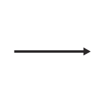
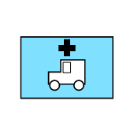
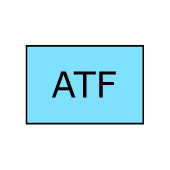
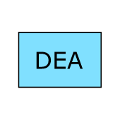
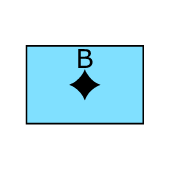
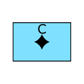
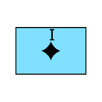
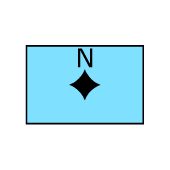
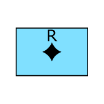

|id|Significant Issue?|Image from DR_Export|Image from Standard|Image from JMSML|Full SIDC|Hierarchy Code|Name|Geometry|Appendix|Notes / Issue Description / Details|
|---|---|---|---|---|---|---|---|---|---|---|
|1319|YES||||WA-DPXCV---L---|METOC.AMPHC.PRS.LNE.CNGLNE|Convergance Line|LINE|C||
|1329|YES||||WA-DWSTSWA--A--|METOC.AMPHC.WTH.TPLSYS.TSWADL|Tropical Storm Wind Areas And Date-Time Labels|AREA|C||
|1496|YES||||WO-DHCF-----A--|METOC.OCA.HYDGRY.CSTHYD.FSH1.FSH3|Foreshore|AREA|C||
|1507|YES||||WO-DHHDK----A--|METOC.OCA.HYDGRY.DANHAZ.KLP1.KLP3|Kelp3-Seaweed|AREA|C||
|1508|YES||||WO-DHHDK--P----|METOC.OCA.HYDGRY.DANHAZ.KLP1.KLP2|Kelp2-Seaweed|POINT|C||
|1513|YES||||WO-DHPMO----A--|METOC.OCA.HYDGRY.PRTHBR.FAC.OSLF3|Offshore Loading Facility|AREA|C||
|1514|YES||||WO-DHPMO---L---|METOC.OCA.HYDGRY.PRTHBR.FAC.OSLF2|Offshore Loading Facility|LINE|C||
|1521|YES||||WO-DIDID---L---|METOC.OCA.ISYS.DYNPRO.ID|Ice Drift (Direction)|LINE|C|JMSML is better|
|1580|YES||||WOS-HHDR---L---|METOC.OCA.HYDGRY.DANHAZ.REEF|Reef|LINE|C||
|1594|YES||||WOS-HPFS--P----|METOC.OCA.HYDGRY.PRTHBR.FSG.FSTK1|Fish Stakes-Traps-Weirs Fstk1|POINT|C||
|1902|YES||||EFOPAB---------|EMS.OPN.EMMED.EQPT|Emergency Medical Operation Equipment|POINT|G||
|1905|YES||||EFOPAE---------|EMS.OPN.EMMED.AMBLNC|Ambulance|POINT|G||
|1906|YES||||EFOPAF---------|EMS.OPN.EMMED.MEH|Medical Evacuation Helicopter|POINT|G||
|1914|YES||||EFOPBB---------|EMS.OPN.EMOPN.EQPT|Emergency Operation Equipment|POINT|G||
|1927|YES||||EFOPCB---------|EMS.OPN.FIRFT.FIRFTE|Fire Fighting Operation Equipment|POINT|G||
|1928|YES||||EFOPCC---------|EMS.OPN.FIRFT.FIRHYD|Fire Hydrant|POINT|G||
|1933|YES||||EFOPDB---------|EMS.OPN.LAWENF.LAWENE|Law Enforcement Operation Equipment|POINT|G||
|1937|YES||||EFOPDDB--------|EMS.OPN.LAWENF.ATF.ATFEQP|Atf Equipment|POINT|G||
|1941|YES||||EFOPDEB--------|EMS.OPN.LAWENF.BDRPT.BDRPTE|Border Patrol Equipment|POINT|G||
|1945|YES||||EFOPDFB--------|EMS.OPN.LAWENF.CSTM.CSTMEQ|Customs Service Equipment|POINT|G||
|1949|YES||||EFOPDGB--------|EMS.OPN.LAWENF.DEA.DEAEQP|Dea Equipment|POINT|G||
|1953|YES||||EFOPDHB--------|EMS.OPN.LAWENF.DOJ.DOJEQP|Doj Equipment|POINT|G||
|1960|YES||||EFOPDJB--------|EMS.OPN.LAWENF.POL.POLEQP|Police Equipment|POINT|G||
|1965|YES||||EFOPDLB--------|EMS.OPN.LAWENF.SECSR.SECSRE|Secret Service Equipment|POINT|G||
|1969|YES||||EFOPDMB--------|EMS.OPN.LAWENF.TSA.TSAEQP|Tsa Equipment|POINT|G||
|1976|YES||||EFOPDOB--------|EMS.OPN.LAWENF.USMAR.USMARE|Us Marshals Service Equipment|POINT|G||
|1978|YES||||EFOPEA---------|EMS.OPN.SNS.BIO|Biological Sensor|POINT|G||
|1979|YES||||EFOPEB---------|EMS.OPN.SNS.CML|Chemical Sensor|POINT|G||
|1980|YES||||EFOPEC---------|EMS.OPN.SNS.INT|Intrusion Sensor|POINT|G||
|1981|YES||||EFOPED---------|EMS.OPN.SNS.NUC|Nuclear Sensor|POINT|G||
|1982|YES||||EFOPEE---------|EMS.OPN.SNS.RAD|Radiological Sensor|POINT|G||
